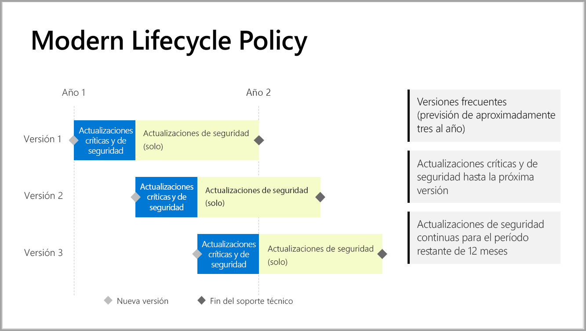

# Escala de tiempo del soporte técnico para el servidor de informes de Power BI

Varias veces al año publicamos nuevas versiones de Power BI Report Server. Las actualizaciones críticas y de seguridad están a disposición de los usuarios hasta que la siguiente versión está disponible con carácter general (GA). Tras su publicación, la anterior sigue recibiendo actualizaciones de seguridad durante el resto de los 12 meses del ciclo de vida de la versión.

Esta directiva de soporte técnico nos permite ofrecer innovación a nuestros clientes con bastante rapidez y, al mismo tiempo, proporcionar flexibilidad para que los clientes adopten la innovación a su ritmo.

* Fase de servicio de actualizaciones críticas y de seguridad: al ejecutar la versión más reciente de Power BI Report Server, el usuario recibe actualizaciones críticas y de seguridad.
* Fase de servicio de actualizaciones de seguridad: tras publicar una nueva versión, el soporte técnico de las anteriores se reduce a actualizaciones de seguridad durante el resto de los 12 meses del ciclo de vida del soporte técnico (figura 1).

    

## Historial de versiones

| **Versión** | **Fecha de disponibilidad** | **Fecha de finalización del soporte técnico** |
| --- | --- | --- |
| Junio de 2017 |12 de junio de 2017 |Ya no dispone de soporte técnico |
| Octubre de 2017 |31 de octubre de 2017 | Ya no dispone de soporte técnico |
| Marzo de 2018 | 19 de marzo de 2018 | Ya no dispone de soporte técnico |
| Agosto de 2018 | 15 de agosto de 2018 | Ya no dispone de soporte técnico |
| Enero de 2019 | 23 de enero de 2019 | 23 de enero de 2020 |
| Mayo de 2019 | 22 de mayo de 2019 | 22 de mayo de 2020 |
| Septiembre de 2019 | Septiembre de 2019 | Septiembre de 2020 

Para descargar el servidor de informes de Power BI y Power BI Desktop optimizado para el servidor de informes de Power BI, vaya a [Publicar informes en almacenamiento local con el servidor de informes de Power BI](https://powerbi.microsoft.com/report-server/).

## Pasos siguientes
[Novedades en el servidor de informes de Power BI](whats-new.md)  
[¿Qué es Power BI Report Server?](get-started.md)
[Información general de administrador](admin-handbook-overview.md)  
[Instalar un servidor de informes de Power BI](install-report-server.md)  

¿Tiene más preguntas? [Pruebe a preguntar a la comunidad de Power BI](https://community.powerbi.com/)