# Tutorial: Exploración del portal web de Power BI Report Server en una máquina virtual
En este tutorial, creara una máquina virtual de Azure con Power BI Report Server ya instalado, para que pueda experimentar con la visualización, edición y administración de KPI e informes paginados y de Power BI de ejemplo.

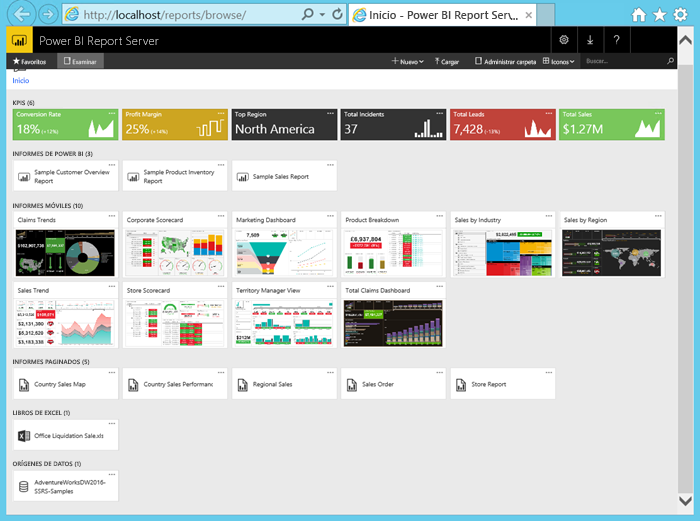

A continuación se indican las tareas que se realizarán en este tutorial:

> [!div class="checklist"]
> * Crear una máquina virtual y conectarse a ella
> * Iniciar y explorar en el portal web de Power BI Report Server
> * Etiquetar un elemento favorito
> * Ver y editar un informe de Power BI
> * Ver, administrar y editar un informe paginado
> * Ver un libro de Excel en Excel Online

Para este tutorial, necesita una suscripción a Azure. Si no tiene una suscripción, [cree una cuenta gratuita](https://azure.microsoft.com/free/?WT.mc_id=A261C142F) antes de comenzar.

## Creación de una máquina virtual de Power BI Report Server

Por suerte, el equipo de Power BI ha creado una máquina virtual que se incluye con Power BI Report Server ya instalado.

1. En Azure Marketplace, abra [Power BI Report Server](https://azuremarketplace.microsoft.com/marketplace/apps/reportingservices.technical-preview?tab=Overview).  

2. Seleccione **Obtenerlo ahora**.
3. Para aceptar los términos de uso y la directiva de privacidad del proveedor, seleccione **Continuar**.

    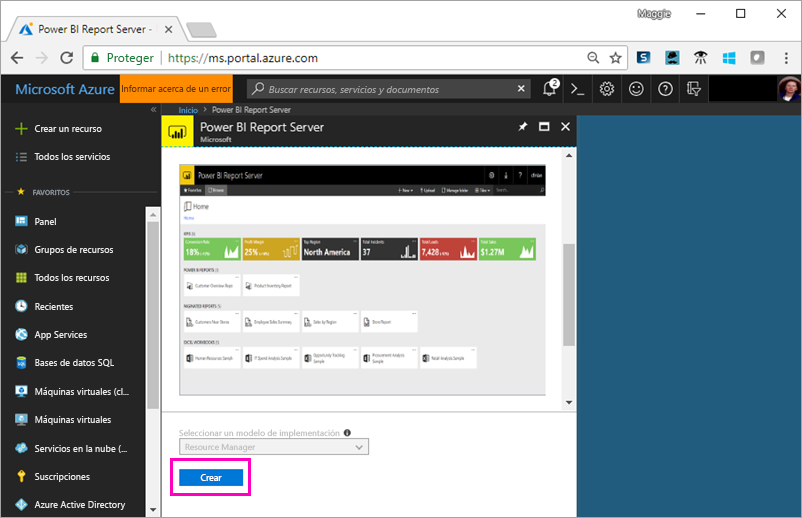

4. En el **Paso 1 Aspectos básicos**, en **Nombre de VM**, escriba **reportservervm**.

5. Cree un nombre de usuario y una contraseña.

6. En **Grupo de recursos**, mantenga **Crear nuevo** y escriba **reportserverresourcegroup**.

    Si realiza los pasos de este tutorial más de una vez, necesitará proporcionar al grupo de recursos un nombre diferente. No puede usar el mismo nombre de grupo de recursos dos veces en la misma suscripción. 

7. Mantenga los demás valores predeterminados > **Aceptar**.

    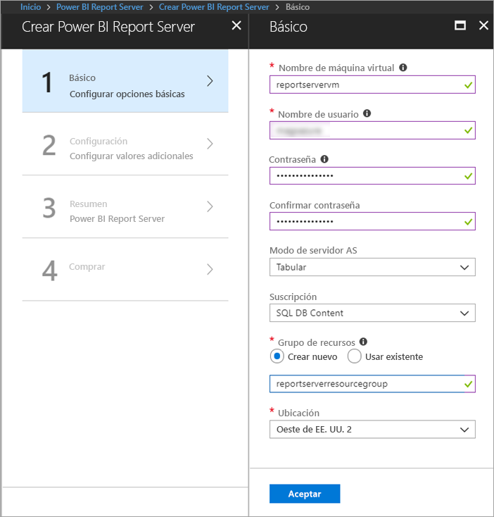

8. En el **Paso 2 Configuración**, mantenga los valores predeterminados > **Aceptar**.

9. En el **Paso 3 Resumen** > **Aceptar**.

10. En el **Paso 4**, revise los términos de uso y la directiva de privacidad > **Crear**.

    El proceso de **envío de la implementación para Power BI Report Server** tarda varios minutos.

## Conexión a la máquina virtual

1. En el panel de navegación izquierdo de Azure, seleccione **Máquinas virtuales**. 

2. En el cuadro **Filtrar por nombre**, escriba "report". 

3. Seleccione la máquina virtual denominada **REPORTSERVERVM**.

    

4. En la máquina virtual REPORTSERVERVM, seleccione **Conectar**.

    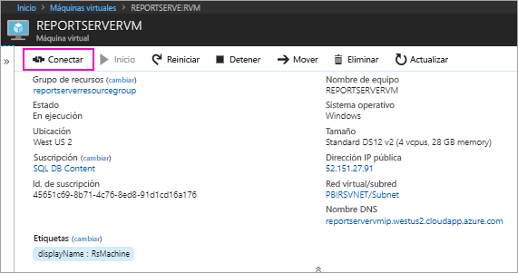

5. En el cuadro de diálogo Conexión a Escritorio remoto, seleccione **Conectar**.

6. Escriba el nombre y la contraseña creados para la máquina virtual > **Aceptar**.

7. El siguiente cuadro de diálogo indica que no se puede identificar la identidad del equipo remoto. Seleccione **Sí**.

   Ya está, ahora se abrirá la nueva máquina virtual.

## Power BI Report Server en la máquina virtual

Cuando se abre la máquina virtual, estos son los elementos que puede ver en el escritorio.

|Número  |Qué significa  |
|---------|---------|
| | Inicia SQL Server Data Tools para crear informes paginados (.RDL) |
| | Ejemplo de informes de Power BI (.PBIX)  |
| | Vínculos a documentación de Power BI Report Server   |
| | Inicia Power BI Desktop optimizado para Power BI Report Server (marzo de 2018)  |
| | Abre el portal web de Power BI Report Server en el explorador   |

Haga doble clic en el icono del **portal web de Report Server**. El explorador abre http://localhost/reports/browse. En el portal web, verá varios archivos agrupados por tipo. 

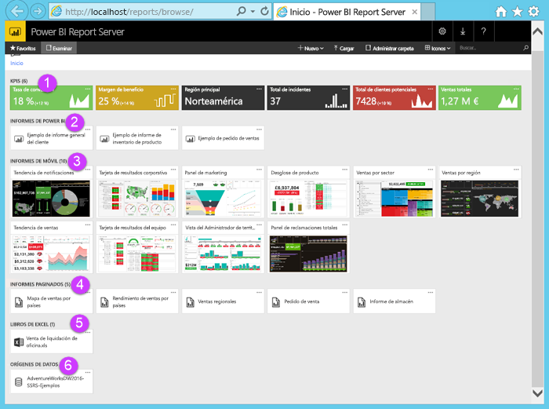

|Número  |Qué significa  |
|---------|---------|
| | Se crean los KPI en el portal web |
| |  Informes de Power BI (.PBIX)  |
| | Informes móviles creados en el Publicador de informes móviles de SQL Server  |
| |  Informes paginados creados en el Generador de informes o en SQL Server Data Tools  |
| | Libros de Excel   | 
| | Orígenes de datos de informes paginados | 

## Etiquetado de favoritos
Puede etiquetar los informes y KPI que desee como favoritos. Son más fáciles de encontrar porque están recopilados en una única carpeta de Favoritos, en el portal web y en las aplicaciones móviles de Power BI. 

1. Seleccione los puntos suspensivos (**…**) en la esquina superior derecha del KPI **Margen de beneficio** > **Agregar a Favoritos**.
   
    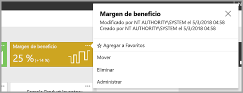
2. Seleccione **Favoritos** en la cinta de opciones del portal web para verlo junto con sus otros favoritos en la página Favoritos del portal web.
   
    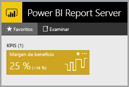

3. Seleccione **Examinar** para volver al portal web.
   
## Visualización de elementos en la vista de lista
De forma predeterminada, el portal web muestra su contenido en la vista de iconos.

Puede cambiar a la vista de lista, donde resulta fácil mover o eliminar varios elementos a la vez. 

1. Seleccione **Iconos** > **Lista**.
   
    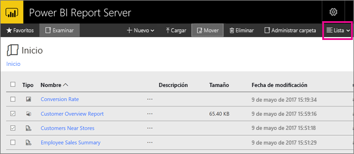

2. Vuelva a la vista Iconos: seleccione **Lista** > **Iconos**.

## Informes de Power BI

Puede visualizar informes de Power BI en el portal web e interactuar con ellos, así como iniciar Power BI Desktop directamente desde el portal web.

### Visualización de informes de Power BI

1. En el portal web, en **Informes de Power BI**, seleccione **Informe de información general de cliente de ejemplo**. El informe se abre en el explorador.

1. Seleccione el bloque de Estados Unidos en el gráfico de rectángulos para ver cómo se resaltan los valores relacionados en los otros objetos visuales.

    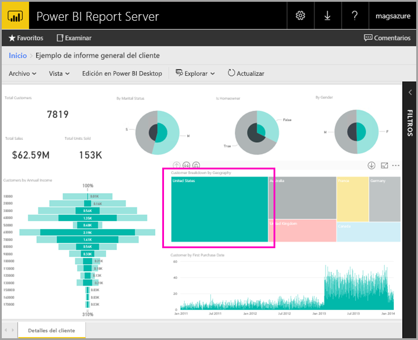

### Edición en Power BI Desktop

1. Seleccione **Edición en Power BI Desktop**.

1. Seleccione **Permitir** para permitir que este sitio web abra un programa en el equipo. 

     El informe se abre en Power BI Desktop. Tenga en cuenta el nombre de la barra superior, "Power BI Desktop (marzo de 2018)". Se trata de la versión optimizada para Power BI Report Server.

    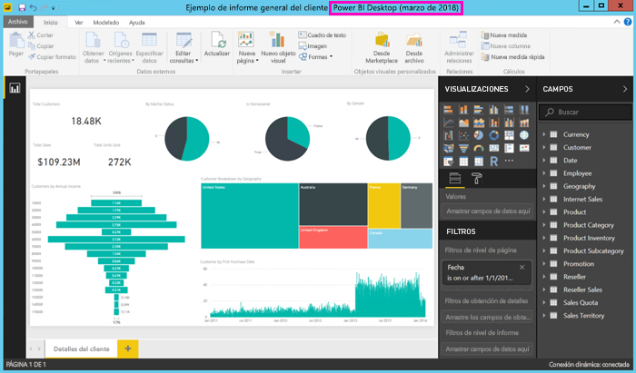

     Use la versión de Power BI Desktop instalada en la máquina virtual. No puede pasar entre dominios para cargar un informe.

3. En el panel Campos, expanda la tabla Clientes y arrastre el campo Ocupación a los filtros de nivel de informe.

    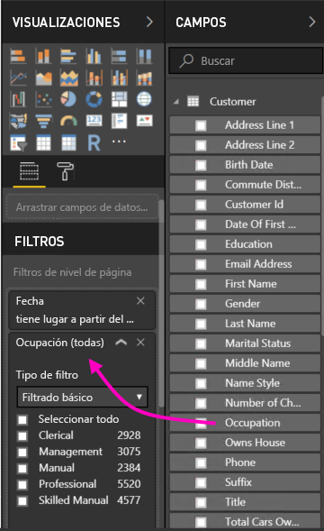

1. Guarde el informe.

1. Vuelva al informe en el explorador y seleccione el icono **Actualizar**.

    

8. Expanda el panel **Filtros** de la derecha para ver el filtro **Ocupación** agregado. Seleccione **Profesional**.

    

3. Seleccione **Examinar** para volver al portal web.

## Informes paginados (.RDL)

Puede ver y administrar informes paginados e iniciar el Generador de informes desde el portal web.

### Administración de un informe paginado

1. En el portal web, en **Informes paginados**, seleccione los puntos suspensivos (...) que están al lado de **Pedido de venta** > **Administrar**.

1. Seleccione **Parámetros**, cambie el valor predeterminado de **SalesOrderNumber** por **SO50689** > **Aplicar**.

   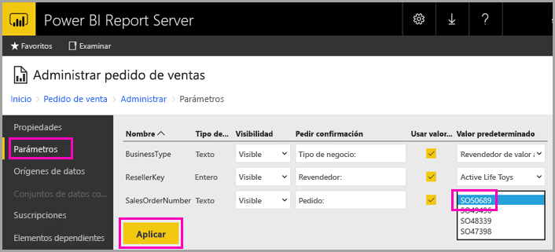

3. Seleccione **Examinar** para volver al portal web.

### Visualización de un informe paginado

1. Seleccione **Pedido de ventas** en el portal web.
 
3.  Podrá verlo abierto en el parámetro **Pedido** establecido, **SO50689**. 

    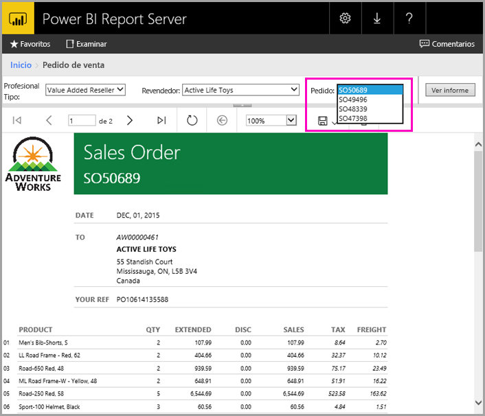

    Puede cambiar ese parámetro aquí, junto con otros parámetros, sin cambiar los valores predeterminados.

1. Seleccione **Pedido** **SO48339** > **Ver informe**.

4. Verá que se trata de la página 1 de 2. Seleccione la flecha derecha para ver la segunda página. La tabla continúa en esa página.

    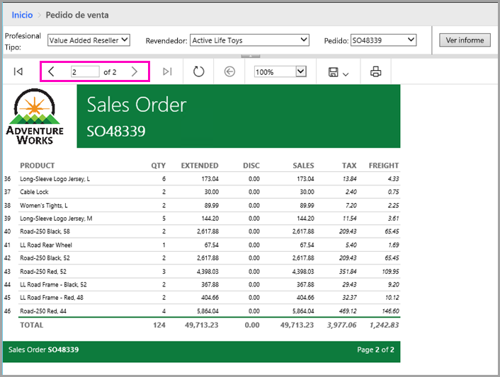

5. Seleccione **Examinar** para volver al portal web.

### Edición de un informe paginado

Puede editar informes paginados en el Generador de informes, y puede iniciar el Generador de informes directamente desde el explorador.

1. En el portal web, seleccione el botón de puntos suspensivos (...) junto a **Pedido de ventas** > **Editar en el Generador de informes**.

1. Seleccione **Permitir** para permitir que este sitio web abra un programa en el equipo.

1. El informe de pedido de ventas se abre en la vista de diseño en el Generador de informes.

    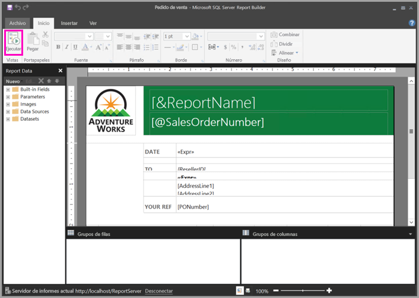

1. Seleccione **Ejecutar** para obtener una vista previa del informe.

    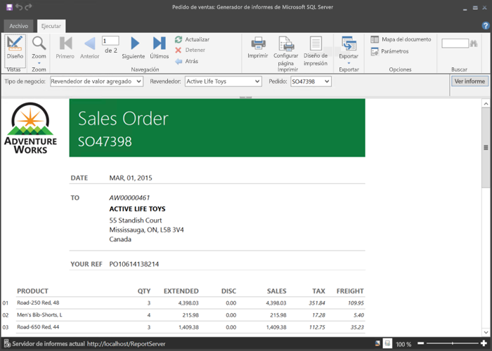

5. Cierre el Generador de informes y vuelva al explorador.

## Edición de libros de Excel

Puede ver libros de Excel en Excel Online en Power BI Report Server e interactuar con ellos. 

1. Seleccione el libro de Excel **Office Liquidation Sale.xlsx**. Puede que se le soliciten credenciales. Seleccione **Cancelar**. 
    Se abre en el portal web.
1. Seleccione **Dispositivo** en la segmentación.

    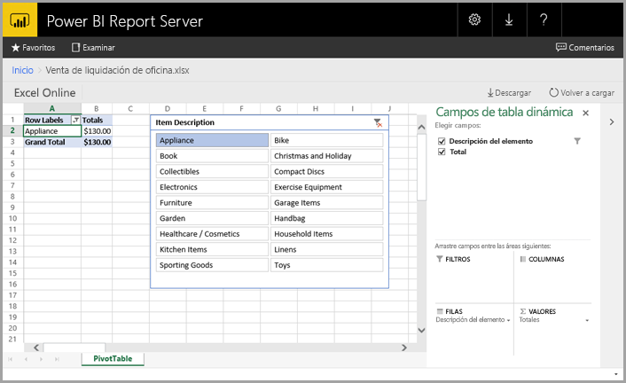

1. Seleccione **Examinar** para volver al portal web.

## Limpieza de recursos

Ahora que ya ha completado este tutorial, elimine el grupo de recursos, la máquina virtual y todos los recursos relacionados. 

- Para ello, seleccione el grupo de recursos de la máquina virtual y luego seleccione **Eliminar**.

## Pasos siguientes

En este tutorial, ha creado una máquina virtual con Power BI Report Server. Ha probado parte de la funcionalidad del portal web y ha abierto un informe de Power BI y un informe paginado en sus editores correspondientes. Esta máquina virtual tiene instalados orígenes de datos de SQL Server Analysis Services, por lo que puede probar a crear sus propios informes paginados y de Power BI con los mismos orígenes de datos. 

Para más información sobre la creación de informes para Power BI Report Server, siga leyendo.

> [!div class="nextstepaction"]
> [Creación de un informe de Power BI para Power BI Report Server](./quickstart-create-powerbi-report.md)

