# Ejemplo Rentabilidad del cliente para Power BI: Dar un paseo

El paquete de contenido de ejemplo Rentabilidad del cliente contiene un panel, un informe y un conjunto de datos de una compañía que fabrica materiales de marketing. Este panel lo ha creado un director de seguridad para ver las métricas clave relacionadas con los cinco responsables de unidad de negocio (directivos), los productos, los clientes y los márgenes brutos. A simple vista, puede ver los factores que afectan a la rentabilidad.

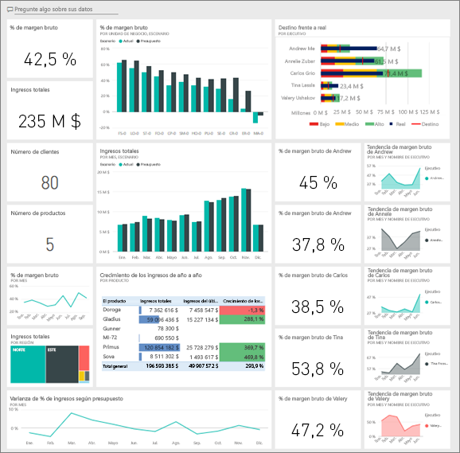

Este ejemplo forma parte de una serie en la que se muestra cómo puede usar Power BI con datos, informes y paneles empresariales. Lo ha creado [obviEnce](http://www.obvience.com/) con datos reales, que se han anonimizado. Los datos están disponibles en varios formatos: paquete de contenido, archivo .pbix de Power BI Desktop o libro de Excel. Consulte [Ejemplos de Power BI](sample-datasets.md). 

Este tutorial usa el paquete de contenido de ejemplo Rentabilidad del cliente del servicio Power BI. Dado que la experiencia de informes es similar en Power BI Desktop y en el servicio, también puede proceder con el archivo .pbix de ejemplo de Power BI Desktop. 

Para explorar los ejemplos de Power BI Desktop, no necesita una licencia de Power BI. Si no tiene una licencia de Power BI Pro, puede guardar el ejemplo en la sección Mi área de trabajo del servicio Power BI. 

## Obtención del ejemplo

Para poder usar el ejemplo, primero debe descargarlo como un [paquete de contenido](#get-the-content-pack-for-this-sample), un [archivo .pbix](#get-the-pbix-file-for-this-sample) o un [libro de Excel](#get-the-excel-workbook-for-this-sample).

### Obtención del paquete de contenido de este ejemplo

1. Abra el servicio Power BI (app.powerbi.com), inicie sesión y abra el área de trabajo donde desea guardar el ejemplo.

   Si no tiene una licencia de Power BI Pro, puede guardar el ejemplo en Mi área de trabajo.

2. En la esquina inferior izquierda, seleccione **Obtener datos**.

   
3. En la página **Obtener datos**, seleccione **Ejemplos**.

4. Seleccione **Ejemplo Rentabilidad del cliente** y, a continuación, elija **Conectar**.  

    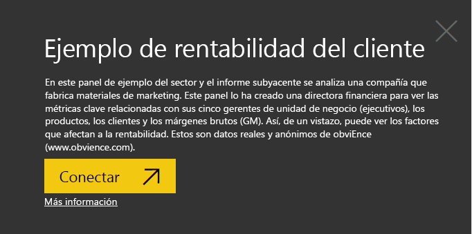
5. Power BI importa el paquete de contenido y agrega un nuevo panel, informe y conjunto de datos en el área de trabajo actual.

    

### Obtención del archivo .pbix de este ejemplo

También puede descargar el ejemplo Rentabilidad del cliente como un [archivo .pbix](http://download.microsoft.com/download/6/A/9/6A93FD6E-CBA5-40BD-B42E-4DCAE8CDD059/Customer%20Profitability%20Sample%20PBIX.pbix), que está diseñado para su uso con Power BI Desktop.

### Obtención del libro de Excel de este ejemplo

Si desea ver el origen de datos de este ejemplo, también está disponible como un [libro de Excel](http://go.microsoft.com/fwlink/?LinkId=529781). El libro contiene hojas de Power View que puede ver y modificar. Para ver los datos sin procesar, habilite los complementos de análisis de datos y, a continuación, seleccione **Power Pivot > Administrar**. Para habilitar los complementos Power View y Power Pivot, vea [Consulta de los ejemplos de Excel desde Excel](sample-datasets.md#optional-take-a-look-at-the-excel-samples-from-inside-excel-itself) para obtener más información.

## ¿Qué indica el panel?

En el área de trabajo donde guardó el ejemplo, busque el panel Rentabilidad del cliente y selecciónelo:

### Iconos del panel relativos a la compañía
1. Abra un panel en el servicio Power BI. Los iconos del panel proporcionan al director de seguridad información general sobre las métricas más importantes de la compañía. Si ven algo interesante, pueden seleccionar un icono para explorar en profundidad los datos.

2. Revise los iconos situados a la izquierda del panel.

    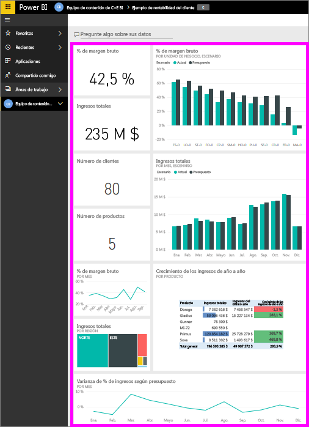

   Tenga en cuenta los siguientes detalles:
   - El margen bruto de la compañía es del 42,5 %.
   - Tiene 80 clientes.
   - Vende cinco productos diferentes.
   - El porcentaje de variación de ingresos más bajo respecto al presupuesto se produjo en febrero, seguido del más alto en marzo.
   - La mayoría de los ingresos provienen de las regiones este y norte. El margen bruto nunca ha superado el presupuesto, si bien las unidades de negocio ER-0 y MA-0 requieren cierta investigación adicional.
   - El total de ingresos al año se aproxima al presupuesto.

### Iconos del panel específicos de los gerentes
Los iconos del lado derecho del panel proporcionan un panel del equipo. El director de seguridad necesita realizar un seguimiento de sus gerentes, y estos iconos les proporcionan información general sobre las ganancias mediante el porcentaje de margen bruto. Si la tendencia del porcentaje de margen bruto de cualquiera de los gerentes le resulta inesperada, podrá investigarlo con mayor detalle.

Mediante el análisis de los iconos del panel específicos del administrador, podemos hacer las observaciones siguientes:

- Todos los ejecutivos, excepto Carlos, ya han superado su objetivo de ventas. Pero las ventas reales de Carlos son las más elevadas.
- El porcentaje de margen bruto de Annelie es el más bajo, si bien se observa un incremento continuado desde marzo.
- En cambio, el porcentaje de margen bruto de Valery se ha reducido considerablemente.
- Andrew ha tenido un año inestable.

## Exploración de los datos subyacentes del panel
En este panel hay iconos que se vinculan a un informe y a un libro de Excel.

### Apertura del origen de datos de Excel Online
Dos iconos en este panel, **Target vs Actual** y **Year Over Year Revenue Growth** se han anclado desde un libro de Excel. Por eso, cuando se selecciona cualquiera de estos iconos, Power BI abre el origen de datos; en este caso, Excel Online.

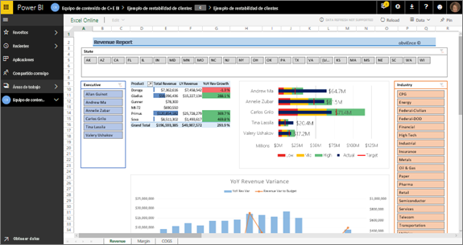

1. Seleccione cualquiera de los iconos que se han anclado de Excel. Se abre Excel Online en el servicio Power BI.
2. Tenga en cuenta que el libro tiene los datos recopilados de tres pestañas. Abra **Revenue**.
3. Veamos por qué Carlos no ha alcanzado aún su objetivo.  

    a. En el control deslizante **Executive**, seleccione **Carlos Grilo**.   

    b. La primera tabla dinámica nos indica que el crecimiento de los ingresos de Carlos relativos a su principal producto, Primus, han caído un 152 % desde el año pasado. En el gráfico **Varianza de ingresos interanual**, se muestra que Carlos ha estado por debajo del presupuesto en la mayoría de los meses.  

    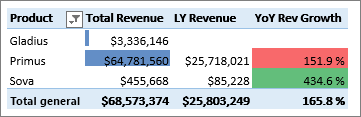

    

4. Continúe explorando. Si encuentra algo interesante, seleccione **Anclar**  en la esquina superior derecha para [anclarlo al panel](service-dashboard-pin-tile-from-excel.md).

5. Utilice la flecha Atrás del explorador para volver al panel.

### Apertura del informe de Power BI subyacente
Muchos iconos del panel de ejemplo Rentabilidad del cliente se anclaron desde el informe de ejemplo Rentabilidad del cliente subyacente.

1. Seleccione uno de estos iconos para abrir el informe en la vista de lectura.

   Si el icono se creó en preguntas y respuestas, al seleccionarlo se abre una ventana de preguntas y respuestas. Seleccione **Salir de Preguntas y respuestas** para volver al panel y probar un icono diferente.

2. El informe tiene tres páginas. Cada pestaña de la parte inferior del informe representa una página.

    

    * **Tarjeta de resultados del equipo** se centra en el rendimiento de los cinco administradores y sus carteras de negocios.
    * **Análisis del margen de la industria** ofrece una forma de analizar nuestra rentabilidad en comparación con la situación de todo el sector.
    * **Cuadro de mandos ejecutivo** proporciona una vista de cada uno de nuestros directores, con un formato para ver en Cortana.

### Página Tarjeta de resultados del equipo

Analicemos en detalle dos de los miembros del equipo y veamos qué información se puede obtener: 

1. En el segmento **Ejecutivo** que aparece a la izquierda, seleccione el nombre de Andrew para filtrar la página del informe de forma que solo muestre los datos de Andrew:

   * Para ver rápidamente un KPI, consulte el valor de **Estado de los ingresos (total del año)** de Andrew; es verde, lo que significa que sus resultados son buenos.
   * El gráfico **% de variación de ingresos del presupuesto por mes y ejecutivo** muestra que, salvo un descenso en febrero, el rendimiento de Andrew es bueno. La región más dominante de Andrew es la región este, con 49 clientes y cinco de los siete productos. El porcentaje de margen bruto de Andrew no es el más alto ni el más bajo.
   * El gráfico **Ingresos totales del año y porcentaje de variación de ingresos sobre el presupuesto por mes** muestra un caso de beneficios constantes. Sin embargo, si aplica un filtro seleccionando el cuadrado de **Central** en el gráfico de rectángulos de la región, observa que Andrew tiene ingresos en marzo y solo en Indiana. ¿Es un hecho intencionado o debe investigarse más?

2. Pasamos a Valery. En el segmento **Ejecutivo**, seleccione el nombre de Valery para filtrar la página del informe y mostrar únicamente los datos relacionados con ella. 

   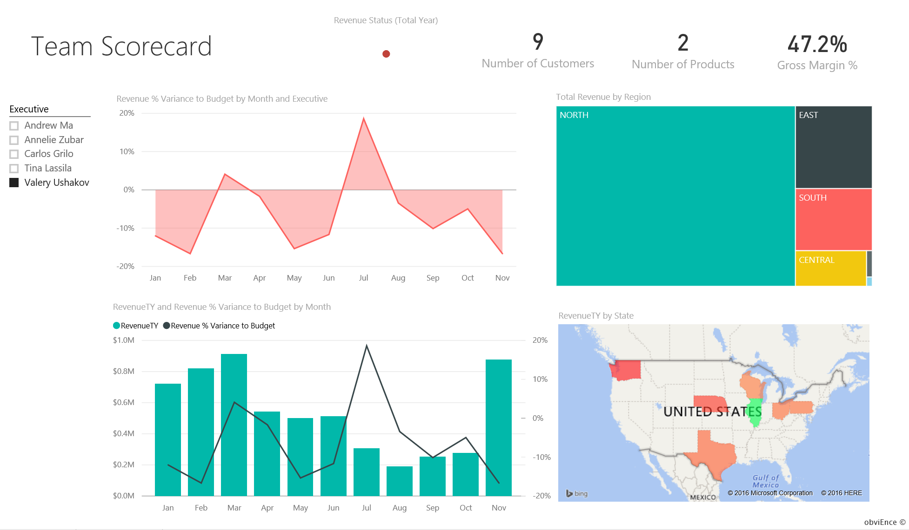

   * Observe el KPI en rojo de **Estado de los ingresos (total de año)** . Sin duda, es necesario investigar más este elemento.
   * La varianza de ingresos de Valery también ofrece un panorama preocupante; Valery no está cumpliendo con los márgenes de ingresos establecidos.
   * Valery solo tiene nueve clientes, trata únicamente con dos productos y trabaja casi de forma exclusiva con clientes de la región norte. Esta especialización puede explicar las grandes fluctuaciones de sus métricas.
   * Al seleccionar el cuadrado **norte** en el gráfico de rectángulos, vemos que el margen bruto de Valery para la región norte es coherente con su margen general.
   * Al seleccionar los otros cuadrados de **Total de ingresos por región**, la historia que cuenta es interesante: el porcentaje de margen bruto varía entre el 23 % y el 79 %. Sus cifras de ingresos en todas las regiones, excepto en la región norte, son altamente estacionales.

3. Siga profundizando para averiguar por qué los resultados en la zona de Valery no son buenos. Mire las regiones, el resto de las unidades de negocio y la página siguiente del informe: **Análisis de margen de la industria**.

### Análisis de margen de la industria
Esta página del informe ofrece un segmento de datos distinto. Se examina el margen bruto de todo el sector desglosado por segmento. El director de seguridad usa esta página para comparar las métricas de la compañía y de las unidades de negocio con las métricas del sector, con el fin de que obtener información para explicar las tendencias y la rentabilidad. Tal vez se pregunte por qué el gráfico **Porcentaje de margen bruto por mes y ejecutivo** está en esta página, aunque es específico del equipo. Al incluirlo aquí podemos filtrar la página por gerente de unidad de negocios.  

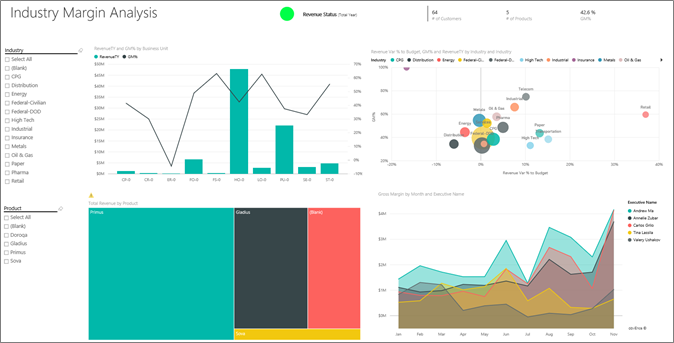

1. ¿Cómo varía la rentabilidad por sector? ¿Cómo se desglosan los productos y los clientes por sector? Para responder a estas preguntas, seleccione uno o varios sectores de la parte superior izquierda (empiece con la industria CPG). Para borrar el filtro, seleccione el icono de borrador.

2. En el gráfico de burbujas (**Porcentaje de variación de ingresos sobre el presupuesto, % de margen bruto e ingresos totales del año por sector**), el director financiero busca las burbujas más grandes, ya que tienen el mayor impacto en los ingresos. Para ver fácilmente el impacto de cada administrador por sector industrial, seleccione el nombre de cada administrador para filtrar la página por el nombre del administrador.

3. Al seleccionar cada administrador en el gráfico, tenga en cuenta los siguientes detalles:
   * La zona de influencia de Andrew abarca muchos segmentos distintos de la industria con un porcentaje de margen bruto y de variación muy amplio (sobre todo positivo).
   * El gráfico de Annelie es similar, excepto que se solo centra en unos pocos segmentos del sector, sobre todo en el segmento federal y en el producto Gladius.
   * Carlos está claramente centrado en el segmento de servicios, con beneficios importantes. Carlos ha mejorado en gran medida el porcentaje de variación para el segmento de alta tecnología; además, en un nuevo segmento para él (el industrial), ha obtenido unos resultados extraordinariamente buenos en comparación con el presupuesto.
   * Tina trabaja con pocos segmentos y tiene el porcentaje de margen bruto más alto, pero el hecho de que el tamaño de sus burbujas sea más bien pequeño muestra que su impacto en los resultados de la compañía es mínimo.
   * Valery, que es responsable de un solo producto, trabaja solamente en cinco segmentos de la industria. Su influencia en el sector es estacional, pero siempre genera una burbuja de gran tamaño, lo que indica un impacto importante en los resultados de la compañía. ¿Explican los segmentos del sector su rendimiento negativo?

### Cuadro de mandos ejecutivo
Esta página se formatea como una Tarjeta de respuestas de Cortana. Para más información, consulte [Creación de una página de respuesta personalizada para Cortana](service-cortana-answer-cards.md).

## Uso de Preguntas y respuestas para profundizar en los datos
Para nuestro análisis, resultaría útil determinar qué sector genera más ingresos para Valery. Vamos a usar Preguntas y respuestas.

1. Seleccione **Editar informe** para abrir el informe en la vista de edición. La vista de edición está disponible solo si es propietario del informe. Esta vista se denomina a veces modo *creador*. Si, por el contrario, este informe solo se ha compartido con usted, no podrá abrirlo en la vista de edición.

2.  En la parte superior del panel, seleccione **Hacer una pregunta** para abrir el cuadro de preguntas y respuestas.

    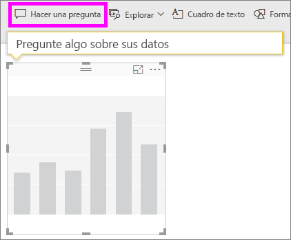

3. Escriba *total de ingresos por sector para Valery Ushakov* en el cuadro de preguntas. Observe cómo se actualiza la visualización a medida que escribe la pregunta.

    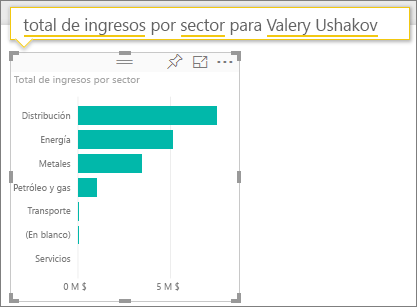

   Como puede ver, la industria de la distribución es el área de ingresos más importante para Valery.

### Agregar filtros para profundizar
Echemos un vistazo al sector Distribución.  

1. Abra la página de informe **Análisis de margen de la industria**.
2. Si no selecciona las visualizaciones en la página del informe, expanda el panel de filtro en la derecha (si todavía no está expandido). El panel **Filtros** debe mostrar solo **Filtros de nivel de página**.  

   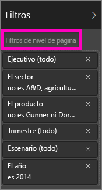
3. Busque el filtro **Sector** y seleccione la flecha para expandir la lista. Vamos a agregar un filtro de página para el sector de distribución. En primer lugar, borre todas las selecciones desactivando la casilla **Seleccionar todo**. A continuación, seleccione solo **Distribución**.  

   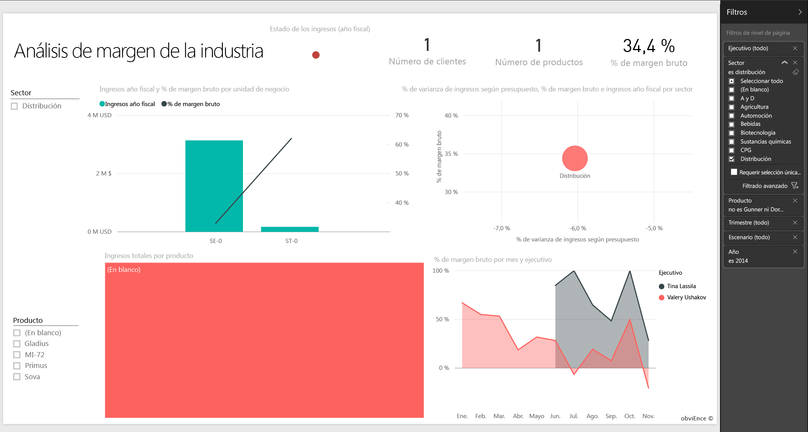
4. El gráfico **Porcentaje de margen bruto por mes y ejecutivo** nos indica que solo Valery y Tina tienen clientes en este sector y, además, Valery solo trabajó para este sector de junio a noviembre.   
5. Seleccione **Tina** y después **Valery** en la leyenda del gráfico **Margen bruto por mes y ejecutivo**. Observe que la parte correspondiente a Tina en **Total de ingresos por producto** es muy reducida en comparación con la de Valery.
6. Para ver los ingresos reales, seleccione el cuadro de preguntas y respuestas en el panel y escriba *total de ingresos por ejecutivo por distribución por escenario*.  

     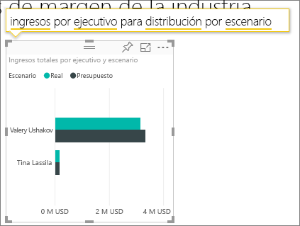

    Podemos explorar otros sectores de forma similar e incluso agregar clientes a nuestros elementos visuales para entender los motivos del rendimiento de Valery.

## Pasos siguientes: Conexión con los datos
Este entorno es seguro porque puede elegir no guardar los cambios. Pero si los guarda, en **Obtener datos** podrá obtener una nueva copia de este ejemplo siempre que lo desee.

Esperamos que este paseo le haya mostrado cómo los paneles de Power BI, Preguntas y respuestas y los informes pueden ofrecer recomendaciones sobre los datos de ejemplo. Ahora es su turno: conéctese a sus propios datos. Con Power BI puede conectarse a una gran variedad de orígenes de datos. Para obtener más información, consulte [Introducción al servicio Power BI](service-get-started.md).

