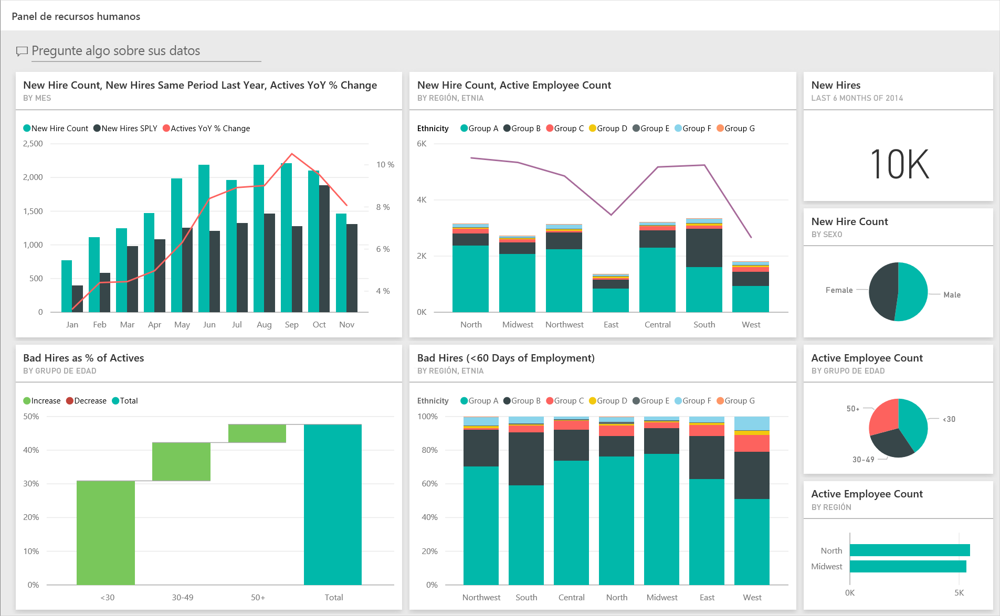
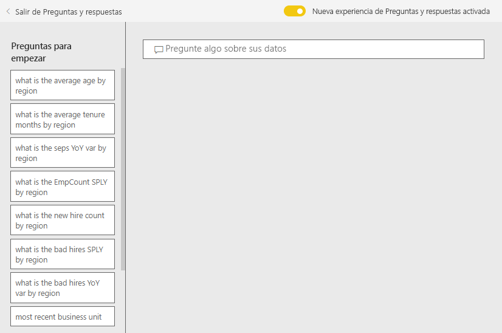
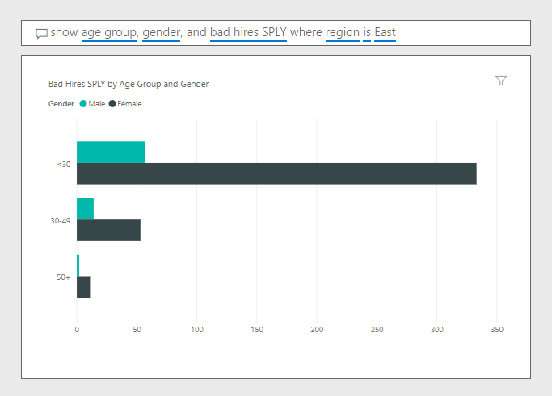

# Ejemplo de recursos humanos para Power BI: Dar un paseo

El paquete de contenido Ejemplo de recursos humanos contiene un panel, informe y conjunto de datos para un departamento de recursos humanos. En este ejemplo, el departamento de recursos humanos tiene el mismo modelo de informe en distintas empresas, incluso cuando se diferencian en sector o tamaño. Este ejemplo analiza las nuevas contrataciones, los empleados activos y los empleados que se han ido. Se centra en descubrir las tendencias en la estrategia de contratación. Nuestros principales objetivos son comprender:

* A quiénes contratamos
* Los prejuicios en nuestra estrategia de contratación
* Las tendencias en los ceses de actividad laboral voluntarios

Este ejemplo forma parte de una serie en la que se muestra cómo puede usar Power BI con datos, informes y paneles empresariales. Se ha creado mediante [obviEnce](http://www.obvience.com/) con datos reales anonimizados. Los datos están disponibles en varios formatos: paquete de contenido, archivo .pbix de Power BI Desktop o libro de Excel. Consulte [Ejemplos de Power BI](sample-datasets.md). 

En este tutorial se explica el paquete de contenido de ejemplo de recursos humanos del servicio Power BI. Dado que la experiencia de informes es similar en Power BI Desktop y en el servicio, también puede proceder con el archivo .pbix de ejemplo de Power BI Desktop. 

Para explorar los ejemplos de Power BI Desktop, no necesita una licencia de Power BI. Si no tiene una licencia de Power BI Pro, puede guardar el ejemplo en Mi área de trabajo del servicio Power BI. 

## Obtención del ejemplo

Para poder usar el ejemplo, primero debe descargarlo como un [paquete de contenido](#get-the-content-pack-for-this-sample), un [archivo .pbix](#get-the-pbix-file-for-this-sample) o un [libro de Excel](#get-the-excel-workbook-for-this-sample).

### Obtención del paquete de contenido de este ejemplo

1. Abra el servicio Power BI (app.powerbi.com), inicie sesión y abra el área de trabajo donde desea guardar el ejemplo.

   Si no tiene una licencia de Power BI Pro, puede guardar el ejemplo en Mi área de trabajo.

2. En la esquina inferior izquierda, seleccione **Obtener datos**.
   
   
3. En la página **Obtener datos**, seleccione **Ejemplos**.
   
4. Seleccione **Ejemplo de recursos humanos** y elija **Conectar**.  
   
   

5. Power BI importa el paquete de contenido y agrega un nuevo panel, informe y conjunto de datos en el área de trabajo actual.
   
   
  
### Obtención del archivo .pbix de este ejemplo

Como alternativa, puede descargar el Ejemplo de recursos humanos como un [archivo .pbix](https://download.microsoft.com/download/6/9/5/69503155-05A5-483E-829A-F7B5F3DD5D27/Human%20Resources%20Sample%20PBIX.pbix), que está diseñado para su uso con Power BI Desktop.

### Obtención del libro de Excel de este ejemplo

Si desea ver el origen de datos de este ejemplo, también está disponible como un [libro de Excel](https://go.microsoft.com/fwlink/?LinkId=529780). El libro contiene hojas de Power View que puede ver y modificar. Para ver los datos sin procesar, habilite los complementos de análisis de datos y, a continuación, seleccione **Power Pivot > Administrar**. Para habilitar los complementos Power View y Power Pivot, vea [Consulta de los ejemplos de Excel desde Excel](sample-datasets.md#optional-take-a-look-at-the-excel-samples-from-inside-excel-itself) para obtener más información.

## Nuevas contrataciones
En primer lugar, veamos las nuevas contrataciones.

1. En el área de trabajo, seleccione la pestaña **Paneles** y abra el panel **Ejemplo de recursos humanos**.
2. En el panel, seleccione el icono **New Hire Count, New Hires Same Period Last Year, Actives YoY % Change By Month** (Recuento de nuevas contrataciones, nuevas contrataciones en el mismo período del año anterior, cambio de % interanual de empleados activos por mes).  

     

   Se abre el informe Ejemplo de recursos humanos en la página **New Hires** .  

   

3. Examine estos elementos de interés:

    * El gráfico combinado **New Hire Count, New Hires SPLY and Actives YoY % Change by Month** (Recuento de nuevas contrataciones, nuevas contrataciones en el mismo período del año anterior, cambio de % interanual de empleados activos por mes) muestra que contratamos un mayor número de empleados cada mes de este año en comparación con el año anterior. Bastantes más algunos meses.
    * En el gráfico combinado **New Hire Count and Active Employee Count by Region and Ethnicity**, observe que estamos contratando menos empleados en la región **East** .
    * El gráfico de cascada **New Hires YoY Var by Age Group** muestra que se contratan principalmente empleados jóvenes. Esta tendencia puede deberse a la naturaleza de los trabajos, principalmente a tiempo parcial.
    * El gráfico circular **New Hire Count by Gender** (Recuento de nuevas contrataciones por mes) muestra una división bastante uniforme.

    ¿Puede extraer alguna idea clara? Por ejemplo, una región donde la división por género no sea uniforme. 

4. Haga clic en los diferentes grupos de edad y géneros de los gráficos para explorar las relaciones entre edad, género, región y grupo étnico.

5. Seleccione **Ejemplo de recursos humanos** en el panel de navegación superior para volver al panel.

   

## Comparación de empleados actualmente activos y antiguos
Vamos a examinar los datos de los empleados actualmente activos y de aquellos que ya no trabajan para la empresa.

1. En el panel, seleccione el icono **Active Employee Count by Age Group** .

   

   El informe Ejemplo de recursos humanos se abre en la página **Active Employees vs. Separations**.  

   

 2. Examine estos elementos de interés:

    * Los dos gráficos combinados de la izquierda muestran los cambios interanuales de empleados activos y ceses de actividad laboral de los empleados. Tenemos más empleados activos este año debido a la rápida contratación, pero también menos ceses de actividad laboral que el año pasado.
    * En agosto, teníamos más ceses de actividad laboral en comparación con otros meses. Seleccione los diferentes grupos de edad, géneros o regiones para ver si puede encontrar valores atípicos.
    * Si se examinan los gráficos circulares, se puede ver que hay una división uniforme en nuestros empleados activos por género y grupo de edad. Seleccione los diferentes grupos de edad para las diferencias de género divididas por edad. ¿Tenemos una división uniforme por género en cada grupo de edad?

## Motivos de cese de actividad laboral
Echemos un vistazo al informe en la Vista de edición. Puede cambiar los gráficos circulares para mostrar los datos de ceses de actividad laboral de los empleados en lugar de los datos de empleados activos.

1. Seleccione **Editar informe** en la esquina superior izquierda.

2. Seleccione el gráfico circular **Active Employee Count by Age Group** .

3. En **Fields** (Campos), seleccione **Employees** (Empleados) para expandir la tabla **Employees** (Empleados). Desactive **Active Employee Count** (Recuento de empleados activos) para quitar ese campo.

4. Seleccione **Separation Count** (Recuento de ceses de actividad laboral) en la tabla **Employees** (Empleados) para agregarlo al cuadro **Values** (Valores) del área **Fields** (Campos).

5. En el lienzo del informe, seleccione la barra **Voluntary** (Voluntarios) del gráfico de barras **Separation Count by Separation Reason** (Recuento de ceses de actividad laboral por motivo de cese de actividad laboral). 

   Esta barra resalta los empleados que se fueron voluntariamente en los otros objetos visuales del informe.

6. Seleccione el segmento de más de cincuenta del gráfico circular **Separation Count by Age Group** (Recuento de ceses de actividad laboral por grupo de edad).

7. Examine el gráfico de líneas en la esquina inferior derecha. Este gráfico se filtra para mostrar los ceses de actividad laboral voluntarios.  

   

   Observe la tendencia en el grupo de edad de más de cincuenta. Durante la última parte del año, más empleados de más de cincuenta años dejaron la empresa de forma voluntaria. Esta tendencia es un área que habría que investigar a fondo con más datos.

8. También puede seguir los mismos pasos con el gráfico circular **Active Employee Count by Gender** (Recuento de empleados activos por género) y cambiar a ceses de actividad laboral en lugar de empleados activos. Examine los datos de los ceses de actividad laboral voluntarios por género para ver si extrae algunas otras ideas importantes.

9. Seleccione **Ejemplo de recursos humanos** en el panel de navegación superior para volver al panel. Puede guardar los cambios realizados en el informe si lo desea.

## Contrataciones incorrectas
La última área para explorar son las contrataciones incorrectas. Las contrataciones incorrectas se definen como aquellos empleados que no duraron más de 60 días. Contratamos rápidamente, pero ¿estamos contratando a buenos candidatos?

1. Seleccione el icono del panel **Bad Hires as % of Actives by Age Group** . El informe se abre en la pestaña tres, **Bad Hires** (Contrataciones incorrectas).

     
2. Seleccione **Northwest** (Noroeste) en el segmento **Region** (Región) de la izquierda y **Male** (Hombres) en el gráfico de anillos **Bad Hire Count by Gender** (Recuento de contrataciones incorrectas por género). Examine los demás gráficos de la página **Bad Hires** (Contrataciones incorrectas). Observe que hay más contrataciones incorrectas de hombres que de mujeres y muchas del grupo A.

     

3. Si observa el gráfico de anillos **Bad Hire Count by Gender** (Recuento de contrataciones incorrectas por género) y selecciona las diferentes regiones en la segmentación **Region** (Región), observará que la región Este es la única región con más contrataciones incorrectas de mujeres que de hombres.  

4. Seleccione el nombre del panel en el panel de navegación superior para volver a este.

## Formule una pregunta en el cuadro de preguntas y respuestas del panel
En el [cuadro de preguntas y respuestas](power-bi-tutorial-q-and-a.md) del panel, puede hacer una pregunta sobre los datos usando lenguaje natural. Preguntas y respuestas reconoce las palabras que escribe y determina la ubicación del conjunto de datos donde se encuentra la respuesta.

1. Seleccione el cuadro de pregunta de Preguntas y respuestas. Observe que incluso antes de comenzar a escribir, Preguntas y respuestas muestra sugerencias que le ayudarán a realizar la pregunta.

   

2. Puede elegir una de estas sugerencias, o escribir: *mostrar grupo de edad, género y contrataciones incorrectas durante el mismo período el último año donde la región es Este*.  

   

   Observe que la mayoría de las contrataciones incorrectas de mujeres pertenecen a menores de 30 años.

## Pasos siguientes: Conexión con los datos
Este entorno es seguro porque puede elegir no guardar los cambios. Pero si los guarda, en **Obtener datos** podrá obtener una nueva copia de este ejemplo siempre que lo desee.

Esperamos que este paseo le haya mostrado cómo los paneles de Power BI, Preguntas y respuestas y los informes pueden ofrecer recomendaciones sobre los datos de ejemplo. Ahora es su turno: conéctese a sus propios datos. Con Power BI puede conectarse a una gran variedad de orígenes de datos. Para obtener más información, consulte [Introducción al servicio Power BI](service-get-started.md).
