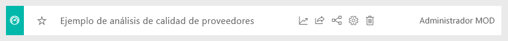
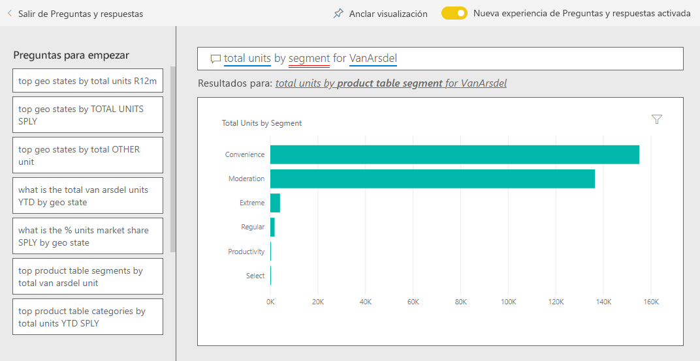
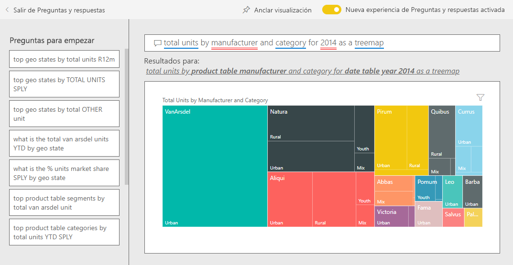

# Ejemplo de ventas y marketing para Power BI: Dar un paseo

En el ejemplo de ventas y marketing, se muestra un panel y un informe de una compañía de fabricación ficticia denominada VanArsdel Ltd. El director de marketing de VanArsdel ha creado este panel para mantenerse informado sobre el sector, así como la cuota de mercado, el volumen de productos, las ventas y la opinión de la compañía.

Aunque VanArsdel tiene muchos competidores, sigue siendo líder del mercado en su sector. El director de marketing desea aumentar la cuota de mercado y descubrir nuevas oportunidades de crecimiento. Pero, por motivos desconocidos, la cuota de mercado de VanArsdel ha empezado a disminuir, con caídas significativas en junio.

Este ejemplo forma parte de una serie en la que se muestra cómo puede usar Power BI con datos, informes y paneles empresariales. Se ha creado mediante [obviEnce](http://www.obvience.com/) con datos reales anonimizados. Los datos están disponibles en varios formatos: paquete de contenido, archivo .pbix de Power BI Desktop o libro de Excel. Consulte [Ejemplos de Power BI](sample-datasets.md). 

En este tutorial, se explora el paquete de contenido de ejemplo de ventas y marketing en el servicio de Power BI. Dado que la experiencia de informes es similar en Power BI Desktop y en el servicio, también puede proceder con el archivo .pbix de ejemplo de Power BI Desktop. 

Para explorar los ejemplos de Power BI Desktop, no necesita una licencia de Power BI. Si no tiene una licencia de Power BI Pro, puede guardar el ejemplo en Mi área de trabajo del servicio Power BI. 

## Obtención del ejemplo

Para poder usar el ejemplo, primero debe descargarlo como un [paquete de contenido](#get-the-content-pack-for-this-sample), un [archivo .pbix](#get-the-pbix-file-for-this-sample) o un [libro de Excel](#get-the-excel-workbook-for-this-sample).

### Obtención del paquete de contenido de este ejemplo

1. Abra el servicio Power BI (app.powerbi.com), inicie sesión y abra el área de trabajo donde desea guardar el ejemplo.

   Si no tiene una licencia de Power BI Pro, puede guardar el ejemplo en Mi área de trabajo.

2. En la esquina inferior izquierda, seleccione **Obtener datos**.
   
   
3. En la página **Obtener datos**, seleccione **Ejemplos**.
   
4. Seleccione **Ejemplo de ventas y marketing** y, después, haga clic en **Conectar**.   
  
   
   
5. Power BI importa el paquete de contenido y agrega un nuevo panel, informe y conjunto de datos en el área de trabajo actual.
   
   
  
### Obtención del archivo .pbix de este ejemplo

También puede descargar el ejemplo de ventas y marketing como un archivo [.pbix](https://download.microsoft.com/download/9/7/6/9767913A-29DB-40CF-8944-9AC2BC940C53/Sales%20and%20Marketing%20Sample%20PBIX.pbix), que se ha diseñado para usarse con Power BI Desktop.

### Obtención del libro de Excel de este ejemplo

Si desea ver el origen de datos de este ejemplo, también está disponible como un [libro de Excel](https://go.microsoft.com/fwlink/?LinkId=529785). El libro contiene hojas de Power View que puede ver y modificar. Para ver los datos sin procesar, habilite los complementos de análisis de datos y, a continuación, seleccione **Power Pivot > Administrar**. Para habilitar los complementos Power View y Power Pivot, vea [Consulta de los ejemplos de Excel desde Excel](sample-datasets.md#optional-take-a-look-at-the-excel-samples-from-inside-excel-itself) para obtener más información.

## ¿Qué indica el panel?
Comencemos nuestro paseo por el panel. Revisaremos los iconos que el director de marketing decidió anclar. Vemos información sobre la cuota de mercado, las ventas y las opiniones sobre la empresa. Los datos se desglosan por región, tiempo y competencia.

* En los iconos de cifras de la columna izquierda, se muestra el volumen de ventas del sector durante el año anterior (50 000), la cuota de mercado (32,86 %), el volumen de ventas (16 000), la puntuación de opinión (68), el intervalo de opinión (4) y el total de unidades vendidas (1 millón).
* En el gráfico de líneas superior (**porcentaje de unidades de cuota de mercado comparado con el porcentaje de unidades de cuota de mercado acumulado de 12 meses**), se muestra cómo fluctúa la cuota de mercado a lo largo del tiempo. Fíjese en la gran caída que se ha producido en junio. Nuestra cuota de mercado acumulada de 12 meses, que aumentó durante un tiempo, está empezando a estancarse.
* Nuestro mayor competidor es Aliqui, como se muestra en el icono de gráfico de columnas central (“**porcentaje de varianza de total de unidades de acumulado anual**”).
* La mayor parte de nuestro negocio se encuentra en las regiones del Este y del Centro.
* En el gráfico de líneas de la parte inferior (**Total de unidades de 2014**), puede verse que la caída de junio no es estacional; en ninguno de nuestros competidores se muestra la misma tendencia.
* En los iconos de **Total general de unidades** y **Total de unidades de acumulado anual** de la parte derecha, se muestran las unidades vendidas, por segmento y por región o fabricante. Los segmentos de mercado más importantes de nuestro sector son **Productividad** y **Comodidad**.

## Profundizar un poco más con Preguntas y respuestas

Mediante el uso de Preguntas y respuestas, puede obtener más información sobre los datos.

### ¿Qué segmentos impulsan nuestras ventas? ¿Coinciden con la tendencia del sector?
1. Seleccione el icono de **Total general de unidades por segmento**; se abrirá la ventana Preguntas y respuestas, y se rellenará con la consulta, *total de unidades por segmento*.
2. Al final de la consulta existente, agregue lo siguiente: *para VanArsdel*. Preguntas y respuestas interpreta la pregunta y muestra un gráfico actualizado con la respuesta. Como puede ver, nuestro volumen de productos proviene en su mayoría de los segmentos **Comodidad** y **Moderación**.

   
3. Nuestra cuota de mercado en las categorías **Moderación** y **Comodidad** es alta; estos son los segmentos en los que competimos.
4. Vuelva al panel; para hacerlo, seleccione el **Ejemplo de ventas y marketing** del panel de navegación superior.

### ¿Qué aspecto tiene la cuota de mercado del total de unidades por categoría (frente a región)?
1. Observe el icono de **Total de unidades de acumulado anual por fabricante y región**. ¿Cuál es el total de cuota de mercado unitaria por categoría?

   
2. En el cuadro de pregunta de la parte superior del panel, escriba la pregunta *Total de unidades por fabricante y categoría en 2014 como un gráfico de rectángulos*. Observe cómo se actualiza la visualización a medida que escribe la pregunta.

   
3. Para comparar las conclusiones, ancle el gráfico en el panel. Tenga en cuenta lo siguiente: En 2014, VanArsdel solo vendió productos de la categoría **Urbano**.
4. Vuelva al panel.

## Informe de ejemplo de ventas y marketing

Los paneles son un punto de entrada a los informes. Si se ha creado un icono a partir de un informe subyacente, se abrirá el informe al seleccionar el icono.

En el panel, en la línea **Porcentaje de unidades de cuota de mercado acumulado de 12 meses** del gráfico **Porcentaje de unidades de cuota de mercado comparado con el porcentaje de unidades de cuota de mercado acumulado de 12 meses**, se muestra que nuestra cuota de mercado ya no se incrementa con el paso del tiempo. Incluso está reduciéndose un poco. ¿Y por qué tenemos un gran descenso en la cuota de mercado en junio? 

El informe del ejemplo de ventas y marketing tiene cuatro páginas.
 
### VanArsdel: página de cuota de mercado
La primera página del informe se centra en la cuota de mercado de VanArsdel.

1. En el panel, seleccione el gráfico **Porcentaje de unidades de cuota de mercado comparado con el porcentaje de unidades de cuota de mercado acumulado en 12 meses** para abrir la página **VanArsdel: cuota de mercado** del informe de ejemplo de ventas y marketing.

   

2. Vea el gráfico de columnas **Total de unidades por mes e isVanArsdel** en la parte inferior del informe. La columna negra representa a VanArsdel (nuestros productos), mientras que la columna verde se corresponde con nuestra competencia. La competencia no experimenta la caída de junio de 2014 que ha sufrido VanArsdel.

3. El gráfico de barras **Volumen total de categoría por segmento** de la parte derecha está filtrado para mostrar los dos segmentos superiores de VanArsdel. Observe cómo se creó este filtro:  

   a. Seleccione el gráfico **Volumen total de categoría por segmento**.

   b. Seleccione el panel **Filtros** a la derecha para expandirlo.  

   c. En **Filtros de nivel visual**, **Segmento** está filtrado para incluir solo los segmentos **Comodidad** y **Moderación**.  

   d. Modifique el filtro; para hacerlo, seleccione **Segmento** para expandirlo y, después, active la casilla **Productividad** para agregar ese segmento.  

4. En el gráfico **Total de unidades por mes e isVanArsdel**, seleccione **Sí** en la leyenda para realizar un filtro cruzado de la página por VanArsdel. En el gráfico **Volumen total de categoría por segmento**, verá que no competimos en el segmento **Productividad**.

5. Vuelva a seleccionar **Sí** en la leyenda para eliminar el filtro.

6. Observe el gráfico de líneas **Porcentaje de unidades de cuota de mercado y porcentaje de unidades de cuota de mercado acumulado de 12 meses por mes**. Se muestra nuestra cuota de mercado mensual y nuestras cuotas de mercado acumuladas de 12 meses. Los datos de los meses acumulados permiten suavizar las fluctuaciones mensuales y muestran las tendencias a largo plazo. En el gráfico de barras **Volumen total de categoría por segmento**, seleccione **Comodidad** y, después, **Moderación** para ver la fluctuación en la cuota de mercado de cada segmento. Como puede ver, en el segmento **Moderación**, se muestra una fluctuación mucho mayor en la cuota de mercado.

Seguimos intentando descubrir la razón por la que la cuota de mercado cayó tanto en junio. Ahora, revisaremos la página **Análisis de sentimiento** del informe.

### Página Análisis de sentimiento
La página tres del informe se centra en la opinión del consumidor.

Los tweets, las publicaciones de Facebook, las entradas de blog y los artículos contribuyen a la opinión del consumidor, que se muestra en los dos gráficos de líneas a la izquierda de la página. En el gráfico **VanArsdel: opinión por mes** de la esquina superior izquierda, se muestra que la opinión de nuestros productos era en su mayoría neutra hasta febrero. Después, se produjo una gran caída en febrero y siguió descendiendo hasta junio. ¿Qué ocurrió para que se produjese esta caída en las opiniones? 

Veamos los orígenes externos. En febrero, varias entradas de blog y artículos calificaron el servicio de atención al cliente de VanArsdel como el peor del sector. Esta mala prensa tuvo una correlación directa con las opiniones de los clientes y las ventas. VanArsdel se esforzó en mejorar el servicio de atención al cliente, y los clientes y el sector tomaron nota. En julio, empezaron a aumentar las opiniones positivas y se alcanzó un máximo histórico de más de 60 puntos. Este aumento temporal en la opinión se refleja en los gráficos **Total de unidades por mes**, en las páginas uno y dos del informe. ¿Quizás esto explica parcialmente la caída de nuestra cuota de mercado en junio?

El intervalo de opinión podría ser otra área a explorar. ¿Qué distritos tienen un mayor intervalo de opinión, cómo puede capitalizarlo el equipo directivo y cómo pueden replicarlo en otros distritos?

### Página Análisis de tendencias de categoría de acumulado anual
La página dos del informe se centra en la tendencia de categoría de acumulado anual.

Tenga en cuenta estos datos:
* VanArsdel es la compañía más importante en esta categoría y sus mayores competidores son Natura, Aliqui y Pirium. No los perderemos de vista.
* Aliqui está creciendo, pero su volumen de productos sigue siendo bajo en comparación con el nuestro.
* El gráfico de rectángulos muestra a VanArsdel en verde. En la región este, los clientes prefieren a la competencia; pero, en la región central, lo estamos haciendo bien. Nuestra cuota de mercado en la región este es la más baja.
* La geografía repercute en las unidades vendidas. La región este es la región dominante para la mayoría de los fabricantes, y VanArsdel también tiene una fuerte presencia en la región central.
* En el gráfico **Porcentaje variable del total de unidades de acumulado anual por mes y fabricante**, en la parte inferior derecha, verá que tenemos una varianza positiva, lo que es una buena señal. Lo estamos haciendo mejor que el año pasado, pero también lo está haciendo mejor nuestro competidor, Aliqui.

### Página Oportunidades de crecimiento
La página cuatro del informe se centra en el análisis de productos competitivos.

Tenga en cuenta estos datos:
* En el gráfico **Total de unidades por segmento**, en la parte inferior izquierda, se muestran todos los segmentos de categoría, excepto los dos mejores segmentos de VanArsdel. Seleccione cada uno de los segmentos para identificar las posibles áreas de expansión de VanArsdel. 
* Los segmentos **Extremo** y **Productividad** están creciendo más rápido que otros. Pero no competimos en esos segmentos; si queremos entrar en estos, podemos usar nuestros datos para conocer qué segmentos son populares y en qué regiones. Podemos investigar con más detalle preguntas como qué regiones crecen con mayor rapidez y quién sería nuestro mayor competidor en ese segmento.
* ¿Recuerda la caída de nuestra cuota de mercado en junio? Junio es un mes importante para el segmento de **Productividad**, un segmento en el que no competimos en absoluto. Este detalle podría ayudar a explicar la caída de nuestra cuota de mercado en junio.

Si filtra las visualizaciones por VanArsdel, segmento, mes y región, podrá descubrir las oportunidades de crecimiento de VanArsdel.

## Pasos siguientes: Conexión con los datos
Este entorno es seguro porque puede elegir no guardar los cambios. Pero si los guarda, en **Obtener datos** podrá obtener una nueva copia de este ejemplo siempre que lo desee.

Esperamos que este paseo le haya mostrado cómo los paneles, la sección de preguntas y respuestas y los informes de Power BI pueden proporcionar ideas claras sobre los datos de recursos humanos. Ahora es su turno: conéctese a sus propios datos. Con Power BI puede conectarse a una gran variedad de orígenes de datos. Para obtener más información, consulte [Introducción al servicio Power BI](service-get-started.md).
