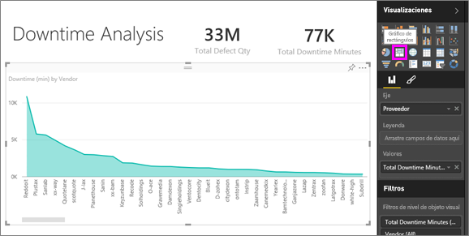
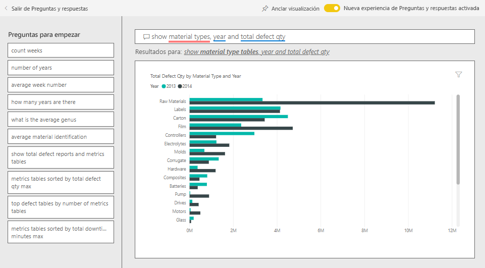
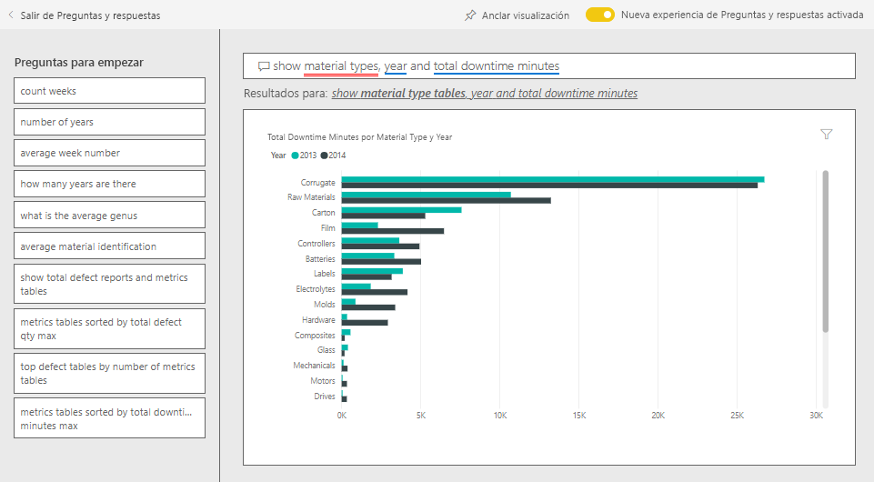
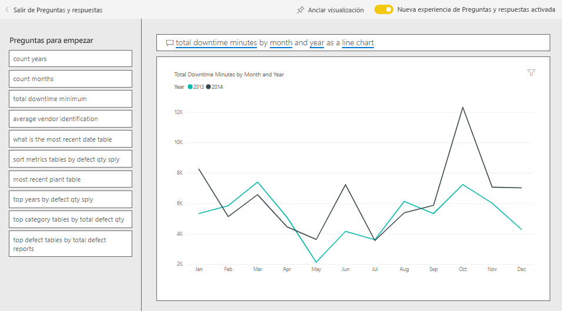

# Ejemplo de análisis de calidad de proveedores para Power BI: Dar un paseo

Este panel de ejemplo del sector y el informe subyacente se centran en uno de los desafíos habituales de la cadena de suministro: el análisis de calidad de proveedores. Hay dos métricas principales en juego en este análisis: el número total de defectos y el tiempo de inactividad total que estos defectos han provocado. 

Este ejemplo tiene dos objetivos principales:

* Comprender quiénes son los mejores y los peores proveedores desde el punto de vista de la calidad.
* Identificar las plantas que son más eficaces a la hora de encontrar y rechazar defectos, con el fin de minimizar los tiempos de inactividad.

Este ejemplo forma parte de una serie en la que se muestra cómo puede usar Power BI con datos, informes y paneles empresariales. Se ha creado mediante [obviEnce](http://www.obvience.com/) con datos reales anonimizados. Los datos están disponibles en varios formatos: paquete de contenido, archivo .pbix de Power BI Desktop o libro de Excel. Consulte [Ejemplos de Power BI](sample-datasets.md). 

En este tutorial, se explora el paquete de contenido de ejemplo de análisis de calidad de proveedores en el servicio de Power BI. Dado que la experiencia de informes es similar en Power BI Desktop y en el servicio, también puede proceder con el archivo .pbix de ejemplo de Power BI Desktop. 

Para explorar los ejemplos de Power BI Desktop, no necesita una licencia de Power BI. Si no tiene una licencia de Power BI Pro, puede guardar el ejemplo en Mi área de trabajo del servicio Power BI. 

## Obtención del ejemplo

Para poder usar el ejemplo, primero debe descargarlo como un [paquete de contenido](#get-the-content-pack-for-this-sample), un [archivo .pbix](#get-the-pbix-file-for-this-sample) o un [libro de Excel](#get-the-excel-workbook-for-this-sample).

### Obtención del paquete de contenido de este ejemplo

1. Abra el servicio Power BI (app.powerbi.com), inicie sesión y abra el área de trabajo donde desea guardar el ejemplo.

   Si no tiene una licencia de Power BI Pro, puede guardar el ejemplo en Mi área de trabajo.

2. En la esquina inferior izquierda, seleccione **Obtener datos**.
   
   
3. En la página **Obtener datos**, seleccione **Ejemplos**.
   
4. Seleccione **Ejemplo de análisis de calidad de proveedores** y haga clic en **Conectar**.  
   
   

5. Power BI importa el paquete de contenido y agrega un nuevo panel, informe y conjunto de datos en el área de trabajo actual.
   
   
  
### Obtención del archivo .pbix de este ejemplo

Como alternativa, puede descargar el ejemplo de análisis de calidad de proveedores como un [archivo .pbix](http://download.microsoft.com/download/8/C/6/8C661638-C102-4C04-992E-9EA56A5D319B/Supplier-Quality-Analysis-Sample-PBIX.pbix), que se ha diseñado para usarse con Power BI Desktop.

### Obtención del libro de Excel de este ejemplo

Si desea ver el origen de datos de este ejemplo, también está disponible como un [libro de Excel](http://go.microsoft.com/fwlink/?LinkId=529779). El libro contiene hojas de Power View que puede ver y modificar. Para ver los datos sin procesar, habilite los complementos de análisis de datos y, a continuación, seleccione **Power Pivot > Administrar**. Para habilitar los complementos Power View y Power Pivot, vea [Consulta de los ejemplos de Excel desde Excel](sample-datasets.md#optional-take-a-look-at-the-excel-samples-from-inside-excel-itself) para obtener más información.

## Tiempos de inactividad causados por materiales defectuosos
Vamos a analizar el tiempo de inactividad causado por los materiales defectuosos y a detectar qué proveedores son responsables.  

1. En el panel, seleccione la pestaña **Cantidad total de defectos** o el icono de **Total de minutos de inactividad**.

     

   Se abrirá el informe “Ejemplo de análisis de calidad de proveedores” en la página **Análisis del tiempo de inactividad**.

   Como puede ver, tenemos 33 millones de piezas defectuosas, lo que causa un total de tiempo de inactividad de 77 000 minutos. Aunque algunos materiales tienen menos piezas defectuosas, pueden causar retrasos, lo que prolonga el tiempo de inactividad. Veámoslo en la página de informes.  
2. Si observa la línea de **Total de minutos de inactividad** en el gráfico combinado **Defectos y tiempo de inactividad (min) por tipo de material**, se puede ver que los materiales corrugados causan la mayor parte del tiempo de inactividad.  
3. Seleccione la columna **Corrugado** para ver qué plantas se ven más afectadas por este defecto y qué proveedor es el responsable.  

     
4. En el mapa **Tiempo de inactividad (min) por planta**, seleccione varias plantas para ver qué proveedor o material es el responsable del tiempo de inactividad en esa planta.

### ¿Cuáles son los peores proveedores?
 Queremos encontrar a los ocho peores proveedores y determinar de qué porcentaje del tiempo de inactividad son responsables. Para hacerlo, podemos convertir el gráfico de áreas **Tiempo de inactividad (min) por proveedor** en un gráfico de rectángulos.  

1. En la página **Análisis del tiempo de inactividad** del informe, seleccione **Editar informe** en la esquina superior izquierda.  
2. Seleccione el gráfico de áreas **Tiempo de inactividad (min) por proveedor** y, en el panel **Visualizaciones**, seleccione el icono de **Gráfico de rectángulos**.  

     

    El gráfico de rectángulos define automáticamente el campo **Proveedor** como **Grupo**.  

      

   En este gráfico de rectángulos, podemos ver que los ocho principales proveedores son los ocho bloques de la izquierda del gráfico. También podemos ver que representan aproximadamente el 50 % del total de minutos de tiempo de inactividad.  
3. Seleccione **Ejemplo de análisis de calidad de proveedores** en la barra de navegación superior para volver al panel.

### Comparar plantas
Ahora veamos qué planta trabaja mejor a la hora de gestionar el material defectuoso, reduciendo así el tiempo de inactividad.  

1. En el panel, seleccione el icono de mapa **Informes de total de defectos por planta, tipo de defecto**.      

     

   El informe se abrirá en la página **Análisis de calidad de proveedores**.  

2. En la leyenda de los **Informes de total de defectos por planta y tipo de defecto**, seleccione el círculo **Impacto**.  

      

    En el gráfico de burbujas, puede verse que **Logística** es la categoría más problemática. Es la mayor en términos de cantidad total de defectos, informes de defectos y minutos de inactividad. Veamos esta categoría de forma más detallada.  
3. Seleccione la burbuja **Logística** en el gráfico de burbujas y observe las plantas de Springfield (Illinois) y Naperville (Illinois). Naperville parece haber mejorado la gestión de los suministros defectuosos, ya que tiene un alto número de rechazos y pocos impactos, en comparación con el elevado número de impactos de Springfield.  

     
4. Seleccione **Ejemplo de análisis de calidad de proveedores** en la barra de navegación superior para volver al panel.

## ¿Qué tipo de material se gestiona mejor?
El tipo material que se gestiona mejor es el que presenta un menor tiempo de inactividad o un impacto nulo, independientemente de la cantidad de defectos.

1. En el panel, examine el icono **Total Defect Quantity by Material Type, Defect Type**.

   

   Como puede ver, aunque el tipo de material de **Materias primas** tiene muchos defectos totales, la mayoría de esos defectos se rechazan o no tienen ningún impacto.

   Vamos a asegurarnos de que este tipo de material no cause un gran tiempo de inactividad, a pesar de la elevada cantidad de defectos.

2. En el panel, examine el icono **Cantidad total de defectos y total de minutos de tiempo de inactividad por tipo de material** .

   

   Parece que las materias primas están bien administradas; aunque tienen más defectos, generan menos minutos de inactividad totales.

### Comparar los defectos con el tiempo de inactividad por año
1. Seleccione el icono de mapa **Informes de total de defectos por planta, tipo de defecto** para abrir el informe en la página **Análisis de calidad de proveedores**.
2. En el gráfico **Cantidad total de defectos por mes y año**, observe que la cantidad de defectos es mayor en 2014 que en 2013.  

      
3. ¿Significa eso que más defectos conllevan más tiempo de inactividad? Para averiguarlo, podemos hacer preguntas en el cuadro de Preguntas y respuestas.  
4. Seleccione **Ejemplo de análisis de calidad de proveedores** en la barra de navegación superior para volver al panel.  
5. Como sabemos que las materias primas tienen el mayor número de defectos, escriba lo siguiente en el cuadro de pregunta: *mostrar tipos de material, año y cantidad total de defectos*.  

    Había muchos más defectos en las materias primas en 2014 que en 2013.  

      
6. Ahora, cambie la pregunta a: _Mostrar tipos de material, año y total de **minutos de inactividad**_ .  

   

   Como puede ver, el tiempo de inactividad de las materias primas fue aproximadamente el mismo en 2013 y 2014, a pesar de que hubo muchos más defectos en las materias primas en 2014. Parece que, aunque se produjeron más defectos de materias primas en 2014, no causaron un tiempo de inactividad mucho mayor para las materias primas en 2014.

### Comparar los defectos con el tiempo de inactividad mes a mes
Echemos un vistazo ahora a otro icono del panel relacionado con la cantidad total de defectos.  

1. Seleccione **Salir de preguntas y respuestas** en la esquina superior izquierda para volver al panel.  

    Veamos con más detalle el icono de **Cantidad total de defectos por mes y año**. Muestra que, en la primera mitad de 2014, tuvo un número de defectos similar al de 2013; pero, en la segunda mitad de 2014, el número de defectos aumentó considerablemente.  

      

    Veamos si este incremento en la cantidad de defectos provocó un aumento semejante en los minutos de tiempo de inactividad.  
2. En el cuadro de pregunta, escriba *Total de minutos de inactividad por mes y año como un gráfico de líneas*.  

   

   Aparte de un aumento en los minutos de inactividad durante junio y octubre, el número de defectos no causó un tiempo de inactividad significativamente mayor. En este resultado, se muestra que estamos administrando bien los defectos.  
3. Para anclar el gráfico al panel, seleccione el icono de anclar  en la parte superior del cuadro de pregunta.  
4. Para explorar los meses atípicos, vea los minutos de inactividad en octubre por tipo de material, ubicación de la planta, categoría, etc. Para ello, realice preguntas como *Total de minutos de inactividad en octubre por planta*. 
5. Seleccione **Salir de preguntas y respuestas** en la esquina superior izquierda para volver al panel.

## Pasos siguientes: Conectarse a sus datos
Este entorno es seguro porque puede elegir no guardar los cambios. Pero si los guarda, en **Obtener datos** podrá obtener una nueva copia de este ejemplo siempre que lo desee.

Esperamos que este paseo le haya mostrado cómo los paneles de Power BI, Preguntas y respuestas y los informes pueden ofrecer recomendaciones sobre los datos de ejemplo. Ahora es su turno: conéctese a sus propios datos. Con Power BI puede conectarse a una gran variedad de orígenes de datos. Para obtener más información, consulte [Introducción al servicio Power BI](service-get-started.md).
