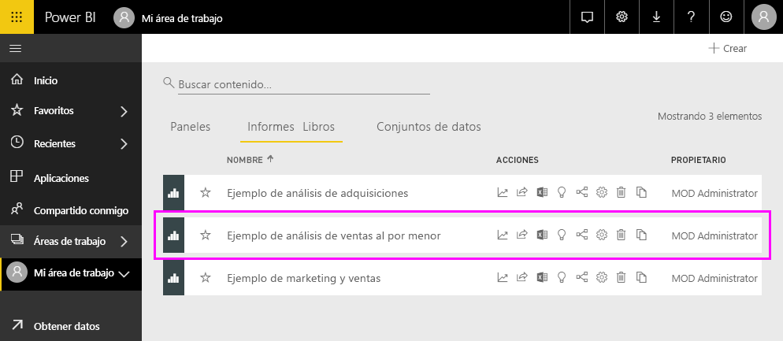
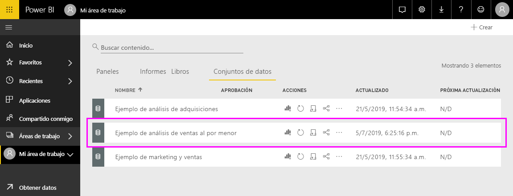

#  Importación y apertura de paquetes de ejemplo para Power BI

En este tutorial, se muestra cómo: 
- Importar un paquete de contenido de ejemplo, agregarlo al servicio de Power BI y abrir el contenido. Un *paquete de contenido* es un tipo de ejemplo en el que el conjunto de datos está integrado en un panel y un informe. 
- Abra un archivo .pbix de ejemplo en Power BI Desktop.

Para obtener más información, vea [Conjuntos de datos de ejemplo para Power BI](sample-datasets.md). En ese artículo, obtendrá información sobre los ejemplos: cómo obtenerlos, dónde guardarlos, cómo usarlos y algunas de las historias que nos explica cada ejemplo. 

## Requisitos previos
Los ejemplos están disponibles para el servicio de Power BI y para Power BI Desktop. Para continuar, usaremos el ejemplo Retail Analysis.

El paquete de contenido *Ejemplo de análisis de minoristas* que se usa en este tutorial se compone de un panel, un informe y un conjunto de datos.
Para familiarizarse con este paquete de contenido en particular y su escenario, vea [Ejemplo de análisis de venta minorista para Power BI: paseo](sample-retail-analysis.md) antes de empezar.

## Ejemplos en el servicio de Power BI

1. Abra el servicio Power BI (app.powerbi.com), inicie sesión y abra el área de trabajo donde desea guardar el ejemplo. 

    Si no tiene una licencia de Power BI Pro, puede guardar el ejemplo en Mi área de trabajo.

2. Seleccione **Obtener datos** en la parte inferior del panel de navegación. 

   

   Si no ve **Obtener datos**, seleccione este icono en la parte superior del panel para expandir el panel de navegación: .

5. En la página **Obtener datos**, seleccione **Ejemplos**.
   
6. Seleccione **Ejemplo de análisis de minoristas** y, luego, elija **Conectar**.   
   
   

## ¿Qué se ha importado?
Con los paquetes de contenido de ejemplo, al seleccionar **Conectar**, Power BI obtiene una copia del paquete de contenido y lo guarda automáticamente en la nube. Como la persona que ha creado el paquete de contenido ha incluido un conjunto de datos, un informe y un panel, eso es justamente lo que obtendrá si hace clic en **Conectar**. 

1. Al seleccionar **Conectar**, Power BI crea el panel y lo agrega a la pestaña **Paneles**. 
   
   
2. Abra la pestaña **Informes**. Aquí, verá un nuevo informe denominado *Ejemplo de análisis de venta minorista*.
   
   
   
   Vea la pestaña **Conjuntos de datos**; también hay un nuevo conjunto de datos.
   
   

## Explorar el contenido nuevo
Ahora, explore el panel, el conjunto de datos y los informes por su cuenta. Hay varias formas de navegar a los paneles, informes y conjuntos de datos. Uno de estos métodos se describe en el procedimiento siguiente.  

1. Vuelva a la pestaña **Paneles** y, después, seleccione el panel **Ejemplo de análisis de venta minorista** para abrirlo.       

   Se abrirá el panel, que tiene varios de iconos de visualización.   
 
1. Seleccione uno de los iconos del panel para abrir el informe subyacente. En este ejemplo, seleccionaremos el gráfico de áreas, **Ventas de este año, ventas del año pasado por mes fiscal**.  

   

   El informe se abrirá en la página que contiene el gráfico de áreas que ha seleccionado; en este caso, la página **Ventas mensuales de distrito** del informe.
   
   
   
   > [!NOTE]
   > Si el icono se ha creado mediante [Preguntas y respuestas de Power BI](power-bi-tutorial-q-and-a.md), en su lugar se abrirá la página de preguntas y respuestas. Si el icono se [ha anclado desde Excel](service-dashboard-pin-tile-from-excel.md), se abrirá Excel Online dentro de Power BI.
   > 
   > 
1. Cuando un usuario comparte un paquete de contenido con sus compañeros, lo más probable es que solo quiera compartir las conclusiones, en lugar de proporcionar acceso directo a los datos. En la pestaña **Conjuntos de datos**, hay varias opciones para explorar un conjunto de datos. Pero no puede ver las filas y columnas de los datos, como puede hacerlo en Power BI Desktop o en Excel. 
   
   
   
1. Una manera de explorarlo es mediante la creación de sus propios informes y visualizaciones desde cero. Seleccione el icono de gráfico  para abrir el conjunto de datos en el modo de edición del informe.
     
   

1. Otra forma de explorar el conjunto de datos es ejecutar [Información rápida](consumer/end-user-insights.md). Seleccione **Más opciones** (...) y, luego, elija **Obtener conclusiones rápidas**. Cuando la información ya está lista, seleccione **Ver información**.
     
    

## Ejemplos en Power BI Desktop 
Al abrir por primera vez el archivo .pbix de ejemplo en Power BI Desktop, se mostrará en la vista Informe, donde puede explorar, crear y modificar cualquier número de páginas del informe con visualizaciones. La vista de informes proporciona prácticamente la misma experiencia de diseño que la vista de edición de un informe en el servicio de Power BI. Puede mover visualizaciones, copiar y pegar, combinar, etc. 

A diferencia de la edición de informes en el servicio de Power BI, en Power BI Desktop también puede trabajar con sus consultas y modelar los datos para asegurarse de que admitan las mejores conclusiones en sus informes. A continuación, puede guardar el archivo de Power BI Desktop donde quiera, ya sea en la unidad local o en la nube.

1. Descargue el archivo [Retail Analysis Sample PBIX.pbix](https://download.microsoft.com/download/9/6/D/96DDC2FF-2568-491D-AAFA-AFDD6F763AE3/Retail%20Analysis%20Sample%20PBIX.pbix) de ejemplo de análisis de venta minorista y ábralo en Power BI Desktop. 

    

1. El archivo se abre en la vista de informe. Observe las cuatro pestañas de la parte inferior del editor de informes; estas pestañas representan las cuatro páginas del informe. En el ejemplo, la página **Nuevas tiendas** está seleccionada actualmente. 

    .

1. Para obtener más información sobre el editor de informes, vea [Paseo por el editor de informes](service-the-report-editor-take-a-tour.md).

## ¿Qué hay en un informe?
Al descargar un archivo .pbix de ejemplo, no solo se descarga el informe, sino también el *conjunto de datos subyacente*. Al abrir el archivo, Power BI Desktop carga los datos con sus consultas y relaciones asociadas. Puede ver las relaciones y datos subyacentes, pero no puede ver las consultas subyacentes en el Editor de consultas.

1. Para cambiar a la [vista de datos](desktop-data-view.md) seleccione el icono de tabla .
 
    

    En la vista de datos, puede inspeccionar, explorar y comprender los datos de su modelo de Power BI Desktop. Es distinto de cómo se visualizan las tablas, columnas y datos en el Editor de consultas. Los datos de la vista de datos ya están cargados en el modelo.

    Al modelar los datos, puede que a veces quiera ver lo que realmente hay en las filas y columnas de una tabla, sin tener que crear un objeto visual en el lienzo del informe. Esto es especialmente cierto cuando crea columnas calculadas y medidas, o tiene que identificar un tipo de datos o una categoría de datos.

1. Seleccione este icono para cambiar a la [vista de relaciones](desktop-relationship-view.md): .
 
    

    La vista de relaciones muestra todas las tablas, columnas y relaciones en el modelo. Desde aquí puede ver, cambiar y crear relaciones.

## Pasos siguientes
Este entorno es seguro porque puede elegir no guardar los cambios. Pero si los guarda, en **Obtener datos** podrá obtener una nueva copia de este ejemplo siempre que lo desee.

Esperamos que en este paseo haya aprendido cómo los paneles, los conjuntos de datos, las relaciones y los informes de Power BI pueden proporcionar conclusiones sobre los datos de ejemplo. Ahora es su turno: conéctese a sus propios datos. Con Power BI puede conectarse a una gran variedad de orígenes de datos. Para obtener más información, vea [Introducción al servicio de Power BI](service-get-started.md) e [Introducción a Power BI Desktop](desktop-getting-started.md).  

Para más información, consulte:  
- [Conceptos básicos para los diseñadores en el servicio Power BI](service-basic-concepts.md)
- [Ejemplos para el servicio de Power BI](sample-datasets.md)
- [Orígenes de datos de Power BI](service-get-data.md)

¿Tiene más preguntas? [Pruebe la comunidad de Power BI](https://community.powerbi.com/)
