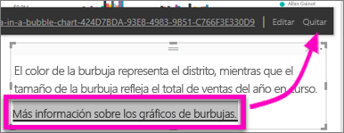

# Agregar un hipervínculo a un cuadro de texto de un informe
Los cuadros de texto se pueden agregar a informes, anclar a paneles desde informes y agregar directamente a paneles. Es posible agregar hipervínculos a un cuadro de texto independientemente de su ubicación.  

> **NOTA**: para más información sobre los hipervínculos en matrices y tablas de Power BI, consulte [Hipervínculos en tablas](power-bi-hyperlinks-in-tables.md). Para más información sobre cómo agregar cuadros de texto a su **panel**, consulte [Agregar un icono directamente desde el panel ](service-dashboard-add-widget.md). 
> 
> 

<iframe width="560" height="315" src="https://www.youtube.com/embed/_3q6VEBhGew#t=0m55s" frameborder="0" allowfullscreen></iframe>

## Para agregar un hipervínculo a un cuadro de texto de un informe
1. [Cree un cuadro de texto y agregue texto](power-bi-reports-add-text-and-shapes.md). 
2. Resalte el texto existente o agregue texto nuevo que se usará como hipervínculo.
   
   
3. Seleccione el icono de hipervínculo .
4. Escriba o pegue la dirección URL en el campo de hipervínculo y seleccione **Listo**.
   
   
5. Pruebe el vínculo.  
   
   
   
   * Coloque el cursor en cualquier lugar en el texto resaltado para mostrar la dirección URL.  
     
      
   * Seleccione la dirección URL para abrir la página en una ventana de explorador nueva.

## Para quitar el hipervínculo del texto y dejar el texto
1. En el cuadro de texto, seleccione el hipervínculo para resaltarlo y
   
     
2. elija **Quitar**. 

## Pasos siguientes
[Cuadros de texto en informes de Power BI](power-bi-reports-add-text-and-shapes.md)

¿Tiene más preguntas? [Pruebe la comunidad de Power BI](http://community.powerbi.com/)

