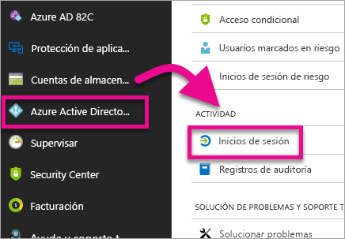
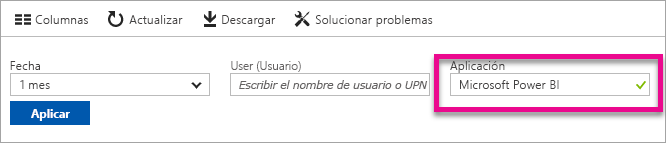
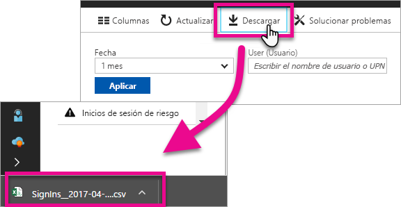

# Encontrar usuarios de Power BI que hayan iniciado sesión

Si es un administrador de inquilinos y quiere ver quién ha iniciado sesión en Power BI, use los [informes de acceso y uso de Azure Active Directory](/azure/active-directory/reports-monitoring/concept-sign-ins) para aumentar la visibilidad.

> [!NOTE]
> El informe de **Inicios de sesión** ofrece información útil, pero no identifica el tipo de licencia que cada usuario tiene. Use el Centro de administración de Microsoft 365 para ver licencias.

## Requisitos

Cualquier usuario (incluidos los no administradores) puede ver un informe de sus propios inicios de sesión, pero debe cumplir los requisitos siguientes para ver un informe para todos los usuarios.

* El inquilino debe tener una licencia de Azure AD Premium asociada.

* Debe tener alguno de los roles siguientes: administrador global, administrador de seguridad o lector de seguridad.

## Uso de Azure Portal para ver los inicios de sesión

Para ver la actividad de inicio de sesión, siga estos pasos.

1. En **Azure Portal**, seleccione **Azure Active Directory**.

1. En **Supervisión**, seleccione **Inicios de sesión**.
   
    

1. Filtre la aplicación, por **Microsoft Power BI** o **Power BI Gateway** y seleccione **Aplicar**.

    **Microsoft Power BI** filtra la actividad de inicio de sesión relacionada con el servicio, mientras que **Power BI Gateway** filtra la actividad de inicio de sesión específica de la puerta de enlace de datos local.
   
    

## Exportar los datos

También se puede [descargar un informe de inicio de sesión](/azure/active-directory/reports-monitoring/quickstart-download-sign-in-report) en cualquiera de los dos formatos: un archivo CSV o un archivo JSON.

En la parte superior del informe de **Inicios de sesión**, seleccione **Descargar** y luego seleccione una de las opciones siguientes:

* **CSV** para descargar un archivo CSV con los datos filtrados actualmente.

* **JSON** para descargar un archivo JSON con los datos filtrados actualmente.

## Retención de datos

Los datos relacionados con el inicio de sesión están disponibles durante 30 días como máximo. Para obtener más información, consulte las [directivas de retención de informes de Azure Active Directory](/azure/active-directory/reports-monitoring/reference-reports-data-retention).

## Pasos siguientes

[Usar la auditoría dentro de su organización](service-admin-auditing.md)

¿Tiene más preguntas? [Pruebe a preguntar a la comunidad de Power BI](https://community.powerbi.com/)