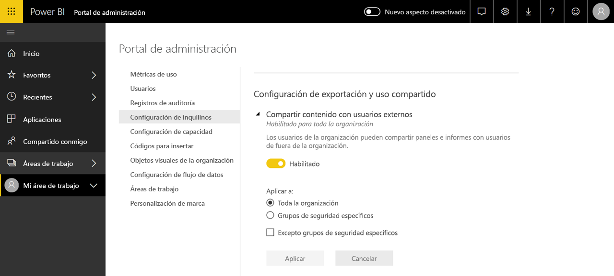

# ¿Qué es la administración de Power BI?

La administración de Power BI es la administración de un inquilino de Power BI, incluida la configuración de directivas de gobernanza, supervisión del uso y aprovisionamiento de licencias, funcionalidades y recursos de la organización. En este artículo se ofrece información general sobre los roles, las tareas y las herramientas de administración, además de vínculos a los artículos que entran en más detalles.

Power BI se diseñó para inteligencia empresarial con características de autoservicio, y el administrador es el guardián de los datos, los procesos y las directivas en el inquilino de Power BI. Un administrador de Power BI es un miembro de clave de un equipo que incluye a los desarrolladores, analistas y otros roles de inteligencia artificial. El administrador puede ayudar a una organización a asegurarse de que se cumplen los objetivos importantes:

- Comprender los KPI y las métricas que los usuarios _realmente_ necesitan
- Reducir el tiempo de entrega de informes corporativos dirigidos a TI
- Incrementar la adopción y el retorno de la inversión de una implementación de Power BI

La finalidad es que los usuarios empresariales sean productivos y garantizar la seguridad y la conformidad de las leyes y los reglamentos. Las responsabilidades pueden incluir ayudar, apoyar y, en muchos casos, asistir a los usuarios empresariales a que hagan lo correcto.

## Roles de administrador relacionados con Power BI

Hay varios roles relacionados con la administración de Power BI, que se tratan en la tabla siguiente.

| **Tipo de administrador** | **Ámbito administrativo** | **Ámbito de Power BI** |
| --- | --- | --- |
| Administrador global de Office 365 | Office 365 | Puede administrar todos los aspectos de un inquilino de Power BI y otros servicios. |
| Administrador de facturación de Office 365 | Office 365 | Puede adquirir licencias de Power BI con suscripciones de Office 365. |
| Administrador de servicios de Power BI | Inquilino de Power BI | Tiene control total sobre un inquilino de Power BI y sus características administrativas (excepto para las licencias). |
| Administrador de capacidad de Power BI Premium | Una única capacidad Premium | Tiene control total sobre una capacidad Premium y sus características administrativas. |
| Administrador de capacidad de Power BI Embedded | Una única capacidad de Embedded | Tiene control total sobre una capacidad de Embedded y sus características administrativas. |

Los administradores globales de Office 365 o Azure Active Directory tienen derechos de administrador en Power BI. Un administrador global de Office 365 puede asignar otros usuarios al rol de administrador del servicio Power BI, que concede derechos administrativos solo para las características de Power BI.

Los administradores del servicio Power BI tienen acceso al portal de administración de Power BI que incluye distintas configuraciones a nivel de inquilino con respecto a la funcionalidad, la seguridad y la supervisión. Los administradores de servicios tienen acceso total a todos los recursos de un inquilino de Power BI. En la mayoría de los casos, los administradores de servicios identifican los problemas y, a continuación, realizan un seguimiento con los propietarios de recursos para tomar medidas correctivas.

El rol de administrador del servicio Power BI no concede la capacidad de asignar licencias a los usuarios o ver registros de auditoría en Office 365. Por lo tanto, la tarea de administración de Power BI actualmente no la pueden realizar los usuarios que son únicamente miembros del rol de administrador del servicio Power BI.

## Tareas administrativas

Los administradores realizan muchas tareas para admitir el inquilino de Power BI en su organización, que se tratan en la tabla siguiente.

| **Área de tareas** | **Tareas habituales** |
| --- | --- |
| Administrar el inquilino de Power BI |<ul><li>Habilitar y deshabilitar características clave de Power BI <li>Informar del uso y del rendimiento <li>Revisar y administrar la auditoría de eventos</ul>|
| Adquirir y asignar licencias de Power BI |<ul><li>Administrar la suscripción de usuarios <li>Adquirir y asignar licencias Pro <li>Bloquear el acceso de los usuarios a Power BI</ul>|
| Administrar la capacidad Premium |<ul><li>Adquirir capacidad Premium y trabajar con ella <li>Garantizar la calidad del servicio|
| Administrar la capacidad de Embedded |<ul><li>Adquirir capacidad de Embedded para simplificar cómo los ISV y los desarrolladores usan funcionalidades de Power BI</ul>|
| Asegurar el cumplimiento de las directivas internas, las leyes y los reglamentos | <ul><li>Administrar la clasificación de datos empresariales <li>Ayudar a aplicar las directivas de uso compartido y publicación de contenido</ul>|
| Administrar recursos de Power BI |<ul><li>Administrar áreas de trabajo <li>Publicar objetos visuales personalizados <li>Verificar los códigos utilizados para insertar Power BI en otras aplicaciones|
| Proporcionar ayuda y soporte técnico a los usuarios del inquilino |<ul><li>Solucionar problemas de acceso a datos y otros problemas</ul>|
| Otras tareas |<ul><li>Implementar Power BI Desktop, por ejemplo, con System Center Configuration Manager <li>Administrar la implementación de aplicaciones móviles de Power BI con Intune <li>Administrar la privacidad y la seguridad de los datos, como la seguridad de los datos de origen</ul>|

## Tareas administrativas

Hay varias herramientas relacionadas con la administración de Power BI, que se tratan en la tabla siguiente. Normalmente, los administradores dedican la mayor parte de su tiempo en el portal de administración de Power BI y a usar otras herramientas, según sea necesario.

| **Herramienta** | **Tareas habituales** |
| --- | --- |
| Portal de administración de Power BI |<ul><li>Adquirir capacidad Premium y trabajar con ella</li><li>Garantizar la calidad del servicio</li><li>Administrar la clasificación de datos empresariales</li><li>Ayudar a aplicar las directivas de uso compartido y publicación de contenido</li><li>Administrar áreas de trabajo <li>Publicar objetos visuales personalizados</li><li>Verificar los códigos utilizados para insertar Power BI en otras aplicaciones</li><li>Solucionar problemas de acceso a datos y otros problemas</li></ul>|
| Centro de administración de Microsoft 365 |<ul><li>Administrar la suscripción de usuarios</li><li>Adquirir y asignar licencias Pro</li><li>Bloquear el acceso de los usuarios a Power BI</li></ul>|
| Centro de seguridad y cumplimiento de Office 365 |<ul><li>Revisar y administrar la auditoría de eventos</li></ul>|
| Azure Active Directory (AAD) en Azure Portal |<ul><li>Configurar el acceso condicional a los recursos de Power BI con AAD</li><li>Aprovisionar capacidad de Power BI Embedded</li></ul>|
| Cmdlets de PowerShell |<ul><li>Administrar áreas de trabajo y otros aspectos de Power BI mediante scripts</li></ul>|
| SDK y API administrativas |<ul><li>Crear herramientas administrativas personalizadas para facilitar el trabajo de un administrador de Power BI. Por ejemplo, Power BI Desktop puede usar estas API para crear informes basados en datos relacionados con la administración</li></ul>|

## Pasos siguientes

Esperamos que este artículo le haya proporcionado alguna información rápida sobre el trabajo del administrador de Power BI y los roles, las tareas y las herramientas específicos que se suelen usar. Se recomienda leer los temas de los artículos siguientes para ampliar conocimientos.

[Uso del portal de administración de Power BI](service-admin-portal.md)

[Uso de cmdlets de PowerShell](/powershell/power-bi/overview)

[Preguntas frecuentes sobre la administración de Power BI](service-admin-faq.md)

¿Tiene más preguntas? [Pruebe a preguntar a la comunidad de Power BI](https://community.powerbi.com/)