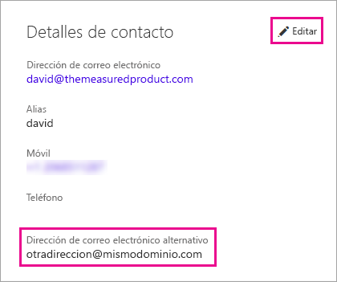

# <a name="use-an-alternate-email-address"></a>Uso de un dirección de correo electrónico alternativa

Al suscribirse a Power BI, proporciona una dirección de correo electrónico. De forma predeterminada, Power BI usa esta dirección para enviar actualizaciones acerca de la actividad en el servicio. Por ejemplo, cuando alguien le envía una invitación de uso compartido, se remite a esta dirección.

A veces, puede que desee que estos correos electrónicos se entreguen a una dirección de correo electrónico alternativa en lugar de a la que usó para registrarse. En este artículo se explica cómo especificar una dirección alternativa en Office 365 y en PowerShell. En el artículo también se explica cómo se resuelve una dirección de correo electrónico en Azure Active Directory (Azure AD).

> [!NOTE]
> Especificar una dirección alternativa no afecta a qué dirección de correo electrónico usa Power BI para las actualizaciones del servicio, los boletines y otras comunicaciones promocionales. Esas comunicaciones siempre se envían a la dirección de correo electrónico que usó al suscribirse a Power BI.

## <a name="use-office-365"></a>Uso de Office 365

Para especificar una dirección alternativa en Office 365, siga estos pasos.

1. Abra la [página de información personal de Office 365](https://portal.office.com/account/#personalinfo). Si la aplicación se lo solicita, inicie sesión con la dirección de correo electrónico y la contraseña que se usa para Power BI.

1. En el menú izquierdo, seleccione **Información personal**.

1. En la sección **Detalles de contacto**, seleccione **Editar**.

    Si no puede editar los detalles, significa que el administrador de Office 365 administra la dirección de correo electrónico. Póngase en contacto con el administrador para actualizar su dirección de correo electrónico.

    

1. En el campo **Correo electrónico alternativo**, escriba la dirección de correo electrónico a la que le gustaría que Office 365 envíe las actualizaciones de Power BI.

## <a name="use-powershell"></a>Uso de PowerShell

Para especificar una dirección alternativa en PowerShell, use el comando [Set-AzureADUser](/powershell/module/azuread/set-azureaduser/).

```powershell
Set-AzureADUser -ObjectId john@contoso.com -OtherMails "otheremail@somedomain.com"
```

## <a name="email-address-resolution-in-azure-ad"></a>Resolución de direcciones de correo electrónico en Azure AD

Para capturar un token de inserción de Azure AD para Power BI, puede usar tres tipos distintos de dirección de correo electrónico:

* La dirección de correo electrónico principal asociada a una cuenta de Azure AD de un usuario

* La dirección de correo electrónico de UserPrincipalName (UPN)

* El atributo de matriz *Otra dirección de correo electrónico*

Power BI selecciona la dirección de correo electrónico que se va según la siguiente secuencia:

1. Si el atributo de correo electrónico del objeto de usuario de Azure AD está presente, Power BI usará ese atributo para la dirección de correo electrónico.

1. Si la dirección de correo electrónico UPN *no* es una dirección de correo electrónico con el dominio **\*.onmicrosoft.com** (la información que aparece detrás del símbolo "\@"), Power BI usa ese atributo de correo para la dirección de correo electrónico.

1. Si el atributo de matriz *Otra dirección de correo electrónico* del objeto de usuario de Azure AD está presente, Power BI usa la primera dirección de correo electrónico de esa lista (dado que puede haber una lista de direcciones de correo electrónico en este atributo).

1. Si no está presente ninguna de las condiciones anteriores, Power Bi usa la dirección UPN.

¿Tiene más preguntas? [Pruebe la comunidad de Power BI](https://community.powerbi.com/)