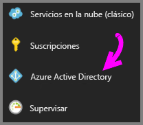
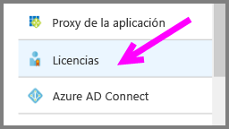
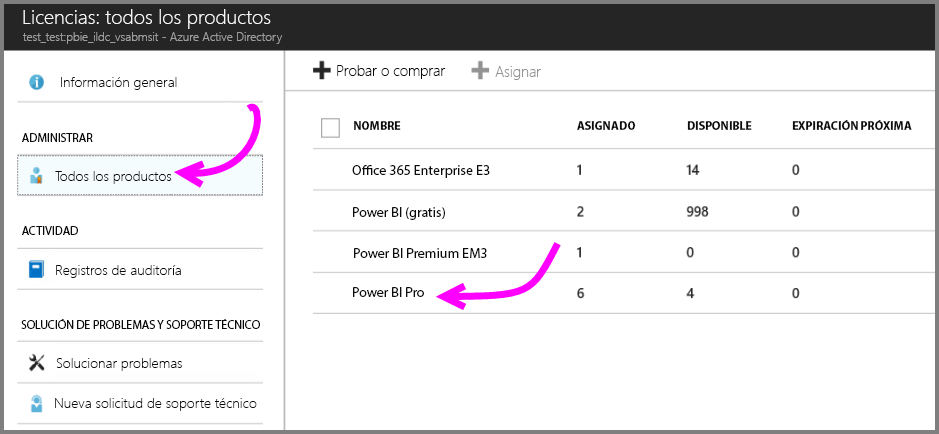
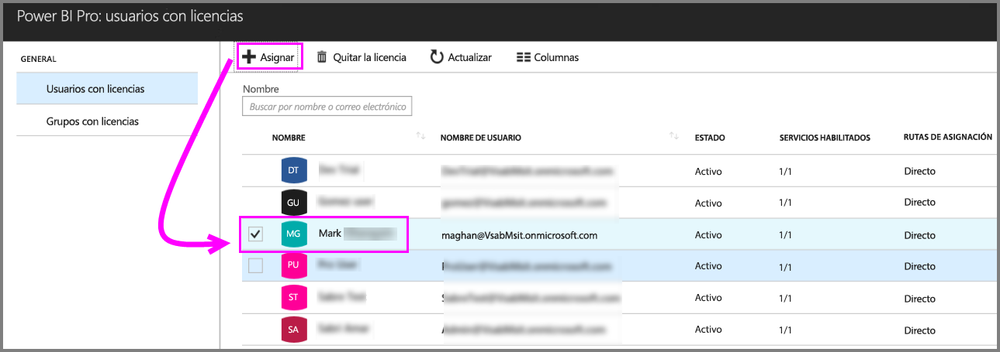

# Inicio rápido: Asignación de licencias de Power BI Pro en Azure

Power BI Pro es una licencia individual que permite acceder a todo el contenido y las funcionalidades del servicio Power BI, incluida la capacidad de compartir el contenido y colaborar con otros usuarios de Pro. Solo los usuarios de la versión Pro pueden publicar y consumir contenido en áreas de trabajo de las aplicaciones, compartir paneles y suscribirse a paneles e informes. En este artículo se explica cómo asignar licencias de Power BI Pro en Azure. También puede [asignar licencias en Office 365](service-admin-assigning-power-bi-pro-licenses.md).

## Requisitos previos

Debe ser propietario de la suscripción de Azure que utiliza Power BI para las búsquedas de Active Directory.

Debe [adquirir al menos una licencia](service-admin-purchasing-power-bi-pro.md) antes de empezar.

## Asignación de licencias a cuentas de usuario individuales

Siga estos pasos para asignar licencias de Power BI Pro a cuentas de usuario individuales:

1. Abra [Azure Portal](https://ms.portal.azure.com/#@microsoft.onmicrosoft.com/dashboard/private/39bc3cf7-31a4-43f6-954c-f2d69ca2f0). 

2. En la barra de navegación izquierda, seleccione **Azure Active Directory**.

    

3. En **Azure Active Directory**, seleccione **Licencias**.

    

4. En **Licencias**, seleccione **Todos los productos** y luego **Power BI Pro** para mostrar la lista de usuarios con licencia.

    

5. Seleccione **Asignar** para agregar una licencia de Power BI Pro a una cuenta de usuario adicional.

    

## Pasos siguientes

Ahora que ya ha asignado las licencias, obtenga más información sobre Power BI Pro.

[Power BI Pro en su organización](service-admin-power-bi-pro-in-your-organization.md)

[Find Power BI users that have signed in](service-admin-access-usage.md) (Búsqueda de usuarios de Power BI que hayan iniciado sesión)

¿Tiene más preguntas? [Pruebe a preguntar a la comunidad de Power BI](https://community.powerbi.com/)