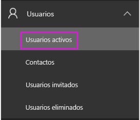
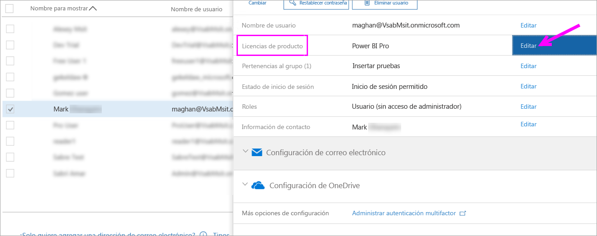
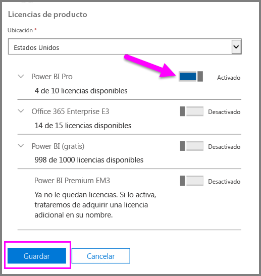
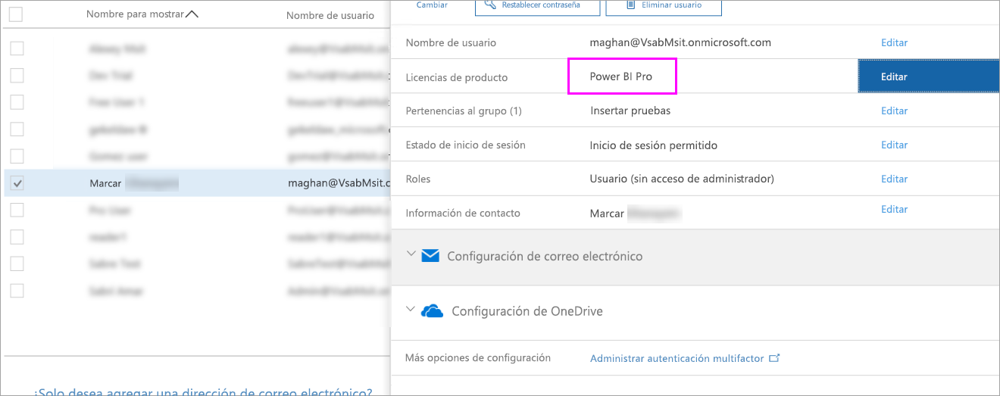

# Inicio rápido: Asignación de licencias de Power BI Pro en Office 365

Power BI Pro es una licencia individual que permite acceder a todo el contenido y las funcionalidades del servicio Power BI, incluida la capacidad de compartir el contenido y colaborar con otros usuarios de Pro. Solo los usuarios de la versión Pro pueden publicar y consumir contenido en áreas de trabajo de las aplicaciones, compartir paneles y suscribirse a paneles e informes. En este artículo se explica cómo asignar licencias de Power BI Pro en Office 365. También puede [asignar licencias en Azure](service-admin-assigning-power-bi-pro-licenses-azure.md).

## Requisitos previos

Debe ser miembro del rol de [**administrador global** o **administrador de cuentas de usuario**](https://support.office.com/article/about-office-365-admin-roles-da585eea-f576-4f55-a1e0-87090b6aaa9d?ui=en-US&rs=en-US&ad=US) en Office 365.

Debe [adquirir al menos una licencia](service-admin-purchasing-power-bi-pro.md) antes de empezar.

## Asignación de licencias a cuentas de usuario individuales

Siga estos pasos para asignar licencias de Power BI Pro a cuentas de usuario individuales:

1. Abra el [centro de administración de Office 365](https://portal.office.com/adminportal/home#/homepage).

2. En el panel de navegación izquierdo, expanda **Usuarios** y luego seleccione **Usuarios activos**.

    

3. Seleccione un usuario y después, en **Licencias de productos**, seleccione **Editar**.

    

4. En **Power BI Pro**, **active** la opción y luego seleccione **Guardar**.

    

5. En la cuenta seleccionada, puede comprobar en **Estado** que se ha asignado correctamente la licencia de Power BI Pro.

    

## Pasos siguientes

Ahora que ya ha asignado las licencias, obtenga más información sobre Power BI Pro.

[Power BI Pro en su organización](service-admin-power-bi-pro-in-your-organization.md)

[Find Power BI users that have signed in](service-admin-access-usage.md) (Búsqueda de usuarios de Power BI que hayan iniciado sesión)

¿Tiene más preguntas? [Pruebe a preguntar a la comunidad de Power BI](https://community.powerbi.com/)