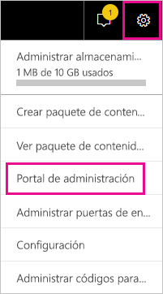
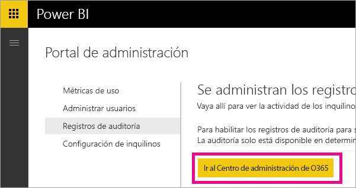
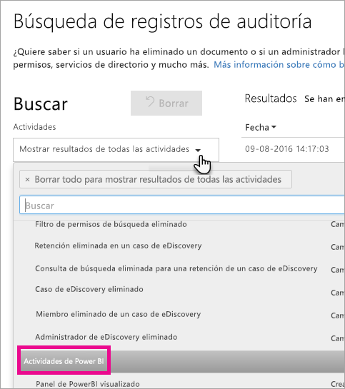
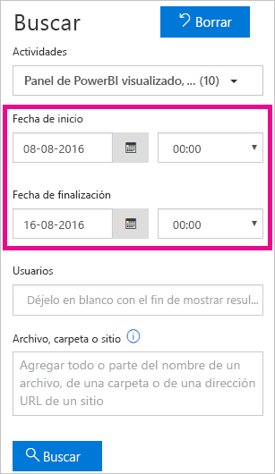
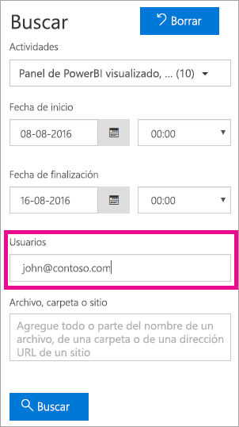
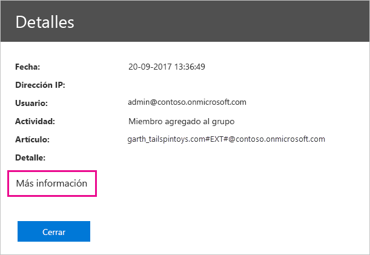
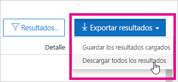

# <a name="using-auditing-within-your-organization"></a>Usar la auditoría dentro de su organización

Es fundamental saber quién realiza cada acción en cada elemento del inquilino de Power BI para ayudar a la organización a satisfacer sus requisitos, como el cumplimiento normativo y la administración de registros. Use las funciones de auditoría de Power BI para auditar las acciones que realizan los usuarios, como "Ver informe" o "Ver panel". No se pueden utilizar para auditar permisos.

Trabaje con las funciones de auditoría en el Centro de seguridad y cumplimiento de Office 365 o use PowerShell. La auditoría se basa en la funcionalidad de Exchange Online, que se aprovisiona automáticamente para admitir Power BI.

Puede filtrar los datos de auditoría por intervalo de fechas, usuario, panel, informe, conjunto de datos y tipo de actividad. También puede descargar las actividades en un archivo .csv (valores separados por comas) para analizarlo sin conexión.

## <a name="requirements"></a>Requisitos

Debe cumplir estos requisitos para tener acceso a los registros de auditoría:

* Debe ser un administrador global o tener asignado el rol Registros de auditoría o Registros de auditoría de solo lectura de Exchange Online para obtener acceso al registro de auditoría. De forma predeterminada, estos roles se asignan a los grupos de roles de Administración de cumplimiento y Administración de organizaciones de la página **Permisos** en el centro de administración de Exchange.

    Para que las cuentas que no son de administrador puedan acceder al registro de auditoría, debe agregar al usuario como miembro de uno de estos grupos de roles. También puede crear un grupo de roles personalizados en el centro de administración de Exchange, asignar el rol Registros de auditoría o Registros de auditoría de solo visualización a este grupo y, luego, agregar la cuenta que no es de administrador al nuevo grupo de roles. Para obtener más información, vea [Manage role groups in Exchange Online](/Exchange/permissions-exo/role-groups) (Administración de grupos de roles en Exchange Online).

    Si no puede acceder al centro de administración de Exchange desde el centro de administración de Office 365, vaya a https://outlook.office365.com/ecp e inicie sesión con sus credenciales.

* Si tiene acceso al registro de auditoría pero no es un administrador global o un administrador del servicio Power BI, no tendrá acceso al portal de administración de Power BI. En este caso, deberá usar un vínculo directo al [Centro de seguridad y cumplimiento de Office 365](https://sip.protection.office.com/#/unifiedauditlog).

## <a name="accessing-your-audit-logs"></a>Obtener acceso a los registros de auditoría

Para acceder a los registros, asegúrese de que el registro está habilitado en Power BI. Para más información, vea [Registros de auditoría](service-admin-portal.md#audit-logs) en la documentación del portal de administración. Puede haber una demora de hasta 48 horas entre la habilitación de la auditoría y el momento en el que se empiecen a mostrar los datos de auditoría. Si no ve los datos de inmediato, consulte los registros de auditoría más tarde. Puede haber una demora similar entre la obtención de permisos para ver los registros de auditoría y la posibilidad de acceder a estos.

Los registros de auditoría de Power BI están disponibles directamente en el [Centro de seguridad y cumplimiento de Office 365](https://sip.protection.office.com/#/unifiedauditlog). También hay un vínculo desde el portal de administración de Power BI:

1. En Power BI, seleccione el **icono de engranaje** en la esquina superior derecha y luego seleccione **Portal de administración**.

   

1. Seleccione **Registros de auditoría**.

1. Seleccione **Ir al Centro de administración de O365**.

   

## <a name="search-only-power-bi-activities"></a>Buscar solo actividades de Power BI

Restrinja los resultados solo a las actividades de Power BI; para ello siga estos pasos. Para obtener una lista de actividades, consulte la lista de [actividades auditadas por Power BI](#activities-audited-by-power-bi) más adelante en este artículo.

1. En la página **Búsqueda de registros de auditoría**, seleccione la lista desplegable **Actividades** en **Buscar**.

2. Seleccione **Actividades de Power BI**.

   

3. Seleccione un lugar fuera del cuadro de selección para cerrarlo.

Ahora, las búsquedas se filtrarán de modo que solo aparezcan actividades de Power BI.

## <a name="search-the-audit-logs-by-date"></a>Buscar en los registros de auditoría por fecha

Puede buscar registros por intervalo de fechas mediante el campo **Fecha de inicio** y **Fecha de finalización**. De forma predeterminada, están seleccionados los últimos siete días. La fecha y hora se presentan en formato de hora universal coordinada (UTC). El intervalo de fechas máximo que se puede especificar es de 90 días. 

Si el intervalo de fechas seleccionado es superior a 90 días, se muestra un error. Si usa el intervalo de fechas máximo de 90 días, debe seleccionar la hora actual en la **fecha de inicio**. En caso contrario, recibirá un error que indica que la fecha de inicio es anterior a la fecha de finalización. Si ha activado la auditoría durante los 90 últimos días, el intervalo de fechas no puede empezar antes de la fecha de activación de la auditoría.



## <a name="search-the-audit-logs-by-users"></a>Buscar en los registros de auditoría por usuario

Puede buscar entradas del registro de auditoría para actividades realizadas por usuarios específicos. Para ello, escriba uno o varios nombres de usuario en el campo **Usuarios**. El nombre de usuario es similar a una dirección de correo electrónico; es la cuenta con la que los usuarios inician sesión en Power BI. Si deja este cuadro en blanco, se devolverán las entradas de todos los usuarios (y las cuentas de servicio) de la organización.



## <a name="view-search-results"></a>Ver los resultados de la búsqueda

Después de seleccionar **Buscar**, se cargarán los resultados de la búsqueda y, tras unos instantes, se mostrarán en **Resultados**. Cuando la búsqueda haya finalizado, se mostrará el número de resultados encontrados. Se muestra un máximo de 1000 eventos; si hay más de 1000 eventos que cumplen los criterios de búsqueda, se mostrarán los 1000 eventos más recientes.

### <a name="view-the-main-results"></a>Ver los resultados principales

El área **Resultados** contiene la siguiente información sobre cada evento devuelto por la búsqueda. Seleccione un encabezado de columna en **Resultados** para ordenar los resultados.

| **Columna** | **Definición** |
| --- | --- |
| Fecha |Fecha y hora (en formato UTC) en las que se produjo el evento. |
| IP address (Dirección IP) |Dirección IP del dispositivo que se ha usado al registrar la actividad. La dirección IP se muestra en el formato de dirección IPv4 o IPv6. |
| User (Usuario) |Usuario (o cuenta de servicio) que realizó la acción que desencadenó el evento. |
| Activity (Actividad) |Actividad realizada por el usuario. Este valor corresponde a las actividades que se seleccionaron en la lista desplegable **Actividades**. En el caso de un evento del registro de auditoría de administración de Exchange, el valor de esta columna es un cmdlet de Exchange. |
| Item (Elemento) |Objeto creado o modificado como resultado de la actividad correspondiente. Por ejemplo, el archivo que se ha visualizado o se ha modificado, o bien la cuenta de usuario que se ha actualizado. No todas las actividades tienen un valor en esta columna. |
| Detail (Detalle) |Detalles adicionales sobre una actividad. También en este caso, no todas las actividades tienen un valor. |

### <a name="view-the-details-for-an-event"></a>Ver los detalles de un evento

Para ver más detalles de un evento, haga clic en el registro de eventos en la lista de los resultados de la búsqueda. Se muestra una página de **detalles** que contiene las propiedades detalladas del registro de eventos. Las propiedades que se muestran dependen del servicio de Office 365 en el que se produce el evento. 

Para mostrar estos detalles, seleccione **Más información**. Todas las entradas de Power BI tienen un valor de 20 para la propiedad RecordType. Para obtener información sobre otras propiedades, vea [Propiedades detalladas del registro de auditoría de Office 365](/office365/securitycompliance/detailed-properties-in-the-office-365-audit-log/).

   

## <a name="export-search-results"></a>Exportar los resultados de la búsqueda

Para exportar el registro de auditoría de Power BI a un archivo .csv, siga estos pasos.

1. Seleccione **Exportar resultados**.

1. Seleccione **Save loaded results** (Guardar resultados cargados) o **Download all results** (Descargar todos los resultados).

    

## <a name="use-powershell-to-search-audit-logs"></a>Uso de PowerShell para buscar registros de auditoría

También puede usar PowerShell para acceder a los registros de auditoría mediante el inicio de sesión. En el ejemplo siguiente se muestra cómo conectarse a Exchange Online PowerShell y usar luego el comando [Search-UnifiedAuditLog](/powershell/module/exchange/policy-and-compliance-audit/search-unifiedauditlog?view=exchange-ps/) para extraer las entradas de registro de auditoría de Power BI. Para ejecutar el script, debe tener asignado los permisos adecuados, tal y como se describe en la sección [Requisitos](#requirements).

```powershell
Set-ExecutionPolicy RemoteSigned

$UserCredential = Get-Credential

$Session = New-PSSession -ConfigurationName Microsoft.Exchange -ConnectionUri https://outlook.office365.com/powershell-liveid/ -Credential $UserCredential -Authentication Basic -AllowRedirection

Import-PSSession $Session
Search-UnifiedAuditLog -StartDate 9/11/2018 -EndDate 9/15/2018 -RecordType PowerBI -ResultSize 1000 | Format-Table | More
```

Para más información sobre cómo conectarse a Exchange Online, vea [Conectarse a Exchange Online mediante PowerShell remoto](/powershell/exchange/exchange-online/connect-to-exchange-online-powershell/connect-to-exchange-online-powershell/). Para consultar otro ejemplo del uso de PowerShell con los registros de auditoría, vea [Using Power BI audit log and PowerShell to assign Power BI Pro licenses](https://powerbi.microsoft.com/blog/using-power-bi-audit-log-and-powershell-to-assign-power-bi-pro-licenses/) (Uso del registro de auditoría de Power BI y PowerShell para asignar licencias de Power BI Pro).

## <a name="activities-audited-by-power-bi"></a>Actividades auditadas por Power BI

A continuación, se indican las actividades auditadas por Power BI.

| Nombre descriptivo                                     | Nombre de operación                              | Notas                                  |
|---------------------------------------------------|---------------------------------------------|------------------------------------------|
| Origen de datos agregado a la puerta de enlace de Power BI             | AddDatasourceToGateway                      |                                          |
| Acceso a la carpeta de Power BI agregado                      | AddFolderAccess                             | No se usa actualmente                       |
| Miembros del grupo de Power BI agregados                      | AddGroupMembers                             |                                          |
| Cuenta de almacenamiento del flujo de datos adjuntado al inquilino por el administrador | AdminAttachedDataflowStorageAccountToTenant | No se usa actualmente                       |
| Se ha analizado un conjunto de datos de Power BI                         | AnalyzedByExternalApplication               |                                          |
| Informe de Power BI analizado                          | AnalyzeInExcel                              |                                          |
| Conjunto de datos de Power BI enlazado a la puerta de enlace                | BindToGateway                               |                                          |
| Estado de capacidad cambiado                            | ChangeCapacityState                         |                                          |
| Asignación de usuarios de la capacidad cambiada                  | UpdateCapacityUsersAssignment               |                                          |
| Conexiones de datos de Power BI cambiadas              | SetAllConnections                           |                                          |
| Se han cambiado los administradores de la puerta de enlace de Power BI                   | ChangeGatewayAdministrators                 |                                          |
| Se han cambiado los usuarios de los orígenes de datos de la puerta de enlace de Power BI        | ChangeGatewayDatasourceUsers                |                                          |
| Paquete de contenido organizativo de Power BI creado      | CreateOrgApp                                |                                          |
| Aplicación de Power BI creada                              | CreateApp                                   |                                          |
| Panel de Power BI creado                        | CreateDashboard                             |                                          |
| Flujo de datos de Power BI creado                         | CreateDataflow                              |                                          |
| Conjunto de datos de Power BI creado                          | CreateDataset                               |                                          |
| Suscripción de correo electrónico de Power BI creada               | CreateEmailSubscription                     |                                          |
| Carpeta de Power BI creada                           | CreateFolder                                |                                          |
| Se ha creado una puerta de enlace de Power BI                          | CreateGateway                               |                                          |
| Grupo de Power BI creado                            | CreateGroup                                 |                                          |
| Informe de Power BI creado                           | CreateReport                                |                                          |
| Flujo de datos migrado a la cuenta de almacenamiento externa     | DataflowMigratedToExternalStorageAccount    | No se usa actualmente                       |
| Permisos de flujo de datos agregados                        | DataflowPermissionsAdded                    | No se usa actualmente                       |
| Permisos de flujo de datos eliminados                      | DataflowPermissionsRemoved                  | No se usa actualmente                       |
| Paquete de contenido organizativo de Power BI eliminado      | DeleteOrgApp                                |                                          |
| Comentario de Power BI eliminado                          | DeleteComment                               |                                          |
| Panel de Power BI eliminado                        | DeleteDashboard                             | No se usa actualmente                       |
| Flujo de datos de Power BI eliminado                         | DeleteDataflow                              | No se usa actualmente                       |
| Conjunto de datos de Power BI eliminado                          | DeleteDataset                               |                                          |
| Suscripción de correo electrónico de Power BI eliminada               | DeleteEmailSubscription                     |                                          |
| Carpeta de Power BI eliminada                           | DeleteFolder                                |                                          |
| Acceso a la carpeta de Power BI eliminado                    | DeleteFolderAccess                          | No se usa actualmente                       |
| Se ha eliminado una puerta de enlace de Power BI                          | DeleteGateway                               |                                          |
| Grupo de Power BI eliminado                            | DeleteGroup                                 |                                          |
| Informe de Power BI eliminado                           | DeleteReport                                |                                          |
| Orígenes de datos de conjunto de datos de Power BI detectados          | GetDatasources                              |                                          |
| Informe de Power BI descargado                        | DownloadReport                              |                                          |
| Permiso de certificación de Power BI editado          | EditCertificationPermission                 | No se usa actualmente                       |
| Panel de Power BI editado                         | EditDashboard                               | No se usa actualmente                       |
| Conjunto de datos de Power BI editado                           | EditDataset                                 |                                          |
| Propiedades de conjunto de datos de Power BI editadas                | EditDatasetProperties                       | No se usa actualmente                       |
| Informe de Power BI editado                            | EditReport                                  |                                          |
| Flujo de datos de Power BI exportado                        | ExportDataflow                              |                                          |
| Datos de objetos visuales de informe de Power BI exportados              | ExportReport                                |                                          |
| Datos de iconos de Power BI exportados                       | ExportTile                                  |                                          |
| No se pudieron agregar permisos de flujo de datos                | FailedToAddDataflowPermissions              | No se usa actualmente                       |
| No se pudieron eliminar permisos de flujo de datos             | FailedToRemoveDataflowPermissions           | No se usa actualmente                       |
| Token SAS de flujo de datos de Power BI generado             | GenerateDataflowSasToken                    |                                          |
| Token de inserción Power BI generado                    | GenerateEmbedToken                          |                                          |
| Archivo a Power BI importado                         | Importar                                      |                                          |
| Aplicación de Power BI instalada                            | InstallApp                                  |                                          |
| Área de trabajo a una capacidad migrada                  | MigrateWorkspaceIntoCapacity                |                                          |
| Comentario de Power BI publicado                           | PostComment                                 |                                          |
| Panel de Power BI imprimido                        | PrintDashboard                              |                                          |
| Página de informe de Power BI imprimida                      | PrintReport                                 |                                          |
| Informe de Power BI publicado en la Web                  | PublishToWebReport                          |                                          |
| Flujo de datos de Power BI secreto recibido de Key Vault  | ReceiveDataflowSecretFromKeyVault           | No se usa actualmente                       |
| Se ha eliminado un origen de datos de la puerta de enlace de Power BI         | RemoveDatasourceFromGateway                 |                                          |
| Miembros del grupo de Power BI eliminados                    | DeleteGroupMembers                          |                                          |
| Área de trabajo de una capacidad eliminada                 | RemoveWorkspacesFromCapacity                |                                          |
| Nombre de un panel de Power BI cambiado                        | RenameDashboard                             |                                          |
| Actualización del flujo de datos de Power BI solicitada               | RequestDataflowRefresh                      | No se usa actualmente                       |
| Actualización del conjunto de datos de Power BI solicitada                | RefreshDataset                              |                                          |
| Áreas de trabajo de Power BI recuperadas                     | GetWorkspaces                               |                                          |
| Actualización programada en un flujo de datos de Power BI establecida        | SetScheduledRefreshOnDataflow               |                                          |
| Actualización programada en un conjunto de datos de Power BI establecida         | SetScheduledRefresh                         |                                          |
| Panel de Power BI compartido                         | ShareDashboard                              |                                          |
| Informe de Power BI compartido                            | ShareReport                                 |                                          |
| Se ha iniciado la versión de prueba extendida de Power BI                   | OptInForExtendedProTrial                    | No se usa actualmente                       |
| Versión de prueba de Power BI iniciada                            | OptInForProTrial                            |                                          |
| Control tomado sobre un origen de datos de Power BI                   | TakeOverDatasource                          |                                          |
| Control tomado sobre un conjunto de datos de Power BI                        | TakeOverDataset                             |                                          |
| Publicación de una aplicación de Power BI anulada                          | UnpublishApp                                |                                          |
| Configuración de gobernanza de recursos de capacidad actualizada      | UpdateCapacityResourceGovernanceSettings    | No disponible actualmente en el portal de administración de Office 365 |
| Administración de capacidad actualizada                            | UpdateCapacityAdmins                        |                                          |
| Nombre para mostrar de la capacidad actualizado                     | UpdateCapacityDisplayName                   |                                          |
| Configuración de Power BI de la organización actualizada          | UpdatedAdminFeatureSwitch                   |                                          |
| Aplicación de Power BI actualizada                              | UpdateApp                                   |                                          |
| Flujo de datos de Power BI actualizados                         | UpdateDataflow                              |                                          |
| Orígenes de datos de conjunto de datos de Power BI actualizados             | UpdateDatasources                           |                                          |
| Parámetros de conjunto de datos de Power BI actualizados               | UpdateDatasetParameters                     |                                          |
| Suscripción de correo electrónico de Power BI actualizada               | UpdateEmailSubscription                     |                                          |
| Carpeta de Power BI actualizada                           | UpdateFolder                                |                                          |
| Acceso a la carpeta de Power BI actualizado                    | UpdateFolderAccess                          |                                          |
| Credenciales de los orígenes de datos de la puerta de enlace de Power BI actualizadas  | UpdateDatasourceCredentials                 |                                          |
| Panel de Power BI visualizado                         | ViewDashboard                               |                                          |
| Flujo de datos de Power BI visualizado                          | ViewDataflow                                |                                          |
| Informe de Power BI visualizado                            | ViewReport                                  |                                          |
| Conjunto de datos de Power BI visualizado                              | ViewTile                                    |                                          |
| Métricas de uso de Power BI visualizadas                     | ViewUsageMetrics                            |                                          |
|                                                   |                                             |                                          |

## <a name="next-steps"></a>Pasos siguientes

[¿Qué es la administración de Power BI?](service-admin-administering-power-bi-in-your-organization.md)  

[Portal de administración de Power BI](service-admin-portal.md)  

¿Tiene más preguntas? [Pruebe a preguntar a la comunidad de Power BI](http://community.powerbi.com/)
