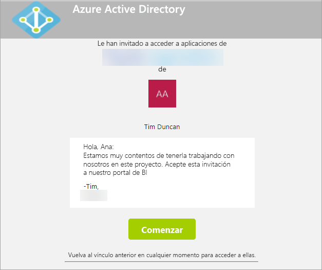
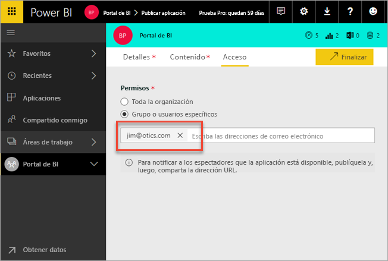
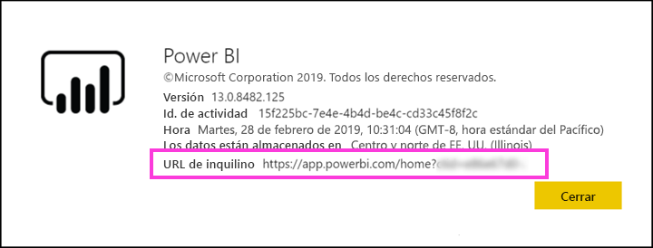

# Distribuir contenido de Power BI a usuarios externos invitados con Azure AD B2B

Power BI se integra con Azure Active Directory de negocio a negocio (Azure AD B2B) para permitir una distribución segura de contenido de Power BI para usuarios invitados de fuera de la organización manteniendo, aún así, el control sobre los datos internos.  

Además, puede permitir que usuarios invitados de fuera de la organización editen y administren contenido dentro de la organización.

## Habilitar acceso

Asegúrese de habilitar la característica [Compartir contenido con usuarios externos](service-admin-portal.md#export-and-sharing-settings) en el portal de administración de Power BI antes de invitar a usuarios invitados.

También puede usar la característica [Permitir a los usuarios externos editar y administrar el contenido de la organización](service-admin-portal.md#allow-external-guest-users-to-edit-and-manage-content-in-the-organization). Esta característica permite seleccionar qué usuario invitado puede ver y crear contenido en áreas de trabajo, incluida la exploración del servicio Power BI de su organización.

## ¿A quién puede invitar?

Puede invitar a usuarios con cualquier dirección de correo electrónico, incluidas las cuentas personales como gmail.com, outlook.com y hotmail.com. En Azure AD B2B, estas direcciones se denominan *identidades sociales*.

## Invitar a usuarios externos

Los usuarios invitados solo requieren invitaciones la primera vez que los invite a su organización. Hay dos maneras de invitar a los usuarios: invitaciones planeadas e invitaciones ad hoc.

### Invitaciones planeadas

Use una invitación planeada si sabe a qué usuarios desea invitar. Puede enviar la invitación mediante Azure Portal o PowerShell. Debe ser un administrador de inquilinos para invitar a usuarios.

Siga estos pasos para enviar una invitación en Azure Portal.

1. En [Azure Portal](https://portal.azure.com), seleccione **Azure Active Directory**.

1. En **Administrar**, seleccione **Usuarios** > **Todos los usuarios** > **Nuevo usuario invitado**.

    

1. Escriba una **dirección de correo electrónico** y un **mensaje personal**.

    

1. Seleccione **Invitar**.

Para invitar a más de un usuario externo, use PowerShell. Para más información, consulte el [código de colaboración de Azure AD B2B y los ejemplos de PowerShell](/azure/active-directory/b2b/code-samples/).

El usuario invitado debe seleccionar **Empezar** en la invitación de correo electrónico que reciba. A continuación, se agregará al usuario invitado al inquilino.

### Invitaciones ad hoc

Para invitar a un usuario externo en cualquier momento, agréguelo al panel o informe a través de la interfaz de usuario de uso compartido o a la aplicación a través de la página de acceso. A continuación se muestra un ejemplo de lo que debe hacer al invitar a un usuario externo para que use una aplicación.

El usuario invitado recibirá un correo electrónico que indica que ha compartido la aplicación con él.

El usuario invitado debe iniciar sesión con su dirección de correo electrónico de la organización. Recibirá una solicitud para que acepte la invitación después de iniciar sesión. Después del inicio de sesión, la aplicación se abre para el usuario invitado. Para volver a la aplicación, debe marcar el vínculo como favorito o guardar el correo electrónico.

## Licencias

El usuario invitado debe tener la licencia adecuada en vigor para ver el contenido compartido. Existen tres opciones para asegurarse de que el usuario tiene una licencia adecuada: usar Power BI Premium, asignar una licencia de Power BI Pro o utilizar la licencia de Power BI Pro de invitado.

Si se usa la característica [Permitir a los usuarios externos editar y administrar el contenido de la organización](service-admin-portal.md#allow-external-guest-users-to-edit-and-manage-content-in-the-organization), los usuarios invitados que aporten contenido a áreas de trabajo o compartan contenido con otros usuarios necesitan una licencia de Power BI Pro.

### Usar Power BI Premium

Asignar el área de trabajo de la aplicación a una [capacidad de Power BI Premium](service-premium-what-is.md) permite al usuario invitado usar la aplicación sin necesidad de una licencia de Power BI Pro. Power BI Premium también permite que las aplicaciones saquen partido a otras funcionalidades como una mayor frecuencia de actualización, capacidad dedicada y tamaños de modelo grandes.

### Asignar una licencia de Power BI Pro a un usuario invitado

Asignar una licencia de Power BI Pro al usuario invitado, dentro de su inquilino, permite que ese usuario invitado vea el contenido del inquilino.

### El usuario invitado aporta su propia licencia de Power BI Pro

El usuario invitado ya tiene una licencia de Power BI Pro asignada dentro del inquilino.

## Usuarios invitados que pueden editar y administrar contenido 

Cuando se usa la característica [Permitir a los usuarios externos editar y administrar el contenido de la organización](service-admin-portal.md#allow-external-guest-users-to-edit-and-manage-content-in-the-organization), los usuarios invitados especificados obtienen acceso a la instancia de Power BI de la organización. Pueden ver cualquier contenido para el que tengan permiso. Pueden acceder a Inicio, examinar áreas de trabajo, instalar aplicaciones que se encuentren en la lista de acceso y aportar contenido a áreas de trabajo. Pueden crear o ser administradores de áreas de trabajo que usen la nueva experiencia de área de trabajo. Existen algunas limitaciones. La sección Consideraciones y limitaciones muestran esas restricciones.
 
Para ayudar a estos usuarios a iniciar sesión en Power BI, proporcióneles la dirección URL del inquilino. Para buscar la dirección URL del inquilino, siga estos pasos.

1. En el servicio Power BI, en el menú superior, seleccione Ayuda ( **?** ) y, a continuación, **Acerca de Power BI**.

2. Vea el valor junto a **URL de inquilino**. El valor es la dirección URL del inquilino que puede compartir con los usuarios invitados.

    

## Consideraciones y limitaciones

* De forma predeterminada, Azure AD B2B solo permite a los invitados externos usar el contenido. Los invitados de Azure AD B2B externos pueden ver aplicaciones, paneles, informes, exportar los datos y crear suscripciones de correo electrónico para los paneles e informes. No pueden acceder a áreas de trabajo ni publicar su propio contenido. Sin embargo, estas restricciones no se aplican a los usuarios invitados que tienen acceso mediante la característica [Permitir a los usuarios externos editar y administrar el contenido de la organización](service-admin-portal.md#allow-external-guest-users-to-edit-and-manage-content-in-the-organization).

* Hay algunas experiencias que no están disponibles para los usuarios invitados mediante la característica [Permitir a los usuarios externos editar y administrar el contenido de la organización](service-admin-portal.md#allow-external-guest-users-to-edit-and-manage-content-in-the-organization). Para actualizar o publicar informes, necesitan usar la interfaz de usuario web del servicio Power BI, incluido Obtener datos para cargar archivos de Power BI Desktop.  Las siguientes experiencias no se admiten:
    * Publicación directa desde Power BI Desktop en el servicio Power BI
    * Los usuarios invitados no pueden usar Power BI Desktop para conectarse a conjuntos de datos de servicio en el servicio Power BI.
    * Áreas de trabajo clásicas asociadas a Grupos de Office 365:
        * Los usuarios invitados no pueden crear ni ser administradores de estas áreas de trabajo.
        * Los usuarios invitados pueden ser miembros.
    * No se admite el envío de invitaciones ad hoc para listas de acceso al área de trabajo.
    * Power BI Publisher para Excel no se admite para usuarios invitados.
    * Los usuarios invitados no pueden instalar Power BI Gateway ni conectarlo a la organización.
    * Los usuarios invitados no pueden instalar la publicación de aplicaciones para toda la organización.
    * Los usuarios invitados no pueden usar, crear, actualizar ni instalar paquetes de contenido de organización.
    * Los usuarios invitados no pueden usar Analizar en Excel.
    * Los usuarios invitados no pueden ser @mentioned en comentarios.
    * Los usuarios invitados no pueden usar suscripciones.
    * Los usuarios invitados que usen esta funcionalidad deben tener una cuenta profesional o educativa. Los usuarios invitados que usen cuentas personales tienen más limitaciones debido a las restricciones de inicio de sesión.

* Esta característica no está disponible actualmente en el componente web de los informes de SharePoint Online de Power BI.

* Hay opciones de Active Directory que pueden limitar lo que los usuarios invitados externos pueden hacer dentro de la organización. Estas opciones también se aplican al entorno de Power BI. En la siguiente documentación se tratan las opciones:
    * [Administrar la configuración de colaboración externa](/azure/active-directory/b2b/delegate-invitations#configure-b2b-external-collaboration-settings)
    * [Permitir o bloquear invitaciones a los usuarios de B2B de organizaciones específicas](https://docs.microsoft.com/azure/active-directory/b2b/allow-deny-list)  

## Pasos siguientes

Para obtener más información, incluida la referida a cómo funciona la seguridad en el nivel de fila, consulte las notas del producto: [Distribuir contenido de Power BI a usuarios externos invitados con Azure AD B2B](https://aka.ms/powerbi-b2b-whitepaper).

Para obtener información sobre Azure AD B2B, consulte [¿Qué es el acceso de usuarios invitados en Azure Active Directory B2B?](/azure/active-directory/active-directory-b2b-what-is-azure-ad-b2b/)
