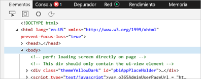
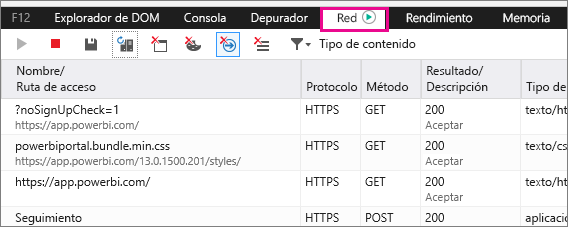
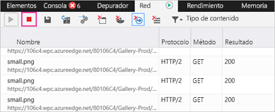
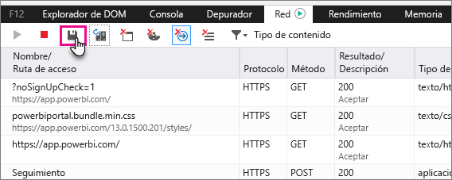

# Captura de información de diagnóstico adicional para Power BI

En este artículo se proporcionan instrucciones para recopilar manualmente información de diagnóstico adicional desde el cliente web de Power BI.

1. Vaya a [Power BI](https://app.powerbi.com) con Microsoft Edge o Internet Explorer.

1. Presione **F12** para abrir las herramientas de desarrollo de Microsoft Edge.

   

1. Seleccione la pestaña **Red**. Obtendrá una lista del tráfico que ya se ha capturado.

   

    Puede:

    * Buscar dentro de la ventana y reproducir cualquier problema que encuentre.

    * Ocultar y mostrar la ventana de herramientas de desarrollo en cualquier momento de la sesión con F12.

1. Para dejar de generar perfiles para la sesión, puede seleccionar el cuadrado rojo en la pestaña **Red** del área de herramientas de desarrollo.

   

1. Seleccione el icono de disquete para exportar los datos como un archivo de almacenamiento HTTP (HAR).

   

1. Escriba un nombre de archivo y guarde el archivo HAR.

    El archivo HAR contendrá toda la información sobre las solicitudes de red entre la ventana del explorador y Power BI, por ejemplo:

    * Los identificadores de actividad de cada solicitud.

    * La marca de tiempo precisa de cada solicitud.

    * Cualquier información de error devuelta al cliente.

    Este seguimiento también contendrá los datos usados para completar los elementos visuales que se muestran en la pantalla.

1. Puede enviar el archivo HAR al soporte técnico para su revisión.

¿Tiene más preguntas? [Pruebe a preguntar a la comunidad de Power BI](http://community.powerbi.com/)
