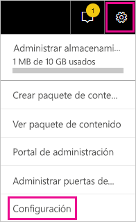
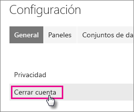
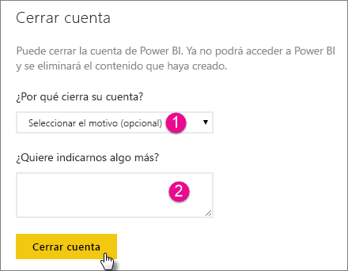
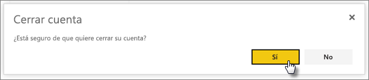
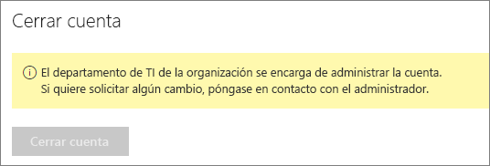

# Cierre de la cuenta de Power BI

Si ya no desea usar Power BI, puede cerrar su cuenta de esta solución.  Después de cerrar su cuenta, no podrá iniciar sesión en Power BI. Se elimina cualquier dato del cliente cargado o creado en Power BI según la directiva de retención de datos de las Condiciones del servicio de Power BI.

## Usuarios individuales de Power BI

Si se registró en Power BI como usuario individual, puede cerrar la cuenta en la pantalla **Configuración**.

1. En Power BI, seleccione el icono de engranaje en la esquina superior derecha y luego seleccione **Configuración**.

    

1. En la pestaña **General**, seleccione **Cerrar cuenta**.

    

1. Seleccione un motivo para cerrar la cuenta (1). También puede proporcionar más información (2). Luego, seleccione **Cerrar cuenta**.

    

1. Confirme que desea cerrar su cuenta.

    

    Debe aparecer una confirmación de que la cuenta está cerrada. Puede volver a abrir su cuenta desde aquí si es necesario.

    

## Usuarios inquilinos administrados

Si su organización lo registró en Power BI, póngase en contacto con el administrador de inquilinos. Pídale que anule la asignación de la licencia de la cuenta.

¿Tiene más preguntas? [Pruebe a preguntar a la comunidad de Power BI](http://community.powerbi.com/)