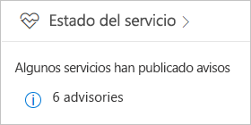
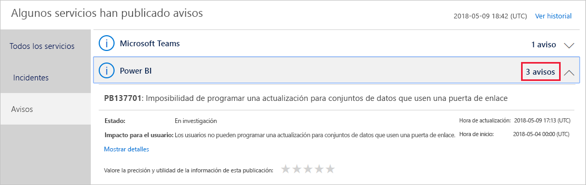
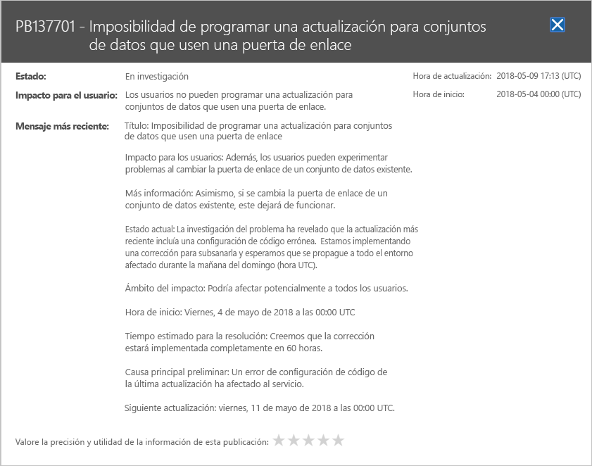

# Seguimiento del estado del servicio Power Bi en Office 365

El Centro de administración de Microsoft 365 proporciona herramientas importantes para los administradores de Power BI. Las herramientas incluyen información actual e histórica sobre el estado del servicio. Para acceder a la información de estado del servicio, debe tener uno de los siguientes roles:

* Administrador de servicios de Power BI

* Administrador global de Office 365

Para más información sobre los roles, consulte [Administración de Power BI en su organización](service-admin-administering-power-bi-in-your-organization.md#administrator-roles-related-to-power-bi).

1. Inicie sesión en el [Centro de administración de Microsoft 365](https://portal.office.com/adminportal).

1. En el panel de navegación, seleccione **Mostrar todo** > **Estado** > **Estado del servicio**. Aparece la página Estado del servicio:

    

1. En la lista **Todos los servicios**, seleccione **Avisos** o **Incidentes** y revise los resultados. En la captura de pantalla siguiente, verá uno de los tres avisos activos.

    

1. Para obtener más información, seleccione **Mostrar detalles** para un elemento. En la captura de pantalla siguiente, puede ver detalles adicionales, incluidas las actualizaciones de estado recientes.

    

    Desplácese hacia abajo para ver más información y, a continuación, cierre el panel cuando haya terminado.

1. Para ver la información histórica de todos los servicios, en la esquina superior derecha de la página **Estado del servicio**, seleccione **Ver historial**. A continuación, seleccione **Últimos 7 días** o **Últimos 30 días**. 

1. Para volver al estado actual del servicio, seleccione **Ver estado actual**.