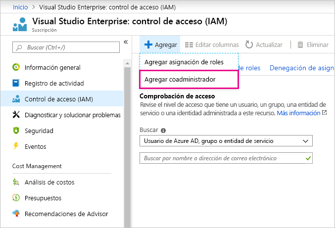

# Uso de la misma cuenta para Power BI y Azure

Si es usuario de Power BI y de Azure, puede que quiera usar el mismo inicio de sesión para ambos servicios, por lo que no es necesario escribir la contraseña dos veces.

Se realiza el registro en Power BI con su cuenta de la organización, asociada a su dirección de correo electrónico educativa o profesional.  Se realiza el registro en Azure con una cuenta Microsoft o su cuenta de la organización.

Si desea usar el mismo inicio de sesión para Azure y Power BI, asegúrese de iniciar sesión en Azure con su cuenta de la organización.

**¿Qué ocurre si ya ha iniciado sesión en Azure con su cuenta Microsoft?**

Puede agregar su cuenta de la organización como coadministrador en Azure mediante estos pasos:

1. Inicie sesión en [Azure Portal](http://portal.azure.com/). Si es usuario de varios directorios de Azure, haga clic en **Suscripciones** y, luego, filtre para ver solo el directorio y las suscripciones que quiere editar.

1. En el panel de navegación, seleccione **Control de acceso (IAM)** y, luego, **Agregar** \> **Agregar coadministrador**.

    

1. Escriba la dirección de correo electrónico asociada a su cuenta de la organización y seleccione **Agregar**.

1. La próxima vez que inicie sesión en Azure Portal, use su dirección de correo electrónico de la organización.

¿Tiene más preguntas? [Pruebe la comunidad de Power BI](http://community.powerbi.com/)
