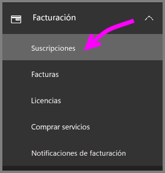
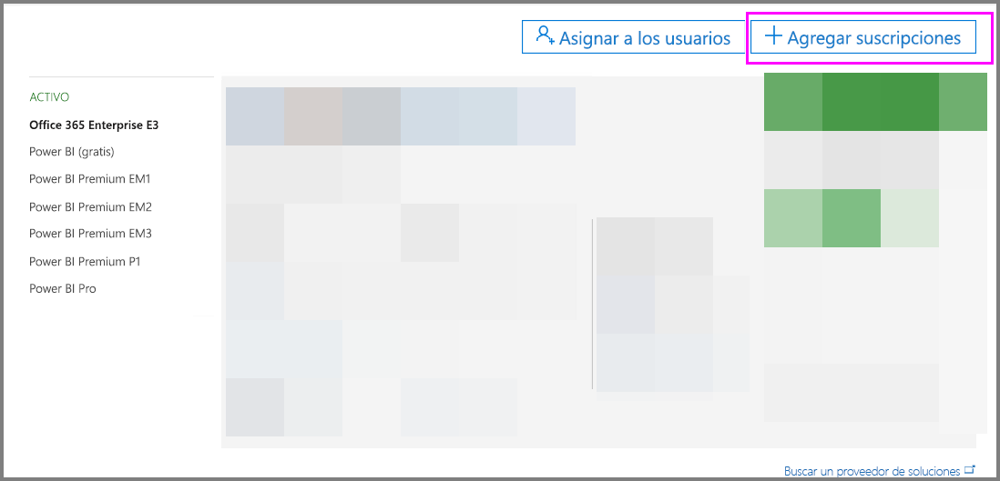
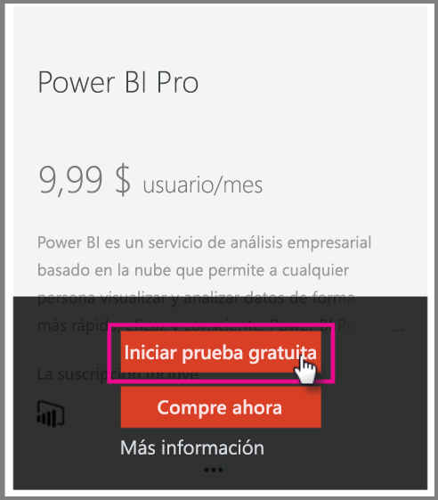
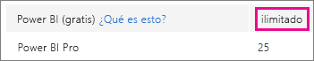
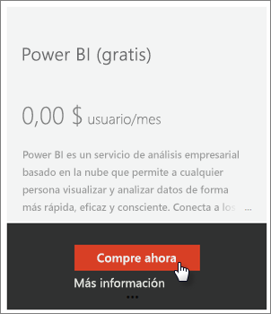
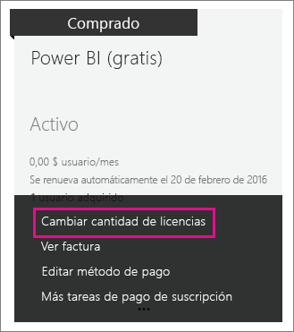
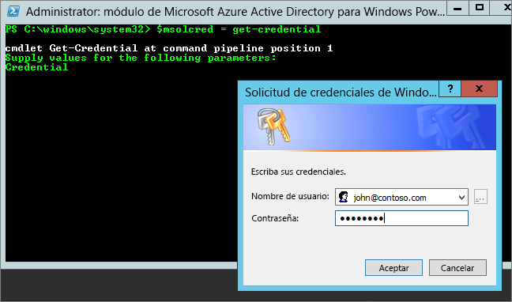

# <a name="power-bi-licensing-in-your-organization"></a>Licencias de Power BI en la organización

[!INCLUDE [license-capabilities](includes/license-capabilities.md)]

Este artículo se centra en las licencias por usuario desde una perspectiva de administrador.

## <a name="manage-power-bi-pro-licenses"></a>Administrar licencias de Power BI Pro

Como administrador, puede adquirir y asignar licencias de Power BI Pro. También puede registrarse para hacer una prueba de Power BI Pro para su organización. Las personas individuales también pueden registrarse para realizar una prueba de Power BI Pro.

### <a name="purchasing-power-bi-pro"></a>Adquisición de Power BI Pro

Puede comprar licencias de Power BI Pro a través de Microsoft Office 365 o a través de un socio certificado de Microsoft. Después de adquirir las licencias, deberá asignarlas a usuarios individuales. Para obtener más información, vea [Adquirir y asignar licencias de Power BI Pro](service-admin-purchasing-power-bi-pro.md).

### <a name="power-bi-pro-trial-for-individuals"></a>Prueba de Power BI Pro para usuarios individuales

Las personas individuales de su organización pueden registrarse para realizar una prueba de Power BI Pro. Para obtener más información, vea [Registro en Power BI como usuario individual](service-self-service-signup-for-power-bi.md).

Los usuarios que usen la Prueba de Power BI Pro en el producto no aparecen en el portal de administración de Office 365 como usuarios de prueba de Power BI Pro (aparecen como usuarios gratuitos de Power BI), pero sí que aparecen como usuarios de Prueba de Power BI Pro en la página Administrar almacenamiento de Power BI.

### <a name="power-bi-pro-trial-for-organizations"></a>Prueba de Power BI Pro para organizaciones

Si quiere adquirir e implementar licencias de prueba de Power BI para varios usuarios de su organización sin que los usuarios tengan que aceptar los términos de prueba de manera individual, regístrese para obtener una versión de prueba de Power BI Pro para su organización.

Tenga en cuenta lo siguiente antes de seguir estos pasos para registrarse:

* Para registrarse, debe ser miembro del rol de [**administrador global** o **administrador de facturación**](https://support.office.com/article/about-office-365-admin-roles-da585eea-f576-4f55-a1e0-87090b6aaa9d?ui=en-US&rs=en-US&ad=US) en Office 365.

* Hay un límite de una prueba organizativa por inquilino. Esto significa que, si alguien ya ha aplicado la Prueba de Power BI Pro al inquilino, no puede volver a hacerlo. Si necesita ayuda con esto, póngase en contacto con el [soporte de facturación de Office 365](https://support.office.microsoft.com/article/contact-support-for-business-products-admin-help-32a17ca7-6fa0-4870-8a8d-e25ba4ccfd4b?CorrelationId=552bbf37-214f-4202-80cb-b94240dcd671&ui=en-US&rs=en-US&ad=US).

1. Vaya al [Centro de administración de Office 365](https://portal.office.com/adminportal/home#/homepage).

1. En el panel de navegación izquierdo, seleccione **Facturación** y después **Suscripciones**.

   

1. En el lado derecho, seleccione **Agregar suscripciones**.

   

1. En **Otros planes**, mantenga el mouse sobre los puntos suspensivos (**...**) de Power BI Pro y seleccione **Iniciar prueba gratuita**.

    

1. En la pantalla de confirmación del pedido, seleccione **Probar ahora**.

1. En el recibo del pedido, seleccione **Continuar**.

También puede [asignar licencias en Office 365](https://support.office.com/article/assign-licenses-to-users-in-office-365-for-business-997596b5-4173-4627-b915-36abac6786dc).

## <a name="manage-power-bi-free-licenses"></a>Administrar licencias gratuitas de Power BI

Los usuarios de su organización pueden obtener acceso a licencias gratuitas de Power BI de dos maneras diferentes:

* Puede asignarles una licencia de Power BI en el portal de administración de Office 365.

* Si un usuario se [suscribe a una prueba de Power BI Pro](service-self-service-signup-for-power-bi.md) y esta expira, se le asigna una licencia gratuita.

### <a name="requesting-and-assigning-free-licenses"></a>Solicitar y asignar licencias gratuitas

Si planea administrar solicitudes y asignaciones de licencias de forma centralizada, compruebe primero si ya dispone del bloque de licencias de Power BI (gratis) ilimitado.

Este bloque de licencias está disponible la primera vez que alguien se registra en Power BI como usuario individual. Durante ese proceso, el bloque de licencias se asocia a su organización y se asigna una licencia al usuario que se está registrando.

1. En el centro de administración de Office 365, en **Facturación** > **Licencias**, busque **ilimitadas**.

    

1. Si el bloque está disponible, ahora puede [asignar licencias en Office 365](https://support.office.com/article/assign-licenses-to-users-in-office-365-for-business-997596b5-4173-4627-b915-36abac6786dc). Si el bloque no está disponible, tiene dos opciones:

    * Pedir a un miembro de su organización que se registre de forma individual, lo que desencadena la creación de un bloque ilimitado.

    * Ir al procedimiento siguiente, donde puede registrarse para un número fijo de licencias.

Si el bloque de licencias ilimitado de Power BI (gratis) no está disponible y no quiere realizar un registro individual, siga este procedimiento.

1. Vaya al [Centro de administración de Office 365](https://portal.office.com/admin/default.aspx).

1. En el panel de navegación izquierdo, seleccione **Facturación**  > **Suscripciones**.

1. En el lado derecho, seleccione **Agregar suscripciones +**.

1. En **Otros planes**, mantenga el puntero sobre los puntos suspensivos (**...**) de Power BI (gratis) y seleccione **Comprar ahora**.

    

1. Escriba el número de licencias que quiere agregar y seleccione **Pagar ahora** o **Agregar al carro**.

1. Escriba la información obligatoria en el proceso de pago de la compra.

    Cuando se usa este método, no se realizan compras, aunque deberá especificar la información de su tarjeta de crédito para los pagos o elegir recibir facturas.

1. Ahora también puede [asignar licencias en Office 365](https://support.office.com/article/assign-licenses-to-users-in-office-365-for-business-997596b5-4173-4627-b915-36abac6786dc).

1. Si más adelante decide que desea agregar más licencias, puede volver a **Agregar suscripciones** y seleccionar **Cambiar la cantidad de licencias** de Power BI (gratis).

    

### <a name="enable-or-disable-individual-user-sign-up-in-azure-active-directory"></a>Habilitar o deshabilitar el registro de usuarios individuales en Azure Active Directory

Como administrador, puede habilitar o deshabilitar los registros de usuarios individuales con Azure Active Directory (AAD). Esta sección del artículo muestra cómo administrar los registros con comandos de PowerShell. Para obtener más información sobre Azure PowerShell, vea [Introducción a Azure PowerShell](/powershell/azure/overview).

La opción de configuración de AAD que controla el registro es **AllowAdHocSubscriptions**. En la mayoría de los inquilinos, esta propiedad se establece en *true*, lo que significa que está habilitada. Si adquirió Power BI a través de un asociado, esta opción podría ser *false*, lo que significaría que está deshabilitada. Si cambia la configuración de *true* a *false*, no se permite que los usuarios nuevos de la organización se registren individualmente. Los usuarios que se hayan registrado en Power BI antes del cambio de configuración, conservan sus licencias.

1. Inicie sesión en Azure Active Directory usando sus credenciales de Office 365. La primera línea del siguiente script de PowerShell le pide las credenciales. La segunda línea se conecta a Azure Active Directory.

    ```powershell
     $msolcred = get-credential
     connect-msolservice -credential $msolcred
    ```

   

1. Después de iniciar sesión, ejecute el comando siguiente para ver cómo está configurado actualmente el inquilino.

    ```powershell
     Get-MsolCompanyInformation | fl AllowAdHocSubscriptions
    ```
1. Ejecute este comando para habilitar ($true) o deshabilitar ($false) **AllowAdHocSubscriptions**.

    ```powershell
     Set-MsolCompanySettings -AllowAdHocSubscriptions $true
    ```

> [!NOTE]
> La marca AllowAdHocSubscriptions se usa para controlar varias funcionalidades de usuario en su organización, incluida la capacidad para que los usuarios se suscriban al servicio Azure Rights Management. El cambio de esta marca afecta a todas estas funcionalidades.

## <a name="next-steps"></a>Pasos siguientes

[Registro de autoservicio para Power BI](service-self-service-signup-for-power-bi.md)  

[Adquirir y asignar licencias de Power BI Pro](service-admin-purchasing-power-bi-pro.md)

¿Tiene más preguntas? [Pruebe a preguntar a la comunidad de Power BI](http://community.powerbi.com/)