# Configurar aplicaciones móviles con Microsoft Intune

Microsoft Intune permite a las organizaciones administrar dispositivos y aplicaciones. Las aplicaciones móviles de Power BI para iOS y Android se integran con Intune. Esta integración le permite administrar la aplicación en los dispositivos y controlar la seguridad. Mediante las directivas de configuración, puede controlar elementos como requerir un PIN de acceso, la forma en que la aplicación controla los datos e incluso cifrar los datos de la aplicación cuando la aplicación no está en uso.

## Configuración general de administración de dispositivos móviles

En este artículo se supone que Intune está configurado correctamente y que tiene dispositivos inscritos con Intune. Este artículo no está pensado como una guía de configuración completa de Microsoft Intune. Para obtener más información sobre Intune, vea [¿Qué es Intune?](/intune/introduction-intune/)

Microsoft Intune puede coexistir con Administración de dispositivos móviles (MDM) en Office 365. Si usa MDM, el dispositivo se mostrará inscrito en MDM, pero disponible para administrarse en Intune.

> [!NOTE]
> Después de configurar Intune, la actualización de datos en segundo plano se desactiva para la aplicación móvil de Power BI en su dispositivo iOS o Android. Power BI actualizará los datos desde el servicio Power BI en la web cuando se acceda a la aplicación.

## Paso 1: Obtener la dirección URL de la aplicación

Antes de crear la aplicación en Intune, debemos obtener las direcciones URL de las aplicaciones. Para iOS, la obtendremos de iTunes. Para Android, se puede obtener desde la página de Power BI Mobile.

Guarde la dirección URL, ya que la necesitará al crear la aplicación.

### Obtener la dirección URL para iOS

La dirección URL de la aplicación para iOS debe obtenerse en iTunes.

1. Abra iTunes.

1. Busque *Power BI*.

1. **Microsoft Power BI** debería aparecer debajo de **Aplicaciones para iPhone aplicaciones** y **Aplicaciones para iPad**. Puede usar cualquiera de las opciones, ya que obtendrá la misma dirección URL.

1. Seleccione el menú desplegable **Obtener** y elija **Copiar vínculo**.

    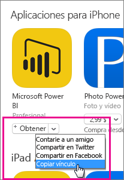

El aspecto debería ser similar al siguiente: *https://itunes.apple.com/us/app/microsoft-power-bi/id929738808?mt=8*.

### Obtener dirección URL en Android

Puede obtener la dirección URL de Google Play desde la [página de Power BI Mobile](https://powerbi.microsoft.com/mobile/). Seleccione **Descargar de Google Play** para acceder a la página de la aplicación. Puede copiar la dirección URL de la barra de direcciones del explorador. El aspecto debería ser similar al siguiente: *https://play.google.com/store/apps/details?id=com.microsoft.powerbim*.

## Paso 2: Crear una directiva de administración de aplicaciones móviles

La directiva de administración de aplicaciones móviles le permite imponer elementos como un PIN de acceso. Puede crear uno en el portal de Intune.

Puede crear primero la aplicación o la directiva primero. No importa el orden en que se agregan. Simplemente, ambas deben existir para el paso de implementación.

1. En el portal de Intune, seleccione **Directiva** > **Directivas de configuración**.

    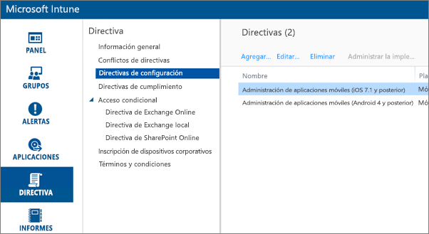

1. Seleccione **Agregar**.

1. Bajo **Software** , puede seleccionar Administración de aplicaciones móviles para Android o iOS. Para empezar a usarlo rápidamente, puede seleccionar **Crear una directiva con la configuración recomendada**, o bien crear una directiva personalizada.

1. Edite la directiva para configurar las restricciones que quiera en la aplicación.

## Paso 3: Crear la aplicación

La aplicación es una referencia, o un paquete, que se guarda en Intune para su implementación. Deberemos crear una aplicación y hacer referencia a la dirección URL de la aplicación que obtuvimos de Google Play o iTunes.

Puede crear primero la aplicación o la directiva primero. No importa el orden en que se agregan. Simplemente, ambas deben existir para el paso de implementación.

1. Vaya al portal de Intune y seleccione **Aplicaciones** en el menú izquierdo.

1. Seleccione **Agregar aplicación**. Se iniciará la aplicación **Agregar Software** .

### Crear para iOS

1. Seleccione **Aplicación iOS administrada de la App Store** en la lista desplegable.

1. Escriba la dirección URL de la aplicación que obtuvimos en el [Paso 1](#step-1-get-the-URL-for-the-application) y seleccione **Siguiente**.

    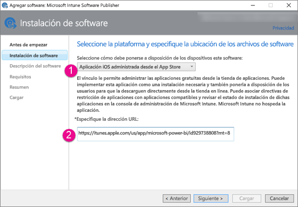

1. Proporcione valores de **Publicador**, **Nombre** y **Descripción**. También puede proporcionar un **icono**. El campo **Categoría** es para la aplicación Portal de empresa. Cuando termine, seleccione **Siguiente**.

1. Puede decidir si quiere publicar la aplicación como **Cualquiera** (valor predeterminado), **iPad** o **iPhone**. De forma predeterminada se mostrará **Cualquiera** y funcionará para ambos tipos de dispositivo. La aplicación Power BI presenta la misma dirección URL para iPhone y iPad. Seleccione **Siguiente**.

1. Seleccione **Cargar**.

1. Si no ve la aplicación en la lista, actualice la página: vaya a **Introducción** y luego vuelva a **Aplicaciones**.

    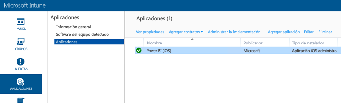

### Crear para Android

1. Seleccione **Vínculo externo** en la lista desplegable.

1. Escriba la dirección URL de la aplicación que obtuvimos en el [Paso 1](#step-1-get-the-URL-for-the-application) y seleccione **Siguiente**.

    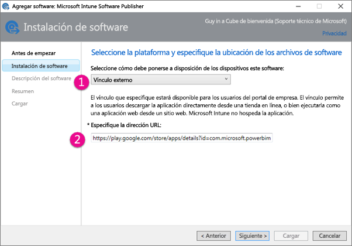

1. Proporcione valores de **Publicador**, **Nombre** y **Descripción**. También puede proporcionar un **icono**. El campo **Categoría** es para la aplicación Portal de empresa. Cuando termine, seleccione **Siguiente**.

1. Seleccione **Cargar**.

1. Si no ve la aplicación en la lista, actualice la página: vaya a **Introducción** y luego vuelva a **Aplicaciones**.

    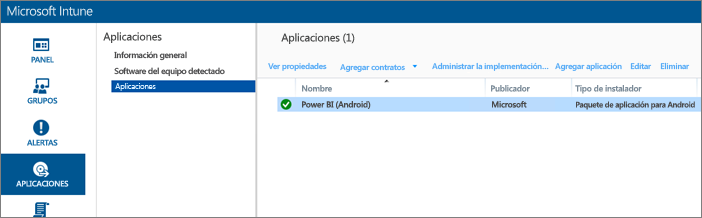

## Paso 4: Implementar la aplicación

Después de agregar la aplicación, deberá implementarla para que esté disponible para los usuarios finales. Este es el paso en el que se enlazará la directiva creada con la aplicación.

### Implementar para iOS

1. En la pantalla de aplicaciones, seleccione la aplicación que creó. A continuación, seleccione el vínculo **Administrar implementación** .

    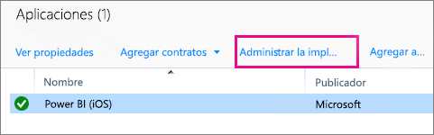

1. En la pantalla **Seleccionar grupos** , puede elegir en qué grupos quiere implementar esta aplicación. Seleccione **Siguiente**.

1. En la pantalla **Acción de implementación** , puede elegir cómo quiere implementar esta aplicación. Al seleccionar **Instalación disponible**o **Instalación requerida**, la aplicación estará disponible en el Portal de empresa para que los usuarios puedan instalarla a petición. Cuando termine de realizar su selección, seleccione **Siguiente**.

    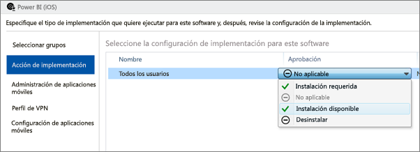

1. En la pantalla **Administración de aplicaciones móviles**, puede seleccionar la directiva de administración de aplicaciones móviles que creamos en el [Paso 2](#step-2-create-a-mobile-application-management-policy). De manera predeterminada, se establecerá la directiva que creó, si es la única directiva de iOS disponible. Seleccione **Siguiente**.

    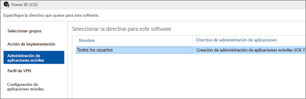

1. En la pantalla **Perfil de VPN** , puede seleccionar una directiva si dispone de una para su organización. El valor predeterminado es **Ninguna**. Seleccione **Siguiente**.

1. En la pantalla **Configuración de la aplicación móvil** , puede seleccionar una **Directiva de configuración de la aplicación** si creó una. El valor predeterminado es **Ninguna**. Esto no es necesario. Seleccione **Finalizar**.

Después de implementar la aplicación, debería mostrarse **Sí** para indicarlo en la página de aplicaciones.

### Implementar para Android

1. En la pantalla de aplicaciones, seleccione la aplicación que creó. A continuación, seleccione el vínculo **Administrar implementación** .

    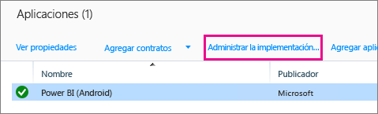
1. En la pantalla **Seleccionar grupos** , puede elegir en qué grupos quiere implementar esta aplicación. Seleccione **Siguiente**.

1. En la pantalla **Acción de implementación** , puede elegir cómo quiere implementar esta aplicación. Al seleccionar **Instalación disponible**o **Instalación requerida**, la aplicación estará disponible en el Portal de empresa para que los usuarios puedan instalarla a petición. Cuando termine de realizar su selección, seleccione **Siguiente**.

    

1. En la pantalla **Administración de aplicaciones móviles**, puede seleccionar la directiva de administración de aplicaciones móviles que creamos en el [Paso 2](#step-2-create-a-mobile-application-management-policy). De manera predeterminada, se establecerá la directiva que creó, si es la única directiva de Android disponible. Seleccione **Finalizar**.

    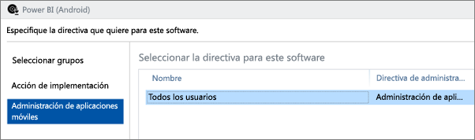

Después de implementar la aplicación, debería mostrarse **Sí** para indicarlo en la página de aplicaciones.

## Paso 5: Instalar la aplicación en un dispositivo

La aplicación se instala con la aplicación *Portal de empresa*. Si no tiene la aplicación Portal de empresa instalada, puede obtenerla a través de la tienda de aplicaciones en las plataformas Android o iOS. Iniciará sesión en el Portal de empresa con las credenciales de inicio de sesión de su organización.

1. Abra la aplicación Portal de empresa.

1. Si la aplicación Power BI no aparece como una aplicación destacada, seleccione **Aplicaciones de empresa**.

    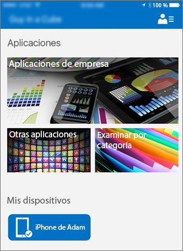

1. Seleccione la aplicación de Power BI que implementó.

    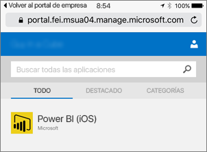

1. Seleccione **Instalar**.

    

1. Si usa iOS, se insertará la aplicación. Seleccione **Instalar** en el cuadro de diálogo de inserción.

    

1. Una vez instalada la aplicación, se mostrará como **Administrado por la empresa**. Si habilitó el acceso con un pin en la directiva, se mostrará lo siguiente.

    

## Pasos siguientes

[Proteger datos mediante las directivas de administración de aplicaciones móviles con Microsoft Intune](/intune/app-protection-policies/)  

[Aplicaciones de Power BI para dispositivos móviles](consumer/mobile/mobile-apps-for-mobile-devices.md)  

¿Tiene más preguntas? [Pruebe a preguntar a la comunidad de Power BI](http://community.powerbi.com/)  