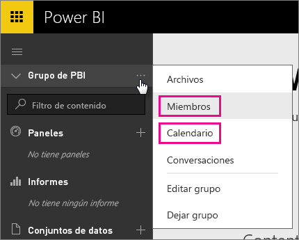
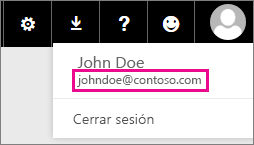

# Clientes dedicados de Office 365: problemas conocidos
Power BI es ahora compatible con los clientes dedicados de Office 365.  Si usted es un cliente dedicado de O365, puede iniciar sesión con una cuenta de ese inquilino y usar Power BI. Actualmente existen dos problemas conocidos.

## Grupos
Al seleccionar **Miembros** o **Calendario** en el menú contextual del grupo, se le redirigirá a la aplicación de correo.  **Archivos** y **Conversaciones** funcionan según lo previsto.

## Aplicación para iPhone: el inicio de sesión con el dominio personal provoca un error
Al iniciar sesión, en la aplicación para iPhone, mediante un inicio de sesión con un dominio personal, puede producirse un error.

*Error de inicio de sesión*  
*Error interno inesperado. Inténtelo de nuevo.*

Para evitar este problema, inicie sesión con la dirección de correo electrónico que aparece al hacer clic en el icono de usuario en el servicio de Power BI en lugar de con el dominio personal.

¿Tiene más preguntas? [Pruebe la comunidad de Power BI](http://community.powerbi.com/)

