# Portal de administración de Power BI

El portal de administración permite la administración de inquilinos de Power BI en su organización. Incluye elementos como métricas de uso, acceso al Centro de administración de Office 365 y configuración.

La administración de inquilinos de Power BI para su empresa se realiza mediante el portal de administración de Power BI. El portal de administración es accesible para todos los usuarios que son administradores globales de Office 365 o a los que se les ha asignado el rol de administrador del servicio Power BI. Para más información acerca del rol de administrador del servicio Power BI, consulte [Descripción del rol de administrador de Power BI](service-admin-role.md).

Todos los usuarios pueden ver el **Portal de administración** bajo el icono de engranaje. Si no son administradores, solo pueden ver la sección **Configuración de Premium** y únicamente pueden ver las funcionalidades para las que tengan derechos de administración.

## Acceso al portal de administración

La cuenta debe estar marcada como **Administrador global** dentro de Office 365 o Azure Active Directory, o que se le haya asignado el rol de administrador del servicio Power BI, para acceder al portal de administración de Power BI. Para más información acerca del rol de administrador del servicio Power BI, consulte [Descripción del rol de administrador de Power BI](service-admin-role.md). Para acceder al portal de administración de Power BI, haga lo siguiente.

1. Seleccione el engranaje de configuración en la parte superior derecha del servicio Power BI.
2. Seleccione **Portal de administración**.

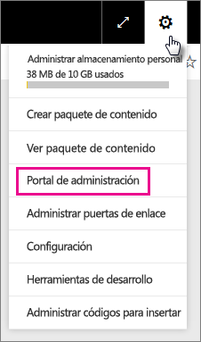

En el portal, hay seis pestañas. Estas fichas se describen a continuación.

* [Métricas de uso](#usage-metrics)
* [Usuarios](#users)
* [Registros de auditoría](#audit-logs)
* [Configuración de inquilinos](#tenant-settings)
* [Configuración de Premium](#premium-settings)
* [Códigos para insertar](#embed-codes)
* [Objetos visuales de la organización](#Organization-visuals)

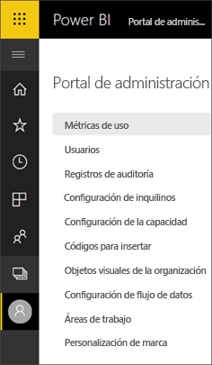

## Métricas de uso
La primera ficha, en el portal de administración, es **Métricas de uso**. El informe de métricas de uso le ofrece la capacidad de supervisar el uso dentro de Power BI para su organización. También proporciona la capacidad para ver qué usuarios y grupos, son los más activos en Power BI para su organización.

> [!NOTE]
> La primera vez que accede al panel, o después de visitarlo de nuevo tras un largo período sin verlo, probablemente verá una pantalla de carga mientras se carga el panel.

Una vez cargado el panel, puede ver dos secciones de iconos. La primera sección incluye datos de uso para usuarios individuales y la segunda sección muestra información similar para los grupos de su organización.

Este es un desglose de lo que puede ver en cada icono:

* Recuento definido de todos los paneles, informes y conjuntos de datos en el área de trabajo de usuario.
  
    

* El panel más consumido por número de usuarios que pueden acceder a él. Por ejemplo, si tiene un panel que comparte con 3 usuarios y también lo agrega a un paquete de contenido al que están conectados dos usuarios distintos, su recuento sería 6 (1 + 3 + 2).
  
    

* El contenido más popular al que están conectados los usuarios. Esto sería cualquier cosa que los usuarios puedan alcanzar a través del proceso de obtención de datos: paquetes SaaS, paquetes de contenido organizativo, archivos o bases de datos.
  
    

* Una vista de los usuarios principales según el número de paneles que tienen, tanto paneles que crearon ellos mismos como paneles compartidos con ellos.
  
    

* Una vista de los usuarios principales según el número de informes que tienen
  
    

La segunda sección muestra el mismo tipo de información, pero se basa en grupos. Esto le permitirá ver qué grupos de la organización son más activos y qué tipo de información usan.

Con esta información, podrá obtener información real sobre cómo las personas usan Power BI en toda la organización y podrá reconocer esos usuarios y grupos, que son muy activos en su organización.

## Usuarios

La segunda ficha, en el portal de administración, es **Administrar usuarios**. La administración de usuarios, para Power BI, se realiza en el Centro de administración de Office 365, por lo que esta sección le permite llegar rápidamente al área para administrar usuarios, administradores y grupos dentro de Office 365.

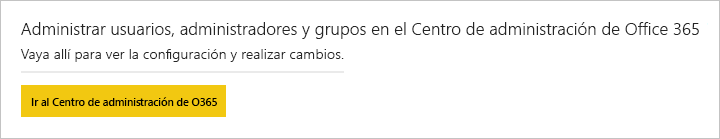

Al hacer clic en **Ir al Centro de administración de O365**, irá directamente a la página de destino del Centro de administración de Office 365 para administrar los usuarios de su inquilino.

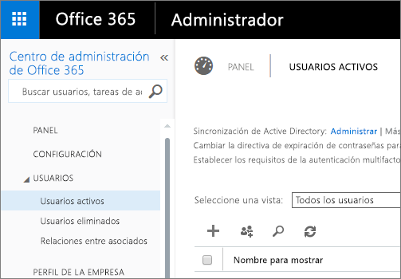

## Registros de auditoría

La tercera pestaña, en el Portal de administración, es **Registros de auditoría**. Los registros se encuentran en el Centro de seguridad y cumplimiento de Office 365. Esta sección le permite obtener acceso rápidamente a esa área en Office 365.

Para obtener más información sobre los registros de auditoría, consulte [Auditoría de Power BI en su organización](service-admin-auditing.md).

## Configuración de inquilinos

La tercera ficha, en el portal de administración, es **Configuración de inquilinos**. La configuración de inquilinos le da un mayor control sobre qué características están disponibles para su organización. Si le preocupa la información confidencial, algunas de nuestras características pueden no ser adecuadas para su organización o, puede que solo quiera que una determinada característica esté disponible para un grupo concreto. Si es así, se puede desactivar en el inquilino.

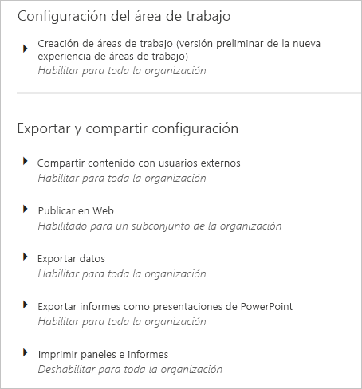

> [!NOTE]
> La configuración puede tardar hasta 10 minutos en entrar en vigor para todos los usuarios del inquilino.

La configuración puede tener tres estados:

* **Deshabilitado para toda la organización**: puede deshabilitar una característica y hacerlo de manera que los usuarios no puedan usarla.

    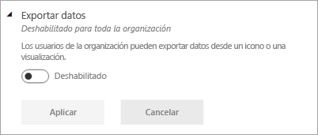

* **Habilitado para toda la organización**: puede habilitar una característica para toda la organización, lo que permitirá a todos los usuarios tener acceso a esa característica.

    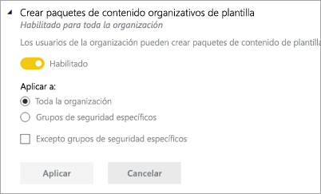

* **Habilitado para un subconjunto de la organización**: también puede habilitar una característica para una parte de la organización. Esto se puede hacer de varias maneras. Puede habilitarla para toda la organización excepto para un grupo de usuarios específico.

    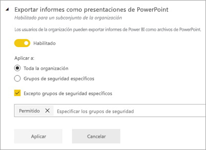

    Puede también habilitar la característica solo para un grupo específico de usuarios y deshabilitarla para determinados usuarios de ese grupo. Esto garantizaría que determinados usuarios no tengan acceso a la característica incluso aunque pertenezcan al grupo permitido.

    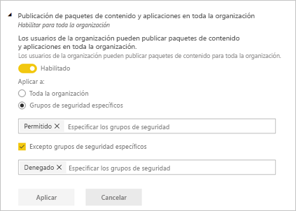

Las secciones siguientes proporcionan una visión general de los distintos tipos de configuración de inquilino.

## Configuración del área de trabajo

### Crear áreas de trabajo (versión preliminar)
Los usuarios de la organización pueden crear áreas de trabajo de aplicación para colaborar en paneles, informes y otro contenido.

Para obtener más información, vea [Crear nuevas áreas de trabajo](service-create-the-new-workspaces.md).

## Exportar y compartir configuración

### Compartir contenido con usuarios externos

Los usuarios de la organización pueden compartir paneles con usuarios de fuera de la organización.

Este es el mensaje que aparece cuando los comparte con un usuario externo.

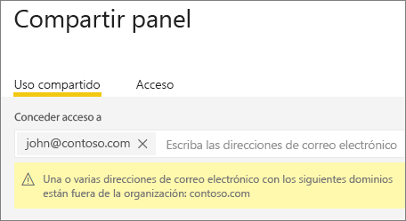

### Publicar en Web

Los usuarios de la organización pueden publicar informes en la web. [Más información](service-publish-to-web.md)

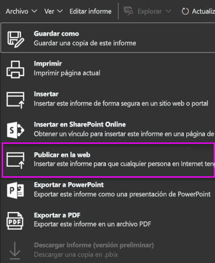

Los usuarios pueden ver diferentes opciones en la interfaz de usuario en función del valor de la opción Publicar en la web.

|Destacado |Habilitada para toda la organización |Deshabilitada para toda la organización |Grupos de seguridad específicos   |
|---------|---------|---------|---------|
|**Publicar en la web** en el menú **Archivo**.|Habilitada para todos|No visible para todos|Solo visible para usuarios o grupos autorizados.|
|**Administrar códigos para insertar** en **Configuración**|Habilitada para todos|Habilitada para todos|Habilitada para todos  Opción * **Eliminar** solo para usuarios o grupos autorizados. * **Obtener código** habilitada para todos.|
|**Códigos de inserción** en el portal de administración|El estado refleja uno de los siguientes: * Activo * No admitido * Bloqueado|El estado muestra **Deshabilitado**.|El estado refleja uno de los siguientes: * Activo * No admitido * Bloqueado  Si el usuario no está autorizado según la configuración del inquilino, el estado muestra **Infracción**.|
|Informes publicados existentes|Todos habilitados|Todos deshabilitados|Los informes continúan generándose para todos.|

### Exportar datos

Los usuarios de la organización pueden exportar datos desde un icono o una visualización. [Más información](power-bi-visualization-export-data.md)

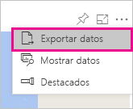

> [!NOTE]
> Si deshabilita la opción **Exportar datos** también impedirá que los usuarios usen la característica **Analizar en Excel**, así como la conexión dinámica al servicio Power BI.

### Exportar informes como presentaciones de PowerPoint

Los usuarios de la organización pueden exportar informes de Power BI como archivos de PowerPoint. [Más información](service-publish-to-powerpoint.md)

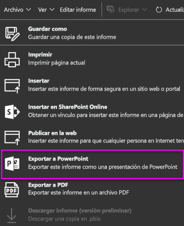

### Imprimir paneles e informes

Los usuarios de la organización pueden imprimir paneles e informes. [Más información](service-print.md)

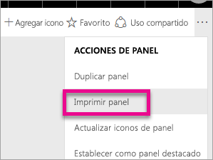

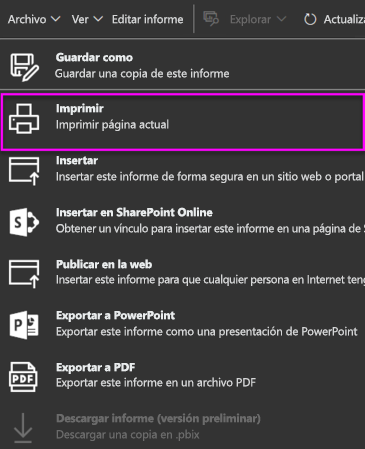

## Configuración de los paquetes de contenido

### Publicar paquetes de contenido para toda la organización

Los usuarios de la organización pueden publicar paquetes de contenido para toda la organización.

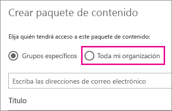

### Crear paquetes de plantilla de contenido de organización

Los usuarios de la organización pueden crear paquetes de plantilla de contenido que utilizan conjuntos de datos integrados en un origen de datos de Power BI Desktop.

### Insertar aplicaciones para los usuarios finales

El administrador de inquilinos ofrece la posibilidad de insertar aplicaciones en **Configuración de inquilinos**.

   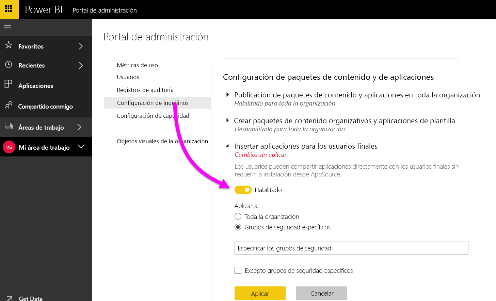

Puede cambiar el valor a **Habilitado** y luego especificar quién obtiene esta capacidad (toda la organización o grupos de seguridad específicos).

> [!NOTE]
> Recuerde que los cambios de configuración de inquilinos pueden tardar algún tiempo en aplicarse.

Vaya aquí para obtener más información sobre cómo [insertar aplicaciones](service-create-distribute-apps.md#how-to-install-an-app-automatically-for-end-users).

## Configuración de integración

### Realizar preguntas sobre datos mediante Cortana

Los usuarios de la organización pueden realizar preguntas sobre sus datos mediante Cortana.

> [!NOTE]
> Esta configuración se aplica a toda la organización y no se puede limitar a grupos específicos.

### Usar la característica Analizar en Excel con conjuntos de datos locales

Los usuarios de la organización pueden utilizar Excel para ver e interactuar con conjuntos de datos locales de Power BI. [Más información](service-analyze-in-excel.md)

> [!NOTE]
> Si deshabilita la opción **Exportar datos** también impide que los usuarios usen la característica **Analizar en Excel**.

### Usar ArcGIS Maps for Power BI

Los usuarios de la organización pueden usar la visualización de ArcGIS Maps for Power BI proporcionada por Esri. [Más información](power-bi-visualization-arcgis.md)

### Usar la búsqueda global para Power BI (versión preliminar)

Los usuarios de la organización pueden usar características de búsqueda externa que se basan en Azure Search. Por ejemplo, los usuarios pueden usar Cortana para recuperar información clave directamente de los informes y paneles de Power BI. [Más información](service-cortana-intro.md)

## Configuración de objetos visuales personalizados

### Habilitación de objetos visuales personalizados para toda la organización

Los usuarios de la organización pueden interactuar con objetos visuales personalizados y compartirlos. [Más información](power-bi-custom-visuals.md)

> [!NOTE]
> Esta configuración se aplica a toda la organización y no se puede limitar a grupos específicos.

## Configuración de objetos visuales de R

### Compartir objetos visuales de R e interactuar con ellos

Los usuarios de la organización pueden interactuar con objetos visuales creados mediante scripts de R y compartirlos. [Más información](visuals/service-r-visuals.md)

> [!NOTE]
> Esta configuración se aplica a toda la organización y no se puede limitar a grupos específicos.

## Configuración de auditoría y uso

### Crear registros de auditoría con fines de auditoría y cumplimiento de la actividad interna

Los usuarios de la organización pueden utilizar la auditoría para supervisar las acciones realizadas en Power BI por otros usuarios de la organización. [Más información](service-admin-auditing.md)

Se debe habilitar esta configuración para que las entradas de registro de auditoría se puedan registrar. Puede haber una demora de hasta 48 horas entre la habilitación de la auditoría y el momento en el que se empiecen a mostrar los datos de auditoría. Si no ve los datos de inmediato, consulte los registros de auditoría más tarde. Puede haber una demora similar entre la obtención de permisos para ver los registros de auditoría y la posibilidad de acceder a estos.

> [!NOTE]
> Esta configuración se aplica a toda la organización y no se puede limitar a grupos específicos.

### Métricas de uso para creadores de contenido
Los usuarios de la organización pueden consultar las métricas de uso de los paneles y los informes que hayan creado. [Más información](service-usage-metrics.md).

Puede cambiar el valor a **Habilitado** y luego especificar quién puede ver métricas de uso (toda la organización o grupos de seguridad específicos).

> [!NOTE]
> Recuerde que los cambios de configuración de inquilinos pueden tardar algún tiempo en aplicarse.

### Datos por usuario en métricas de uso de creadores de contenido
Las métricas de uso de creadores de contenido revelan los nombres para mostrar y las direcciones de correo electrónico de los usuarios que acceden al contenido. [Más información](service-usage-metrics.md).

Puede cambiar el valor a **Habilitado** y luego especificar quién puede ver nombres para mostrar y direcciones de correo electrónico en las métricas de uso (toda la organización o grupos de seguridad específicos).

Los datos por usuario están habilitados de forma predeterminada en las métricas de uso, mientras que el informe de métricas incluye información sobre la cuenta del creador de contenido. Si prefiere no incluir esta información de algunos los usuarios, incluso de ninguno de ellos, deshabilite la característica para los grupos de seguridad en cuestión o para toda la organización. En tal caso, la información de la cuenta aparecerá en el informe como *Sin nombre*.

> [!NOTE]
> Recuerde que los cambios de configuración de inquilinos pueden tardar algún tiempo en aplicarse.

## Configuración del panel

### Clasificación de datos para paneles

Los usuarios de la organización pueden etiquetar paneles con clasificaciones que indiquen los niveles de seguridad del panel. [Más información](service-data-classification.md)

> [!NOTE]
> Esta configuración se aplica a toda la organización y no se puede limitar a grupos específicos.

## Configuración del desarrollador

### Insertar contenido en las aplicaciones

Los usuarios de la organización pueden insertar informes y paneles de Power BI en las aplicaciones de software como servicio (SaaS). Si deshabilita esta configuración, impide que los usuarios puedan usar las API REST para insertar contenido de Power BI en la aplicación.

## Configuración de la capacidad

### Configuración de Premium

La pestaña Configuración de Premium le permite administrar las capacidades de Power BI Premium (SKU EM o P) que se han adquirido para su organización. Todos los usuarios de su organización pueden ver la pestaña Configuración de Premium, pero solo ven lo que contiene si están asignados como **administrador de capacidades** o como un usuario con permisos de asignación. Si un usuario no tiene ningún permiso, aparecerá el mensaje siguiente.

Para más información sobre cómo administrar la configuración de Premium, consulte [Administración de Power BI Premium](service-admin-premium-manage.md).

### Configuración de Power BI Embedded

La pestaña Configuración de Power BI Embedded le permite ver sus capacidades de Power BI Embedded (SKU A) que ha adquirido para su cliente. Dado que solo puede adquirir SKU A de Azure, puede [administrar las capacidades insertadas en Azure](developer/azure-pbie-create-capacity.md) desde **Azure Portal**.

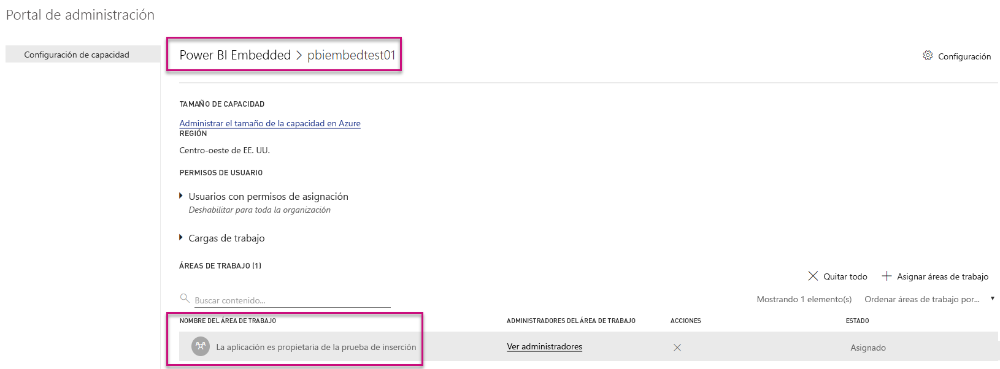

Para más información sobre cómo administrar la configuración de Power BI Embedded (SKU A), consulte [¿Qué es Power BI Embedded?](developer/azure-pbie-what-is-power-bi-embedded.md).

## Códigos para insertar

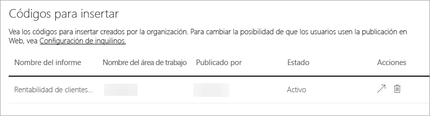

Como administrador, puede ver los códigos para insertar que se generan para su inquilino. Puede ver el informe y eliminar el código para insertar para revocarlo.

## Objetos visuales de la organización

La pestaña de objetos visuales de la organización le permite implementar y administrar los objetos visuales personalizados dentro de la organización, por lo que puede implementar con facilidad sus propios objetos visuales personalizados en la organización con el fin de que los autores de los informes detecten e importen fácilmente los objetos visuales directamente desde Power BI Desktop en sus informes.

La página muestra todos los objetos visuales personalizados que están implementados actualmente en el repositorio de la organización.

### Adición de un nuevo objeto visual personalizado

Para agregar un nuevo objeto visual personalizado a la lista, seleccione **Agregar objeto visual personalizado**.

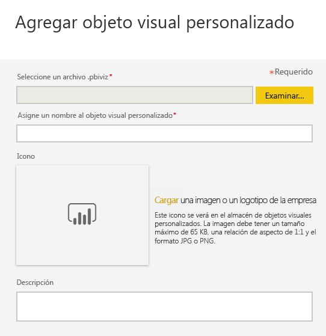

> [!WARNING]
> Un objeto visual personalizado podría contener código con riesgos para la seguridad o la privacidad; asegúrese de que confía en el autor y del origen del objeto visual personalizado antes de implementar en el repositorio de origen.

Complete los campos:

* Elija un archivo .pbiviz (obligatorio): seleccione un archivo visual personalizado para cargar. Se admiten solo objetos visuales de API con control de versiones (lea aquí lo que esto significa).

Antes de cargar un objeto visual personalizado, debe revisar la seguridad y privacidad de dicho objeto visual para asegurarse de que se ajusta a los estándares de su organización. Obtenga más información acerca de la seguridad de los objetos visuales personalizados.

* Ponga un nombre a los objetos visuales personalizados (obligatorio): asigne un título corto al objeto visual para que los usuarios de Power BI Desktop sepan fácilmente para qué sirve.

* Icono (obligatorio): el archivo de icono que se muestra en la interfaz de usuario de Power BI Desktop.

* Descripción: una descripción breve del objeto visual para proporcionar más contexto e información al usuario.

Seleccione "Aplicar" para iniciar la solicitud de carga. Si se realiza correctamente, verá el nuevo elemento en la lista. Si el proceso no se completa, recibirá el mensaje de error pertinente.

### Eliminación de un objeto visual personalizado de la lista

Seleccione el icono de la Papelera de reciclaje para eliminar permanentemente el objeto visual del repositorio.
Importante: la eliminación es irreversible. Una vez eliminado, el objeto visual deja de representarse de inmediato en los informes existentes. Incluso si vuelve a cargar el mismo objeto visual, este no reemplazará al anterior que se eliminó; los usuarios pueden volver a importar el nuevo objeto visual y reemplazar la instancia que tienen en sus informes.

### Deshabilitación de un objeto visual personalizado en la lista

Para deshabilitar el objeto visual desde la tienda de la organización, seleccione el icono de engranaje. En la sección **Acceso**, deshabilite el objeto visual personalizado.

Después de deshabilitar el objeto visual, ya no se representa en los informes existentes y se muestra el mensaje de error siguiente.

*This custom visual is no longer available (Este objeto visual personalizado ya no está disponible). Please contact your administrator for details* (Póngase en contacto con su administrador para más información).

Sin embargo, los objetos visuales guardados como marcador siguen funcionando.

Después de una actualización o un cambio por el administrador, los usuarios de Power BI Desktop deben reiniciar la aplicación o actualizar el explorador en el servicio Power BI para ver las actualizaciones.

### Actualización de un objeto visual

Si desea actualizar un objeto visual en el repositorio porque hay una versión nueva del objeto visual (por ejemplo, correcciones de errores, una funcionalidad nueva, etc.), seleccione el icono **Actualizar** y cargue el archivo nuevo. Asegúrese de que el identificador del objeto visual no cambie. El archivo nuevo reemplaza al archivo anterior en todos los informes de la organización. Sin embargo, si la versión nueva del objeto visual puede generar errores en el uso o la estructura de datos de la versión anterior del objeto visual, no reemplace la versión anterior. En lugar de eso, debe crear una nueva lista para la versión nueva del objeto visual. Por ejemplo, agregue un número de versión nuevo (versión X.X) al título del objeto visual nuevo. De este modo, resulta claro que es el mismo objeto visual solo con un número de versión actualizado, por lo que los informes existentes no interrumpen su funcionalidad. Vuelva a asegurarse de que el identificador del objeto visual no cambie. Luego, la próxima vez que los usuarios entren en el repositorio de la organización desde Power BI Desktop, pueden importar la versión nueva, donde se les pide que reemplacen la versión actual que tienen en el informe.

## Pasos siguientes

[Descripción del rol de administrador de Power BI](service-admin-role.md)  
[Auditoría de Power BI en su organización](service-admin-auditing.md)  
[Administración de Power BI Premium](service-admin-premium-manage.md)  
[Administración de Power BI en su organización](service-admin-administering-power-bi-in-your-organization.md)  

¿Tiene más preguntas? [Pruebe a preguntar a la comunidad de Power BI](http://community.powerbi.com/)
