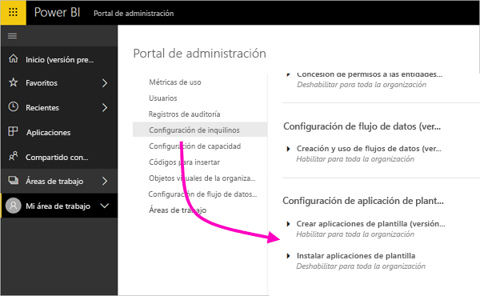
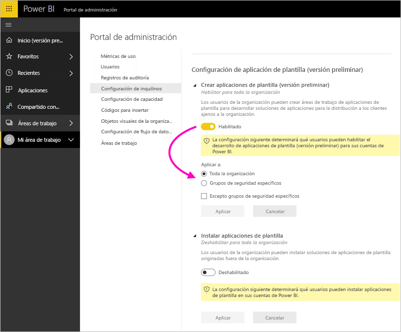

# Administración de Power BI en el portal de administración

El portal de administración le permite administrar un *inquilino* de Power BI de su organización. El portal incluye elementos como métricas de uso, acceso al Centro de administración de Office 365 y configuración.

El portal de administración completo es accesible para todos los usuarios que sean administradores globales de Office 365 o a los que se les haya asignado el rol de administrador del servicio Power BI. Si no está en uno de estos roles, solo verá **Configuración de la capacidad** en el portal. Para más información acerca del rol de administrador del servicio Power BI, consulte [Descripción del rol de administrador de Power BI](service-admin-role.md).

## Acceso al portal de administración

La cuenta debe estar marcada como **Administrador global** dentro de Office 365 o Azure Active Directory, o que se le haya asignado el rol de administrador del servicio Power BI, para acceder al portal de administración de Power BI. Para más información acerca del rol de administrador del servicio Power BI, consulte [Descripción del rol de administrador de Power BI](service-admin-role.md). Para acceder al portal de administración de Power BI, haga lo siguiente.

1. Seleccione el engranaje de configuración en la parte superior derecha del servicio Power BI.

1. Seleccione **Portal de administración**.

    

Hay siete pestañas en el portal. En el resto de este artículo se proporciona información sobre cada una de ellas.

* [Métricas de uso](#usage-metrics)
* [Usuarios](#users)
* [Registros de auditoría](#audit-logs)
* [Configuración de inquilinos](#tenant-settings)
* [Configuración de Premium](#premium-settings)
* [Códigos para insertar](#embed-codes)
* [Objetos visuales de la organización](#organization-visuals)

## Métricas de uso

La pestaña **Métricas de uso** le permiten supervisar el uso de Power BI de su organización. También proporciona la capacidad para ver qué usuarios y grupos, son los más activos en Power BI para su organización.

> [!NOTE]
> La primera vez que accede al panel, o después de visitarlo de nuevo tras un largo período sin verlo, probablemente verá una pantalla de carga mientras se carga el panel.

Una vez cargado el panel, verá dos secciones de iconos. La primera sección incluye datos de uso para usuarios individuales y la segunda sección muestra información similar para los grupos de su organización.

Este es un desglose de lo que puede ver en cada icono:

* Recuento definido de todos los paneles, informes y conjuntos de datos en el área de trabajo de usuario.
  
    

* El panel más consumido por número de usuarios que pueden acceder a él. Por ejemplo, si tiene un panel que ha compartido con tres usuarios y también lo agrega a un paquete de contenido al que están conectados dos usuarios distintos, su recuento sería 6 (1 + 3 + 2).
  
    

* El contenido más popular al que están conectados los usuarios. Esto sería cualquier cosa que los usuarios puedan alcanzar a través del proceso de obtención de datos: paquetes SaaS, paquetes de contenido organizativo, archivos o bases de datos.
  
    

* Una vista de los usuarios principales según el número de paneles que tienen, tanto paneles que crearon ellos mismos como paneles compartidos con ellos.
  
    

* Una vista de los usuarios principales según el número de informes que tienen
  
    

La segunda sección muestra el mismo tipo de información, pero se basa en grupos. Esto le permite ver qué grupos de la organización son más activos y qué tipo de contenido consumen.

Con esta información, puede obtener información real sobre cómo las personas usan Power BI en toda la organización y puede reconocer esos usuarios y grupos que son muy activos en su organización.

## Usuarios

Administrará usuarios, grupos y administradores de Power Bi en el Centro de administración de Office 365. La pestaña **Usuarios** proporciona un vínculo al centro de administración del inquilino.

## Registros de auditoría

Administrará registros de auditoría de Power BI en el Centro de seguridad y cumplimiento de Office 365. La pestaña **Registros de auditoría** proporciona un vínculo al Centro de seguridad y cumplimiento del inquilino. [Más información](service-admin-auditing.md)

Para usar los registros de auditoría, asegúrese de que la opción [**Crear registros de auditoría para el cumplimiento y la auditoría de la actividad interna**](#create-audit-logs-for-internal-activity-auditing-and-compliance) está habilitada.

## Configuración de inquilinos

La pestaña **Configuración de inquilinos** permite controlar de manera pormenorizada las características que están disponibles para su organización. Si le preocupa la información confidencial, algunas de nuestras características pueden no ser adecuadas para su organización, o puede que solo quiera que una determinada característica esté disponible para un grupo concreto.

En la imagen siguiente se muestran las dos primeras secciones de la pestaña **Configuración de inquilinos**.

> [!NOTE]
> La configuración puede tardar hasta 10 minutos en aplicarse para todos los usuarios del inquilino.

La configuración puede tener tres estados:

* **Deshabilitado para toda la organización**: ninguna persona de la organización puede usar esta característica.

    

* **Habilitado para toda la organización**: todas las personas de la organización pueden usar esta característica.

    

* **Habilitado para un subconjunto de la organización**: un subconjunto específico de usuarios o grupos de la organización puede usar esta característica.

    Puede habilitar la característica para toda la organización, menos para un grupo de usuarios específico.

    

    Puede habilitar también la característica solo para un grupo específico de usuarios y deshabilitarla para determinados usuarios de ese grupo. El uso de este enfoque garantiza que determinados usuarios no tengan acceso a la característica incluso aunque pertenezcan al grupo permitido.

    

Las secciones siguientes proporcionan una visión general de los distintos tipos de configuración de inquilino.

## Configuración del área de trabajo

### Crear áreas de trabajo (versión preliminar)

Los usuarios de la organización pueden crear áreas de trabajo de aplicación para colaborar en paneles, informes y otro contenido. [Más información](service-create-the-new-workspaces.md)

## Exportar y compartir configuración

### Compartir contenido con usuarios externos

Los usuarios de la organización pueden compartir paneles con usuarios de fuera de la organización. [Más información](service-share-dashboards.md#share-a-dashboard-or-report-with-people-outside-your-organization)

En la imagen siguiente se muestra el mensaje que aparece al compartir con un usuario externo.

### Publicar en la web

Los usuarios de la organización pueden publicar informes en la web. [Más información](service-publish-to-web.md)

En la imagen siguiente se muestra el menú **Archivo** de un informe cuando está habilitada la opción **Publicar en la web**.

Los usuarios ven diferentes opciones en la interfaz de usuario en función del valor de la opción **Publicar en la web**.

|Destacado |Habilitada para toda la organización |Deshabilitada para toda la organización |Grupos de seguridad específicos   |
|---------|---------|---------|---------|
|**Publicar en la web** en el menú **Archivo**.|Habilitada para todos|No visible para todos|Solo visible para usuarios o grupos autorizados.|
|**Administrar códigos para insertar** en **Configuración**|Habilitada para todos|Habilitada para todos|Habilitada para todos  Opción * **Eliminar** solo para usuarios o grupos autorizados. * **Obtener código** habilitada para todos.|
|**Códigos de inserción** en el portal de administración|El estado refleja uno de los siguientes: * Activo * No admitido * Bloqueado|El estado muestra **Deshabilitado**.|El estado refleja uno de los siguientes: * Activo * No admitido * Bloqueado  Si el usuario no está autorizado según la configuración del inquilino, el estado muestra **Infracción**.|
|Informes publicados existentes|Todos habilitados|Todos deshabilitados|Los informes continúan generándose para todos.|

### Exportar datos

Los usuarios de la organización pueden exportar datos desde un icono o una visualización. [Más información](visuals/power-bi-visualization-export-data.md)

En la imagen siguiente se muestra la opción para exportar datos desde un icono.

> [!NOTE]
> Si deshabilita la opción **Exportar datos** también impedirá que los usuarios usen la característica **Analizar en Excel**, así como la conexión dinámica al servicio Power BI.

### Exportación de informes como presentaciones de PowerPoint o documentos PDF

Los usuarios de la organización pueden exportar informes de Power BI como archivos de PowerPoint o documentos PDF. [Más información](consumer/end-user-powerpoint.md)

En la imagen siguiente se muestra el menú **Archivo** para un informe cuando está habilitada la opción **Exportar informes como presentaciones de PowerPoint o documentos PDF**.

### Imprimir paneles e informes

Los usuarios de la organización pueden imprimir paneles e informes. [Más información](consumer/end-user-print.md)

En la imagen siguiente se muestra la opción para imprimir un panel.

En la imagen siguiente se muestra el menú **Archivo** de un informe cuando está habilitada la opción **Imprimir paneles e informes**.

## Configuración de paquetes de contenido y de aplicaciones

### Publicación de paquetes de contenido y aplicaciones en toda la organización

Los usuarios de la organización pueden publicar paquetes de contenido y aplicaciones en toda la organización, en lugar de solo en grupos específicos. [Más información](service-organizational-content-pack-manage-update-delete.md)

La siguiente imagen muestra la opción **Toda mi organización** al crear un paquete de contenido.

### Creación de aplicaciones plantilla

Los usuarios de la organización pueden crear aplicaciones de plantilla en las que se usan conjuntos de datos integrados en Power BI Desktop. Más información sobre las [aplicaciones de plantilla](template-content-pack-authoring.md)

### Insertar aplicaciones para los usuarios finales

Los usuarios pueden compartir aplicaciones directamente con los usuarios finales sin requerir la instalación desde AppSource. [Más información](service-create-distribute-apps.md)

## Configuración de integración

### Realizar preguntas sobre datos mediante Cortana

Los usuarios de la organización pueden realizar preguntas sobre sus datos mediante Cortana. [Más información](service-cortana-enable.md)

> [!NOTE]
> Esta configuración se aplica a toda la organización y no se puede limitar a grupos específicos.

### Usar la característica Analizar en Excel con conjuntos de datos locales

Los usuarios de la organización pueden utilizar Excel para ver e interactuar con conjuntos de datos locales de Power BI. [Más información](service-analyze-in-excel.md)

> [!NOTE]
> Si deshabilita la opción **Exportar datos** también impide que los usuarios usen la característica **Analizar en Excel**.

### Usar ArcGIS Maps for Power BI

Los usuarios de la organización pueden usar la visualización de ArcGIS Maps for Power BI proporcionada por Esri. [Más información](visuals/power-bi-visualization-arcgis.md)

### Usar la búsqueda global para Power BI (versión preliminar)

Los usuarios de la organización pueden usar características de búsqueda externa que se basan en Azure Search. Por ejemplo, los usuarios pueden usar Cortana para recuperar información clave directamente de los informes y paneles de Power BI. [Más información](service-cortana-intro.md)

## Configuración de objetos visuales personalizados

### Incorporación y uso de objetos visuales personalizados

Los usuarios de la organización pueden interactuar con objetos visuales personalizados y compartirlos. [Más información](power-bi-custom-visuals.md)

> [!NOTE]
> Esta configuración se puede aplicar en toda la organización o puede limitarse a grupos específicos.

### Permitir solo objetos visuales certificados

Los usuarios de la organización a los que se han concedido permisos para agregar y usar objetos visuales personalizados (lo que se indica mediante la configuración "Agregar y usar objetos visuales personalizados") solo podrán usar [objetos visuales personalizados certificados](https://go.microsoft.com/fwlink/?linkid=2002010). Los objetos visuales no certificados se bloquearán y se mostrará un mensaje de error cuando se usen. 

## Configuración de objetos visuales de R

### Compartir objetos visuales de R e interactuar con ellos

Los usuarios de la organización pueden interactuar con objetos visuales creados mediante scripts de R y compartirlos. [Más información](visuals/service-r-visuals.md)

> [!NOTE]
> Esta configuración se aplica a toda la organización y no se puede limitar a grupos específicos.

## Configuración de auditoría y uso

### Crear registros de auditoría con fines de auditoría y cumplimiento de la actividad interna

Los usuarios de la organización pueden utilizar la auditoría para supervisar las acciones realizadas en Power BI por otros usuarios de la organización. [Más información](service-admin-auditing.md)

Se debe habilitar esta configuración para que las entradas de registro de auditoría se puedan registrar. Puede haber una demora de hasta 48 horas entre la habilitación de la auditoría y el momento en el que se empiecen a mostrar los datos de auditoría. Si no ve los datos de inmediato, consulte los registros de auditoría más tarde. Puede haber una demora similar entre la obtención de permisos para ver los registros de auditoría y la posibilidad de acceder a estos.

> [!NOTE]
> Esta configuración se aplica a toda la organización y no se puede limitar a grupos específicos.

### Métricas de uso para creadores de contenido

Los usuarios de la organización pueden consultar las métricas de uso de los paneles y los informes que hayan creado. [Más información](service-usage-metrics.md)

### Datos por usuario en métricas de uso de creadores de contenido

Las métricas de uso de creadores de contenido revelan los nombres para mostrar y las direcciones de correo electrónico de los usuarios que acceden al contenido. [Más información](service-usage-metrics.md)

Los datos por usuario están habilitados de forma predeterminada en las métricas de uso, mientras que el informe de métricas incluye información sobre la cuenta del creador de contenido. Si prefiere no incluir esta información de algunos los usuarios, incluso de ninguno de ellos, deshabilite la característica para los grupos de seguridad en cuestión o para toda la organización. En tal caso, la información de la cuenta aparecerá en el informe como *Sin nombre*.

## Configuración del panel

### Clasificación de datos para paneles

Los usuarios de la organización pueden etiquetar paneles con clasificaciones que indiquen los niveles de seguridad del panel. [Más información](service-data-classification.md)

> [!NOTE]
> Esta configuración se aplica a toda la organización y no se puede limitar a grupos específicos.

## Configuración del desarrollador

### Insertar contenido en las aplicaciones

Los usuarios de la organización pueden insertar informes y paneles de Power BI en las aplicaciones de software como servicio (SaaS). Si deshabilita esta configuración, impide que los usuarios puedan usar las API REST para insertar contenido de Power BI en la aplicación. [Más información](developer/embedding.md)

## Configuración de flujo de datos (versión preliminar)

### Creación y uso de flujos de datos (versión preliminar)

Los usuarios de la organización pueden crear y usar flujos de datos. Para obtener información general sobre flujos de datos, vea [Preparación de datos de autoservicio en Power BI (versión preliminar)](service-dataflows-overview.md). Para habilitar flujos de datos en una capacidad Premium, vea [Configuración de las cargas de trabajo](service-admin-premium-workloads.md).

> [!NOTE]
> Esta configuración se aplica a toda la organización y no se puede limitar a grupos específicos.

## Configuración de aplicaciones de plantilla (versión preliminar)

Dos opciones controlan las aplicaciones de plantilla. 

La primera opción, **Crear aplicaciones de plantilla**, controla quién puede crear aplicaciones de plantilla en la organización. Los creadores de aplicaciones de plantilla, pueden distribuirlas a clientes fuera de la organización mediante AppSource u otro método de distribución.

Con la segunda opción, **Instalar aplicaciones de plantilla**, puede controlar quién de la organización puede descargar e instalar aplicaciones de plantilla desde AppSource u otro origen

## Configuración de capacidad

### Power BI Premium

La pestaña **Power BI Premium** le permite administrar las funcionalidades de Power BI Premium (SKU EM o P) que se han adquirido para su organización. Todos los usuarios de su organización pueden ver la pestaña **Power BI Premium**, pero solo ven lo que contiene si están asignados como *administrador de funcionalidades* o como un usuario con permisos de asignación. Si un usuario no tiene ningún permiso, aparecerá el mensaje siguiente.

### Power BI Embedded

La pestaña **Power BI Embedded** le permite ver sus funcionalidades de Power BI Embedded (SKU A) que ha adquirido para su cliente. Dado que solo puede adquirir SKU A de Azure, puede [administrar las funcionalidades insertadas en Azure](developer/azure-pbie-create-capacity.md) desde **Azure Portal**.

Para más información sobre cómo administrar la configuración de Power BI Embedded (SKU A), consulte [¿Qué es Power BI Embedded?](developer/azure-pbie-what-is-power-bi-embedded.md).

## Códigos para insertar

Como administrador, puede ver los códigos para insertar que se generan para su inquilino. También puede revocar o eliminar códigos. [Más información](service-publish-to-web.md)

## Objetos visuales de la organización

La pestaña **Objetos visuales de la organización** permite implementar y administrar los objetos visuales personalizados de la organización. Con objetos visuales de la organización, puede implementar fácilmente objetos visuales propietarios en su organización, que los autores de informes pueden detectar e importar después en sus informes de Power BI Desktop. [Más información](power-bi-custom-visuals-organization.md)

> [!WARNING]
> Un objeto visual personalizado podría contener código con riesgos para la seguridad o la privacidad; asegúrese de que confía en el autor y del origen del objeto visual personalizado antes de implementar en el repositorio de la organización.

En la imagen siguiente se muestran todos los objetos visuales personalizados que están implementados actualmente en un repositorio de la organización.

### Adición de un nuevo objeto visual personalizado

Para agregar un nuevo objeto visual personalizado a la lista, siga estos pasos. 

1. En el panel derecho, seleccione **Agregar objeto visual personalizado**.

    

1. Rellene el formulario **Agregar objeto visual personalizado**:

    * **Elija un archivo .pbiviz** (obligatorio): seleccione un archivo visual personalizado para cargar. Se admiten solo objetos visuales de API con control de versiones (lea aquí lo que esto significa).

    Antes de cargar un objeto visual personalizado, debe revisar la seguridad y privacidad de dicho objeto visual para asegurarse de que se ajusta a los estándares de su organización.

    * **Asigne un nombre a los objetos visuales personalizados** (obligatorio): asigne un título corto al objeto visual para que los usuarios de Power BI Desktop sepan fácilmente para qué sirve.

    * **Icono**: El archivo de icono que se muestra en la interfaz de usuario de Power BI Desktop.

    * **Descripción**: una descripción breve del objeto visual para proporcionar más contexto e información al usuario.

1. Seleccione **Agregar** para iniciar la solicitud de carga. Si se realiza correctamente, verá el nuevo elemento en la lista. Si el proceso no se completa, recibirá el mensaje de error pertinente.

### Eliminación de un objeto visual personalizado de la lista

Para eliminar de forma permanente un objeto visual, seleccione el icono de la Papelera de reciclaje para el objeto visual en el repositorio.

> [!IMPORTANT]
> La eliminación es irreversible. Una vez eliminado, el objeto visual deja de representarse de inmediato en los informes existentes. Aunque se cargue el mismo objeto visual de nuevo, no reemplazará al anterior que se eliminó. Sin embargo, los usuarios pueden volver a importar el nuevo objeto visual y reemplazar la instancia que tienen en los informes.

### Deshabilitación de un objeto visual personalizado en la lista

Para deshabilitar el objeto visual desde la tienda de la organización, seleccione el icono de engranaje. En la sección **Acceso**, deshabilite el objeto visual personalizado.

Después de deshabilitar el objeto visual, ya no se representa en los informes existentes y se muestra el mensaje de error siguiente.

*This custom visual is no longer available (Este objeto visual personalizado ya no está disponible). Please contact your administrator for details* (Póngase en contacto con su administrador para más información).

Sin embargo, los objetos visuales guardados como marcador siguen funcionando.

Después de una actualización o un cambio por el administrador, los usuarios de Power BI Desktop deben reiniciar la aplicación o actualizar el explorador en el servicio Power BI para ver las actualizaciones.

### Actualización de un objeto visual

Para actualizar el objeto visual desde la tienda de la organización, seleccione el icono de engranaje. Examine y cargue una nueva versión del objeto visual.

Asegúrese de que el identificador del objeto visual no cambie. El archivo nuevo reemplaza al archivo anterior en todos los informes de la organización. Sin embargo, si la versión nueva del objeto visual puede generar errores en el uso o la estructura de datos de la versión anterior del objeto visual, no reemplace la versión anterior. En lugar de eso, debe crear una nueva lista para la versión nueva del objeto visual. Por ejemplo, agregue un número de versión nuevo (versión X.X) al título del objeto visual nuevo. De este modo, resulta claro que es el mismo objeto visual solo con un número de versión actualizado, por lo que los informes existentes no interrumpen su funcionalidad. Vuelva a asegurarse de que el identificador del objeto visual no cambie. Luego, la próxima vez que los usuarios entren en el repositorio de la organización desde Power BI Desktop, pueden importar la versión nueva, donde se les pide que reemplacen la versión actual que tienen en el informe.

Para obtener más información, visite las [preguntas más frecuentes sobre objetos visuales personalizados de organización](https://docs.microsoft.com/power-bi/power-bi-custom-visuals-faq#organizational-custom-visuals).

## Almacenamiento de flujos de datos (versión preliminar)

De forma predeterminada, los datos usados con Power BI se almacenan en almacenamiento interno proporcionado por Power BI. Con la integración de flujos de datos y Azure Data Lake Storage Gen2 (ADLS Gen2), puede almacenar los flujos de datos en la cuenta de Azure Data Lake Storage Gen2 de su organización. Para obtener más información, vea [Integración de flujos de datos y Azure Data Lake (versión preliminar)](service-dataflows-azure-data-lake-integration.md).

## Áreas de trabajo (versión preliminar)

Como administrador, puede ver las áreas de trabajo que existen en el inquilino. Puede ordenar y filtrar la lista de áreas de trabajo y mostrar los detalles de cada una de ellas. Tenga en cuenta que las columnas de la tabla se corresponden con las propiedades devueltas por la [API de Rest de administración de Power BI](/rest/api/power-bi/admin) para las áreas de trabajo. Las áreas de trabajo personales son de tipo **PersonalGroup**, las heredadas son de tipo **Group** y las modernas son del tipo **Workspace**. Para obtener más información, vea [Crear nuevas áreas de trabajo (versión preliminar) en Power BI](service-create-the-new-workspaces.md).

## Pasos siguientes

[Administración de Power BI en su organización](service-admin-administering-power-bi-in-your-organization.md) [Descripción del rol de administrador de Power BI](service-admin-role.md)  
[Auditoría de Power BI en su organización](service-admin-auditing.md)  

¿Tiene más preguntas? [Pruebe a preguntar a la comunidad de Power BI](http://community.powerbi.com/)
