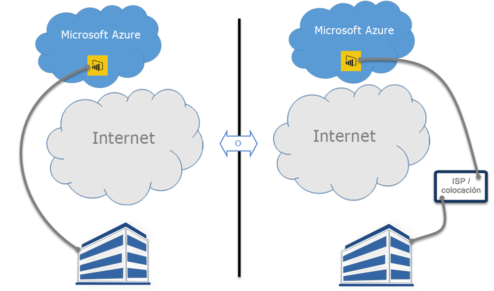

# Power BI y ExpressRoute

**ExpressRoute** es un servicio de Azure que le permite crear conexiones privadas entre centros de datos de Azure (donde reside Power BI) y la infraestructura local o entre centros de datos de Azure y su entorno de colocación.

Con **Power BI** y **ExpressRoute**, puede crear una conexión de red privada entre su organización y Power BI (o mediante una instalación de colocación del ISP), omitiendo Internet para proteger mejor las conexiones y los datos confidenciales de Power BI.

Para más información, consulte [Información general sobre ExpressRoute](/azure/expressroute/expressroute-introduction). Power BI es compatible con ExpressRoute, con algunas excepciones en las que Power BI obtiene o envía datos a través de la red pública de Internet. Para ver una lista de las direcciones URL que Power BI usa, consulte [URL de Power BI](power-bi-whitelist-urls.md).

