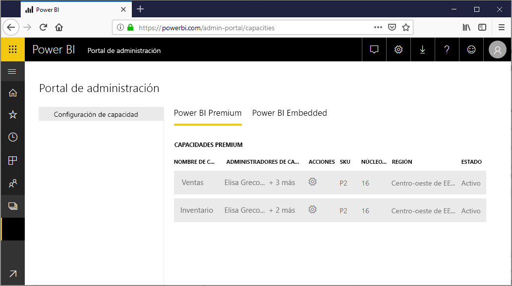
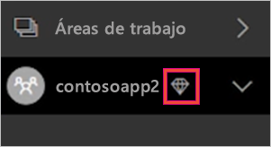
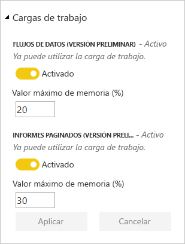
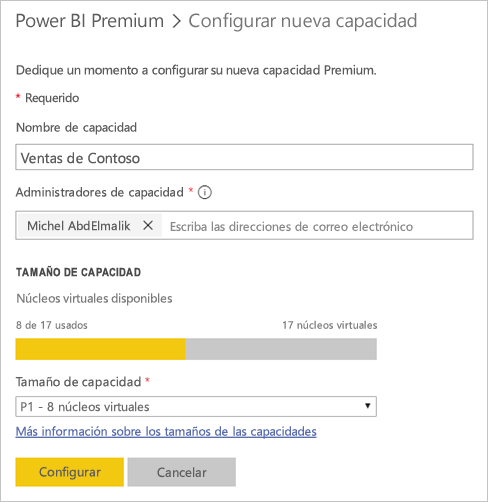
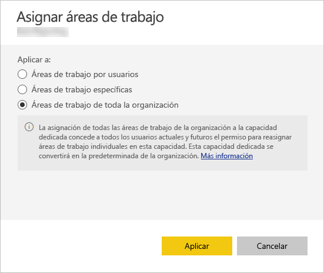
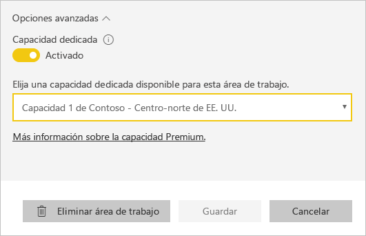

# Administración de la capacidad en Power BI Premium y Power BI Embedded

Aprenda a administrar las capacidades de Power BI Premium y Power BI Embedded, que ofrecen recursos dedicados para su contenido.

## ¿Cuál es la capacidad?

La *capacidad* es el núcleo de las ofertas Power BI Premium y Power BI Embedded. Es el conjunto de recursos reservados para uso exclusivo por parte de la organización. Tener capacidad dedicada le permite publicar paneles, informes y conjuntos de datos para los usuarios de su organización sin tener que adquirir licencias por usuario para ellos. También ofrece un rendimiento confiable y continuo del contenido hospedado en la capacidad. Para más información, consulte [What is Power BI Pro?](service-premium.md) (¿Qué es Power BI Premium?).

### Administradores de capacidad

Cuando se le asigna a una capacidad como *administrador de capacidad*, tiene el control total sobre esta capacidad y sobre sus características administrativas. En el portal de administración de Power BI, puede agregar más administradores de capacidad o proporcionar a los usuarios permisos de asignación de capacidad. Puede asignar áreas de trabajo en masa a una capacidad y ver las métricas de uso de una capacidad.

> [!NOTE]
> Para Power BI Embedded, los administradores de capacidad se definen en Microsoft Azure Portal.

Cada capacidad tiene sus propios administradores. Asignar un administrador de capacidad para una capacidad no le concede acceso a todas las capacidades de la organización. De forma predeterminada, los administradores de capacidad no tienen acceso a todas las áreas de administración de Power BI, por ejemplo, las métricas de uso, los registros de auditoría o la configuración de inquilinos. Además, los administradores de capacidad no tiene permiso para configurar nuevas capacidades ni cambiar las SKU de las capacidades existentes. Solo los administradores globales de Office 365 o los administradores de servicio Power BI tienen acceso a esos elementos.

Todos los administradores globales de Office 365 y los administradores de servicio Power BI son automáticamente administradores tanto de la capacidad de Power BI Premium como de Power BI Embedded.

## Comprar capacidad

Para aprovechar las ventajas de la capacidad dedicada, debe comprar Power BI Premium en el centro de administración de Office 365, o crear un recurso de Power BI Embedded en Microsoft Azure Portal. Para obtener más información, consulte los artículos siguientes:

* **Power BI Premium:** [Adquisición de Power BI Premium](service-admin-premium-purchase.md)

* **Power BI Embedded**: [Creación de una capacidad de Power BI Embedded en Azure Portal](https://docs.microsoft.com/azure/power-bi-embedded/create-capacity)

Al adquirir SKU de Power BI Premium o Embedded, su inquilino recibe el número correspondiente de núcleos virtuales para usarlos en la capacidad de ejecución. Por ejemplo, si compra una SKU P3 de Power BI Premium, proporciona al inquilino 32 núcleos virtuales. Para más información acerca de los SKU, consulte [Nodos de capacidad Premium](service-premium.md#premium-capacity-nodes).

## Aspecto de Premium para los usuarios

En la mayoría de los casos, los usuarios no necesitan saber siquiera que están en una capacidad Premium. Sus paneles e informes, simplemente funcionan. Como ayuda visual, puede ver un icono de diamante junto a las áreas de trabajo que están en una capacidad Premium.

## Configuración de las cargas de trabajo

De forma predeterminada, las funcionalidades de Power BI Premium y Power BI Embedded admiten solo la carga de trabajo asociada a la ejecución de consultas de Power BI en la nube. Ahora ofrecemos compatibilidad de versión preliminar para dos cargas de trabajo adicionales: **informes paginados** y **flujos de datos**. Para obtener más información, consulte [Cargas de trabajo de la capacidad Premium](service-premium.md#workloads-in-premium-capacity).

Siga estos pasos para habilitar las cargas de trabajo en el portal de administración de Power BI.

1. En **Configuración de capacidad**, seleccione una capacidad.

1. En **MÁS OPCIONES**, expanda **Cargas de trabajo**.

1. Habilite una o varias cargas de trabajo y establezca un valor para **Memoria máxima**.

    

1. Seleccione **Aplicar**.

## Supervisar el uso de la capacidad

Power BI proporciona una aplicación para supervisar el uso de capacidades. Para más información, consulte [Supervisión de las capacidades de Power BI Premium en su organización](service-admin-premium-monitor-capacity.md).

## Administración de capacidad

Cuando haya adquirido los nodos de capacidad en Office 365, configure la capacidad en el portal de administración de Power BI. Las capacidades de Power BI Premium se administran en la sección de **configuración de la capacidad** del portal.

Para administrar una capacidad, seleccione el nombre de la misma. Después de hacerlo, irá a la pantalla de administración de la capacidad.

Si no se han asignado áreas de trabajo a la capacidad, verá un mensaje que le permite [asignar una área de trabajo a la capacidad](#assign-a-workspace-to-a-capacity).

### Configuración de una nueva capacidad (Power BI Premium)

El portal de administración muestra el número de *núcleos virtuales* que ha utilizado y que aún están disponibles. El número total de núcleos virtuales se basa en las SKU Premium que ha adquirido. Por ejemplo, si compra una P3 y una P2, habrá 48 núcleos disponibles (32 de P3 y 16 de P2).

Si tiene núcleos virtuales disponibles, puede configurar la nueva capacidad siguiendo los pasos siguientes.

1. Seleccione **Configurar nueva capacidad**.

1. Otorgue un nombre a la capacidad.

1. Defina quién es el administrador de esta capacidad.

1. Seleccione el tamaño de la capacidad. Las opciones disponibles dependen de cuántos núcleos virtuales disponibles haya. No se puede seleccionar una opción mayor que lo que hay disponible.

    

1. Seleccione **Configurar**.

    

Los administradores de capacidad, así como los administradores de Power BI y los administradores globales de Office 365, podrán ver posteriormente la capacidad en el portal de administración.

### Configuración de capacidad

1. En la pantalla de administración de la capacidad Premium, bajo **Acciones**, seleccione el **icono de engranaje** para revisar y actualizar la configuración. 

    

1. Puede ver quiénes son los administradores del servicio, la SKU o el tamaño de la capacidad, y en qué región está.

    

1. También puede cambiar el nombre de una capacidad o eliminarla.

    

> [!NOTE]
> La configuración de la capacidad de Power BI Embedded se administra en Microsoft Azure Portal.

### Cambiar tamaño de capacidad

Los administradores de Power BI y los administradores globales de Office 365 pueden cambiar la capacidad de Power BI Premium. Los administradores de capacidad que no sean administradores de Power BI o administradores globales de Office 365 no tendrán esta opción.

1. Seleccione **Cambiar tamaño de capacidad**.

    

1. En la pantalla **Cambiar tamaño de capacidad**, aumente o reduzca la capacidad, según corresponda.

    

    Los administradores pueden crear, cambiar el tamaño y eliminar nodos libremente, siempre y cuando tengan el número necesario de núcleos virtuales.

    Las SKU P no se pueden reducir a SKU EM. Al mantener el puntero sobre cualquier opción deshabilitada, verá una explicación.

### Administración de permisos de usuario

Puede asignar administradores de capacidad adicionales, así como asignar los usuarios que tengan permisos de *asignación de capacidad*. Los usuarios con permisos de asignación pueden asignar un área de trabajo de aplicación a una capacidad si son administradores de esa área de trabajo. También pueden asignar *Mi área de trabajo* personal a la capacidad. Los usuarios con permisos de asignación no tienen acceso al portal de administración.

> [!NOTE]
> Para Power BI Embedded, los administradores de capacidad se definen en Microsoft Azure Portal.

En **Permisos de usuario**, expanda **Usuarios con permisos de asignación** y, a continuación, agregue usuarios o grupos según corresponda.

## Asignación de un área de trabajo a una capacidad

Hay dos maneras de asignar un área de trabajo a una capacidad: en el portal de administración y desde el área de trabajo de una aplicación.

### Asignación desde el portal de administración

Los administradores de capacidad, junto con los administradores de Power BI y los administradores globales de Office 365 pueden asignar en masa áreas de trabajo en la sección de administración de la capacidad Premium del portal de administración. Al administrar una capacidad, se muestra una sección **Áreas de trabajo** que permite asignar áreas de trabajo.

1. Seleccione **Asignar áreas de trabajo**. Esta opción está disponible en varios lugares.

1. Seleccione una opción para **Aplicar a**.

    

   | Selección | Descripción |
   | --- | --- |
   | **Áreas de trabajo por usuarios** | Al asignar áreas de trabajo por usuario o grupo, todas las áreas de trabajo que pertenecen a esos usuarios se asignan a la capacidad Premium, incluida el área de trabajo personal del usuario. Estos usuarios obtendrán automáticamente permisos de asignación de área de trabajo. Esto incluye las áreas de trabajo ya asignadas a una capacidad diferente. |
   | **Áreas de trabajo específicas** | Escriba el nombre de un área de trabajo específica para asignar a la capacidad seleccionada. |
   | **Áreas de trabajo de toda la organización** | Asignar áreas de trabajo de toda la organización a la capacidad Premium asigna todas las áreas de trabajo de la aplicación y las áreas de trabajo personales de la organización a esta capacidad Premium. Además, todos los usuarios actuales y los futuros tendrán permiso para reasignar las áreas de trabajo individuales a esta capacidad. |
   | | |

1. Seleccione **Aplicar**.

### Asignación desde la configuración del área de trabajo de una aplicación

También puede asignar un área de trabajo de la aplicación a una capacidad Premium desde la configuración de esa área de trabajo. Para mover un área de trabajo a una capacidad, debe tener permisos de administrador sobre esa área de trabajo, así como permisos de asignación de capacidad para esa capacidad. Tenga en cuenta que los administradores de áreas de trabajo siempre pueden quitar un área de trabajo de la capacidad Premium.

1. Edite un área de trabajo de la aplicación seleccionando el icono de **puntos suspensivos (. . .)** y seleccionando **Editar área de trabajo**.

    

1. En **Editar área de trabajo**, expanda **Avanzado**.

1. Seleccione la capacidad que quiere asignar a esta área de trabajo de la aplicación.

    

1. Seleccione **Guardar**.

Una vez guardada, el área de trabajo y todo lo que contiene se mueve a la capacidad Premium sin que los usuarios finales experimenten ninguna interrupción.

## Clave de producto del servidor de informes de Power BI

En la pestaña **Configuración de la capacidad** del portal de administración de Power BI, tendrá acceso a la clave de producto de Power BI Report Server. Esta opción solo estará disponible para los administradores globales o los usuarios a quienes se haya asignado el rol de administrador del servicio Power BI, si ha comprado una SKU de Power BI Premium.

Al seleccionar **Clave del servidor de informes de Power BI**, se mostrará un cuadro de diálogo con su clave de producto. Puede copiarla y usarla en la instalación.

Para más información, consulte [Instalar un servidor de informes de Power BI](report-server/install-report-server.md).

## Pasos siguientes

Comparta las aplicaciones publicadas con los usuarios. Para más información, consulte [Creación y distribución de una aplicación en Power BI](service-create-distribute-apps.md).

¿Tiene más preguntas? [Pruebe a preguntar a la comunidad de Power BI](http://community.powerbi.com/)
