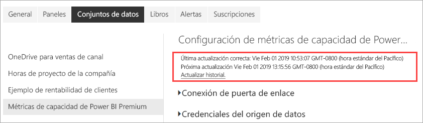

# Supervisión de capacidades Premium con la aplicación

La supervisión de las capacidades es esencial para tomar decisiones fundamentadas sobre el uso óptimo de los recursos de capacidad Premium. Puede supervisar la capacidad en el portal de administración o con la aplicación **Power BI Premium Capacity Metrics**. En este artículo se describe el uso de la aplicación Premium Capacity Metrics. La aplicación proporciona la información más detallada del rendimiento de las capacidades. Para obtener una introducción de nivel superior del promedio de métricas de uso durante los últimos siete días, puede usar el portal de administración. Para obtener más información sobre la supervisión en el portal, vea [Supervisión de capacidades Premium en el portal de administración](service-admin-premium-monitor-portal.md).

La aplicación se actualiza periódicamente con nuevas características y funcionalidades. Asegúrese de ejecutar la versión más reciente. Si ya tiene instalada una versión anterior de la aplicación, se recomienda eliminarla de las aplicaciones y, después, presionar CTRL+F5 para actualizar.

## Instalación de la aplicación

Puede ir directamente a la [aplicación Premium Capacity Metrics](https://app.powerbi.com/groups/me/getapps/services/capacitymetrics), o bien instalarla como hace con otras aplicaciones en Power BI.

1. En Power BI, haga clic en **Aplicaciones**.

    

2. En el lado derecho, haga clic en **Obtener aplicaciones**.
3. En la categoría **Aplicaciones**, busque **Power BI Premium Capacity Metrics**.
4. Suscríbase para instalar la aplicación.

Tenga paciencia. La instalación y actualización de las métricas tarda unos minutos. Si la aplicación muestra las métricas en blanco, presione F5 para actualizar el explorador.

## Obtención del historial de actualización de la aplicación

Para comprobar la última vez que se ha actualizado la aplicación Premium Capacity Metrics, haga clic en **Configuración** > **Conjuntos de datos** > **Power BI Premium Capacity Metrics** > **Historial de actualización**. 

Se muestra la última actualización, o bien haga clic en **Actualizar historial** para ver las actualizaciones programadas y a petición.

## Supervisión de capacidades con la aplicación

Ahora que ha instalado la aplicación, puede ver las métricas para las capacidades de la organización. La aplicación proporciona un Panel con resúmenes de métricas e Informes de métricas detallados.

### Panel

Para ver un panel donde se resuman las métricas clave de las capacidades para las que es administrador, en **Paneles**, haga clic en **Métricas de capacidad de Power BI Premium**. Aparece un panel.

En el panel se incluyen las métricas siguientes:

#### Top

| Métrica | Descripción |
| --- | --- |
| Versión | Versión de la aplicación. | 
| Capacidades | Número de capacidades para las que es administrador. | 
| Áreas de trabajo | Número de áreas de trabajo de las capacidades que proporcionan métricas.|
|||

#### Resumen del sistema

| Métrica | Descripción |
| --- | --- |
| Capacidad de uso más alto de la CPU | Capacidad con el número máximo de veces que la CPU superó el 80 % de los umbrales en los últimos siete días. |
| Recuento de uso más alto de la CPU | Número de veces que la capacidad con nombre superó el 80 % de los umbrales en los últimos siete días. | 
| Capacidad de uso máximo de memoria | Capacidad con el número máximo de veces que el límite de memoria máximo se alcanzó en los últimos siete días, segmentados en depósitos de tres minutos.  |
| Recuento de uso máximo de memoria| Número de veces que la capacidad con nombre alcanzó el límite de memoria máximo en los últimos siete días, segmentados en depósitos de tres minutos. |
|||

#### Resumen del conjunto de datos

| Métrica | Descripción |
| --- | --- |
| Conjuntos de datos | Número total de conjuntos de datos en todas las áreas de trabajo de las capacidades.|
| Tamaño promedio de los conjuntos de datos (MB) | Tamaño promedio de los conjuntos de datos en todas las áreas de trabajo de las capacidades.|  
| Recuento cargado promedio de los conjuntos de datos | Recuento promedio de los conjuntos de datos cargados en memoria. |  
| Conjuntos de datos: promedio de conjuntos de datos activos (%)| Promedio de conjuntos de datos activos en los últimos siete días. Un conjunto de datos se define como activo si el usuario ha interactuado con los objetos visuales en los últimos tres minutos. |
| CPU: consumo máximo de los conjuntos de datos (%)| Consumo de CPU máximo por carga de trabajo de conjunto de datos en los últimos siete días. |
| CPU: promedio de los conjuntos de datos (%)| Consumo promedio de CPU por carga de trabajo de conjunto de datos en los últimos siete días. |
| Memoria: promedio de los conjuntos de datos (GB) | Consumo promedio de memoria por carga de trabajo de conjunto de datos en los últimos siete días. |
| Memoria: consumo máximo de los conjuntos de datos (GB) | Consumo de memoria máximo por carga de trabajo de conjunto de datos en los últimos siete días.|
| Expulsiones de los conjuntos de datos | Número total de conjuntos de datos expulsados debido a la presión de memoria. |
| Recuento de uso alto de conexiones dinámicas y DirectQuery| Número de veces que las conexiones dinámicas y DirectQuery superaron el 80 % de los umbrales en los últimos siete días, segmentados en depósitos de tres minutos. |
| Recuento de uso máximo de conexiones dinámicas y DirectQuery| Número mayor de veces que las conexiones dinámicas y DirectQuery superaron el 80 % en los últimos siete días, segmentados en depósitos de una hora. |
| Uso alto máximo de conexiones dinámicas y DirectQuery | Número de veces máximo que las conexiones dinámicas y DirectQuery superaron el 80 % de los umbrales en los últimos siete días, segmentados en depósitos de tres minutos.|
| Hora de realización máxima de las conexiones dinámicas y DirectQuery | Hora en UTC en que las conexiones dinámicas y DirectQuery superaron el 80 % más veces en una hora. |
| Total de actualizaciones | Número total de actualizaciones en los últimos siete días. |
| Confiabilidad de la actualización (%) | Número de actualizaciones correctas dividido entre el número total de actualizaciones en los últimos siete días. |
| Promedio de duración de las actualizaciones (minutos) | Cantidad de tiempo promedio para completar la actualización. |
| Tiempo promedio de espera de las actualizaciones (minutos)| Cantidad de tiempo promedio antes del inicio de la actualización. |
| Total de consultas |  Número total de consultas ejecutadas en los últimos siete días. |
| Recuento de espera total de consultas | Número total de consultas que tuvieron que esperar antes de ejecutarse. |
| Duración promedio de las consultas (MS) | Tiempo promedio empleado para completar las consultas. |
| Tiempo promedio de espera de las consultas (MS) | Tiempo promedio que esperaron las consultas en los recursos del sistema antes de ejecutarse. |
|||

#### Resumen del flujo de datos

| Métrica | Descripción |
| --- | --- |
| Flujos de datos |  Número total de flujos de datos en todas las áreas de trabajo de las capacidades.|
| Total de actualizaciones | Número total de actualizaciones en los últimos siete días.|  
| Promedio de duración de las actualizaciones (minutos) | El tiempo empleado para completar la actualización. |
| Tiempos promedio de espera de las actualizaciones (minutos) | El retraso entre el tiempo programado y el inicio real de la actualización.|
| CPU: consumo máximo de los flujos de datos (%) | Consumo de CPU máximo por carga de trabajo de flujos de datos en los últimos siete días. |
| CPU: promedio de los flujos de datos (%) | Consumo promedio de CPU por carga de trabajo de flujos de datos en los últimos siete días. |
| Memoria: consumo máximo de los flujos de datos (GB) | Consumo de memoria máximo por carga de trabajo de flujos de datos en los últimos siete días. |
| Memoria: promedio de los flujos de datos (GB) | Consumo promedio de memoria por carga de trabajo de flujos de datos en los últimos siete días. |
|||

#### Resumen de informe paginado

| Métrica | Descripción |
| --- | --- |
| Informes paginados |  Número total de informes paginados en todas las áreas de trabajo de las capacidades. |
| Total de vistas | Número total de veces que los usuarios han visto todos los informes. | 
| Total de filas | Número total de filas de datos que hay en todos los informes.|
| Tiempo total | Tiempo total necesario para que se completen todas las fases (recuperación, procesamiento y representación de datos) de todos los informes, expresado en milisegundos. |
| CPU: consumo máximo de los informes paginados (%) | Consumo de CPU máximo por carga de trabajo de informes paginados en los últimos siete días. |
| CPU: promedio de los informes paginados (%) | Consumo promedio de CPU por carga de trabajo de informes paginados en los últimos siete días. |
| Memoria: consumo máximo de los informes paginados (GB) | Consumo de memoria máximo por carga de trabajo de informes paginados en los últimos siete días. |
| Memoria: promedio de los informes paginados (GB) | Consumo promedio de memoria por carga de trabajo de informes paginados en los últimos siete días. |
|||

#### Resumen de IA

| Métrica | Descripción |
| --- | --- |
| Ejecución de la función de inteligencia artificial | Número total de ejecuciones en los últimos siete días. |
| Confiabilidad de la ejecución de la función de inteligencia artificial (%) | Número de ejecuciones correctas dividido entre el número total de ejecuciones en los últimos siete días. |
| Máximo de CPU (%)| Consumo de CPU máximo por la carga de trabajo de IA en los últimos siete días. |
| Máximo de memoria (GB) | Consumo de memoria máximo por la carga de trabajo de IA en los últimos siete días.|
| Tiempo de espera máximo de ejecución de la función de inteligencia artificial (MS) | Cantidad de tiempo máxima antes del inicio de la ejecución. |
| Tiempo promedio de espera de ejecución de la función de inteligencia artificial (MS)| Cantidad de tiempo promedio antes del inicio de la ejecución. |
| Duración máxima de ejecución de la función de inteligencia artificial (MS) | Cantidad de tiempo máxima para completar la ejecución. |
| Duración promedio de ejecución de la función de inteligencia artificial (MS)| Cantidad de tiempo promedio para completar la ejecución. |
| | |

### Informes

Los informes proporcionan métricas más detalladas. Para ver informes de las capacidades para las que es administrador, en **Informes**, haga clic en **Métricas de capacidad de Power BI Premium**. O bien, desde el panel, haga clic en una celda de métrica para ir al informe subyacente. 

En la parte inferior del informe, hay cinco *pestañas*:

[**Conjuntos de datos**](#datasets): proporciona métricas detalladas sobre el mantenimiento de los conjuntos de datos de Power BI dentro de las capacidades.
[**Informes paginados**](#paginated-reports): proporciona métricas detalladas sobre el mantenimiento de los informes paginados dentro de las capacidades.
[**Flujos de datos**](#dataflows): proporciona métricas de actualización detalladas de los flujos de datos dentro de las capacidades.
[**AI**](#ai) (IA): proporciona métricas detalladas sobre el estado de las funciones de inteligencia artificial que se usan en las capacidades.
[**Consumo de recursos**](#resource-consumption): proporciona métricas de recursos detalladas, incluidos el uso elevado de memoria y CPU.
[**Identificadores e información**](#ids-and-info): nombres, identificadores y propietarios de las capacidades, las áreas de trabajo y las cargas de trabajo.

Cada pestaña abre una página donde puede filtrar las métricas por capacidad e intervalo de fechas. Si no se selecciona ningún filtro, en el informe se muestran de forma predeterminada las métricas de la semana pasada de todas las capacidades que proporcionan métricas. 

### Conjuntos de datos

La página Conjuntos de datos cuenta con diferentes *áreas*, entre las que se incluyen **Actualizaciones**, **Duraciones de consulta**, **Tiempos de espera de consulta** y **Conjuntos de datos**. Utilice los botones de la parte superior de la página para desplazarse a las distintas áreas.

#### Pestaña Refreshes (Actualizaciones)

| Sección del informe | Métricas |
| --- | --- |
| Actualizaciones |  Recuento total: actualizaciones totales de cada conjunto de datos.   Confiabilidad: el porcentaje de las actualizaciones que se han completado para cada conjunto de datos.   Promedio de tiempo de espera: el retraso medio entre la hora programada y el inicio de una actualización del conjunto de datos, en minutos.   Tiempo de espera máximo: tiempo de espera máximo del conjunto de datos, en minutos.   Duración media: duración media de la actualización del conjunto de datos, en minutos.   Duración máxima: duración de la actualización de ejecución más larga del conjunto de datos, en minutos. |
| Cinco conjuntos de datos principales por duración promedio (minutos) |  Los cinco conjuntos de datos con la duración promedio de actualización más larga, en minutos. |
| Cinco conjuntos de datos principales por tiempo de espera promedio (minutos) |  Los cinco conjuntos de datos con el tiempo de espera promedio de actualización más largo, en minutos. |
| Recuento de actualización cada hora y consumo de memoria (GB) |  Ejecuciones correctas, con errores y consumo de memoria, segmentadas en depósitos de una hora, notificadas en la hora UTC. |
| Tiempos de espera de actualización promedio por hora (minutos) |  El tiempo promedio de espera de actualización, segmentado en depósitos horarios, notificados en la hora UTC. Varios picos con tiempos de espera de actualización largos son indicativos de un alto uso de la capacidad. |
|  |  |

#### Área de duraciones de consultas

| Sección del informe | Métricas |
| --- | --- |
| Duraciones de consulta |  Los datos de esta sección se segmentan por conjuntos de datos, área de trabajo y depósitos por hora en los siete últimos días.   Total: número total de consultas ejecutadas para el conjunto de datos.   Promedio: duración media de consulta del conjunto de datos, en milisegundos.   Máximo: duración de la consulta de ejecución más larga del conjunto de datos, en milisegundos.|
| Distribución de la duración de consulta |  El histograma de la duración de consulta se divide en duraciones de consulta (en milisegundos) en las categorías siguientes: 30 ms, 30-100 ms, 100-300 ms, 300 ms-1 s, 1 s-3 s, 3 s-10 s, 10 s-30 s, e intervalos de > 30 segundos. Las duraciones de consulta y los tiempos de espera largos son indicativos de un alto uso de la capacidad. También puede significar que un único conjunto de datos está causando problemas y es necesario seguir investigando. |
| Cinco conjuntos de datos principales por duración promedio |  Los cinco conjuntos de datos con la duración promedio de consulta más larga, en milisegundos. |
| Distribuciones por horas de la duración de consulta |  Los recuentos de consulta y la duración media (en milisegundos) frente al consumo de memoria en GB, segmentados en depósitos horarios notificados en la hora UTC. |
| Conexiones dinámicas y DirectQuery (utilización > 80 %) |  Las veces que una conexión dinámica o DirectQuery superó el 80 % de utilización de la CPU, segmentadas en depósitos horarios notificados en la hora UTC. |
|  |  |

#### Área Tiempo de espera de consultas

| Sección del informe | Métricas |
| --- | --- |
| Tiempos de espera de consulta |  Los datos de esta sección se segmentan por conjuntos de datos, área de trabajo y depósitos por hora en los siete últimos días.   Total: número total de consultas ejecutadas para el conjunto de datos.   Recuento de espera: número de consultas del conjunto de datos que estuvieron en espera en los recursos del sistema antes de iniciar la ejecución.   Promedio: tiempo de espera de consulta promedio del conjunto de datos, en milisegundos.   Máximo: duración de la consulta con un tiempo de espera más largo en el conjunto de datos, en milisegundos.|
| Cinco conjuntos de datos principales por tiempo de espera promedio |  Los cinco conjuntos de datos con el tiempo de espera promedio más largo para iniciar la ejecución de una consulta, en milisegundos. |
| Distribuciones del tiempo de espera |  El histograma de la duración de consulta se segmenta por las duraciones de consulta (en milisegundos) en las categorías siguientes: <= 50 ms, 50-100 ms, 100-200 ms, 200-400 ms 400 ms-1s, 1 s-5 s e intervalos de > 5 segundos. |
| Distribuciones del tiempo de espera de consulta por hora |  Recuentos de los tiempos de espera de las consultas y el tiempo de espera medio (en milisegundos) frente al consumo de memoria en GB, segmentados en depósitos horarios notificados en la hora UTC. |
|  |  |

#### Área Datasets (Conjuntos de datos)

| **Sección de informe** | **Metrics** (Métricas) |
| --- | --- |
| Tamaños del conjunto de datos  |  Tamaño máximo: tamaño máximo del conjunto de datos en MB durante el período que se muestra. |
| Recuentos de expulsiones del conjunto de datos |  Total: número total de *expulsiones* del conjunto de datos para cada capacidad. Cuando una funcionalidad sufre la presión de la memoria, el nodo expulsa uno o varios conjuntos de datos de la memoria. Los conjuntos de datos que están inactivos (sin ninguna operación de consulta o actualización ejecutándose actualmente) se expulsan primero. A continuación, el orden de expulsión se basa en una medida de tipo LRU (el menos usado recientemente).|
| Recuentos de conjuntos de datos cargados por hora |  Número de conjuntos de datos cargados en memoria frente al consumo de memoria en GB, segmentados en depósitos horarios notificados en la hora UTC. |
| Consumo de memoria y expulsiones de conjuntos de datos por horas |  Expulsiones de conjuntos de datos frente a consumo de memoria en GB, segmentados en depósitos horarios notificados en la hora UTC. |
| Porcentajes de memoria consumida |  Total de conjuntos de datos activos en memoria como un porcentaje del total de memoria. La diferencia entre Activos y Todos define los conjuntos de datos que se pueden expulsar. Se muestra cada hora, para los siete días anteriores. |
|  |  |

### Informes paginados

| **Sección de informe** | **Metrics** (Métricas) |
| --- | --- |
| Uso general |  Número total de vistas: número de veces que los usuarios han visualizado el informe.   Recuento de filas: número de filas de datos que hay en el informe.   Recuperación (promedio): cantidad media de tiempo que se tarda en recuperar los datos del informe, en milisegundos. Las duraciones largas pueden indicar consultas lentas u otros problemas del origen de datos.    Procesamiento (promedio): cantidad media de tiempo que se tarda en procesar los datos de un informe, en milisegundos.  Representación (promedio): cantidad media de tiempo que se tarda en representar un informe en el explorador, en milisegundos.   Tiempo total: tiempo necesario para todas las fases del informe, en milisegundos. |
| Cinco informes principales por tiempo promedio de recuperación de datos |  Los cinco informes con el tiempo medio de recuperación de datos más largo, en milisegundos. |
| Tiempo medio de procesamiento de informes en los cinco informes principales |  Los cinco informes con el tiempo medio de procesamiento de informes más largo, en milisegundos. |
| Resultados por hora |  Ejecuciones correctas, con errores y consumo de memoria, segmentadas en depósitos de una hora, notificadas en la hora UTC. |
| Duraciones por hora |  Tiempo de recuperación de datos frente al tiempo de procesamiento y representación, segmentado en depósitos horarios notificados en la hora UTC. |
|  |  |

### Flujos de datos

| **Sección de informe** | **Metrics** (Métricas) |
| --- | --- |
| Actualizaciones |  Total: número total de actualizaciones de cada flujo de datos.   Confiabilidad: el porcentaje de las actualizaciones que se han completado para cada flujo de datos.   Promedio de tiempo de espera: retraso medio entre la hora programada y el inicio de una actualización del flujo de datos, en minutos.   Tiempo de espera máximo: tiempo de espera máximo del flujo de datos, en minutos.   Duración media: duración media de la actualización del flujo de datos, en minutos.   Duración máxima: duración de la actualización de ejecución más larga del flujo de datos, en minutos. |
| Duración promedio de la actualización de los cinco flujos de datos principales |  Los cinco flujos de datos con la duración promedio de actualización más larga, en minutos. |
| Cinco flujos de datos principales por tiempo de espera promedio |  Los cinco flujos de datos con el tiempo de espera promedio de actualización más largo, en minutos. |
| Tiempos de espera de actualización promedio por hora |  El tiempo promedio de espera de actualización, segmentado en depósitos horarios, notificados en la hora UTC. Varios picos con tiempos de espera de actualización largos son indicativos de un alto uso de la capacidad. |
| Recuento de actualización cada hora y consumo de memoria |  Ejecuciones correctas, con errores y consumo de memoria, segmentadas en depósitos de una hora, notificadas en la hora UTC. |
|  |  |

### INTELIGENCIA ARTIFICIAL

| **Sección de informe** | **Metrics** (Métricas) |
| --- | --- |
| Consumo de memoria de IA | Consumo de memoria en GB, segmentado en depósitos horarios notificados en la hora UTC. |
| Ejecución de la función de inteligencia artificial cada hora y tiempo promedio de espera | Ejecuciones de IA y tiempo promedio de espera (en milisegundos) segmentados en depósitos horarios notificados en la hora UTC. |
| Uso general | Recuento total: número de funciones de IA en un área de trabajo o flujo de datos.   Confiabilidad del sistema: porcentaje de ejecuciones que se han completado.  Promedio Tiempo de espera: el retraso medio entre la hora programada y el inicio de una ejecución, en milisegundos.  Tiempo de espera máximo: el tiempo de espera máximo, en milisegundos.  Promedio Duración: la duración media de una ejecución, en milisegundos.  Duración máxima: duración de la ejecución más larga, en milisegundos.  Tamaño total promedio: el tamaño promedio, en bytes, de los datos de entrada y salida para la función de IA. |
| | |

### Consumo de recursos

| **Sección de informe** | **Metrics** (Métricas) |
| --- | --- |
| Consumo de CPU |  Consumo de carga de trabajo como porcentaje de la capacidad total de CPU. Se muestra cada hora, para los siete días anteriores. |
| Consumo de memoria |  Consumo de memoria máximo durante la hora en GB por carga de trabajo (líneas continuas) superpuesto con los límites de la carga de trabajo (línea de puntos). Se muestra cada hora, para los siete días anteriores. |
|  |  |

### Identificadores e información

La pestaña **Identificadores e información** contiene áreas para **Capacidades**, **Áreas de trabajo**, **Conjuntos de datos**, **Informes paginados** y **Flujos de datos**.

#### Área de capacidades

| Sección del informe | Métricas |
| --- | --- |
| Información de carga de trabajo y SKU | Configuración de carga de trabajo y SKU para la capacidad. |
| Administradores | Nombres de administradores para la capacidad. |
|||

#### Áreas de trabajo

| Sección del informe | Métricas |
| --- | --- |
| Áreas de trabajo | Nombres e identificadores para todas las áreas de trabajo. |
|||

#### Área Datasets (Conjuntos de datos)

| Sección del informe | Métricas |
| --- | --- |
| Conjuntos de datos | Nombres e identificadores de área de trabajo para todos los conjuntos de datos. |
|||

#### Área de informes paginados

| Sección del informe | Métricas |
| --- | --- |
| Informes paginados | Nombres, nombres de área de trabajo e identificadores para todos los informes paginados. |
|||

#### Área de flujos de datos

| Sección del informe | Métricas |
| --- | --- |
| Flujos de datos | Nombres de flujo de datos, nombres de área de trabajo e identificadores para todos los flujos de datos. |
|||

## Supervisión de capacidades de Power BI Embedded

Puede usar la aplicación Power BI Premium Capacity Metrics para supervisar las capacidades de *SKU A* en Power BI Embedded. Esas capacidades se mostrarán en el informe siempre y cuando sea administrador de la capacidad. Sin embargo, la actualización del informe producirá un error si no concede determinados permisos a Power BI en sus SKU A:

1. Abra su capacidad en Azure Portal.

1. Haga clic en **Control de acceso (IAM)** y, a continuación, agregue la aplicación **Power BI Premium** al rol de lector. Si no puede encontrar la aplicación por el nombre, también puede agregarla por el identificador de cliente: `cb4dc29f-0bf4-402a-8b30-7511498ed654`.

    

> [!NOTE]
> Puede supervisar el uso de capacidades de Power BI Embedded en la aplicación o en Azure Portal, pero no en el Portal de administración de Power BI.

## Pasos siguientes

> [!div class="nextstepaction"]
> [Optimización de las capacidades de Power BI Premium](service-premium-capacity-optimize.md)
