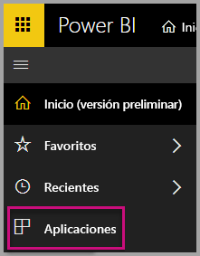
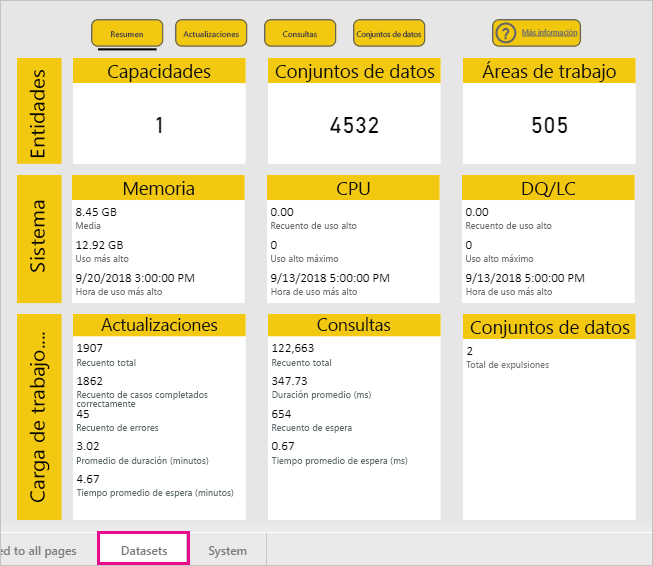
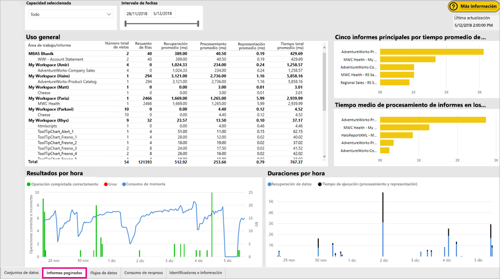
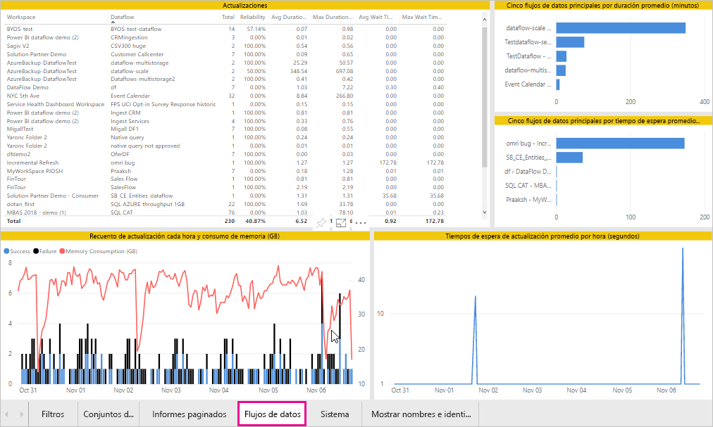
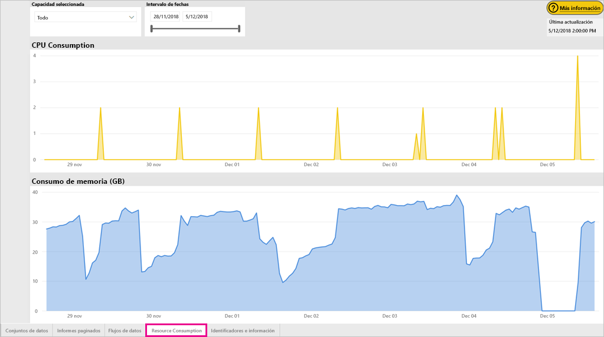
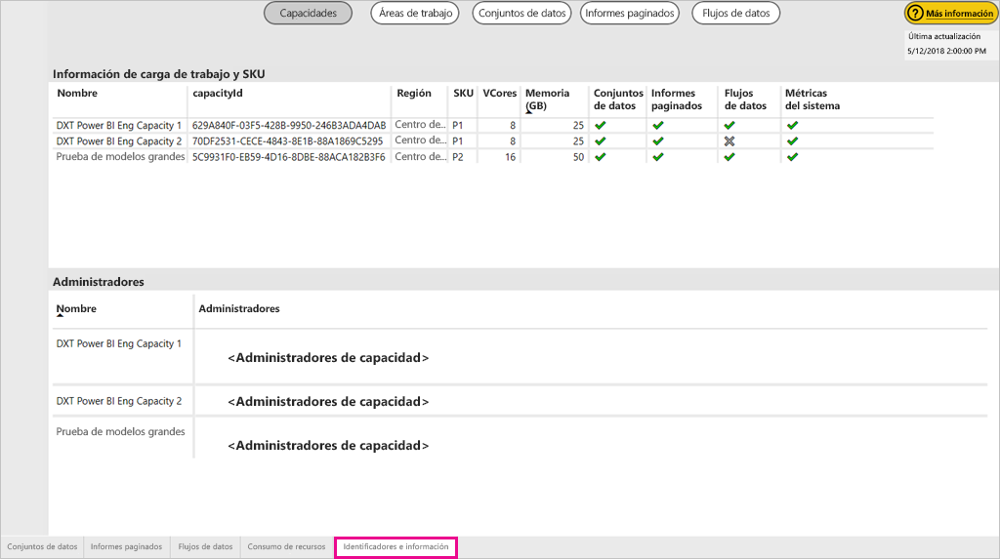
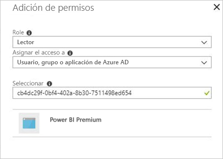

# Supervisión de las capacidades de Power BI Premium y Power BI Embedded

En este artículo se proporciona información general sobre la supervisión de las métricas de las capacidades de Power BI Premium. La supervisión del uso de la capacidad le permite adoptar un enfoque fundamentado para administrar sus capacidades.

Puede supervisar la capacidad con la aplicación Premium Capacity Metrics o en el Portal de administración. Aunque en este artículo se tratan las dos opciones, se recomienda la aplicación porque proporciona muchos más detalles.

**La versión actual de la aplicación es la 1.10, publicada el 13 de diciembre de 2018.**

.

<iframe width="560" height="315" src="https://www.youtube.com/embed/UgsjMbhi_Bk?rel=0&amp;showinfo=0" frameborder="0" allowfullscreen></iframe>

## Instalación de la aplicación Premium Capacity Metrics

Puede ir directamente a la [aplicación Premium Capacity Metrics](https://app.powerbi.com/groups/me/getapps/services/capacitymetrics) o instalarla como hace con otras aplicaciones en Power BI.

1. En Power BI, haga clic en **Aplicaciones**.

    

1. En el lado derecho, haga clic en **Obtener aplicaciones**.

1. En la categoría **Aplicaciones**, busque **Power BI Premium Capacity Metrics**.

1. Suscríbase para instalar la aplicación.

Ahora que ha instalado la aplicación, puede ver las métricas sobre las capacidades de su organización. Echemos un vistazo a algunas de las métricas principales que están disponibles.

## Uso de la aplicación de métricas

### Panel de métricas

Cuando se abre la aplicación, primero se muestra un panel con un resumen de todas las capacidades para las que tiene derechos de administrador.

El panel incluye las siguientes métricas.

| **Sección de informe** | **Metrics** (Métricas) |
| --- | --- |
| **Resumen del sistema** | * Versión de la aplicación.  * Número de capacidades para las que es administrador.  * Número de áreas de trabajo de sus capacidades que proporcionan métricas.  * Consumo medio de memoria en GB durante los últimos siete días.  * Consumo máximo de memoria en GB durante los últimos siete días.  * Hora local en la que se produjo el consumo máximo de memoria.  * Número de veces que la CPU superó el 80 % de los umbrales en los últimos siete días, dividido en cubos de tres minutos.  * Número mayor de veces que la CPU superó el 80 % en los últimos siete días, dividido en cubos de una hora.  * Hora local en la que la CPU excedió el 80 % más veces en una hora. |
| **Resumen del conjunto de datos** | * Número de conjuntos de datos en todas las áreas de trabajo de sus capacidades.  * Número de veces que las conexiones dinámicas y consultas directas superaron el 80 % de los umbrales en los últimos siete días, dividido en cubos de tres minutos.  * Número mayor de veces que Direct Query o las conexiones dinámicas superaron el 80 % en los últimos siete días, dividido en cubos de una hora.  * Hora local en que Direct Query o las conexiones dinámicas superaron el 80 % más veces en una hora.  * Número total de actualizaciones en los últimos siete días.  * Tiempo de espera medio de actualización: retraso medio entre la hora programada y el inicio de la actualización, en minutos.  * Duración media de actualización: tiempo necesario para completar la operación, en minutos.  * Número total de consultas ejecutadas en los últimos siete días.  * Promedio de tiempo de espera de consulta: tiempo de espera de una consulta en los recursos del sistema antes de iniciar su ejecución, en milisegundos.  * Duración media de consulta: tiempo necesario para completar la consulta, en milisegundos.  * Número total de modelos expulsados debido a la presión de memoria.  * Tamaño promedio de los conjuntos de datos   * Recuento promedio de los conjuntos de datos cargados en memoria |
| **Resumen del flujo de datos** | * Número de flujos de datos en todas las áreas de trabajo de sus capacidades.  * Número total de actualizaciones en los últimos siete días.  * Tiempo de espera medio de actualización: retraso medio entre la hora programada y el inicio de la actualización, en minutos.  * Duración media de actualización: tiempo necesario para completar la operación, en minutos. |
| **Resumen de informe paginado** | * Número de informes paginados en todas las áreas de trabajo de sus capacidades.  * Número total de veces que los usuarios han visto todos los informes.  * Número total de filas de datos que hay en todos los informes.  * Tiempo total necesario para que se completen todas las fases (recuperación de datos, procesamiento y representación) de todos los informes, expresado en milisegundos. |
|  |  |

### Informe de métricas

Haga clic en el panel para ir al informe subyacente. El informe tiene cinco pestañas que se describen con más detalle en las secciones siguientes.

* **Conjuntos de datos**: proporciona métricas detalladas sobre el estado de los conjuntos de datos de Power BI dentro de las funcionalidades.

* **Informes paginados**: proporciona métricas detalladas sobre el mantenimiento de los informes paginados dentro de sus capacidades.

* **Flujos de datos**: ofrece métricas de actualización detalladas de los flujos de datos dentro de sus funcionalidades.

* **Consumo de recursos**: ofrece métricas de capacidad total, incluidos el uso elevado de memoria y CPU.

* **Identificadores e información**: nombres, identificadores y propietarios de las capacidades, las áreas de trabajo y las cargas de trabajo.

En cada pestaña, puede filtrar las métricas por capacidad e intervalo de fechas. Si no se selecciona ningún filtro, en el informe se muestran de forma predeterminada las métricas de la semana pasada de todas las capacidades que proporcionan métricas.

#### Pestaña Conjuntos de datos

Utilice los botones de la parte superior de la pestaña **Conjuntos de datos** para desplazarse a las distintas áreas: **Resumen**, **Actualizaciones**, **Duraciones de consulta**, **Tiempos de espera de consulta** y **Conjuntos de datos**.

##### Pestaña Refreshes (Actualizaciones)

El área **Actualizaciones** contiene las siguientes métricas.

| **Sección de informe** | **Metrics** (Métricas) |
| --- | --- |
| **Confiabilidad de la actualización** | * Recuento total: actualizaciones totales de cada conjunto de datos.  * Confiabilidad: el porcentaje de las actualizaciones que se han completado para cada conjunto de datos.  * Promedio de tiempo de espera: el retraso medio entre la hora programada y el inicio de una actualización del conjunto de datos, en minutos.  * Tiempo de espera máximo: tiempo de espera máximo del conjunto de datos, en minutos.   * Duración media: duración media de la actualización del conjunto de datos, en minutos.  * Duración máxima: duración de la actualización de ejecución más larga del conjunto de datos, en minutos. |
| **Duración promedio de la actualización de los cinco conjuntos de datos principales** | * Los cinco conjuntos de datos con la duración promedio de actualización más larga, en minutos. |
| **Tiempo promedio de espera de los cinco conjuntos de datos principales** | * Los cinco conjuntos de datos con el tiempo de espera promedio de actualización más largo, en minutos. |
| **Tiempos de espera de actualización promedio por hora** | * El tiempo promedio de espera de actualización, dividido en fragmentos de horas, notificado en la hora local. Varios picos con tiempos de espera de actualización largos son indicativos de un alto uso de la capacidad. |
| **Recuento de actualización cada hora y consumo de memoria** | * Ejecuciones correctas, con errores y consumo de memoria, con divisiones en fragmentos por horas, notificadas en la hora local. |
|  |  |

##### Área de duraciones de consultas

El área **Duraciones de consulta** contiene las siguientes métricas.

| **Sección de informe** | **Metrics** (Métricas) |
| --- | --- |
| **Duraciones de consulta** | * Los datos de esta sección se segmentan por conjuntos de datos, área de trabajo y cubos por hora en los siete últimos días.  * Total: número total de consultas ejecutadas para el conjunto de datos.  * Promedio: duración media de consulta del conjunto de datos, en milisegundos.  * Máximo: duración de la consulta de ejecución más larga del conjunto de datos, en milisegundos.|
| **Distribución de la duración de consulta** | * El histograma de la duración de consulta está dividido en duraciones de consulta (en milisegundos) en las siguientes categorías: 30 ms, 30-100 ms, 100-300 ms, 300 ms-1 s, 1 s-3 s, 3 s-10 s, 10 s-30 s, e intervalos de > 30 segundos. Las duraciones de consulta y los tiempos de espera largos son indicativos de un alto uso de la capacidad. También puede significar que un único conjunto de datos está causando problemas y es necesario seguir investigando. |
| **Duración promedio de los cinco conjuntos de datos principales** | * Los cinco conjuntos de datos con la duración promedio de consulta más larga, en milisegundos. |
| **Consulta directa / Conexiones dinámicas (utilización > 80 %)** | * Las veces que una consulta directa o una conexión dinámica excedieron el 80 % de utilización de la CPU, con una segmentación en depósitos horarios notificados en la hora local. |
| **Distribución por horas de la duración de consulta** | * Los recuentos de consulta y la duración media (en milisegundos) frente al consumo de memoria en GB, segmentados en depósitos horarios notificados en la hora local. |
|  |  |

##### Área Tiempo de espera de consultas

El área **Esperas de consulta** contiene las siguientes métricas.

| **Sección de informe** | **Metrics** (Métricas) |
| --- | --- |
| **Tiempos de espera de consulta** | * Los datos de esta sección se segmentan por conjuntos de datos, área de trabajo y cubos por hora en los siete últimos días.  * Total: número total de consultas ejecutadas para el conjunto de datos.  * Recuento de espera: número de consultas del conjunto de datos que estuvieron en espera en los recursos del sistema antes de iniciar la ejecución.   * Promedio: tiempo de espera de consulta promedio del conjunto de datos, en milisegundos.  * Máximo: duración de la consulta con un tiempo de espera más largo en el conjunto de datos, en milisegundos.|
| **Distribución del tiempo de espera** | * El histograma de la duración de consulta está dividido en las duraciones de consulta (en milisegundos) en las siguientes categorías: <= 50 ms, 50-100 ms, 100-200 ms, 200-400 ms 400 ms-1s, 1 s-5 s e intervalos de > 5 segundos. |
| **Tiempo promedio de espera de los cinco conjuntos de datos principales** | * Los cinco conjuntos de datos con el tiempo de espera promedio más largo para iniciar la ejecución de una consulta, en milisegundos. |
| **Horas y recuento de espera de consulta por hora** | * Recuentos de los tiempos de espera de las consultas y el tiempo de espera medio (en milisegundos) frente al consumo de memoria en GB, segmentados en depósitos horarios notificados en la hora local. |
|  |  |

##### Área Datasets (Conjuntos de datos)

El área **Conjuntos de datos** contiene las siguientes métricas.

| **Sección de informe** | **Metrics** (Métricas) |
| --- | --- |
| **Recuentos de expulsiones del conjunto de datos** | * Total: número total de *expulsiones* del conjunto de datos para cada capacidad. Cuando una funcionalidad sufre la presión de la memoria, el nodo expulsa uno o varios conjuntos de datos de la memoria. Los conjuntos de datos que están inactivos (sin ninguna operación de consulta o actualización ejecutándose actualmente) se expulsan primero. A continuación, el orden de expulsión se basa en una medida de tipo LRU (el menos usado recientemente).|
| **Consumo de memoria y expulsiones de conjuntos de datos por horas** | * Expulsiones de conjuntos de datos frente a consumo de memoria en GB, con divisiones en fragmentos por horas, notificadas en la hora local. |
| **Recuentos de conjuntos de datos cargados por hora** | * Número de conjuntos de datos cargados en memoria frente al consumo de memoria en GB, con divisiones en fragmentos por horas, notificadas en la hora local |
| **Tamaños de datos**  | * Tamaño máximo: tamaño máximo del conjunto de datos en MB durante el período que se muestra. |
|  |  |

#### Pestaña Informes paginados

En la pestaña **Informes paginados** se muestran métricas detalladas sobre el estado de los informes paginados dentro de sus funcionalidades.

La pestaña **Informes paginados** contiene las siguientes métricas.

| **Sección de informe** | **Metrics** (Métricas) |
| --- | --- |
| **Uso general** | * Número total de vistas: número de veces que los usuarios han visualizado el informe.  * Recuento de filas: número de filas de datos que hay en el informe.  * Recuperación (promedio): cantidad media de tiempo que se tarda en recuperar los datos del informe, en milisegundos. Las duraciones largas pueden indicar consultas lentas u otros problemas del origen de datos.   * Procesamiento (promedio): cantidad media de tiempo que se tarda en procesar los datos de un informe, en milisegundos. * Representación (promedio): cantidad media de tiempo que se tarda en representar un informe en el explorador, en milisegundos.  * Tiempo total: tiempo necesario para todas las fases del informe, en milisegundos.|
| **Tiempo medio de recuperación de datos de los cinco informes principales** | * Los cinco informes con el tiempo medio de recuperación de datos más largo, en milisegundos. |
| **Tiempo medio de procesamiento de informes en los cinco informes principales** | * Los cinco informes con el tiempo medio de procesamiento de informes más largo, en milisegundos. |
| **Duraciones por hora** | * Tiempo de recuperación de datos frente al tiempo de procesamiento y representación, dividido en fragmentos de hora, notificado en la hora local. |
| **Resultados por hora** | * Ejecuciones correctas, con errores y consumo de memoria, con divisiones en fragmentos por horas, notificadas en la hora local. |
|  |  |

#### Pestaña Flujos de datos

La pestaña **Flujos de datos** muestra métricas de actualización detalladas de los flujos de datos dentro de las funcionalidades.

La pestaña **Flujos de datos** contiene las siguientes métricas.

| **Sección de informe** | **Metrics** (Métricas) |
| --- | --- |
| **Actualizar** | * Total: número total de actualizaciones de cada flujo de datos.  * Confiabilidad: el porcentaje de las actualizaciones que se han completado para cada flujo de datos.  * Promedio de tiempo de espera: retraso medio entre la hora programada y el inicio de una actualización del conjunto de datos, en minutos.  * Tiempo de espera máximo: tiempo de espera máximo del flujo de datos, en minutos.   * Duración media: duración media de la actualización del flujo de datos, en minutos.  * Duración máxima: duración de la actualización de ejecución más larga del flujo de datos, en minutos. |
| **Duración promedio de la actualización de los cinco flujos de datos principales** | * Los cinco flujos de datos con la duración promedio de actualización más larga, en minutos. |
| **Tiempo promedio de espera de los cinco flujos de datos principales** | * Los cinco flujos de datos con el tiempo de espera promedio de actualización más largo, en minutos. |
| **Tiempos de espera de actualización promedio por hora** | * El tiempo promedio de espera de actualización, dividido en fragmentos de horas, notificado en la hora local. Varios picos con tiempos de espera de actualización largos son indicativos de un alto uso de la capacidad. |
| **Recuento de actualización cada hora y consumo de memoria** | * Ejecuciones correctas, con errores y consumo de memoria, con divisiones en fragmentos por horas, notificadas en la hora local. |
|  |  |

#### Pestaña Consumo de recursos

La pestaña **Consumo de recursos** muestra el consumo de CPU y memoria de todas las capacidades y cargas de trabajo.

La pestaña **Consumo de recursos** contiene las siguientes métricas.

| **Sección de informe** | **Metrics** (Métricas) |
| --- | --- |
| **Consumo de CPU** | * El número de veces que la CPU superó el 80 % de los umbrales en los últimos siete días, dividido en cubos de tres minutos. |
| **Consumo de memoria** | * Consumo de memoria durante los siete últimos días, dividido en fragmentos de tres minutos. |
|  |  |

#### Pestaña Identificadores e información

La pestaña **Identificadores e información** contiene los nombres, los identificadores y los propietarios de las capacidades, las áreas de trabajo y las cargas de trabajo.

## Supervisión de capacidades de Power BI Embedded

También puede usar la aplicación Power BI Premium Capacity Metrics para supervisar las capacidades de *SKU A* en Power BI Embedded. Esas capacidades se mostrarán en el informe siempre y cuando sea administrador de la capacidad. Sin embargo, la actualización del informe producirá un error si no concede determinados permisos a Power BI en sus SKU A:

1. Abra su capacidad en Azure Portal.

1. Haga clic en **Control de acceso (IAM)** y agregue la aplicación "Power BI Premium" al rol de lector. Si no puede encontrar la aplicación por el nombre, también puede agregarla por su identificador de cliente: cb4dc29f 0bf4 402a 8b30 7511498ed654.

    

> [!NOTE]
> Puede supervisar el uso de capacidades de Power BI Embedded en la aplicación o en Azure Portal, pero no en el Portal de administración de Power BI.

## Supervisión básica en el Portal de administración

El área **Configuración de la capacidad** del Portal de administración proporciona cuatro medidores que indican las cargas colocadas y los recursos usados por la capacidad durante los últimos siete días. Estos cuatro iconos funcionan en una ventana de tiempo por horas que indica el número de horas en los últimos siete días que la métrica correspondiente estuvo por encima del 80 %. Esta métrica indica una posible degradación de la experiencia del usuario final.

| **Métrica** | **Descripción** |
| --- | --- |
| CPU |Número de veces que la CPU ha superado el 80 % del uso. |
| Hiperpaginación de memoria |Representa la presión de memoria en los núcleos de back-end. Concretamente, se trata de una métrica que indica cuántas veces se han desalojado los modelos de la memoria debido a la presión que resulta del uso de varios conjuntos de datos. |
| Uso de memoria |Uso medio de memoria representado en gigabytes (GB). |
| DQ/s | Número de veces que el recuento de consultas de DirectQuery y conexiones dinámicas supera el 80 % del límite.   * Se limita el número total de consultas DirectQuery y consultas de conexión dinámica por segundo.* Los límites son 30/s para P1, 60/s para P2 y 120/s para P3. * Las consultas de DirectQuery y las de conexión dinámica son acumulativas en las limitaciones anteriores. Por ejemplo, si tiene 15 consultas DirectQuery y 15 conexiones dinámicas en un segundo, habrá alcanzado el límite. * Esto se aplica igualmente a las conexiones en la nube y a las locales. |
|  |  |

Las métricas reflejan el uso durante la semana pasada.  Si quisiera obtener una vista más detallada de las métricas, no hay problema: solo tiene que hacer clic en cualquiera de los iconos de resumen.  Esto le llevará a gráficos detallados relativos a cada métrica de la capacidad Premium. El siguiente gráfico muestra los detalles de la métrica de CPU.

Estos gráficos se resumen hora a hora durante la última semana, y sirven para aislar eventos concretos relacionados con el rendimiento que han tenido lugar en la capacidad Premium.

Los datos subyacentes de cualquiera de las métricas se pueden exportar también a un archivo csv.  Esta exportación le proporcionará información detallada en intervalos de tres minutos de cada día de la semana pasada.

## Pasos siguientes

Ahora que sabe cómo supervisar las capacidades de Power BI Premium, aprenda más sobre las capacidades de optimización.

> [!div class="nextstepaction"]
> [Optimización y administración de recursos con capacidad Power BI Premium](service-premium-understand-how-it-works.md)
