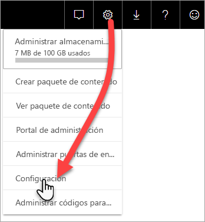

# Supervisión de capacidades Premium con la aplicación

La supervisión de las capacidades es esencial para tomar decisiones fundamentadas sobre el uso óptimo de los recursos de capacidad Premium. Puede supervisar la capacidad en el portal de administración o con la aplicación **Power BI Premium Capacity Metrics**. En este artículo se describe el uso de la aplicación Premium Capacity Metrics. La aplicación proporciona la información más detallada del rendimiento de las capacidades. Para obtener una introducción de nivel superior del promedio de métricas de uso durante los últimos siete días, puede usar el portal de administración. Para obtener más información sobre la supervisión en el portal, vea [Supervisión de capacidades Premium en el portal de administración](service-admin-premium-monitor-portal.md).

La aplicación se actualiza periódicamente con nuevas características y funcionalidades. Asegúrese de ejecutar la versión más reciente.
**La versión más reciente de la aplicación es 1.10.1.1 (5 de febrero de 2019)**.   
Si ya tiene instalada una versión anterior de la aplicación, se recomienda eliminarla de las aplicaciones y, después, presionar CTRL+F5 para actualizar. 

## Instalación de la aplicación

Puede ir directamente a la [aplicación Premium Capacity Metrics](https://app.powerbi.com/groups/me/getapps/services/capacitymetrics), o bien instalarla como hace con otras aplicaciones en Power BI.

1. En Power BI, haga clic en **Aplicaciones**.   
    

2. En el lado derecho, haga clic en **Obtener aplicaciones**.
3. En la categoría **Aplicaciones**, busque **Power BI Premium Capacity Metrics**.
4. Suscríbase para instalar la aplicación.

Tenga paciencia. La instalación y actualización de las métricas tarda unos minutos. Si la aplicación muestra las métricas en blanco, presione F5 para actualizar el explorador.

## Obtención del historial de actualización de la aplicación

Para comprobar la última vez que se ha actualizado la aplicación Premium Capacity Metrics, haga clic en **Configuración** > **Conjuntos de datos** > **Power BI Premium Capacity Metrics** > **Historial de actualización**. 

Se muestra la última actualización, o bien haga clic en **Actualizar historial** para ver las actualizaciones programadas y a petición.

## Supervisión de una capacidad con la aplicación

Ahora que ha instalado la aplicación, puede ver las métricas para las capacidades de la organización. Echemos un vistazo a algunas de las métricas principales que están disponibles.

### Panel de métricas

Cuando se abre la aplicación, primero se muestra un panel con un resumen de todas las capacidades para las que tiene derechos de administrador.

En el panel se incluyen las métricas siguientes:

| **Sección de informe** | **Metrics** (Métricas) |
| --- | --- |
| **Resumen del sistema** |  Versión de la aplicación   Número de capacidades para las que es administrador   Número de áreas de trabajo de las capacidades que proporcionan métricas   Consumo medio de memoria en GB durante los últimos siete días   Consumo máximo de memoria en GB durante los últimos siete días   Hora local a la que se produjo el consumo máximo de memoria   Número de veces que la CPU superó el 80 % de los umbrales en los últimos siete días, segmentados en depósitos de tres minutos   Número mayor de veces que la CPU superó el 80 % en los últimos siete días, segmentados en depósitos de una hora   Hora local en la que la CPU superó el 80 % más veces en una hora |
| **Resumen del conjunto de datos** |  Número total de conjuntos de datos en todas las áreas de trabajo de las capacidades   Número de veces que las conexiones dinámicas y consultas directas superaron el 80 % de los umbrales en los últimos siete días, segmentados en depósitos de tres minutos   Número mayor de veces que las conexiones dinámicas y consultas directas superaron el 80 % en los últimos siete días, segmentados en depósitos de una hora   Hora local en que las conexiones dinámicas y consultas directas superaron el 80 % más veces en una hora   Número total de actualizaciones en los últimos siete días   Tiempo de espera medio de actualización: retraso medio entre la hora programada y el inicio de la actualización, en minutos   Duración media de actualización: tiempo necesario para completar la operación, en minutos   Número total de consultas ejecutadas en los últimos siete días   Promedio de tiempo de espera de consulta: tiempo de espera de una consulta en los recursos del sistema antes de iniciar la ejecución, en milisegundos   Duración media de consulta: tiempo necesario para completar la consulta, en milisegundos   Número total de modelos expulsados debido a la presión de memoria   Tamaño promedio de los conjuntos de datos    Recuento promedio de los conjuntos de datos cargados en memoria |
| **Resumen del flujo de datos** |  Número de flujos de datos en todas las áreas de trabajo de las capacidades   Número total de actualizaciones en los últimos siete días   Tiempo de espera medio de actualización: retraso medio entre la hora programada y el inicio de la actualización, en minutos   Duración media de actualización: tiempo necesario para completar la operación, en minutos |
| **Resumen de informe paginado** |  Número de informes paginados en todas las áreas de trabajo de las capacidades   Número total de veces que los usuarios han visto todos los informes   Número total de filas de datos que hay en todos los informes   Tiempo total necesario para que se completen todas las fases (recuperación, procesamiento y representación de datos) de todos los informes, expresado en milisegundos |
|  |  |

### Informe de métricas

Haga clic en el panel para ir al informe subyacente. En la parte inferior del informe, hay cinco pestañas:

* [**Conjuntos de datos**](#datasets): proporciona métricas detalladas sobre el estado de los conjuntos de datos de Power BI dentro de las capacidades.

* [**Informes paginados**](#paginated-reports): proporciona métricas detalladas sobre el mantenimiento de los informes paginados dentro de las capacidades.

* [**Flujos de datos**](#dataflows): proporciona métricas de actualización detalladas de los flujos de datos dentro de las funcionalidades.

* [**Consumo de recursos**](#resource-consumption): proporciona métricas de capacidad total, incluidos el uso elevado de memoria y CPU.

* [**Identificadores e información**](#ids-and-info): nombres, identificadores y propietarios de las capacidades, las áreas de trabajo y las cargas de trabajo.

En cada pestaña, puede filtrar las métricas por capacidad e intervalo de fechas. Si no se selecciona ningún filtro, en el informe se muestran de forma predeterminada las métricas de la semana pasada de todas las capacidades que proporcionan métricas. 

#### Conjuntos de datos

Utilice los botones de la parte superior de la pestaña **Conjuntos de datos** para desplazarse a las distintas áreas: **Actualizaciones**, **Duraciones de consulta**, **Tiempos de espera de consulta** y **Conjuntos de datos**.

##### Pestaña Refreshes (Actualizaciones)

El área **Actualizaciones** contiene las siguientes métricas.

| **Sección de informe** | **Metrics** (Métricas) |
| --- | --- |
| **Confiabilidad de la actualización** |  Recuento total: actualizaciones totales de cada conjunto de datos.   Confiabilidad: el porcentaje de las actualizaciones que se han completado para cada conjunto de datos.   Promedio de tiempo de espera: el retraso medio entre la hora programada y el inicio de una actualización del conjunto de datos, en minutos.   Tiempo de espera máximo: tiempo de espera máximo del conjunto de datos, en minutos.    Duración media: duración media de la actualización del conjunto de datos, en minutos.   Duración máxima: duración de la actualización de ejecución más larga del conjunto de datos, en minutos. |
| **Duración promedio de la actualización de los cinco conjuntos de datos principales** |  Los cinco conjuntos de datos con la duración promedio de actualización más larga, en minutos. |
| **Tiempo promedio de espera de los cinco conjuntos de datos principales** |  Los cinco conjuntos de datos con el tiempo de espera promedio de actualización más largo, en minutos. |
| **Tiempos de espera de actualización promedio por hora** |  El tiempo promedio de espera de actualización, segmentado en depósitos horarios, notificados en la hora local. Varios picos con tiempos de espera de actualización largos son indicativos de un alto uso de la capacidad. |
| **Recuento de actualización cada hora y consumo de memoria** |  Ejecuciones correctas, con errores y consumo de memoria, segmentadas en depósitos de una hora, notificadas en la hora local. |
|  |  |

##### Área de duraciones de consultas

El área **Duraciones de consulta** contiene las siguientes métricas.

| **Sección de informe** | **Metrics** (Métricas) |
| --- | --- |
| **Duraciones de consulta** |  Los datos de esta sección se segmentan por conjuntos de datos, área de trabajo y depósitos por hora en los siete últimos días.   Total: número total de consultas ejecutadas para el conjunto de datos.   Promedio: duración media de consulta del conjunto de datos, en milisegundos.   Máximo: duración de la consulta de ejecución más larga del conjunto de datos, en milisegundos.|
| **Distribución de la duración de consulta** |  El histograma de la duración de consulta se divide en duraciones de consulta (en milisegundos) en las categorías siguientes: 30 ms, 30-100 ms, 100-300 ms, 300 ms-1 s, 1 s-3 s, 3 s-10 s, 10 s-30 s, e intervalos de > 30 segundos. Las duraciones de consulta y los tiempos de espera largos son indicativos de un alto uso de la capacidad. También puede significar que un único conjunto de datos está causando problemas y es necesario seguir investigando. |
| **Duración promedio de los cinco conjuntos de datos principales** |  Los cinco conjuntos de datos con la duración promedio de consulta más larga, en milisegundos. |
| **Consulta directa / Conexiones dinámicas (utilización > 80 %)** |  Las veces que una consulta directa o una conexión dinámica superaron el 80 % de utilización de la CPU, segmentadas en depósitos horarios notificados en la hora local. |
| **Distribución por horas de la duración de consulta** |  Los recuentos de consulta y la duración media (en milisegundos) frente al consumo de memoria en GB, segmentados en depósitos horarios notificados en la hora local. |
|  |  |

##### Área Tiempo de espera de consultas

El área **Esperas de consulta** contiene las siguientes métricas.

| **Sección de informe** | **Metrics** (Métricas) |
| --- | --- |
| **Tiempos de espera de consulta** |  Los datos de esta sección se segmentan por conjuntos de datos, área de trabajo y depósitos por hora en los siete últimos días.   Total: número total de consultas ejecutadas para el conjunto de datos.   Recuento de espera: número de consultas del conjunto de datos que estuvieron en espera en los recursos del sistema antes de iniciar la ejecución.    Promedio: tiempo de espera de consulta promedio del conjunto de datos, en milisegundos.   Máximo: duración de la consulta con un tiempo de espera más largo en el conjunto de datos, en milisegundos.|
| **Distribución del tiempo de espera** |  El histograma de la duración de consulta se segmenta por las duraciones de consulta (en milisegundos) en las categorías siguientes: <= 50 ms, 50-100 ms, 100-200 ms, 200-400 ms 400 ms-1s, 1 s-5 s e intervalos de > 5 segundos. |
| **Tiempo promedio de espera de los cinco conjuntos de datos principales** |  Los cinco conjuntos de datos con el tiempo de espera promedio más largo para iniciar la ejecución de una consulta, en milisegundos. |
| **Horas y recuento de espera de consulta por hora** |  Recuentos de los tiempos de espera de las consultas y el tiempo de espera medio (en milisegundos) frente al consumo de memoria en GB, segmentados en depósitos horarios notificados en la hora local. |
|  |  |

##### Área Datasets (Conjuntos de datos)

El área **Conjuntos de datos** contiene las siguientes métricas.

| **Sección de informe** | **Metrics** (Métricas) |
| --- | --- |
| **Recuentos de expulsiones del conjunto de datos** |  Total: número total de *expulsiones* del conjunto de datos para cada capacidad. Cuando una funcionalidad sufre la presión de la memoria, el nodo expulsa uno o varios conjuntos de datos de la memoria. Los conjuntos de datos que están inactivos (sin ninguna operación de consulta o actualización ejecutándose actualmente) se expulsan primero. A continuación, el orden de expulsión se basa en una medida de tipo LRU (el menos usado recientemente).|
| **Consumo de memoria y expulsiones de conjuntos de datos por horas** |  Expulsiones de conjuntos de datos frente a consumo de memoria en GB, segmentados en depósitos horarios notificados en la hora local. |
| **Recuentos de conjuntos de datos cargados por hora** |  Número de conjuntos de datos cargados en memoria frente al consumo de memoria en GB, segmentados en depósitos horarios notificados en la hora local. |
| **Porcentajes de memoria consumida** |  Total de conjuntos de datos activos en memoria como un porcentaje del total de memoria. La diferencia entre Activos y Todos define los conjuntos de datos que se pueden expulsar. Se muestra cada hora, para los siete días anteriores. |
| **Tamaños de datos**  |  Tamaño máximo: tamaño máximo del conjunto de datos en MB durante el período que se muestra. |
|  |  |

#### Informes paginados

En la pestaña **Informes paginados** se muestran métricas detalladas sobre el estado de los informes paginados dentro de sus funcionalidades.

| **Sección de informe** | **Metrics** (Métricas) |
| --- | --- |
| **Uso general** |  Número total de vistas: número de veces que los usuarios han visualizado el informe.   Recuento de filas: número de filas de datos que hay en el informe.   Recuperación (promedio): cantidad media de tiempo que se tarda en recuperar los datos del informe, en milisegundos. Las duraciones largas pueden indicar consultas lentas u otros problemas del origen de datos.    Procesamiento (promedio): cantidad media de tiempo que se tarda en procesar los datos de un informe, en milisegundos.  Representación (promedio): cantidad media de tiempo que se tarda en representar un informe en el explorador, en milisegundos.   Tiempo total: tiempo necesario para todas las fases del informe, en milisegundos.|
| **Tiempo medio de recuperación de datos de los cinco informes principales** |  Los cinco informes con el tiempo medio de recuperación de datos más largo, en milisegundos. |
| **Tiempo medio de procesamiento de informes en los cinco informes principales** |  Los cinco informes con el tiempo medio de procesamiento de informes más largo, en milisegundos. |
| **Duraciones por hora** |  Tiempo de recuperación de datos frente al tiempo de procesamiento y representación, segmentado en depósitos horarios notificados en la hora local |
| **Resultados por hora** |  Ejecuciones correctas, con errores y consumo de memoria, segmentadas en depósitos de una hora, notificadas en la hora local. |
|  |  |

#### Flujos de datos

La pestaña **Flujos de datos** muestra métricas de actualización detalladas de los flujos de datos dentro de las funcionalidades.

| **Sección de informe** | **Metrics** (Métricas) |
| --- | --- |
| **Actualizar** |  Total: número total de actualizaciones de cada flujo de datos.   Confiabilidad: el porcentaje de las actualizaciones que se han completado para cada flujo de datos.   Promedio de tiempo de espera: retraso medio entre la hora programada y el inicio de una actualización del conjunto de datos, en minutos.   Tiempo de espera máximo: tiempo de espera máximo del flujo de datos, en minutos.    Duración media: duración media de la actualización del flujo de datos, en minutos.   Duración máxima: duración de la actualización de ejecución más larga del flujo de datos, en minutos. |
| **Duración promedio de la actualización de los cinco flujos de datos principales** |  Los cinco flujos de datos con la duración promedio de actualización más larga, en minutos. |
| **Tiempo promedio de espera de los cinco flujos de datos principales** |  Los cinco flujos de datos con el tiempo de espera promedio de actualización más largo, en minutos. |
| **Tiempos de espera de actualización promedio por hora** |  El tiempo promedio de espera de actualización, segmentado en depósitos horarios, notificados en la hora local. Varios picos con tiempos de espera de actualización largos son indicativos de un alto uso de la capacidad. |
| **Recuento de actualización cada hora y consumo de memoria** |  Ejecuciones correctas, con errores y consumo de memoria, segmentadas en depósitos de una hora, notificadas en la hora local. |
|  |  |

#### Consumo de recursos

La pestaña **Consumo de recursos** muestra el consumo de CPU y memoria de todas las capacidades y cargas de trabajo.

| **Sección de informe** | **Metrics** (Métricas) |
| --- | --- |
| **Consumo de CPU** |  Consumo de carga de trabajo como porcentaje de la capacidad total de CPU. Se muestra cada hora, para los siete días anteriores. |
| **Consumo de memoria** |  Consumo de memoria en GB por carga de trabajo (líneas continuas) superpuesto con los límites de la carga de trabajo (línea de puntos). Se muestra cada hora, para los siete días anteriores. |
|  |  |

#### Identificadores e información

La pestaña **Identificadores e información** contiene los nombres, los identificadores y los propietarios de las capacidades, las áreas de trabajo y las cargas de trabajo.

## Supervisión de capacidades de Power BI Embedded

Puede usar la aplicación Power BI Premium Capacity Metrics para supervisar las capacidades de *SKU A* en Power BI Embedded. Esas capacidades se mostrarán en el informe siempre y cuando sea administrador de la capacidad. Sin embargo, la actualización del informe producirá un error si no concede determinados permisos a Power BI en sus SKU A:

1. Abra su capacidad en Azure Portal.

1. Haga clic en **Control de acceso (IAM)** y agregue la aplicación "Power BI Premium" al rol de lector. Si no puede encontrar la aplicación por el nombre, también puede agregarla por su identificador de cliente: cb4dc29f 0bf4 402a 8b30 7511498ed654.

    

> [!NOTE]
> Puede supervisar el uso de capacidades de Power BI Embedded en la aplicación o en Azure Portal, pero no en el Portal de administración de Power BI.

## Pasos siguientes

> [!div class="nextstepaction"]
> [Optimización y administración de recursos con capacidad Power BI Premium](service-premium-understand-how-it-works.md)
