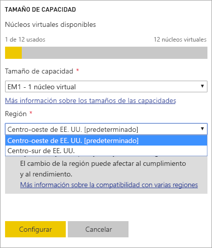
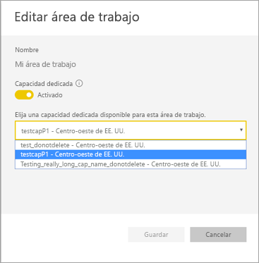
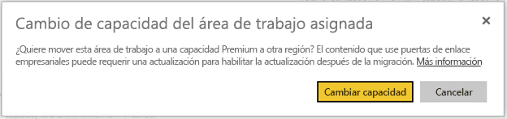
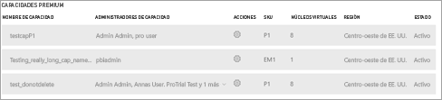

# Compatibilidad con Multi-Geo en Power BI Premium (versión preliminar)

Multi-Geo es una característica de Power BI Premium que ayuda a que los clientes multinacionales aborden los requisitos de residencia de datos organizacionales, regionales o específicos del sector. Como cliente de Power BI Premium, puede implementar contenido en centros de datos de regiones distintas de la región principal del inquilino de Power BI. Una geoárea (geografía) puede contener más de una región. Por ejemplo, Estados Unidos es una geoárea y Centro-oeste de EE. UU. y Centro-sur de EE. UU. son regiones de Estados Unidos. Puede elegir implementar contenido en cualquiera de las geoáreas siguientes:

- Estados Unidos
- Canadá
- Reino Unido
- Brasil
- Europa
- Japón
- India
- Asia Pacífico
- Australia

Multi-Geo no está disponible para Power BI Alemania, Power BI China operado por 21Vianet o Power BI para la Administración Pública de Estados Unidos.

Multi-Geo ahora está también disponible en Power BI Embedded. Puede encontrar más información en [Multi-Geo support in Power BI Embedded (Preview)](developer/embedded-multi-geo.md) (Compatibilidad con Multi-Geo en Power BI Embedded [versión preliminar]).

## Uso de Multi-Geo

Para las capacidades nuevas, habilite Multi-Geo al seleccionar una región distinta de la región predeterminada en la lista desplegable.  Cada capacidad muestra la región donde está ubicada actualmente, como **Centro-oeste de EE. UU**.

Después de crear una capacidad, esta permanece en esa región y todas las áreas de trabajo creadas almacenarán su contenido en esa región. Puede migrar las áreas de trabajo desde una región a otra a través de la lista desplegable en la pantalla de configuración del área de trabajo.

Verá este mensaje para confirmar el cambio.

En este momento, no es necesario restablecer las credenciales de la puerta de enlace durante una migración.  Una vez que se almacenan en la región de capacidad Premium, deberá restablecerlas después de la migración.

Durante la migración, ciertas operaciones pueden generar errores, como la publicación de conjuntos de datos nuevos o la actualización programada de datos.  

Los elementos siguientes se almacenan en la región Premium cuando Multi-Geo está habilitado:

- Modelos (archivos .ABF) para conjuntos de datos de importación y DirectQuery
- Caché de consultas
- Imágenes de R

Estos elementos permanecen en la región principal del inquilino:

- Conjuntos de datos de inserción
- Libros de Excel
- Metadatos de informes/paneles: por ejemplo, nombres de icono, consultas de icono
- Buses de servicio para consultas de puerta de enlace o trabajos de actualización programada
- Permisos
- Credenciales de conjuntos de datos

## Vista de regiones de capacidad

En el Portal de administración, puede ver todas las capacidades del inquilino de Power BI y las regiones donde se ubican actualmente.

 

## Cambio de la región de contenido existente

Si necesita cambiar la región de contenido existente, tiene dos opciones.

- Crear una segunda capacidad y mover las áreas de trabajo. Los usuarios gratuitos no experimentarán tiempo de inactividad siempre que el inquilino tenga núcleos virtuales libres.
- Si la creación de una segunda capacidad no es opción, puede mover de manera temporal el contenido de vuelta a la capacidad compartida desde Premium. No necesita núcleos virtuales adicionales, pero los usuarios gratuitos experimentarán cierto tiempo de inactividad.

## Movimiento de contenido fuera de Multi-Geo  

Puede quitar áreas de trabajo de la capacidad Multi-Geo de una de estas dos maneras:

- Elimine la capacidad actual donde se ubica el área de trabajo.  Esta acción devuelve el área de trabajo a la capacidad compartida en la región principal.
- Migre las áreas de trabajo individuales de vuelta a la capacidad Premium ubicada en el inquilino principal.

## Limitaciones y consideraciones

- Confirme que cualquier movimiento que inició entre regiones cumple con todos los requisitos de cumplimiento corporativos y gubernamentales antes de iniciar la transferencia de datos.
- Una consulta en caché almacenada en una región remota permanece en esa región en reposo. Sin embargo, otros datos en tránsito pueden ir y venir entre distintas geografías.
- Al mover datos de una región a otra en un entorno de Multi-Geo, los datos de origen pueden permanecer en la región desde donde se movieron los datos durante hasta 30 días. Durante ese período, los usuarios finales no tienen acceso a ellos. Se quitan de esta región y se destruyen durante el período de 30 días.
- En términos generales, Multi-Geo no genera un mejor rendimiento. La carga de informes y paneles sigue implicando solicitudes de metadatos a la región principal.

## Pasos siguientes

- [¿Qué es Power BI Premium?](service-premium.md)
- [Multi-Geo para capacidades de Power BI Embedded](developer/embedded-multi-geo.md)

¿Tiene más preguntas? [Pruebe a preguntar a la comunidad de Power BI](http://community.powerbi.com/)
