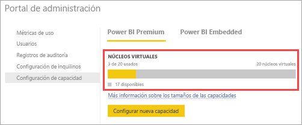

# Adquisición de Power BI Premium

Este artículo describe cómo puede comprar capacidad de Power BI Premium para su organización. En este artículo se describen dos escenarios:

- Uso de SKU P para escenarios de producción típicos. Las SKU P requieren un compromiso mensual o anual, y se facturan mensualmente. Las SKU P se compran en el [Centro de administración de Microsoft 365](https://admmin.microsoft.com).

- Uso de SKU A para escenarios de prueba y para casos en los que no tiene los permisos necesarios para comprar SKU P (rol de administrador global de Microsoft 365 o rol de administrador de facturación). Las SKU A no requieren ningún compromiso de tiempo y se facturan por hora. Las SKU A se compran en [Azure Portal](https://portal.azure.com).

Para obtener más información sobre Power BI Premium, consulte [¿Qué es Power BI Premium?](service-premium-what-is.md). Para obtener información actualizada sobre precios y planificación, consulte la [Página de precios de Power BI](https://powerbi.microsoft.com/pricing/) y la [Calculadora de Power BI Premium](https://powerbi.microsoft.com/calculator/). Los creadores de contenido siguen necesitando una [licencia de Power BI Pro](service-admin-purchasing-power-bi-pro.md), incluso si en la organización se usa Power BI Premium. Asegúrese de adquirir al menos una licencia de Power BI Pro para su organización. Con las SKU A, _todos los usuarios_ que consumen contenido también necesitan licencias Pro.

> [!NOTE]
> Si expira una suscripción Premium, dispone de 30 días de acceso completo a su capacidad. Transcurrido este tiempo, el contenido vuelve a ser una capacidad compartida. La capacidad compartida no admite los modelos de más de 1 GB.

## Compra de SKU P para escenarios de producción típicos

Puede crear un inquilino con una SKU P1 de Power BI Premium configurada, o bien puede comprar una capacidad de Power BI Premium para una organización existente. En ambos casos, después puede agregar capacidad si la necesita.

### Creación de un nuevo inquilino con Power BI Premium P1

Si no tiene ningún inquilino y desea crear uno, puede adquirir Power BI Premium a la vez. El vínculo siguiente le guiará por el proceso de creación de un inquilino y le permitirá adquirir Power BI Premium: [oferta de Power BI Premium P1](https://signup.microsoft.com/Signup?OfferId=b3ec5615-cc11-48de-967d-8d79f7cb0af1). Al crear el inquilino, se le asignará automáticamente el rol de administrador global de Microsoft 365 para el inquilino.

Después de comprar la capacidad, obtenga información sobre cómo [administrar capacidades](service-admin-premium-manage.md#manage-capacity) y [asignar áreas de trabajo](service-admin-premium-manage.md#assign-a-workspace-to-a-capacity) a una capacidad.

### Adquisición de la capacidad de Power BI Premium para una organización existente

Si tiene una organización existente (inquilino), tiene que tener el rol de administrador global de Microsoft 365 o el de administrador de facturación para comprar suscripciones y licencias. Para más información, vea [Acerca de los roles de administrador de Microsoft 365](https://support.office.com/article/About-Office-365-admin-roles-da585eea-f576-4f55-a1e0-87090b6aaa9d).

Para comprar capacidad Premium, siga estos pasos.

1. En el servicio Power BI, elija el selector de aplicaciones de Microsoft 365 y, después, **Administrador**.

    

    O bien, puede ir al Centro de administración de Microsoft 365.

1. Seleccione **Facturación** > **Servicios de compra**.

1. En **Otros planes**, busque las ofertas de Power BI Premium. En la lista aparecerá como P1 a P3, EM3 y P1 (mes a mes).

1. Mantenga el puntero sobre los puntos suspensivos ( **. . .** ) y después seleccione **Comprar ahora**.

    

1. Siga estos pasos para completar la compra.

Después de completar la compra, la página **Servicios de compra** mostrará que el elemento se ha adquirido y que está activo.

Después de comprar la capacidad, obtenga información sobre cómo [administrar capacidades](service-admin-premium-manage.md#manage-capacity) y [asignar áreas de trabajo](service-admin-premium-manage.md#assign-a-workspace-to-a-capacity) a una capacidad.

### Compra de capacidades adicionales

Ahora que tiene una capacidad, puede agregar más a medida que crecen sus necesidades. Puede usar cualquier combinación de SKU de la capacidad Premium (P1 a P3) en la organización. Las distintas SKU ofrecen diferentes funcionalidades de recursos.

1. En el Centro de administración de Microsoft 365, seleccione **Facturación** > **Servicios de compra**.

1. Busque el elemento adicional de Power BI Premium que desea comprar debajo de **Otros planes**.

1. Mantenga el puntero sobre **Más opciones** (...) y después seleccione **Cambiar la cantidad de licencias**.

    

1. Cambie el número de instancias que desea tener de este elemento. Seleccione **Enviar** cuando haya terminado.

   > [!IMPORTANT]
   > La selección de **Enviar** carga la tarjeta de crédito registrada.

En la página **Servicios de compra** se indicará el número de instancias de las que dispone. En el portal de administración de Power BI, en **Configuración de la capacidad**, los núcleos virtuales disponibles reflejan la nueva capacidad adquirida.

### Cancelación de la suscripción

Puede cancelar la suscripción desde el Centro de administración de Microsoft 365. Para cancelar una suscripción Premium, realice lo siguiente:

1. Vaya al Centro de administración de Microsoft 365.

1. Seleccione **Facturación** > **Suscripciones**.

1. Seleccione la suscripción de Power BI Premium en la lista.

1. Seleccione **Más acciones** > **Cancelar suscripción**.

1. La página **Cancelar suscripción** indicará si debe o no pagar un [cargo por cancelación anticipada](https://support.office.com/article/early-termination-fees-6487d4de-401a-466f-8bc3-c0beb5cc40d3). Esta página también le permitirá saber cuándo se eliminarán los datos de la suscripción.

1. Lea la información y, si desea continuar, seleccione **Cancelar suscripción**.

#### Cuando se cancela la suscripción o la licencia expira

Al cancelar su suscripción Premium o expirar su licencia de capacidad, puede continuar obteniendo acceso a sus capacidades Premium durante un período de 30 días desde la cancelación o la expiración de la licencia. Una vez transcurridos los 30 días, ya no podrá obtener acceso a sus capacidades Premium o áreas de trabajo en ellas.

## Compra de SKU A para pruebas y otros escenarios

Las SKU se ponen a disposición a través del servicio Azure Power BI Embedded. Puede usar las SKU A de las siguientes maneras:

- Para habilitar la inserción de Power BI en aplicaciones de terceros. Para obtener más información, vea [Power BI Embedded](developer/azure-pbie-what-is-power-bi-embedded.md).

- Para probar la funcionalidad Premium antes de comprar una SKU P.

- Para crear entornos de desarrollo y pruebas junto con un entorno de producción en el que se usen SKU P.

- Para comprar Power BI Premium aunque no tenga un rol de administrador global de Microsoft 365 o de administrador de facturación.

> [!NOTE]
> Si compra una SKU A4 o superior, puede aprovechar todas las características Premium, excepto el uso compartido ilimitado de contenido. Con las SKU A, _todos los usuarios_ que consumen contenido necesitan licencias Pro.

Siga estos pasos para comprar SKU A en Azure Portal:

1. Inicie sesión en [Azure Portal](https://portal.azure.com) con una cuenta que tenga al menos permisos de administrador de capacidad en Power BI.

1. Busque _Power BI Embedded_ y seleccione el servicio en los resultados de la búsqueda.

    

1. Seleccione **Creación de un recurso de Power BI Embedded**.

    

1. En la pantalla de creación de **Power BI Embedded**, especifique la información siguiente:

    - La **Suscripción** en la que se va a crear el servicio Power BI Embedded.

    - La **Ubicación** física en la que se va a crear el grupo de recursos que contiene el servicio. Para obtener un mejor rendimiento, esta ubicación debe estar cerca de la del inquilino de Azure Active Directory para Power BI.

    - El **Grupo de recursos** existente que se va a usar, o cree uno como se muestra en el ejemplo.

    - El **Administrador de la capacidad de Power BI**. El administrador de la capacidad debe ser un usuario miembro o una entidad de servicio en el inquilino de Azure AD.

    

1. Si quiere usar todas las características de Power BI Premium (excepto el uso compartido ilimitado), necesita al menos una SKU A4. Seleccione **Cambiar el tamaño**.

    

1. Seleccione un tamaño de capacidad de A4, A5 o A6, que se corresponden a P1, P2 y P3.

    

1. Seleccione **Revisar y crear**, revise las opciones que ha elegido y, después, seleccione **Crear**.

    

1. La implementación puede tardar unos minutos en completarse. Cuando esté lista, seleccione **Ir al recurso**.

    

1. En la pantalla de administración, revise las opciones que tiene para administrar el servicio, incluida la pausa del servicio cuando no lo use.

    

Después de comprar la capacidad, obtenga información sobre cómo [administrar capacidades](service-admin-premium-manage.md#manage-capacity) y [asignar áreas de trabajo](service-admin-premium-manage.md#assign-a-workspace-to-a-capacity) a una capacidad.

## Pasos siguientes

[Configuración y administración de capacidades en Power BI Premium](service-admin-premium-manage.md)\
[Página de precios de Power BI](https://powerbi.microsoft.com/pricing/)\
[Calculadora de Power BI Premium](https://powerbi.microsoft.com/calculator/)\
[Preguntas más frecuentes sobre Power BI Premium](service-premium-faq.md)\
[Notas del producto de la planeación de una implementación de Power BI Enterprise](https://aka.ms/pbienterprisedeploy)

¿Tiene más preguntas? [Pruebe a preguntar a la comunidad de Power BI](https://community.powerbi.com/)
