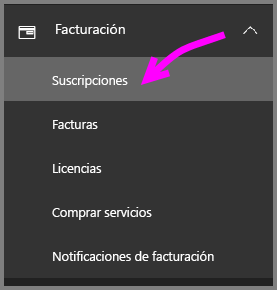
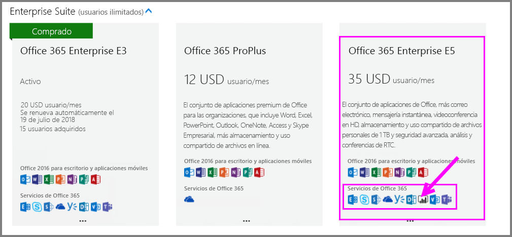
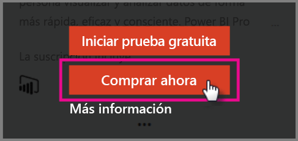
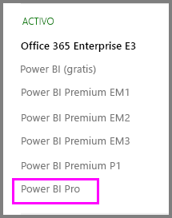

# Inicio rápido: Adquisición de licencias de Power BI Pro

Power BI Pro es una licencia individual que permite acceder a todo el contenido y las funcionalidades del servicio Power BI, incluida la capacidad de compartir el contenido y colaborar con otros usuarios de Pro. Solo los usuarios de la versión Pro pueden publicar y consumir contenido en áreas de trabajo de las aplicaciones, compartir paneles y suscribirse a paneles e informes. En este artículo se explica cómo adquirir licencias de Power BI Pro en Office 365.

## Requisitos previos

Debe ser miembro del rol de [**administrador global** o **administrador de facturación**](https://support.office.com/article/about-office-365-admin-roles-da585eea-f576-4f55-a1e0-87090b6aaa9d?ui=en-US&rs=en-US&ad=US) en Office 365. 

## Adquisición de licencias de Power BI Pro en Office 365

Siga estos pasos para adquirir licencias de Power BI Pro:

1. Abra el [centro de administración de Office 365](https://portal.office.com/adminportal/home#/homepage).

2. En el panel de navegación izquierdo, seleccione **Facturación**  > **Suscripciones**.

    

3. Seleccione **Agregar suscripciones** en la esquina superior derecha de la página **Suscripciones**.

    

4. Busque la oferta de suscripción que le interese:

    En **Enterprise Suite**, seleccione **Office 365 Enterprise E5**.

    

    En **Otros planes**, seleccione **Power BI Pro**.

    

5. Mueva el puntero por encima del botón de puntos suspensivos (...) para la suscripción que quiera y seleccione **Comprar ahora**.

    

6. Elija **Pago mensual** o **Pagar un año completo** según sus preferencias de facturación.

7. En **How many users do you want?** (¿Cuántos usuarios quiere?), escriba el número de licencias que quiera y seleccione **Check out now** (Comprar ahora) para completar la transacción.

8. Compruebe que la suscripción adquirida aparece ahora en la página **Suscripciones**.

   

9. Para agregar más licencias después de la compra inicial, seleccione **Power BI Pro** en la página **Suscripciones** y luego seleccione **Agregar o quitar licencias**.

## Pasos siguientes

Ahora que ya ha adquirido las licencias, asígnelas a los usuarios del inquilino.

[Asignación de licencias a los usuarios en Office 365](service-admin-assigning-power-bi-pro-licenses.md)

[Asignación de licencias a los usuarios en Azure](service-admin-assigning-power-bi-pro-licenses-azure.md)

[Precios de Power BI](https://powerbi.microsoft.com/en-us/pricing/)
