# Adquirir y asignar licencias de Power BI Pro

Power BI Pro es una licencia individual que permite acceder a todo el contenido y las funcionalidades del servicio Power BI, incluida la capacidad de compartir el contenido y colaborar con otros usuarios de Pro. Solo los usuarios de la versión Pro pueden publicar y consumir contenido en áreas de trabajo de las aplicaciones, compartir paneles y suscribirse a paneles e informes. Para obtener más información, vea [Características de Power BI por tipo de licencia](service-features-license-type.md).

En este artículo primero se explica cómo adquirir licencias de Power BI Pro en Office 365. Luego se explican las dos opciones disponibles para asignar esas licencias a usuarios individuales: Office 365 y Azure (se elige una opción).

## Requisitos previos

Debe ser miembro del rol de [**administrador global** o **administrador de facturación**](https://support.office.com/article/about-office-365-admin-roles-da585eea-f576-4f55-a1e0-87090b6aaa9d?ui=en-US&rs=en-US&ad=US) en Office 365.

Para asignar licencias en Azure, debe ser propietario de la suscripción de Azure que usa Power BI para las búsquedas de Active Directory.

## Adquirir licencias en Office 365

Siga estos pasos para adquirir licencias de Power BI Pro:

1. Abra el [centro de administración de Office 365](https://portal.office.com/adminportal/home#/homepage).

2. En el panel de navegación izquierdo, seleccione **Facturación**  > **Suscripciones**.

    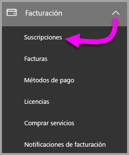

3. Seleccione **Agregar suscripciones** en la esquina superior derecha de la página **Suscripciones**.

    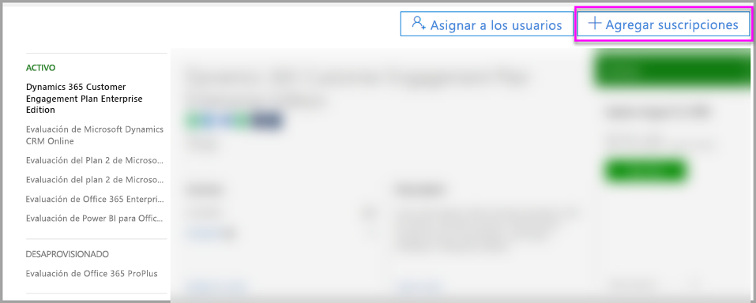

4. Busque la oferta de suscripción que le interese:

    En **Enterprise Suite**, seleccione **Office 365 Enterprise E5**.

    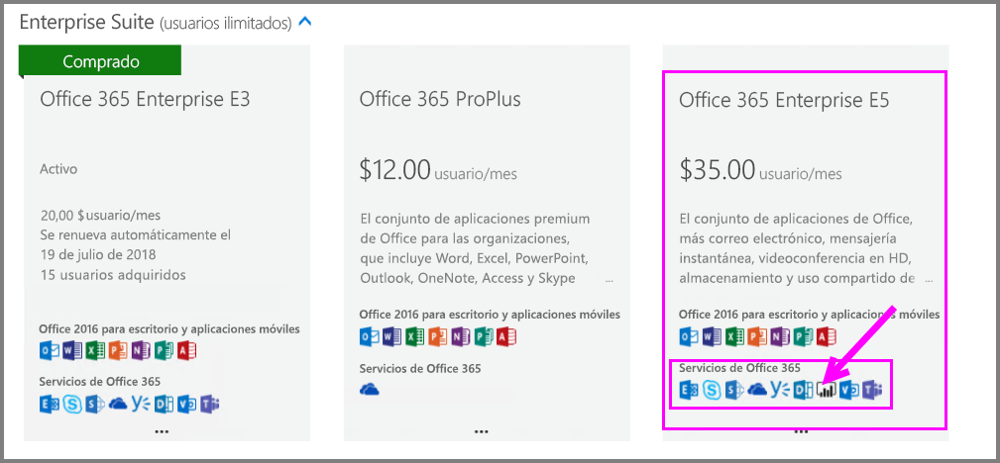

    En **Otros planes**, seleccione **Power BI Pro**.

    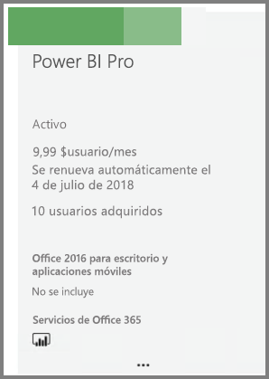

5. Mueva el puntero por encima del botón de puntos suspensivos (**...**) de la suscripción que quiera y seleccione **Comprar ahora**.

    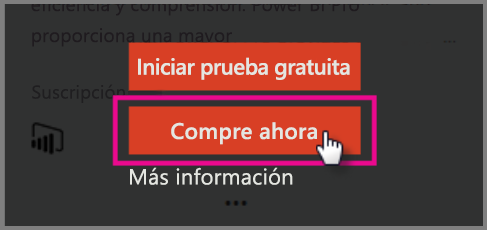

6. Elija **Pago mensual** o **Pagar un año completo** según sus preferencias de facturación.

7. En **How many users do you want?** (¿Cuántos usuarios quiere?), escriba el número de licencias que quiera y seleccione **Check out now** (Comprar ahora) para completar la transacción.

8. Compruebe que la suscripción adquirida aparece ahora en la página **Suscripciones**.

   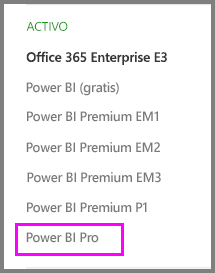

9. Para agregar más licencias después de la compra inicial, seleccione **Power BI Pro** en la página **Suscripciones** y luego seleccione **Agregar o quitar licencias**.

## Asignar licencias en Office 365

Siga estos pasos para asignar licencias de Power BI Pro a cuentas de usuario individuales:

1. Abra el [centro de administración de Office 365](https://portal.office.com/adminportal/home#/homepage).

2. En el panel de navegación izquierdo, expanda **Usuarios** y luego seleccione **Usuarios activos**.

    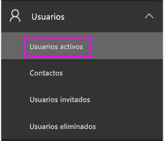

3. Seleccione un usuario y después, en **Licencias de productos**, seleccione **Editar**.

    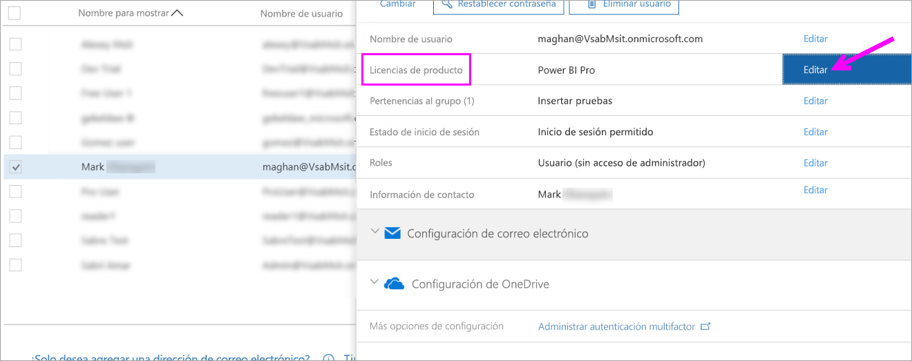

4. En **Power BI Pro**, **active** la opción y luego seleccione **Guardar**.

    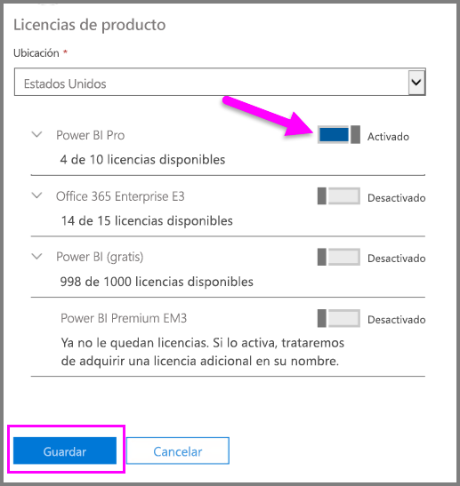

5. En la cuenta seleccionada, puede comprobar en **Estado** que se ha asignado correctamente la licencia de Power BI Pro.

    

## Asignar licencias en Azure

Siga estos pasos para asignar licencias de Power BI Pro a cuentas de usuario individuales:

1. Abra [Azure Portal](https://ms.portal.azure.com/#@microsoft.onmicrosoft.com/dashboard/private/39bc3cf7-31a4-43f6-954c-f2d69ca2f0).

2. En la barra de navegación izquierda, seleccione **Azure Active Directory**.

    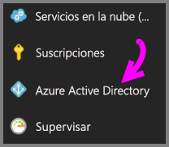

3. En **Azure Active Directory**, seleccione **Licencias**.

    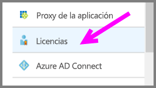

4. En **Licencias**, seleccione **Todos los productos** y luego **Power BI Pro** para mostrar la lista de usuarios con licencia.

    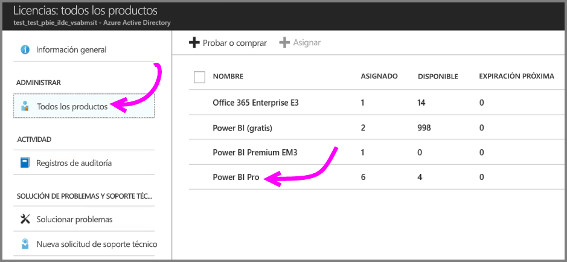

5. Seleccione **Asignar** para agregar una licencia de Power BI Pro a una cuenta de usuario adicional.

    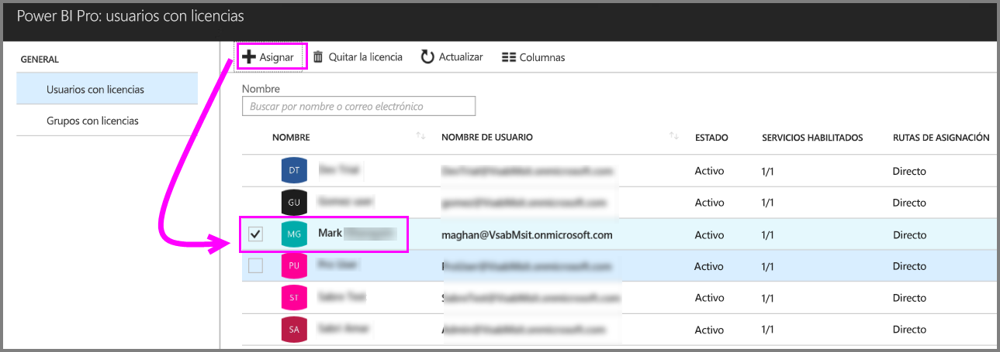

## Pasos siguientes

Ahora que ya ha asignado las licencias, obtenga más información sobre Power BI Pro.

[Licencias de Power BI en la organización](service-admin-licensing-organization.md)

[Encontrar usuarios de Power BI que hayan iniciado sesión](service-admin-access-usage.md)

¿Tiene más preguntas? [Pruebe a preguntar a la comunidad de Power BI](https://community.powerbi.com/)
