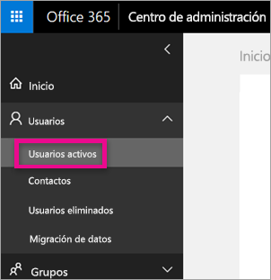
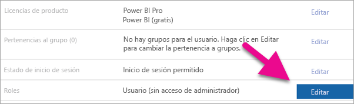
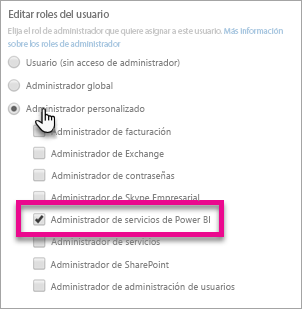
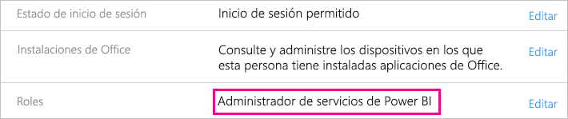

# <a name="understanding-the-power-bi-service-administrator-role"></a>Descripción del rol de administrador del servicio Power BI

Aprenda a usar el rol de administrador del servicio Power BI en su organización. Los usuarios de este rol tienen control total sobre un inquilino de Power BI y sus características administrativas, excepto para las licencias.

<iframe width="640" height="360" src="https://www.youtube.com/embed/PQRbdJgEm3k?showinfo=0" frameborder="0" allowfullscreen></iframe>

El rol de administrador del servicio Power BI puede asignarse a los usuarios que necesitan acceder al Portal de administración de Power BI, pero sin concederles también acceso administrativo completo de Office 365.

Los administradores de usuarios de Office 365 asignan a los usuarios el rol Administrador del servicio Power BI en el Centro de administración de Microsoft 365 o mediante un script de PowerShell. Una vez que se asigna un usuario, este podrá acceder al [Portal de administración de Power BI](service-admin-portal.md). Allí, tendrá acceso a las métricas de uso de todos los inquilinos y podrá controlar el uso de características de Power BI por parte de estos.

## <a name="limitations-and-considerations"></a>Limitaciones y consideraciones

El rol de administrador del servicio Power BI no proporciona las siguientes funcionalidades:

* Capacidad de modificar usuarios y licencias en el Centro de administración de Microsoft 365.

* Acceso a los registros de auditoría. Para más información, consulte [Usar la auditoría dentro de su organización](service-admin-auditing.md).

## <a name="assign-users-to-the-admin-role-in-office-365"></a>Asignar a usuarios el rol de administrador en Office 365

Para asignar a los usuarios el rol de administrador de Power BI en el Centro de administración de Microsoft 365, siga estos pasos.

1. En el [Centro de administración de Microsoft 365](https://portal.office.com/adminportal/home#/homepage), seleccione **Usuarios** > **Usuarios activos**.

    

1. Seleccione el usuario al que desea asignar el rol.

1. En **Roles**, seleccione **Editar**.

    

1. Seleccione **Administrador personalizado** > **Administrador de servicios de Power BI**.

    

1. Seleccione **Guardar** y luego **Cerrar**.

Debe aparecer **Power BI service administrator** (Administrador del servicio Power BI) en el rol de ese usuario.



## <a name="assign-users-to-the-admin-role-with-powershell"></a>Asignar a usuarios el rol de administrador con PowerShell

También puede asignar roles a los usuarios mediante PowerShell. Los usuarios se administran en Azure Active Directory (Azure AD). Si aún no tiene el módulo de PowerShell de Azure AD, [descargue e instale la última versión](https://www.powershellgallery.com/packages/AzureAD/).

1. En primer lugar, conéctese a Azure AD:
   ```
   PS C:\Windows\system32> Connect-AzureAD
   ```

1. Luego, obtenga el elemento **ObjectId** para el rol **Administrador del servicio Power BI**. Puede ejecutar [Get AzureADDirectoryRole](/powershell/module/azuread/get-azureaddirectoryrole) para obtener el **ObjectId**

    ```
    PS C:\Windows\system32> Get-AzureADDirectoryRole

    ObjectId                             DisplayName                        Description
    --------                             -----------                        -----------
    00f79122-c45d-436d-8d4a-2c0c6ca246bf Power BI Service Administrator     Full access in the Power BI Service.
    250d1222-4bc0-4b4b-8466-5d5765d14af9 Helpdesk Administrator             Helpdesk Administrator has access to perform..
    3ddec257-efdc-423d-9d24-b7cf29e0c86b Directory Synchronization Accounts Directory Synchronization Accounts
    50daa576-896c-4bf3-a84e-1d9d1875c7a7 Company Administrator              Company Administrator role has full access t..
    6a452384-6eb9-4793-8782-f4e7313b4dfd Device Administrators              Device Administrators
    9900b7db-35d9-4e56-a8e3-c5026cac3a11 AdHoc License Administrator        Allows access manage AdHoc license.
    a3631cce-16ce-47a3-bbe1-79b9774a0570 Directory Readers                  Allows access to various read only tasks in ..
    f727e2f3-0829-41a7-8c5c-5af83c37f57b Email Verified User Creator        Allows creation of new email verified users.
    ```

    En este caso, el **ObjectId** del rol es 00f79122-c45d-436d-8d4a-2c0c6ca246bf.

1. A continuación, obtenga el **ObjectId** del usuario. Puede averiguarlo mediante la ejecución de [Get-AzureADUser](/powershell/module/azuread/get-azureaduser).

    ```
    PS C:\Windows\system32> Get-AzureADUser -ObjectId 'tim@contoso.com'

    ObjectId                             DisplayName UserPrincipalName      UserType
    --------                             ----------- -----------------      --------
    6a2bfca2-98ba-413a-be61-6e4bbb8b8a4c Tim         tim@contoso.com        Member
    ```

1. Para agregar el miembro al rol, ejecute [Add-AzureADDirectoryRoleMember](/powershell/module/azuread/add-azureaddirectoryrolemember).

    | Parámetro | Descripción |
    | --- | --- |
    | ObjectId |El ObjectId del rol. |
    | RefObjectId |El ObjectId de los miembros. |

    ```powershell
    Add-AzureADDirectoryRoleMember -ObjectId 00f79122-c45d-436d-8d4a-2c0c6ca246bf -RefObjectId 6a2bfca2-98ba-413a-be61-6e4bbb8b8a4c
    ```

## <a name="next-steps"></a>Pasos siguientes

[Administración de Power BI en su organización](service-admin-administering-power-bi-in-your-organization.md)  
[Portal de administración de Power BI](service-admin-portal.md)  

¿Tiene más preguntas? [Pruebe a preguntar a la comunidad de Power BI](http://community.powerbi.com/)