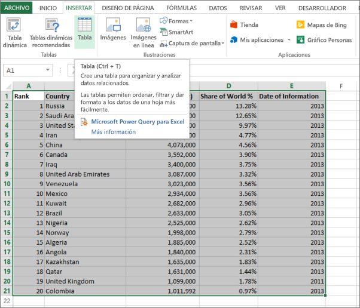
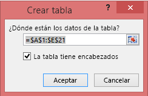
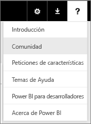

# Error: Datos no encontrados en el libro de Excel

>[!NOTE]  
>Este artículo es aplicable a Excel 2007 y versiones posteriores.

Al importar un libro de Excel en Power BI, es posible que vea el siguiente error:

*Error: No pudimos encontrar ningún dato con el formato de tabla. Para importar desde Excel en el servicio Power BI, debe aplicar a los datos el formato de tabla. Seleccione todos los datos que quiera de la tabla y presione Ctrl+T.*

## Solución rápida
1. Edite el libro en Excel.
2. Seleccione el rango de celdas que contienen los datos. La primera fila debe contener los encabezados de columna (los nombres de columna).
3. Presione **Ctrl + T** para crear una tabla.
4. Guarde el libro.
5. Regrese a Power BI y vuelva a importar el libro, o bien, si trabaja en Excel 2016 y guardó el libro en OneDrive para la Empresa, en Excel, haga clic en Archivo > Publicar.

## Detalles
### Causa
En Excel se puede crear una **tabla** fuera de un rango de celdas, lo que facilita ordenar, filtrar y dar formato a datos.

Cuando se importa un libro de Excel, Power BI busca estas tablas y las importa en un conjunto de datos; si no encuentra ninguna tabla, mostrará este mensaje de error.

### Solución
1. Abra el libro en Excel. 
    >[!NOTE]
    >Las imágenes que aparecen aquí son de Excel 2013. Si usa otra versión, la apariencia puede ser levemente distinta, pero los pasos son los mismos.
    
    
2. Seleccione el rango de celdas que contienen los datos. La primera fila debe contener los encabezados de columna (los nombres de columna):
   
    
3. En la cinta de opciones, en la ficha **INSERTAR** , haga clic en **Tabla**. (O bien, como un método abreviado, presione **Ctrl + T**).
   
    
4. Verá el siguiente cuadro de diálogo. Asegúrese de que la opción **La tabla tiene encabezados** esté activada y, a continuación, seleccione **Aceptar**:
   
    
5. Ahora los datos tienen el formato de una tabla:
   
    
6. Guarde el libro.
7. Regrese a Power BI. En la parte inferior del panel izquierdo, seleccione Obtener datos.
   
    
8. En el cuadro **Archivos** , seleccione **Obtener**.
   
    
9. Vuelva a importar el libro de Excel. Esta vez, la importación debe encontrar la tabla sin problemas.
   
    Si la importación sigue sin funcionar, háganoslo saber haciendo clic en **Comunidad** en el menú Ayuda:
   
    
