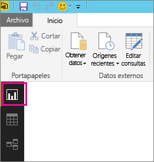
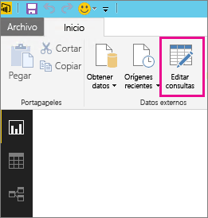
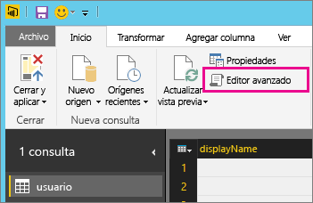
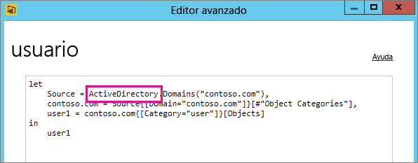

# Solución de problemas de origen de datos no admitido para la actualización
Puede ver un error al intentar configurar un conjunto de datos para la actualización programada.

        You cannot schedule refresh for this dataset because it gets data from sources that currently don’t support refresh.

Esto sucede cuando no se admite el origen de datos que usa, en Power BI Desktop, para la actualización. Tendrá que buscar el origen de datos que está usando y compararlo con la lista de orígenes de datos compatibles en [Actualizar datos en Power BI](refresh-data.md). 

## Búsqueda del origen de datos
Si no está seguro de qué origen de datos se utilizó, puede encontrarlo siguiendo los siguientes pasos en Power BI Desktop.  

1. En Power BI Desktop, asegúrese de que se encuentra en el panel **Informe** .  
   
2. Seleccione **Editar consultas** en la barra de cinta.  
   
3. Seleccione **Editor avanzado**.  
   
4. Tome nota del proveedor que aparece para el origen.  En este ejemplo, el proveedor es Active Directory.  
   
5. Compare el proveedor con la lista de orígenes de datos admitidos que se encuentra en los [orígenes de datos de Power BI](power-bi-data-sources.md).

## Pasos siguientes
[Actualización de datos](refresh-data.md)  
[Power BI Gateway - Personal](service-gateway-personal-mode.md)  
[Puerta de enlace de datos local](service-gateway-onprem.md)  
[Solución de problemas con la puerta de enlace de datos local](service-gateway-onprem-tshoot.md)  
[Solución de problemas de Power BI Gateway - Personal](service-admin-troubleshooting-power-bi-personal-gateway.md)  

¿Tiene más preguntas? [Pruebe a preguntar a la comunidad de Power BI](https://community.powerbi.com/)

