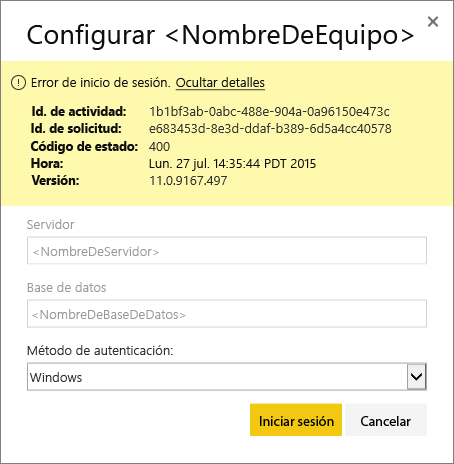
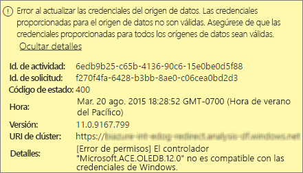
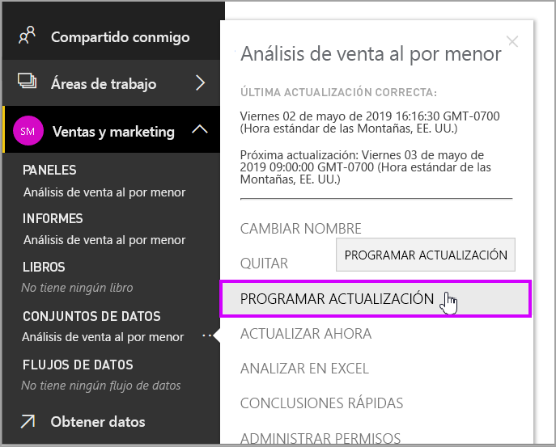
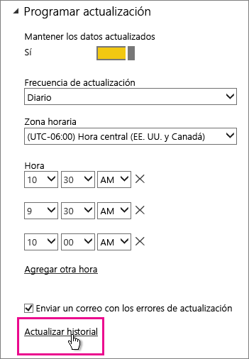
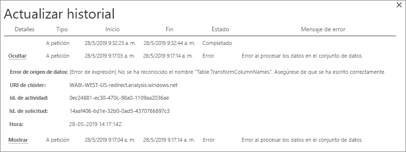
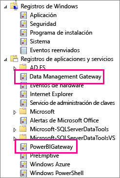
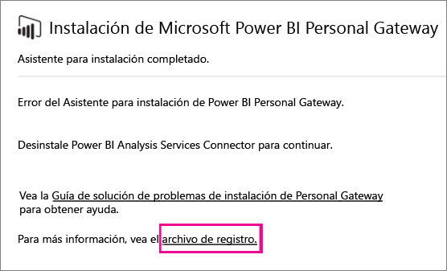
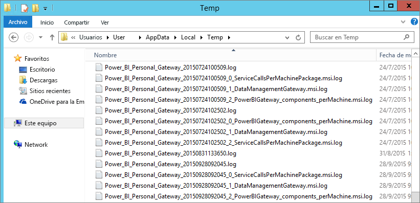

# Solución de problemas de Power BI Gateway - Personal
Las siguientes secciones se vaya a través de algunos problemas comunes que puede encontrarse al usar el Power BI Gateway-Personal.

> [!NOTE]
> La versión actual de la puerta de enlace para uso personal es la **puerta de enlace de datos local (personal)**. Actualice la instalación para usar esa versión.
> 
> 

## Actualizar a la versión más reciente
Pueden surgir muchos problemas cuando la versión de la puerta de enlace no está actualizada.  Es una buena práctica general para asegurarse de que se encuentra en la versión más reciente. Si no ha actualizado la puerta de enlace durante un mes, o más, considere la posibilidad de instalar la versión más reciente de la puerta de enlace. A continuación, vea si puede reproducir el problema.

## Instalación
**Puerta de enlace personal es de 64 bits** -si la máquina es de 32 bits, no se puede instalar la puerta de enlace personal. El sistema operativo tiene que ser la versión de 64 bits. Instale una versión de 64 bits de Windows o instale la puerta de enlace personal en un equipo de 64 bits.

**No se puede instalar como un servicio, aunque sea un administrador local para el equipo de puerta de enlace personal** -instalación puede fallar si el usuario está en el grupo de administradores locales del equipo, pero la directiva de grupo no permite ese nombre de usuario iniciar sesión como un servicio. En este momento, asegúrese de que la directiva de grupo permite a un usuario inicie sesión como un servicio. Estamos trabajando para solucionar este problema. [Más información](https://technet.microsoft.com/library/cc739424.aspx)

**Operación agotó el tiempo de espera** : este mensaje es frecuente si el equipo (físico o máquina virtual) en el que va a instalar la puerta de enlace personal tiene un procesador de núcleo único. Cierre todas las aplicaciones y desactive todos los procesos que no sean esenciales. Luego, intente realizar la instalación de nuevo.

**Data Management Gateway o Analysis Services Connector no puede instalarse en el mismo equipo que la puerta de enlace personal** : si ya tiene de Analysis Services Connector o Data Management Gateway instalado, primero debe desinstalar el conector o la puerta de enlace. A continuación, intente instalar la puerta de enlace personal.

> [!NOTE]
> Si encuentra algún problema durante la instalación, los registros de instalación pueden proporcionar información para ayudarle a resolver el problema. Para obtener más información, consulte [los registros de instalación](#SetupLogs).
> 
> 

 **Configuración de proxy** pueden producirse problemas con la configuración de la puerta de enlace personal si su entorno necesita el uso de un servidor proxy. Para obtener más información sobre cómo configurar la información de proxy, consulte [Configuring proxy settings for the Power BI Gateways](service-gateway-proxy.md) (Configuración de proxy para las puertas de enlace de Power BI).

## Programar actualización
**Error: Falta la credencial almacenada en la nube.**

Podría recibir este error en configuración de \<dataset\> si tiene una actualización programada y, a continuación, desinstala y vuelve a instalar la puerta de enlace personal. Cuando se desinstala una puerta de enlace personal, se quitan las credenciales del origen de datos para un conjunto de datos que se ha configurado para la actualización desde el servicio Power BI.

**Solución:** En Power BI, vaya a la configuración de actualización de un conjunto de datos. En Administrar orígenes de datos, para cualquier origen de datos con un error, seleccione **editar credenciales** e inicie sesión en el origen de datos.

**Error: Las credenciales proporcionadas para el conjunto de datos no son válidas. Actualice las credenciales a través de una actualización o en el cuadro de diálogo Configuración de origen de datos para continuar.**

**Solución**: Si recibe un mensaje de credenciales, puede significar que:

* Asegúrese de que los nombres de usuario y contraseñas para iniciar sesión en los orígenes de datos están actualizadas. En Power BI, vaya a la configuración de actualización de un conjunto de datos. En Administrar orígenes de datos, seleccione **editar credenciales** para actualizar las credenciales del origen de datos.
* Mashups entre un origen en la nube y un origen local, en una sola consulta, no pueden actualizarse en la puerta de enlace personal si uno de los orígenes usa OAuth para la autenticación. Un ejemplo de este problema es un mashup entre CRM Online y local de SQL Server. El mashup produce un error porque CRM Online requiere OAuth.
  
  Este error es un problema conocido y se está examinando. Para solucionar el problema, tiene una consulta independiente para el origen en la nube y el origen local. A continuación, utilice una combinación o anexe la consulta para combinarlos.

**Error: Origen de datos no admitido.**

**Solución:** si recibe un mensaje de origen de datos no admitido en la configuración de Programar actualización, puede tener el significado que se indica a continuación: 

* El origen de datos no se admite actualmente para la actualización en Power BI. 
* El libro de Excel no contiene un modelo de datos, solo los datos de hoja de cálculo. Actualmente, Power BI solo admite la actualización si el libro de Excel cargado contiene un modelo de datos. Al importar datos mediante Power Query en Excel, asegúrese de elegir la opción para cargar los datos en el modelo de datos. Esta opción garantiza que se importan datos en un modelo de datos. 

**Error: [No se pueden combinar datos] &lt;parte de la consulta&gt;/&lt;... &gt; / &lt;... &gt; está accediendo a orígenes de datos con niveles de privacidad, que no pueden usarse juntos. Vuelva a generar esta combinación de datos.**

**Solución**: Este error es debido a las restricciones de nivel de privacidad y los tipos de orígenes de datos que está usando.

**Error: Error de origen de datos: no se puede convertir el valor "\[Table\]" al tipo Table.**

**Solución**: Este error es debido a las restricciones de nivel de privacidad y los tipos de orígenes de datos que está usando.

**Error: No hay suficiente espacio para esta fila.**

Este error se produce si tiene una sola fila mayor que 4 MB de tamaño. Busque la fila del origen de datos e intentar filtrarla o reducir el tamaño de esa fila.

## Orígenes de datos
**Proveedor de datos que faltan** : la puerta de enlace personal es solo la versión de 64 bits. Para que los proveedores de datos se puedan instalar en el mismo equipo que la puerta de enlace personal, se requiere una versión de 64 bits. Por ejemplo, si el origen de datos del conjunto de datos es Microsoft Access, debe instalar al proveedor ACE de 64 bits en el mismo equipo en el que instaló la puerta de enlace personal.  

>[!NOTE]
>Si tiene Excel de versión de 32 bits, no puede instalar a un proveedor ACE de la versión de 64 bits en el mismo equipo.

**No se admite la autenticación de Windows en la base de datos de Access**: actualmente, Power BI solo admite la autenticación anónima para la base de datos de Access. Estamos trabajando en habilitar la autenticación de Windows para la base de datos Access.

**Error iniciar sesión al especificar las credenciales para un origen de datos** -si se produce un error como este al escribir las credenciales de Windows para un origen de datos, es posible que en una versión anterior de la puerta de enlace personal. [Instale la versión más reciente de Power BI Gateway - Personal](https://powerbi.microsoft.com/gateway/).

  

**Error: Error de inicio de sesión al seleccionar la autenticación de Windows para un origen de datos mediante ACE OLEDB**: si se muestra el siguiente error al especificar las credenciales de origen de datos para un origen de datos mediante el proveedor ACE OLEDB:

Power BI no admite actualmente la autenticación de Windows para un origen de datos mediante el proveedor ACE OLEDB.

**Solución:** Para solucionar este error, puede seleccionar **autenticación anónima**. Para el proveedor ACE OLEDB heredado, credenciales anónimas equivalen a las credenciales de Windows.

## Actualización de iconos
Si recibe un error con Actualizar iconos del panel, consulte el artículo siguiente.

[Solución de problemas de errores de icono](refresh-troubleshooting-tile-errors.md)

## Herramientas de solución de problemas
### Actualizar historial
**Historial de actualización** le ayuda a ver qué errores se han producido y proporciona datos útiles si necesita crear una solicitud de soporte técnico. Puede ver tanto programadas y a petición, las actualizaciones. Mostramos cómo tener acceso a la **Actualizar historial**.

1. En el panel de navegación de Power BI, en **Conjuntos de datos**, seleccione un conjunto de datos &gt; menú Abrir &gt; **Programar actualización**.
   
1. En **configuración...** , seleccione **Actualizar historial**.  
   
   
   

### Registros de eventos
Varios registros de eventos puede proporcionar información. Las dos primeras, **Data Management Gateway** y **PowerBIGateway**, están presentes si es un administrador en el equipo.  Si no es un administrador y utiliza Personal Gateway, verá las entradas del registro dentro de la **aplicación** registro.

Los registros **Data Management Gateway** y **PowerBIGateway** están presentes en el área de **Registros de aplicaciones y servicios**.

### Seguimiento de Fiddler
[Fiddler](http://www.telerik.com/fiddler) es una herramienta gratuita de Telerik que supervisa el tráfico HTTP. Puede ver la comunicación con el servicio Power BI desde el equipo cliente. Esta comunicación puede mostrar errores y otra información relacionada.

### Registros de instalación
Si el **puerta de enlace Personal**, no se puede instalar, verá un vínculo para mostrar el registro de instalación. El registro de instalación puede mostrar los detalles sobre el error. Estos registros son registros de instalación de Windows, también conocidos como registros MSI. Pueden ser bastante complejos y difíciles de leer. Normalmente, el error resultante es en la parte inferior, pero determinar la causa del error no es trivial. Podría ser el resultado de errores en un registro diferente, o de un error que aparece más arriba en el registro.

O bien, puede ir a su **carpeta Temp** (% temp %) y busque los archivos que empiezan por **Power\_BI\_**.

> [!NOTE]
> Si va a %temp%, es posible que llegue a una subcarpeta de archivos temporales. El **Power\_BI\_**  archivos están en la raíz del directorio temporal.  Puede que tenga que subir un nivel o dos.
> 
> 

## Pasos siguientes
[Configuración de proxy para Power BI Gateways](service-gateway-proxy.md)  
[Actualización de datos](refresh-data.md)  
[Power BI Gateway - Personal](service-gateway-personal-mode.md)  
[Solución de problemas de errores de icono](refresh-troubleshooting-tile-errors.md)  
[Solución de problemas con la puerta de enlace de datos local](service-gateway-onprem-tshoot.md)  
¿Tiene más preguntas? [Pruebe la comunidad de Power BI](http://community.powerbi.com/)

