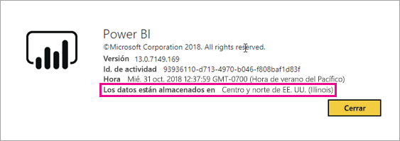
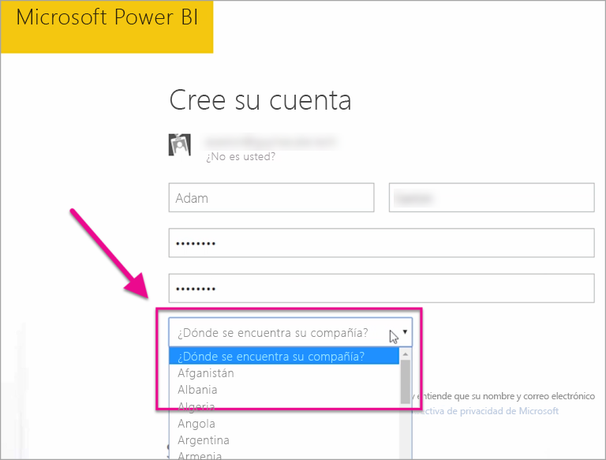

# ¿Dónde se encuentra mi inquilino de Power BI?

<iframe width="560" height="315" src="https://www.youtube.com/embed/0fOxaHJPvdM?showinfo=0" frameborder="0" allowfullscreen></iframe>

Obtenga información sobre dónde se encuentra su inquilino de Power BI y cómo se selecciona esa ubicación. Saber la ubicación es importante, ya que puede afectar a las interacciones que tiene con el servicio.

## Cómo determinar dónde se encuentra el inquilino de Power BI

Para buscar la región en la que se encuentra su inquilino, siga estos pasos.

1. En el servicio Power BI, en el menú superior, seleccione Ayuda (**?**) y, a continuación, **Acerca de Power BI**.

1. Busque el valor situado junto a **Los datos están almacenados en**. Esta es la región donde se encuentra el inquilino.

    

## Cómo se selecciona la región de datos

La región de datos se basa en el país que seleccionó al crear el inquilino. Esto se aplica a la suscripción a Office 365 además de a Power BI, ya que esta información se comparte. Si se trata de un nuevo inquilino, seleccione el país correspondiente en la lista cuando se suscriba.

Power BI selecciona una región de datos más cercana a esta selección, que determina dónde se almacenan los datos del inquilino.

> [!IMPORTANT]
> No se puede cambiar esta selección después de crear el inquilino.

¿Tiene más preguntas? [Pruebe la comunidad de Power BI](http://community.powerbi.com/)

