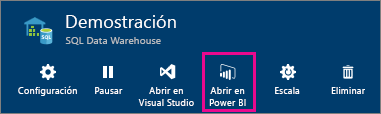
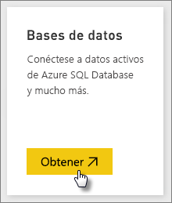
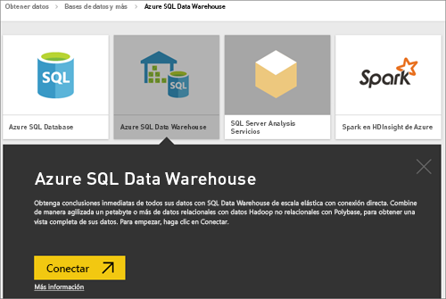
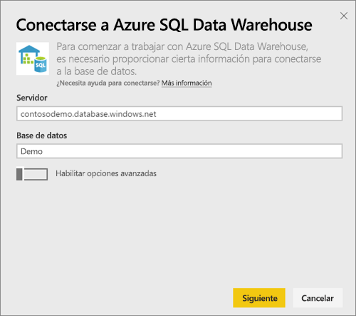
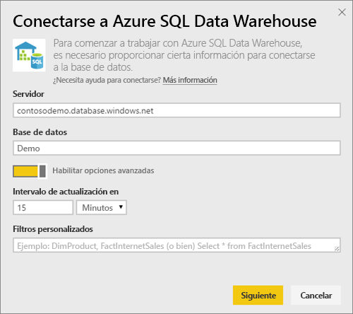
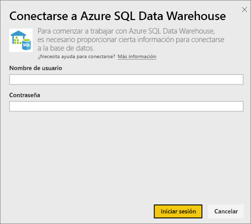
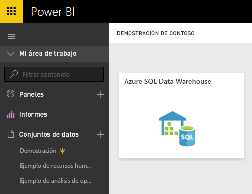
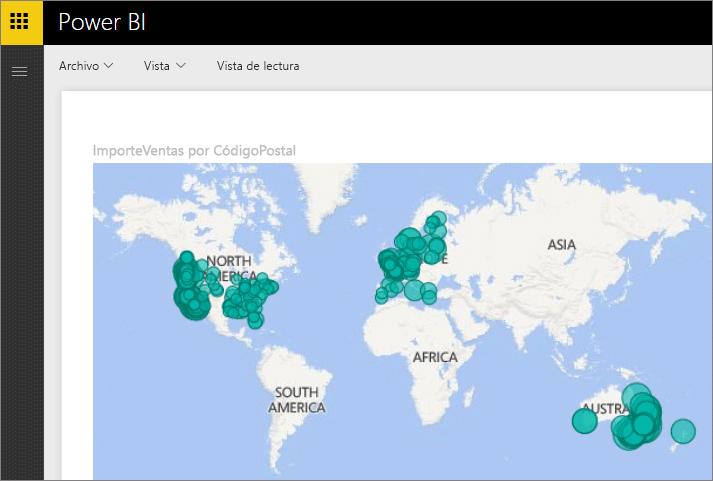
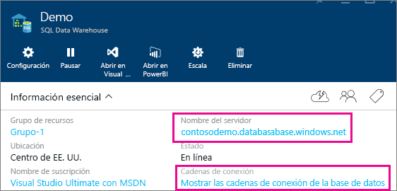

# Azure SQL Data Warehouse con DirectQuery

Azure SQL Data Warehouse con DirectQuery permite crear informes dinámicos en función de los datos y métricas que ya existen en Azure SQL Data Warehouse. Con DirectQuery, las consultas se vuelven a enviar a Azure SQL Data Warehouse en tiempo real a medida que explora los datos. Las consultas en tiempo real, combinadas con el escalado de SQL Data Warehouse, permiten a los usuarios crear informes dinámicos en cuestión de minutos con terabytes de datos. Además, la incorporación del botón **Abrir en Power BI** permite a los usuarios conectar directamente Power BI co SQL Data Warehouse sin tener que especificar manualmente la información.

Cuando use el conector de SQL Data Warehouse:

* Especifique el nombre completo del servidor cuando se conecte (consulte los detalles más abajo).
* Asegúrese de que las reglas de firewall del servidor están configuradas en "Permitir el acceso a los servicios de Azure".
* Cada acción, como seleccionar una columna o agregar un filtro, enviará directamente una consulta al almacenamiento de datos.
* Los iconos se configuran para actualizarse aproximadamente cada 15 minutos y no es necesario programar la actualización.  La actualización se puede ajustar en la configuración avanzada al conectarse.
* Preguntas y respuestas no está disponible para conjuntos de datos de DirectQuery.
* los cambios de esquema no se recogen automáticamente

Estas restricciones y notas pueden cambiar mientras seguimos mejorando las experiencias. A continuación, se detallan los pasos para conectarse.

## Uso del botón "Abrir en Power BI"

> [!Important]
> Hemos mejorado la conectividad con Azure SQL Data Warehouse.  Use Power BI Desktop para disfrutar de la mejor experiencia de conexión al origen de datos de Azure SQL Data Warehouse.  Una vez creados el modelo y el informe, puede publicarlos en el servicio Power BI.  Ahora, el conector directo de Azure SQL Data Warehouse en el servicio Power BI está en desuso.

La manera más sencilla de cambiar entre SQL Data Warehouse y Power BI es con el botón **Abrir en Power BI** en Azure Portal. Este botón le permite comenzar a crear sin ningún problema nuevos paneles en Power BI.

1. Para comenzar, vaya a su la instancia de SQL Data Warehouse en Azure Portal. Tenga en cuenta que SQL Data Warehouse solo está presente en Azure Portal en este momento.

2. Haga clic en el botón **Abrir en Power BI** .

    

3. Si no es posible iniciar sesión directamente o si no dispone de una cuenta de Power BI, deberá iniciar sesión.

4. Se le redirigirá a la página de conexión de SQL Data Warehouse, con la información de SQL Data Warehouse previamente completada. Especifique sus credenciales y seleccione la opción de conexión para crear una conexión.

## Conexión a través de Power BI

SQL Data Warehouse también se muestra en la página Obtener datos de Power BI. 

1. Seleccione **Obtener datos** en la parte inferior del panel de navegación izquierdo.  

    

2. En **Bases de datos**, seleccione **Obtener**.

    

3. Seleccione **SQL Data Warehouse**\>**Conectar**.

    

4. Escriba la información necesaria para conectarse. En la sección **Búsqueda de parámetros** siguiente se muestra dónde se encuentran estos datos en Azure Portal.

    

    

    

   > [!NOTE]
   > El nombre de usuario será un usuario definido en la instancia de Azure SQL Data Warehouse.

5. Profundice en el conjunto de datos seleccionando el nuevo icono o el conjunto de datos recién creado, indicado por un asterisco. Este conjunto de datos tendrá el mismo nombre que la base de datos.

    

6. Puede explorar todas las tablas y columnas. Si selecciona una columna enviará una consulta al origen y se creará dinámicamente el objeto visual. Los filtros también se volverán a transformar en consultas en el almacenamiento de datos. Estos elementos visuales pueden guardarse en un informe nuevo y anclarse de nuevo al panel.

    

## Buscar valores de parámetro

El nombre completo del servidor y el nombre de la base de datos pueden encontrarse en Azure Portal. Tenga en cuenta que SQL Data Warehouse solo está presente en Azure Portal en este momento.

> [!NOTE]
> Si su inquilino de Power BI está en la misma región que Azure SQL Data Warehouse, no habrá ningún cargo de salida. Para encontrar la ubicación de su inquilino de Power BI, use [estas instrucciones](https://docs.microsoft.com/power-bi/service-admin-where-is-my-tenant-located).

[!INCLUDE [direct-query-sso](includes/direct-query-sso.md)]

## Pasos siguientes

* [¿Qué es Power BI?](power-bi-overview.md)  
* [Obtener datos para Power BI](service-get-data.md)  
* [Azure SQL Data Warehouse](/azure/sql-data-warehouse/sql-data-warehouse-overview-what-is/)

¿Tiene más preguntas? [Pruebe la comunidad de Power BI](http://community.powerbi.com/)
