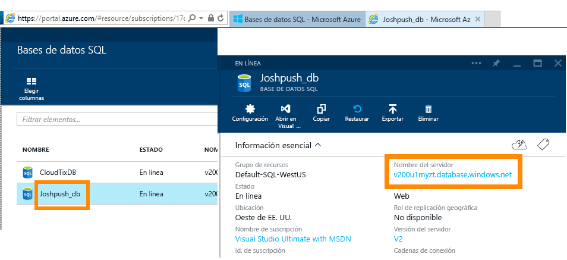
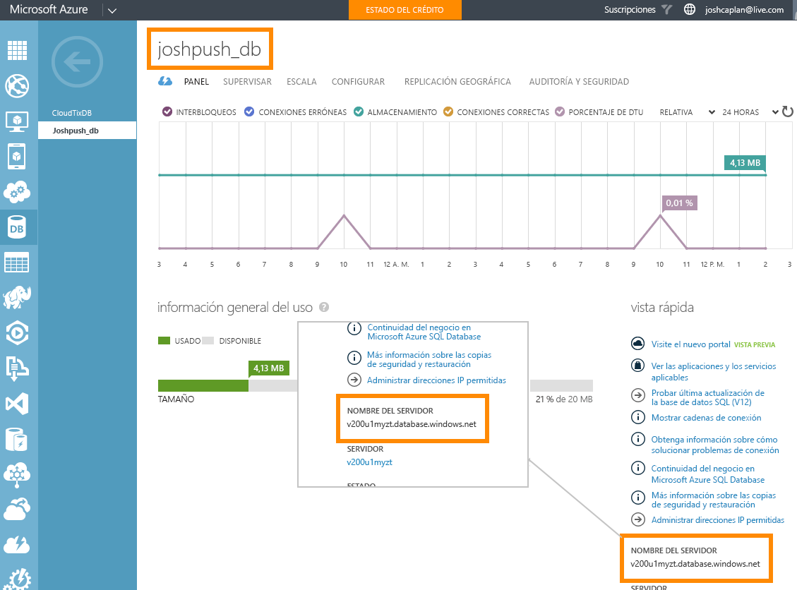

# Azure SQL Database con DirectQuery

Obtenga información sobre cómo puede conectarse directamente a Azure SQL Database y crear informes que usan datos activos. Puede mantener los datos en el origen y no en Power BI.

Con DirectQuery, las consultas se envían a Azure SQL Database a medida que explora los datos en la vista de informe. Se sugiere esta experiencia para los usuarios que están familiarizados con las bases de datos y entidades a las que se conectan.

**Notas:**

* Especifique el nombre completo del servidor cuando se conecte (consulte a continuación para obtener más detalles).
* Asegúrese de que las reglas de firewall de la base de datos están configuradas en "[Permitir el acceso a servicios de Azure](https://docs.microsoft.com/azure/sql-database/sql-database-networkaccess-overview#allow-azure-services)".
* Cada acción, como seleccionar una columna o agregar un filtro, enviará una consulta a la base de datos.
* Los iconos se actualizan cada hora (no es necesario programar la actualización). Puede ajustar la frecuencia de actualización en la configuración avanzada al conectarse.
* Preguntas y respuestas no está disponible para conjuntos de datos de DirectQuery.
* Los cambios de esquema no se capturan automáticamente.

Estas restricciones y notas pueden cambiar mientras seguimos mejorando las experiencias. A continuación, se detallan los pasos para conectarse.

> [!Important]
> Hemos mejorado la conectividad con Azure SQL Database.  Use Power BI Desktop para disfrutar de la mejor experiencia de conexión al origen de datos de Azure SQL Database.  Una vez creados el modelo y el informe, puede publicarlos en el servicio Power BI.  El conector directo de Azure SQL Database en el servicio Power BI se encuentra en desuso.

## Power BI Desktop y DirectQuery

Para conectarse a Azure SQL Database mediante DirectQuery, debe usar Power BI Desktop. Este enfoque proporciona más flexibilidad y capacidades. Los informes creados mediante Power BI Desktop se pueden publicar en el servicio Power BI. Puede obtener más información sobre cómo conectarse a [Azure SQL Database mediante DirectQuery](desktop-use-directquery.md) en Power BI Desktop.

## Búsqueda de valores de parámetro

Puede encontrar el nombre completo del servidor y el nombre de la base de datos en Azure Portal.

[!INCLUDE [direct-query-sso](includes/direct-query-sso.md)]

## Pasos siguientes

* [Usar DirectQuery en Power BI Desktop](desktop-use-directquery.md)  
* [¿Qué es Power BI?](fundamentals/power-bi-overview.md)  
* [Obtener datos para Power BI](service-get-data.md)  

¿Tiene más preguntas? [Consulte la comunidad de Power BI](http://community.powerbi.com/)
