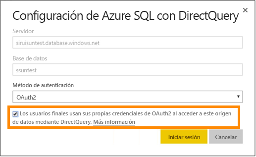

# Azure SQL Database con DirectQuery

Obtenga información sobre cómo puede conectarse directamente a Azure SQL Database y crear informes que usan datos activos. Puede mantener los datos en el origen y no en Power BI.

Con DirectQuery, las consultas se envían a Azure SQL Database a medida que explora los datos en la vista de informe. Se sugiere esta experiencia para los usuarios que están familiarizados con las bases de datos y entidades a las que se conectan.

**Notas:**

* Especifique el nombre completo del servidor cuando se conecte (consulte más abajo para obtener más detalles)
* Asegúrese de que las reglas de firewall para la base de datos están configuradas en "[Permitir el acceso a los servicios de Azure](https://msdn.microsoft.com/library/azure/ee621782.aspx)"
* Cada acción, como seleccionar una columna o agregar un filtro, enviará una consulta a la base de datos
* Los iconos se actualizan cada hora (no es necesario programar la actualización). Se puede ajustar en la configuración avanzada al conectarse.
* Preguntas y respuestas no está disponible para conjuntos de datos de DirectQuery.
* Los cambios de esquema no se recogen automáticamente

Estas restricciones y notas pueden cambiar mientras seguimos mejorando las experiencias. A continuación, se detallan los pasos para conectarse.

> [!Important]
> Hemos mejorado la conectividad con Azure SQL Database.  Use Power BI Desktop para disfrutar de la mejor experiencia de conexión al origen de datos de Azure SQL Database.  Una vez creados el modelo y el informe, puede publicarlos en el servicio Power BI.  El conector directo de Azure SQL Database en el servicio Power BI se encuentra en desuso.

## Power BI Desktop y DirectQuery

Para conectarse a Azure SQL Database mediante DirectQuery, debe usar Power BI Desktop. Este enfoque proporciona más flexibilidad y capacidades. Los informes creados mediante Power BI Desktop se pueden publicar en el servicio Power BI. Puede obtener más información sobre cómo conectarse a [Azure SQL Database mediante DirectQuery](desktop-use-directquery.md) en Power BI Desktop.

## Inicio de sesión único

Después de publicar un conjunto de datos DirectQuery de Azure SQL en el servicio, puede habilitar el inicio de sesión único (SSO) a través de OAuth2 de Azure Active Directory (Azure AD) para los usuarios finales.

Para habilitar el inicio de sesión único, vaya a la configuración del conjunto de datos, abra la pestaña **Orígenes de datos** y active la casilla SSO.

Cuando se habilita la opción SSO y los usuarios pueden acceder a los informes creados sobre el origen de datos, Power BI envía sus credenciales autenticadas de Azure AD en las consultas a la instancia de Azure SQL Database. Esto permite a Power BI respetar la configuración de seguridad establecida en el nivel de origen de datos.

La opción SSO surte efecto en todos los conjuntos de datos que usan este origen de datos. No afecta el método de autenticación utilizado para los escenarios de importación.

> [!Note]
> No se admite Azure Multi-Factor Authentication (MFA). Los usuarios que quieran usar SSO con Azure SQL DirectQuery deben excluirse de MFA.

## Buscar valores de parámetro

El nombre completo del servidor y el nombre de la base de datos pueden encontrarse en Azure Portal.

## Pasos siguientes

* [Usar DirectQuery en Power BI Desktop](desktop-use-directquery.md)  
* [¿Qué es Power BI?](power-bi-overview.md)  
* [Obtener datos para Power BI](service-get-data.md)  

¿Tiene más preguntas? [Pruebe la comunidad de Power BI](http://community.powerbi.com/)
