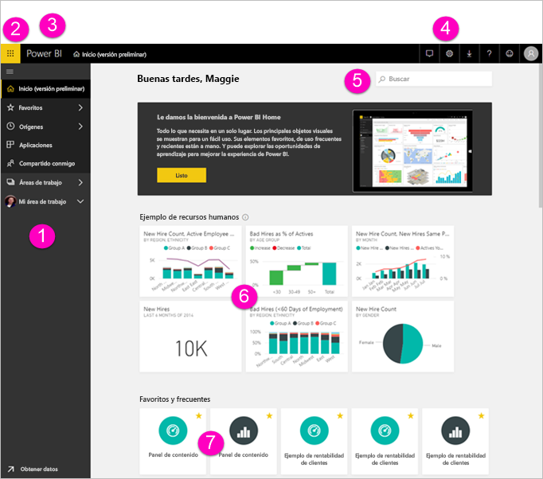
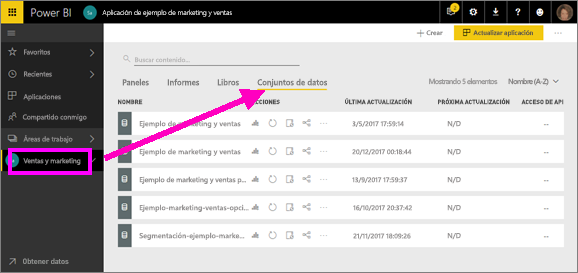
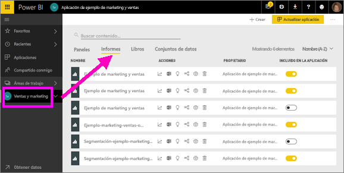
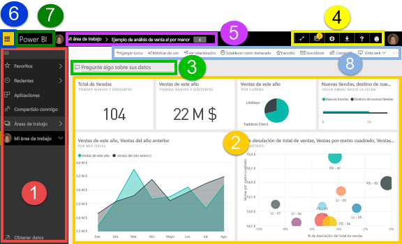
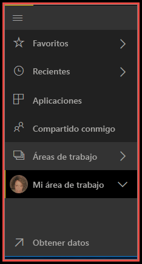
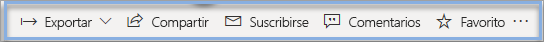

# Conceptos básicos para los diseñadores en el servicio Power BI

En este artículo se da por supuesto que ya se ha [registrado en el servicio Power BI](service-self-service-signup-for-power-bi.md) y ha [agregado algunos datos](service-get-data.md). Si aún no tiene ningún dato, pruebe a instalar un [paquete de contenido de ejemplo de Power BI](sample-datasets.md#the-power-bi-samples-as-content-packs).

Estos son los elementos que se ven al abrir el servicio Power BI en el explorador:

1. Panel de navegación (izquierdo)
2. Iniciador de aplicaciones de Office 365
3. Botón Inicio de Power BI
4. Botones de iconos, incluidos los de configuración, ayuda y comentarios
5. Cuadro de búsqueda
6. Mosaicos de un panel favoritos
7. Informes y paneles favoritos y frecuentes

Más adelante se explicarán estas características de forma detallada, pero primero analizaremos algunos conceptos de Power BI.

Conviene ver este vídeo antes de leer el resto del artículo.  En el video, Will da un repaso a los conceptos básicos y muestra el servicio Power BI.

<iframe width="560" height="315" src="https://www.youtube.com/embed/B2vd4MQrz4M" frameborder="0" allowfullscreen></iframe>

## Conceptos de Power BI
Los cuatro pilares principales de Power BI son los **_paneles_**, los **_informes_**, los **_libros_** y los **_conjuntos de datos_**. Y todos ellos se organizan en **_áreas de trabajo_**. Es importante comprender las áreas de trabajo antes de profundizar en los cuatro bloques de creación, así que vamos a empezar por ahí.

## Áreas de trabajo
Las áreas de trabajo son contenedores de paneles, informes, libros y conjuntos de datos de Power BI. Existen dos tipos de áreas de trabajo: *Mi área de trabajo* y las *áreas de trabajo de la aplicación*. ¿Qué es una *aplicación*? Una *aplicación* de Power BI es una colección de paneles e informes creada para presentar las métricas clave de su organización. Las aplicaciones son interactivas, pero no se pueden editar.

- *Mi área de trabajo* es el área de trabajo personal de cualquier cliente de Power BI en la que puede trabajar con su contenido. Solo usted tiene acceso a esta área de trabajo. Puede compartir paneles e informes desde Mi área de trabajo. Si desea colaborar en paneles e informes o crear una aplicación, querrá trabajar en el área de trabajo de una aplicación.      
-  Las *áreas de trabajo de la aplicación* se usan para colaborar y compartir el contenido con los compañeros. También son los lugares donde puede crear, publicar y administrar aplicaciones para su organización. Piense en ellas como áreas de almacenamiento provisional y contenedores del contenido que compondrá una aplicación de Power BI. Puede agregar compañeros a las áreas de trabajo de la aplicación y colaborar en paneles, informes, libros y conjuntos de datos. Todos los miembros del área de trabajo de la aplicación necesitan licencias de Power BI Pro, pero los consumidores de la aplicación (los compañeros que tienen acceso a las aplicaciones) no las necesitan.  

Para más información, consulte la sección **Compartir tu trabajo** de la tabla de contenido, empezando por [¿Cómo debo compartir paneles e informes y colaborar en ellos?](service-how-to-collaborate-distribute-dashboards-reports.md)

Ahora pasemos a los bloques de creación de Power BI. No se pueden tener paneles ni informes sin datos (bueno, se pueden tener paneles e informes vacíos, pero no serán útiles hasta que tengan datos), por eso comenzaremos con **conjuntos de datos**.

## Conjuntos de datos
Un *conjunto de datos* es una colección de datos que *importa* o a lo que se *conecta*. Power BI permite importar y conectar con todos los tipos de conjuntos de datos y ponerlos todos en un solo lugar.  

Los conjuntos de datos están asociados a *áreas de trabajo* y un único conjunto de datos puede formar parte de muchas áreas de trabajo. Cuando se abre un área de trabajo, los conjuntos de datos asociados aparecen en la pestaña **Conjuntos de datos**. Cada conjunto de datos de la lista representa un origen de datos, por ejemplo, un libro de Excel en OneDrive, un conjunto de datos tabulares locales de SSAS o una base de datos de Salesforce. Hay muchos orígenes de datos compatibles diferentes y estamos agregando nuevos todo el tiempo. [Consulte la lista de tipos de conjuntos de datos que se pueden usar con Power BI.](service-get-data.md)

En el ejemplo siguiente, he seleccionado el área de trabajo de la aplicación "Ventas y marketing" y he hecho clic en la pestaña de **Conjuntos de datos**.

**Un único** conjunto de datos...

* puede utilizarse una y otra vez en una o varias áreas de trabajo.
* se puede usar en muchos informes diferentes.
* Las visualizaciones de ese conjunto de datos se pueden mostrar en muchos paneles diferentes.

  

Para [importar o conectarse a un conjunto de datos](service-get-data.md), seleccione **Obtener datos** (en la parte inferior de la barra de navegación izquierda) o seleccione **+ Crear > Conjunto de datos** (en la esquina superior derecha). Siga las instrucciones para importar o conectarse al origen específico y agregue el conjunto de datos al área de trabajo activa. Los nuevos conjuntos de datos se marcan con un asterisco amarillo. El trabajo que realice en Power BI no cambiará el conjunto de datos subyacente.

Si [forma parte de un **_área de trabajo de la aplicación_**](service-collaborate-power-bi-workspace.md), los conjuntos de datos agregados por un miembro del área de trabajo están disponibles para los demás miembros del área de trabajo.

Los conjuntos de datos se pueden actualizar, cambiar de nombre, explorar y eliminar. Use un conjunto de datos para crear un informe desde cero o mediante la ejecución de [información rápida](service-insights.md).  Para ver qué informes y paneles ya están usando un conjunto de datos, seleccione **Ver relacionados**. Para explorar un conjunto de datos, selecciónelo. Lo que realmente está haciendo es abrir el conjunto de datos en el editor de informes, donde puede empezar realmente a profundizar en los datos y a crear visualizaciones. Ahora vamos a pasar al tema siguiente: informes.

### Análisis en profundidad
* [¿Qué es Power BI Premium?](service-premium.md)
* [Obtener datos para Power BI](service-get-data.md)
* [Conjuntos de datos de ejemplo para Power BI](sample-datasets.md)

## Informes
Un informe de Power BI se compone de una o más páginas de visualizaciones, como gráficos de líneas, mapas y gráficos de rectángulos. A las visualizaciones también se les denomina **_objetos visuales_**. Todas las visualizaciones de un informe proceden de un único conjunto de datos. Los informes pueden crearse desde cero en Power BI, pueden importarse con paneles que otros compañeros comparten con usted o pueden crearse al conectarse a conjuntos de datos de Excel, Power BI Desktop, bases de datos, aplicaciones SaaS y [aplicaciones](service-get-data.md).  Por ejemplo, cuando se conecta a un libro de Excel que contiene hojas de Power View, Power BI crea un informe basado en dichas hojas. Y cuando se conecta a una aplicación de SaaS, Power BI importa un informe previamente creado.

Hay dos maneras de ver los informes e interactuar con ellos: [la vista de lectura y la vista de edición](service-reading-view-and-editing-view.md).  Solo la persona que ha creado el informe, los copropietarios y los usuarios con permisos tienen acceso a todas las funcionalidades de exploración, diseño, creación y uso compartido de la **_Vista de edición_** de ese informe. Las personas con las que comparta el informe pueden explorarlo e interactuar con él mediante la **_vista de lectura_**.   

Cuando se abre un área de trabajo, los informes asociados aparecen en la pestaña **Informes**. Cada informe de la lista representa una o más páginas de visualizaciones basadas en solo uno de los conjuntos de datos subyacentes. Para abrir un informe, selecciónelo.

Cuando abre una aplicación, se le muestra un panel.  Para acceder a un informe subyacente, seleccione un icono del panel (se proporciona más información sobre los iconos más adelante) que se ha anclado desde un informe. Tenga en cuenta que no todos los iconos se anclan desde los informes, por lo que tendrá que hacer clic en unos cuantos iconos para encontrar un informe.

De forma predeterminada, el informe se abre en la Vista de lectura.  Simplemente seleccione **Editar informe** para abrirlo en la vista de edición (si tiene los permisos necesarios).

En el ejemplo siguiente, he seleccionado el área de trabajo de la aplicación "Ventas y marketing" y he hecho clic en la pestaña de **Informes**.

**UN** informe...

* se encuentra en una misma área de trabajo.
* se puede asociar con varios paneles de esa área de trabajo (los iconos anclados desde ese informe pueden aparecer en varios paneles).
* se puede crear con los datos de un conjunto de datos. (La excepción a esto es que Power BI Desktop puede combinar más de un conjunto de datos en un único informe, y ese informe se puede importar a Power BI).

  

### Análisis en profundidad
* [Informes en el servicio Power BI y en Power BI Desktop](service-reports.md)
* [Informes en las aplicaciones móviles de Power BI](mobile-reports-in-the-mobile-apps.md)

## Paneles
Un *panel* es algo que usted crea **en el servicio Power BI** o que un compañero de trabajo crea **en este** y comparte con usted. Es un lienzo individual que contiene uno o varios iconos y widgets. Cada icono anclado desde un informe o desde [Preguntas y respuestas](power-bi-q-and-a.md) muestra una [visualización](power-bi-report-visualizations.md) única creada a partir de un conjunto de datos y anclada al panel. Además, pueden anclarse páginas de informe completas a un panel como un único icono. Hay muchas maneras de agregar iconos al panel; demasiadas para tratarlas en este tema de información general. Para más información, vea [Iconos del panel en Power BI](service-dashboard-tiles.md).

¿Por qué se crean paneles?  Estas son solo algunas de las razones:

* para observar de un solo vistazo toda la información necesaria para tomar decisiones.
* para supervisar la información más importante sobre su empresa.
* para garantizar que todos los compañeros estén en la misma sintonía, es decir, que vean y usen la misma información.
* para supervisar el correcto funcionamiento de un negocio, producto, unidad de negocio, campaña de marketing, etc.
* para crear una vista personalizada de un panel más grande (con las métricas importantes para usted).

Cuando se abre un área de trabajo, los paneles asociados aparecen en la pestaña **Paneles**. Para abrir un panel, selecciónelo. Cuando abre una aplicación, se le muestra un panel.  Cada panel representa una vista personalizada de algún subconjunto de los conjuntos de datos subyacentes.  Si es el propietario del panel, también tendrá acceso de edición a los conjuntos de datos e informes subyacentes.  Si el panel se ha compartido con usted, podrá modificar el panel y los informes subyacentes, pero no podrá guardar los cambios.

Hay muchas maneras diferentes mediante las que usted o un compañero de trabajo pueden [compartir un panel](service-share-dashboards.md). Power BI Pro es necesario para compartir un panel y puede que sea necesario para ver un panel compartido.

**UN** panel...

* está asociado a una única área de trabajo
* puede mostrar visualizaciones de muchos conjuntos de datos diferentes
* puede mostrar visualizaciones de muchos informes diferentes
* puede mostrar visualizaciones ancladas desde otras herramientas (por ejemplo, Excel)

  

### Análisis en profundidad
* [Cree un nuevo panel en blanco y, a continuación, obtenga algunos datos](service-dashboard-create.md).
* [Duplicar un panel](service-dashboard-copy.md)
* [Crear una vista de teléfono de un panel](service-create-dashboard-mobile-phone-view.md)

## Libros
Los libros son un tipo especial de conjunto de datos. Si ha leído la sección anterior **Conjuntos de datos**, sabrá casi todo lo que necesita saber acerca de los libros. Pero quizás se pregunte por qué a veces, Power BI clasifica un libro de Excel como un **conjunto de datos** y otras veces como un **libro**.

Cuando usa **Obtener datos** con archivos de Excel, tiene la opción de *Importar* o *Conectarse* al archivo. Si elige Conectar, aparecerá el libro en Power BI tal como lo haría en Excel Online. Sin embargo, a diferencia de Excel Online, podrá disfrutar de algunas funciones fantásticas que le ayudarán a anclar elementos de las hojas de cálculo directamente en los paneles.

No puede editar el libro en Power BI, pero si necesita realizar algunos cambios, haga clic en Editar y, a continuación, edite el libro en Excel Online o ábralo en Excel en el equipo. Todos los cambios que realice se guardarán en el libro en OneDrive.

### Análisis en profundidad
* [Obtención de datos de archivos de libro de Excel](service-excel-workbook-files.md)
* [Publicación en Power BI desde Excel 2016](service-publish-from-excel.md)

## Panel en Mi área de trabajo
Se han analizado áreas de trabajo y bloques de creación. Vamos a aunarlo todo y a revisar las partes que conforman la experiencia de panel en el servicio Power BI.

### 1. **Panel de navegación** (izquierdo)
Use el panel de navegación para localizar y moverse entre las áreas de trabajo y los bloques de creación de Power BI: paneles, informes, libros y conjuntos de datos.  

  

* Seleccione **Obtener datos** para [agregar conjuntos de datos, informes y paneles a Power BI](service-get-data.md).
* Expanda y contraiga el panel de navegación con este icono .
* Abra o administre su contenido favorito seleccionando **Favoritos**.
* Vea y abra los últimos contenidos que ha visitado seleccionando **Reciente**.
* Vea, abra o elimine una aplicación mediante **Aplicaciones**.
* ¿Ha compartido contenido un compañero con usted? Seleccione **Compartido conmigo** para buscar y ordenar ese contenido para encontrar lo que necesita.
* Haga clic en **Áreas de trabajo** para mostrar y abrir las áreas de trabajo.

Haga clic en estos elementos:

* en un icono o título para abrir en la vista de contenido
* en una flecha derecha (>) para abrir un menú flotante de Favoritos, Recientes y Áreas de trabajo.
* un icono de comillas angulares para mostrar la lista desplazable **Mi área de trabajo** con los paneles, informes, libros y conjuntos de datos.

### 2. **Lienzo**
Dado que se ha abierto un panel, el área del lienzo muestra los iconos de la visualización. Si, por ejemplo, se hubiera abierto el editor de informes, el área del lienzo mostraría una página del informe.

Los paneles se componen de [iconos](service-dashboard-tiles.md).  Los iconos se crean en la vista de edición del informe, en preguntas y respuestas, y en otros paneles, y se pueden anclar desde Excel, SSRS y muchos otros. Un tipo especial de icono, llamado [widget](service-dashboard-add-widget.md), se agrega directamente al panel. Los iconos que aparecen en un panel los colocó específicamente ahí el creador/propietario del informe.  La acción de agregar un icono a un panel se denomina *anclar*.

Para obtener más información, consulte [Paneles](#dashboards) (arriba).

### 3. **Cuadro de preguntas y respuestas**
Una manera de explorar los datos consiste en formular una pregunta y permitir que Preguntas y respuestas de Power BI proporcione una respuesta en la forma de una visualización. Se puede usar Preguntas y respuestas para agregar contenido a un panel o informe.

Preguntas y respuestas busca una respuesta en los conjuntos de datos conectados al panel.  Un conjunto de datos conectado es aquel que tiene al menos un icono anclado a ese panel.

Tan pronto como empieza a escribir la pregunta, Preguntas y respuestas lo dirige a la página de Preguntas y respuestas. A medida que escribe, Preguntas y respuestas le ayuda a formular la pregunta correcta y a encontrar la mejor respuesta a través de sus funciones para reformular, autorellenar, hacer sugerencias y mucho más. Cuando tenga una visualización (respuesta) satisfactoria, la puede anclar al panel. Para más información, consulte [Preguntas y respuestas en Power BI](power-bi-q-and-a.md).

### 4. **Botones de iconos**
Los iconos en la esquina superior derecha son los recursos para las configuraciones, notificaciones, descargas, obtener ayuda y proporcionar comentarios al equipo de Power BI. Seleccione la flecha doble para abrir el panel en modo de **pantalla completa**.  

### 5. **Título del panel** (ruta de navegación)
No siempre es fácil averiguar qué áreas de trabajo y paneles están activos. Por eso, Power BI crea una ruta de navegación para usted.  En este ejemplo se muestra el área de trabajo (Mi área de trabajo) y el título del panel (Ejemplo de análisis de minoristas).  Si se abre un informe, el nombre de este se anexa al final de la ruta de navegación.  Cada sección de la ruta de acceso es un hipervínculo activo.  

Observe el icono "C" después del título del panel. Este panel tiene una [etiqueta de clasificación de datos](service-data-classification.md) que pone "confidencial". La etiqueta permite identificar la confidencialidad y el nivel de seguridad de los datos. Si el administrador ha activado la clasificación de datos, cada panel tendrá un conjunto de etiquetas predeterminado. Los propietarios del panel deben cambiar la etiqueta para que coincida con el nivel de seguridad apropiado de su panel.

### 6. **Iniciador de aplicaciones de Office 365**
Con el iniciador de aplicaciones, todas las aplicaciones de Office 365 están disponibles fácilmente con un solo clic. Desde aquí, puede iniciar rápidamente el correo electrónico, los documentos, el calendario y mucho más.

### 7. **Inicio de Power BI**
Si hace clic en **Power BI**, vuelve al inicio de Power BI.

   

### 8. **Botones de iconos con etiqueta**
Esta área de la pantalla contiene opciones adicionales para interactuar con el contenido (en este caso, con el panel).  Además de los iconos con etiqueta que puede ver, si selecciona el botón de puntos suspensivos aparecerán opciones para duplicar, imprimir y actualizar el panel, entre otras.

   

## Pasos siguientes
- [¿Qué es Power BI?](power-bi-overview.md)  
- [Vídeos de Power BI](videos.md)  
- [Un paseo por el editor de informes](service-the-report-editor-take-a-tour.md)

¿Tiene más preguntas? [Pruebe a preguntar a la comunidad de Power BI](http://community.powerbi.com/)
