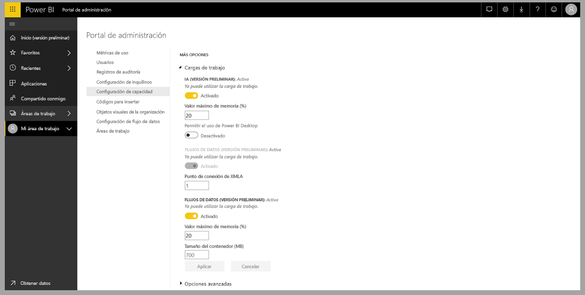
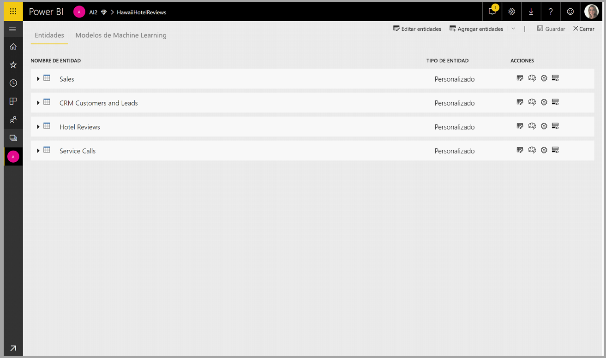
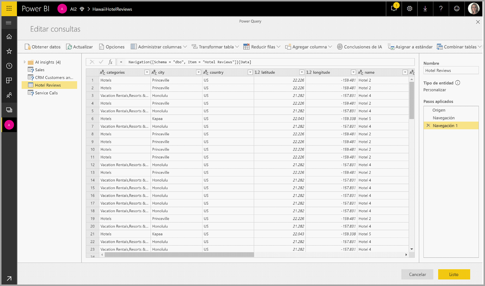
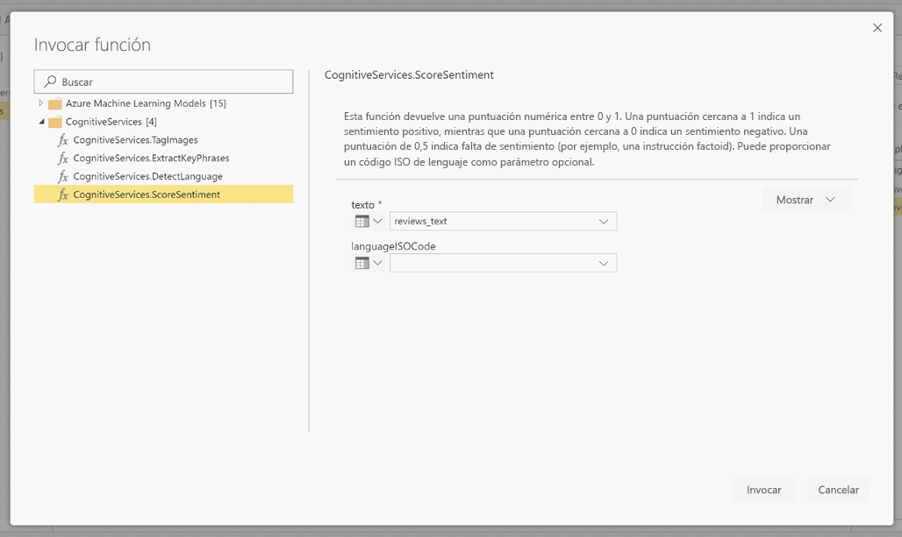
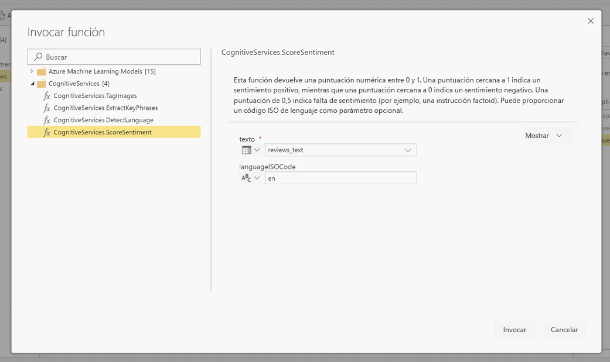
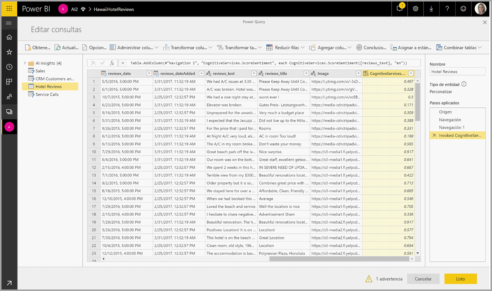
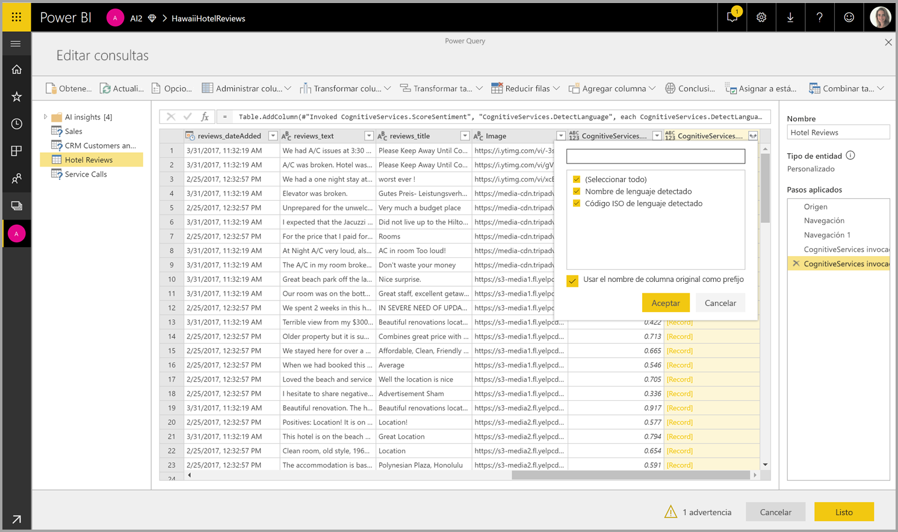

# Cognitive Services en Power BI (versión preliminar)

Con Cognitive Services en Power BI, puede aplicar diversos algoritmos de [Azure Cognitive Services](https://azure.microsoft.com/services/cognitive-services/) para enriquecer sus datos en la preparación de datos de autoservicio para flujos de datos.

Los servicios que hoy se admiten son [Análisis de sentimiento](https://docs.microsoft.com/azure/cognitive-services/text-analytics/how-tos/text-analytics-how-to-sentiment-analysis), [Extracción de frases clave](https://docs.microsoft.com/azure/cognitive-services/text-analytics/how-tos/text-analytics-how-to-keyword-extraction), [Detección de idioma](https://docs.microsoft.com/azure/cognitive-services/text-analytics/how-tos/text-analytics-how-to-language-detection) y [Etiquetado de imágenes](https://docs.microsoft.com/azure/cognitive-services/computer-vision/concept-tagging-images). Las transformaciones se ejecutan en el servicio Power BI y no requieren una suscripción a Azure Cognitive Services. Esta característica requiere Power BI Premium.

## **Habilitación de características de IA**

Cognitive Services son compatibles con los nodos de la capacidad Premium EM2, A2 o P1 y posteriores. Una carga de trabajo de IA independiente en la capacidad se usa para ejecutar Cognitive Services. Durante la versión preliminar pública, esta carga de trabajo se deshabilita de forma predeterminada. Antes de usar Cognitive Services en Power BI, la carga de trabajo de IA debe habilitarse en la configuración de capacidad del portal de administración. Puede activar la carga de trabajo de IA en la sección de cargas de trabajo y definir la cantidad máxima de memoria que desea que consuma esta carga de trabajo. El límite de memoria recomendado es del 20 %. Superar este límite hace que la consulta se ralentice.

## **Introducción a Cognitive Services en Power BI**

Las transformaciones de Cognitive Services forman parte de la [preparación de datos de autoservicio para flujos de datos](https://powerbi.microsoft.com/blog/introducing-power-bi-data-prep-wtih-dataflows/). Para enriquecer sus datos con Cognitive Services, empiece editando un flujo de datos.

Seleccione el botón **Conclusiones de AI** en la cinta de opciones superior del Editor de Power Query.

En la ventana emergente, seleccione la función que desee usar y los datos que desee transformar. En este ejemplo, puntúo el sentimiento de una columna que contiene texto de la crítica.

**Cultureinfo** es una entrada opcional para especificar el idioma del texto. Este campo espera un código ISO. Puede usar una columna como entrada para Cultureinfo, o bien un campo estático. En este ejemplo, se especifica el idioma como inglés (en) para toda la columna. Si deja este campo en blanco, Power BI detectará automáticamente el idioma antes de aplicar la función. A continuación, seleccione **Invocar.**

Tras invocar la función, se agregará el resultado como una nueva columna a la tabla. También se agregará la transformación como un paso aplicado en la consulta.

Si la función devuelve varios campos de salida, con la invocación de la función se agrega una nueva columna con un registro de los numerosos campos de salida.

Use la opción de expansión para agregar uno o ambos valores como columnas a sus datos.

## **Funciones disponibles**

En esta sección se describen las funciones disponibles en Cognitive Services en Power BI.

### **Detectar idioma**

La función de detección de idioma evalúa la entrada de texto y, para cada campo, devuelve el nombre del idioma y el identificador ISO. Esta función es útil para las columnas de datos que recopilan texto arbitrario, donde se desconoce el idioma. La función espera los datos en formato de texto como entrada.

Text Analytics reconoce hasta 120 idiomas. Para obtener más información, consulte los [idiomas admitidos](https://docs.microsoft.com/azure/cognitive-services/text-analytics/text-analytics-supported-languages).

### **Extraer frases clave**

La función **Extracción de frases clave** evalúa el texto no estructurado y, para cada campo de texto, devuelve una lista de frases clave. La función requiere un campo de texto como entrada y acepta una entrada opcional para **Cultureinfo** (consulte la sección **Introducción** anteriormente en este artículo).

La extracción de frases clave funciona mejor si proporciona fragmentos de texto más grandes con los que trabajar. Con el análisis de sentimiento ocurre lo contrario, ya que su rendimiento es mejor en bloques de texto más pequeños. Para obtener los mejores resultados de ambas operaciones, considere la posibilidad de reestructurar las entradas en consecuencia.

### **Score Sentiment** (Puntuar opiniones)

La función **Score Sentiment** (Puntuar opiniones) evalúa la entrada de texto y devuelve una puntuación de opiniones para cada documento, que va desde 0 (negativa) a 1 (positiva). Esta función es útil para detectar opiniones positivas y negativas en las redes sociales, revisiones del cliente y foros de debate.

Text Analytics usa un algoritmo de clasificación de aprendizaje automático para generar una puntuación de opiniones entre 0 y 1. Las puntuaciones más cercanas a 1 indican opiniones positivas, mientras que las más cercanas a 0 indican opiniones negativas. El modelo se entrena previamente con un cuerpo de texto extenso con asociaciones de opiniones. Actualmente, no es posible proporcionar sus propios datos de aprendizaje. El modelo usa una combinación de técnicas durante el análisis de texto, incluidas el procesamiento de texto, el análisis de funciones de sintaxis, la colocación de palabras y las asociaciones de palabras. Para obtener más información sobre el algoritmo, consulte [Introducción a Text Analytics](https://blogs.technet.microsoft.com/machinelearning/2015/04/08/introducing-text-analytics-in-the-azure-ml-marketplace/).

El análisis de sentimiento se realiza en todo el campo de entrada, en lugar de extraerse opiniones para una entidad concreta del texto. En la práctica, existe una tendencia a la precisión de la puntuación para mejorar cuando los documentos contienen una o dos frases en lugar de un gran bloque de texto. Durante una fase de evaluación de objetividad, el modelo determina si un campo de entrada como un todo es objetivo o contiene opiniones. Un campo de entrada que es principalmente objetivo no avanza a la fase de detección de sentimiento, lo que da lugar a una puntuación de 0,50 sin ningún procesamiento adicional. Para los campos de entrada que continúan en la canalización, la siguiente fase genera una puntuación superior o inferior a 0,50, dependiendo del grado de sentimiento detectado en el campo de entrada.

Actualmente, Análisis de sentimiento admite inglés, alemán, español y francés. Otros idiomas están en versión preliminar. Para obtener más información, consulte [Idiomas admitidos](https://docs.microsoft.com/azure/cognitive-services/text-analytics/text-analytics-supported-languages).

### **Tag Images** (Etiquetar imágenes)

La función **Tag Images** (Etiquetar imágenes) devuelve etiquetas basadas en más de 2000 objetos reconocibles, seres vivos, paisajes y acciones. Cuando las etiquetas son ambiguas o no son conocimientos habituales, el resultado proporciona "sugerencias" para aclarar el significado de la etiqueta en el contexto de una configuración conocida. Las etiquetas no se organizan como taxonomía y no existe ninguna jerarquía de herencia. Una colección de etiquetas de contenido constituye la base de una "descripción" de la imagen mostrada como lenguaje legible para el ser humano con formato en frases completas.

Después de cargar una imagen o especificar una dirección URL de la imagen, los algoritmos de Computer Vision generan etiquetas basadas en los objetos, seres vivos y acciones identificados en la imagen. El etiquetado no se limita al sujeto principal, como una persona en primer plano, sino que también incluye la configuración (interior o exterior), muebles, plantas, animales, accesorios, gadgets, etc.

Esta función requiere una dirección URL de la imagen o un campo Base 64 como entrada. En este momento, el etiquetado de imágenes admite inglés, español, japonés, portugués y chino simplificado. Para obtener más información, consulte [Idiomas admitidos](https://docs.microsoft.com/rest/api/cognitiveservices/computervision/tagimage/tagimage#uri-parameters).

## Pasos siguientes

En este artículo se proporcionó información general del uso de Cognitive Services con el servicio Power BI. Los siguientes artículos también podrían ser interesantes y útiles. 

* [Tutorial: Invocación de un modelo de Machine Learning Studio en Power BI (versión preliminar)](service-tutorial-invoke-machine-learning-model.md)
* [Integración de Azure Machine Learning en Power BI (versión preliminar)](service-machine-learning-integration.md)
* [Tutorial: Uso de Cognitive Services en Power BI](service-tutorial-use-cognitive-services.md)

Para más información sobre los flujos de datos, puede leer estos artículos:
* [Creación y uso de flujos de datos en Power BI](service-dataflows-create-use.md)
* [Uso de entidades calculadas en Power BI Premium (versión preliminar)](service-dataflows-computed-entities-premium.md)
* [Uso de flujos de datos con orígenes de datos locales (versión preliminar)](service-dataflows-on-premises-gateways.md)
* [Recursos de desarrollador para flujos de datos de Power BI](service-dataflows-developer-resources.md)
* [Integración de flujos de datos y Azure Data Lake (versión preliminar)](service-dataflows-azure-data-lake-integration.md)