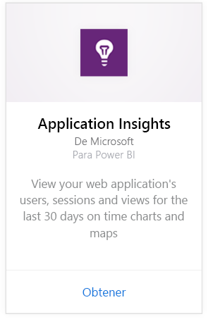
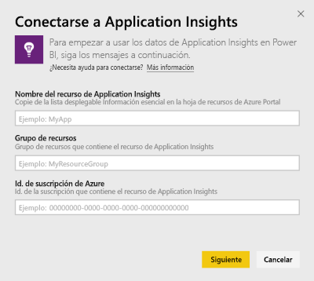
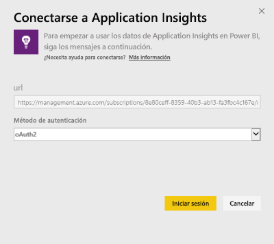
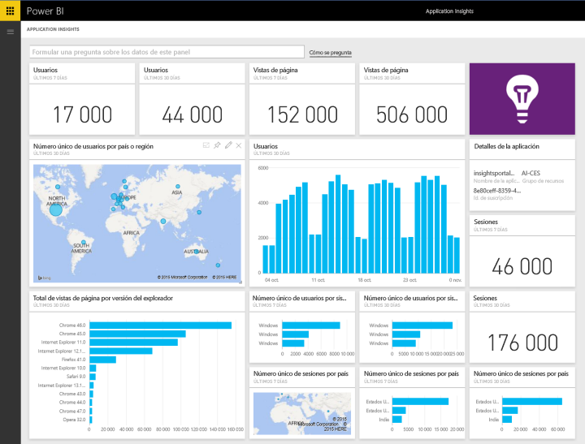
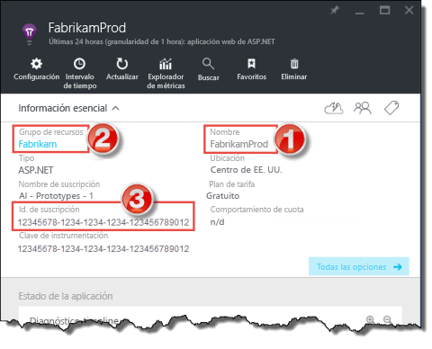
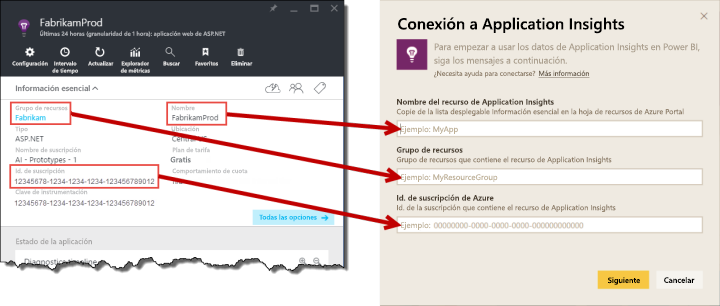

# Conexión a Application Insights con Power BI
Use Power BI para crear paneles personalizados eficaces a partir de la telemetría de [Application Insights](/azure/application-insights/app-insights-overview/). Visualice la telemetría de la aplicación de nuevas maneras. Combine las métricas de varias aplicaciones o servicios de componentes en un panel. Esta primera versión del paquete de contenido de Power BI para Application Insights incluye widgets para métricas comunes relacionadas con el uso, como usuarios activos, vista de página, sesiones, explorador, versión del explorador y el sistema operativo, y distribución geográfica de los usuarios en un mapa.

Conéctese al [paquete de contenido de Application Insights para Power BI](https://app.powerbi.com/getdata/services/application-insights).

>[!NOTE]
>Este método de integración ahora está **en desuso**. Para obtener más información sobre el método preferido de conexión de Application Insights a Power BI, use la [funcionalidad de consulta de análisis de exportación](https://docs.microsoft.com/azure/application-insights/app-insights-export-power-bi#export-analytics-queries).

## Cómo conectarse
1. Seleccione **Obtener datos** en la parte inferior del panel de navegación izquierdo.
   
    
2. En el cuadro **Servicios** , seleccione **Obtener**.
   
    
3. Seleccione **Application Insights** > **Obtener**.
   
    
4. Proporcione los detalles de la aplicación a la que desea conectarse, incluidos **Nombre de recurso**, **Grupo de recursos**e **Id. de suscripción**de Aplication Insights. Consulte [Búsqueda de parámetros de Application Insights](#FindingAppInsightsParams) a continuación para obtener más detalles.
   
        
5. Seleccione **Iniciar sesión** y siga las pantallas para conectarse.
   
    
6. El proceso de importación se inicia automáticamente. Cuando finaliza, se muestra una notificación y aparecen un panel, un informe y un conjunto de datos nuevos en el panel Navegación (marcados con un asterisco).  Seleccione el panel para ver los datos importados.
   
    

**¿Qué más?**

* Pruebe a [hacer una pregunta en el cuadro de preguntas y respuestas](consumer/end-user-q-and-a.md), en la parte superior del panel.
* [Cambie los iconos](service-dashboard-edit-tile.md) en el panel.
* [Seleccione un icono](consumer/end-user-tiles.md) para abrir el informe subyacente.
* Aunque el conjunto de datos se programará para actualizarse diariamente, puede cambiar la programación de actualización o intentar actualizar a petición mediante **Actualizar ahora**

## Qué se incluye
El paquete de contenido de Application Insights incluye las siguientes tablas y métricas:  

    ´´´
    - ApplicationDetails  
    - UniqueUsersLast7Days   
    - UniqueUsersLast30Days   
    - UniqueUsersDailyLast30Days  
    - UniqueUsersByCountryLast7Days  
    - UniqueUsersByCountryLast30Days   
    - PageViewsDailyLast30Days   
    - SessionsLast7Days   
    - SessionsLast30Days  
    - PageViewsByBrowserVersionDailyLast30Days   
    - UniqueUsersByOperatingSystemLast7Days   
    - UniqueUsersByOperatingSystemLast30Days    
    - SessionsDailyLast30Days   
    - SessionsByCountryLast7Days   
    - SessionsByCountryLast30Days   
    - PageViewsByCountryDailyLast30Days  
    ´´´ 

## Búsqueda de parámetros
Los valores Nombre de recurso, Grupo de recursos e Id. de suscripción se pueden encontrar en Azure Portal. Al seleccionar el nombre se abrirá una vista detallada y podrá usar la lista desplegable Essentials para encontrar todos los valores que necesita.

Copie y pegue estos elementos en los campos de Power BI:

## Pasos siguientes
[Introducción a Power BI](service-get-started.md)

[Obtener datos en Power BI](service-get-data.md)

