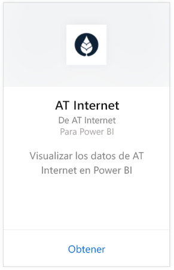
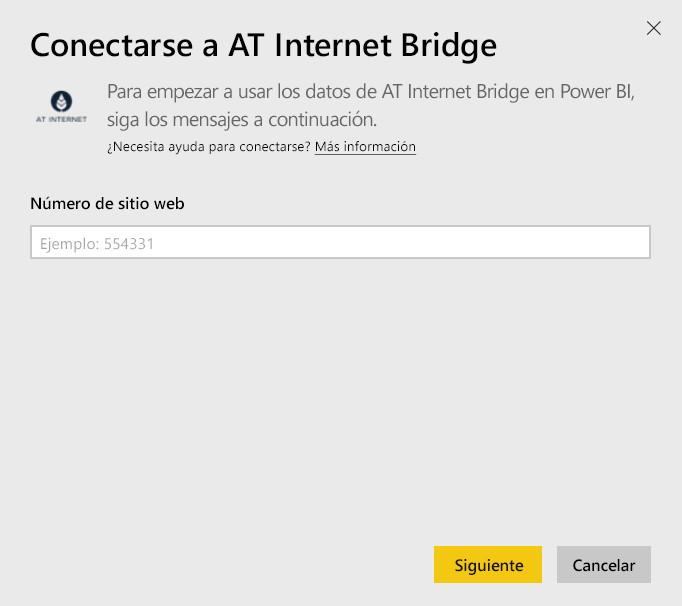
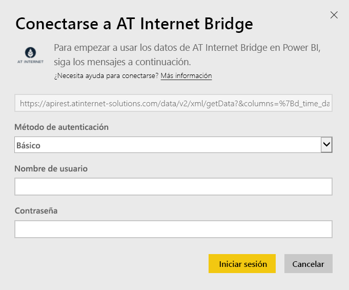

# Conexión a AT Internet Bridge con Power BI
AT Internet le permite extraer el valor inmediato de los datos mediante su plataforma unificada de análisis digital, Analytics Suite. El paquete de contenido de AT Internet Bridge para Power BI incluye datos relacionados con las visitas, los orígenes, la localización y los dispositivos de su sitio.

Conéctese al [paquete de contenido de AT Internet Bridge](https://app.powerbi.com/getdata/services/at-internet-bridge) para Power BI.

## Cómo conectarse
1. Seleccione **Obtener datos** en la parte inferior del panel de navegación izquierdo.
   
    
2. En el cuadro **Servicios** , seleccione **Obtener**.
   
    
3. Seleccione **AT Internet Bridge** \> **Obtener**.
   
   
4. Especifique el número de sitio web de AT Internet al que quiere conectarse.
   
   
5. Seleccione **Básico** como mecanismo de autenticación, proporcione el nombre de usuario y la contraseña de AT Internet y haga clic en **Iniciar sesión**.
   
   
6. Haga clic en **Conectar** para comenzar el proceso de importación. Cuando haya finalizado, aparecerá un nuevo panel, informes y modelo en el panel de navegación. Seleccione el panel para ver los datos importados.
   
    

**¿Qué más?**

* Pruebe a [hacer una pregunta en el cuadro de preguntas y respuestas](consumer/end-user-q-and-a.md), en la parte superior del panel.
* [Cambie los iconos](service-dashboard-edit-tile.md) en el panel.
* [Seleccione un icono](consumer/end-user-tiles.md) para abrir el informe subyacente.
* Aunque el conjunto de datos se programará para actualizarse diariamente, puede cambiar la programación de actualización o intentar actualizar a petición mediante **Actualizar ahora**

## Qué se incluye
Este paquete de contenido contiene datos de los últimos 45 días en las tablas siguientes:  

    - Conversion (Conversión)  
    - Devices (Dispositivos)  
    - Localization (Localización)  
    - Sources (Orígenes)  
    - Global Visits (Visitas globales)  

## Pasos siguientes
[¿Qué es Power BI?](power-bi-overview.md)

[Power BI: Conceptos básicos](consumer/end-user-basic-concepts.md)

