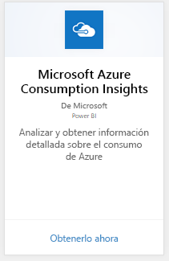
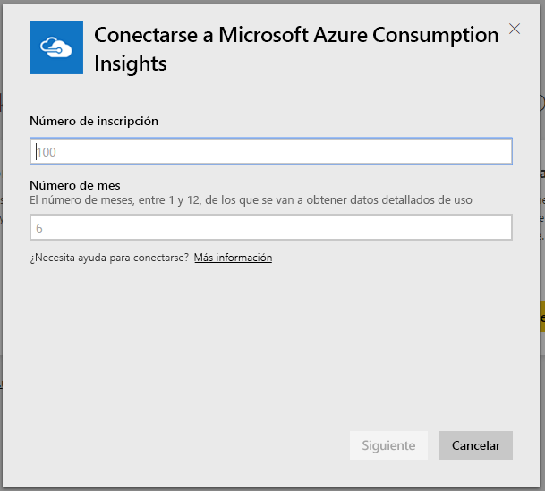
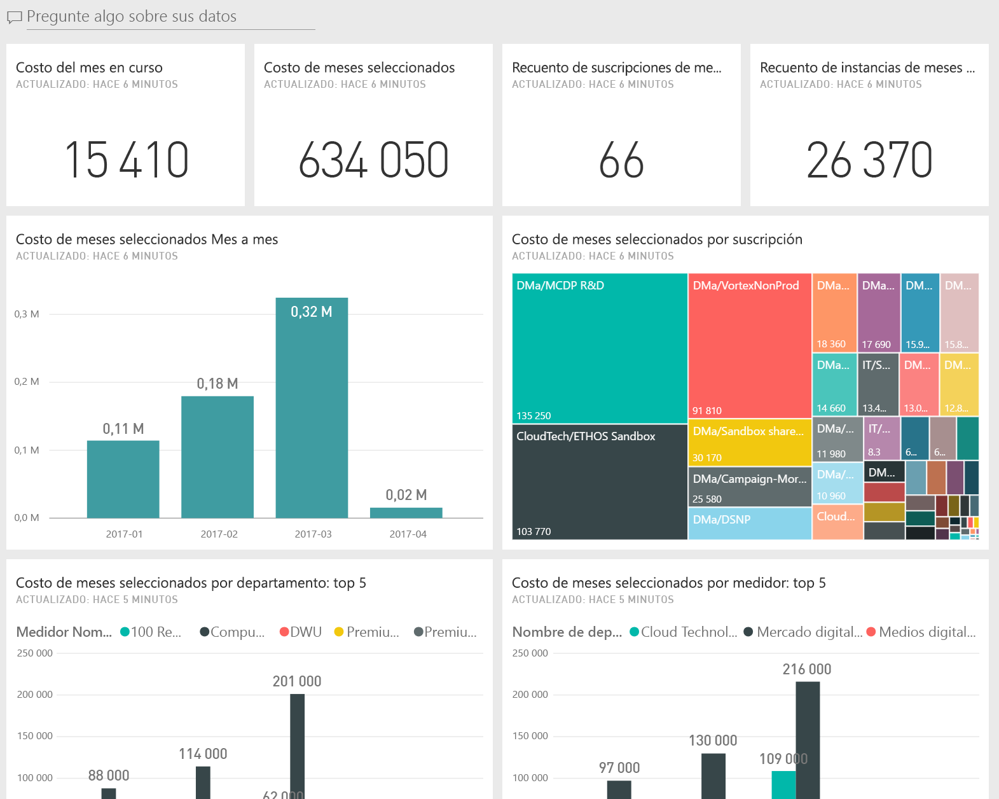
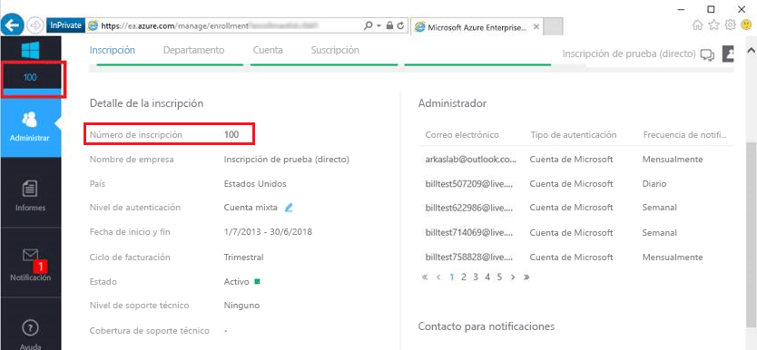
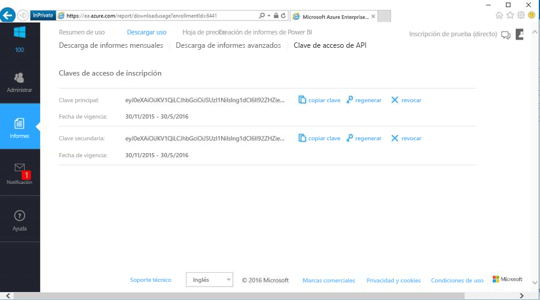

# Conexión a Microsoft Azure Consumption Insights con Power BI
Explore y supervise sus datos de consumo de Microsoft Azure en el servicio Power BI con el paquete de contenido de Power BI. Los datos se actualizan automáticamente una vez al día.

Conéctese al [Paquete de contenido de Microsoft Azure Consumption Insights](https://app.powerbi.com/getdata/services/azureconsumption) para Power BI.

> [!NOTE]
> Para tener una configuración más personalizada, pruebe a usar el [conector Azure Consumption Insights](desktop-connect-azure-consumption-insights.md) en Power BI Desktop.

## Cómo conectarse
1. En el servicio Power BI, seleccione **Obtener datos** en la parte inferior del panel de navegación izquierdo.
   
    
2. En el cuadro **Servicios** , seleccione **Obtener**.
   
   
3. Seleccione **Microsoft Azure Consumption Insights** \> **Obtenerlo ahora**. 
   
   
4. Proporcione la cantidad de meses durante los que desea importar datos y el número de inscripción de Azure Enterprise. Consulte los detalles acerca de la [búsqueda de parámetros](#FindingParams) más adelante.
   
    
5. Proporcione la clave de acceso para conectarse. Puede encontrar la clave de inscripción en el portal de EA de Azure. 
   
    
6. El proceso de importación se inicia automáticamente. Cuando haya finalizado, aparece un nuevo panel, informe y modelo en el panel de navegación. Seleccione el panel para ver los datos importados.
   
   

**¿Qué más?**

* Pruebe a [hacer una pregunta en el cuadro de preguntas y respuestas](consumer/end-user-q-and-a.md), en la parte superior del panel.
* [Cambie los iconos](service-dashboard-edit-tile.md) en el panel.
* [Seleccione un icono](consumer/end-user-tiles.md) para abrir el informe subyacente.
* Aunque el conjunto de datos se programará para actualizarse diariamente, puede cambiar la programación de actualización o intentar actualizar bajo petición mediante **Actualizar ahora**.

## Qué se incluye
El paquete de contenido de Microsoft Azure Consumption Insights incluye datos de informes mensuales para el intervalo de meses que indicó durante la conexión. El intervalo es una ventana móvil, por lo que las fechas incluidas se actualizan a medida que se actualice el conjunto de datos.

## Requisitos del sistema
El paquete de contenido requiere acceso a las características de Enterprise en Azure Portal. 

## Búsqueda de parámetros
Los informes de Power BI están disponibles para clientes directos, socios y clientes indirectos de EA que pueden ver la información de facturación. Consulte a continuación los detalles sobre la búsqueda de los valores previstos del flujo de conexión.

**Número de meses**

* El número de meses (1-36) de datos a partir de hoy que desea importar.

**Número de inscripción**

* El número de inscripción de Azure Enterprise que se encuentra en la pantalla principal de [Azure Enterprise Portal](https://ea.azure.com/) bajo **Detalle de la inscripción**.
  
    

**Clave de acceso**

* Puede encontrar la clave en el portal de Azure Enterprise, en **Descargar uso** > **Clave de acceso de la API**.
  
    

**Ayuda adicional**

* Para obtener ayuda adicional sobre cómo configurar el paquete de Power BI en Azure Enterprise, inicie sesión en el portal de Azure Enterprise y vea el archivo de ayuda de la API bajo **Ayuda**. También encontrará instrucciones en **Informes** -> **Descargar uso** -> **Clave de acceso de API**.
* Para tener una configuración más personalizada, pruebe a usar el [conector Azure Consumption Insights](desktop-connect-azure-consumption-insights.md) en Power BI Desktop.

## Pasos siguientes

[Conector Azure Consumption Insights](desktop-connect-azure-consumption-insights.md) en Power BI Desktop

[Obtener datos en Power BI](service-get-data.md)

