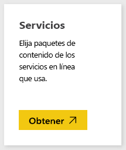
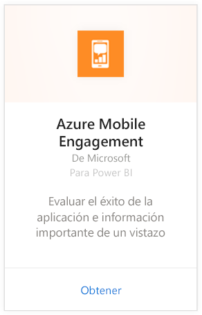
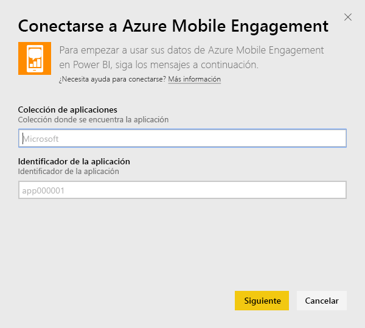
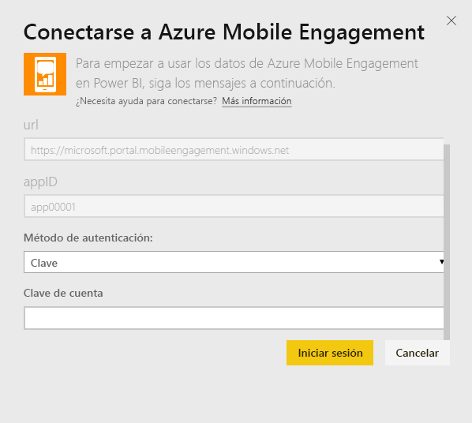
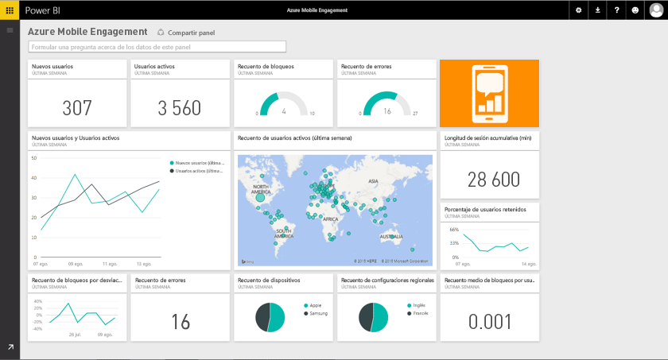

# Conexión a Azure Mobile Engagement con Power BI
El paquete de contenido de Azure Mobile Engagement para Power BI permite obtener rápidamente información sobre los datos de aplicaciones.

Conéctese al [paquete de contenido de Azure Mobile Engagement](https://app.powerbi.com/groups/me/getdata/services/azme) para Power BI.

## Cómo conectarse
1. Seleccione **Obtener datos** en la parte inferior del panel de navegación izquierdo.
   
    
2. En el cuadro **Servicios** , seleccione **Obtener**.
   
    
3. Seleccione **Azure Mobile Engagement** \> **Obtener**.
   
     
4. Especifique la colección de aplicaciones y el nombre de la aplicación. Esta información se encuentra en su cuenta de Azure Mobile Engagement.
   
     
5. En el Método de autenticación, proporcione la clave y, a continuación, haga clic en Iniciar sesión.
   
    
6. Una vez que Power BI importe los datos, verá un nuevo panel, el informe y el conjunto de datos en el panel de navegación izquierdo. Los nuevos elementos se muestran marcados con un asterisco amarillo \* que desaparece una vez que se realiza la selección:
   
    

## ¿Qué más?

* Pruebe a [hacer una pregunta en el cuadro de preguntas y respuestas](consumer/end-user-q-and-a.md), en la parte superior del panel.
* [Cambie los iconos](service-dashboard-edit-tile.md) en el panel.
* [Seleccione un icono](consumer/end-user-tiles.md) para abrir el informe subyacente.
* Aunque el conjunto de datos se programará para actualizarse diariamente, puede cambiar la programación de actualización o intentar actualizar a petición mediante **Actualizar ahora**

## Pasos siguientes
[Introducción a Power BI](service-get-started.md)

[Obtener datos en Power BI](service-get-data.md)

