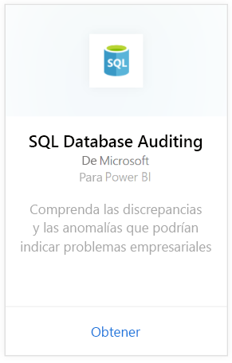
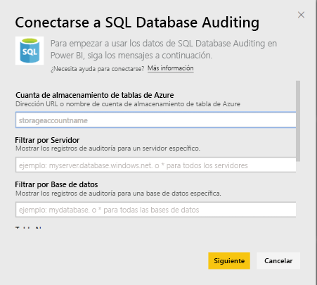
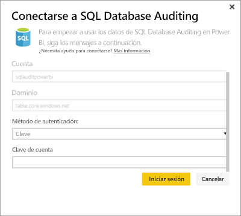
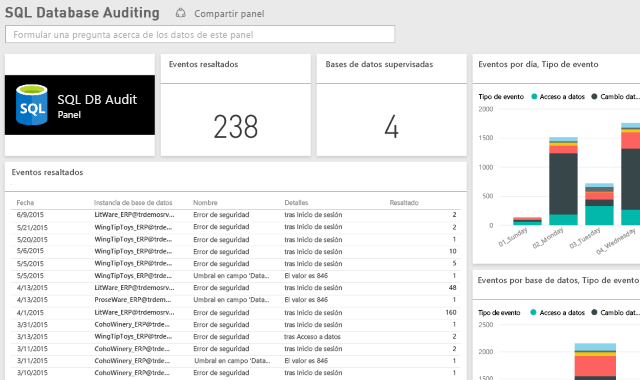

# Paquete de contenido SQL Database Auditing para Power BI

> [!IMPORTANT]
> El paquete de contenido de SQL Database Auditing se encuentra en desuso y ya no está disponible.
 
El paquete de contenido de [Azure SQL Database Auditing](/azure/sql-database/sql-database-auditing/) para Power BI permite comprender la actividad de las bases de datos y obtener información sobre las discrepancias y las anomalías que podrían indicar problemas empresariales o posibles infracciones de seguridad. 

Conéctese al [paquete de contenido de SQL Database Auditing](https://app.powerbi.com/getdata/services/sql-db-auditing) para Power BI.

>[!NOTE]
>El paquete de contenido importa datos de todas las tablas que contienen “AuditLogs” en su nombre y los anexan a una tabla de modelo de datos única denominada “AuditLogs”. Los últimos 250.000 eventos se incluirán y los datos se actualizarán cada día.

## Cómo conectarse
1. Seleccione **Obtener datos** en la parte inferior del panel de navegación izquierdo.
   
    
2. En el cuadro Servicios, seleccione Obtener.
   
    
3. Seleccione **SQL Database Auditing**\>**Obtener**.
   
   
4. En la ventana para conectarse a la auditoría de base de datos de SQL:
   
   - Escriba el nombre de la cuenta de Azure Table Storage o la dirección URL donde se almacenan los registros.
   
   - Escriba el nombre del servidor SQL que le interesa. Escriba “\*” para cargar los registros de auditoría de todos los servidores.
   
   - Escriba el nombre de la base de datos SQL que le interesa. Escriba “\*” para cargar los registros de auditoría de todas las bases de datos.
   
   - Escriba el nombre de la tabla de Azure que contiene los registros que le interesan. Escriba “\*” para cargar los registros de auditoría de todas las tablas que contienen "AuditLogs" en el nombre.
   
   >[!IMPORTANT]
   >Con fines de rendimiento, es aconsejable especificar siempre un nombre de tabla explícito, aunque todos los registros de auditoría se almacenen en una única tabla.
   
   - Escriba la fecha de inicio de los registros de auditoría que le interesan. Escriba “\*” para cargar los registros de auditoría sin límite de tiempo inferior o "1d" para cargar los registros de auditoría del último día.
   
   - Escriba la fecha de finalización de los registros de auditoría que le interesan. Escriba “\*” para cargar los registros de auditoría sin límite de tiempo superior.
   
   
5. En Método de autenticación, seleccione **Clave**, escriba su **clave de cuenta** \> **Iniciar sesión**.
   
   
6. Una vez que Power BI importe los datos, verá un nuevo panel, el informe y el conjunto de datos en el panel de navegación izquierdo. Los nuevos elementos se marcan con un asterisco amarillo \*.
   
   

**¿Qué más?**

* Pruebe a [hacer una pregunta en el cuadro de preguntas y respuestas](consumer/end-user-q-and-a.md), en la parte superior del panel.
* [Cambie los iconos](service-dashboard-edit-tile.md) en el panel.
* [Seleccione un icono](consumer/end-user-tiles.md) para abrir el informe subyacente.
* Aunque el conjunto de datos se programará para actualizarse diariamente, puede cambiar la programación de actualización o intentar actualizar a petición mediante **Actualizar ahora**

## Pasos siguientes
[Obtención de datos para Power BI](service-get-data.md)
[¿Qué es Power BI?](power-bi-overview.md)
