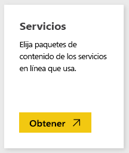
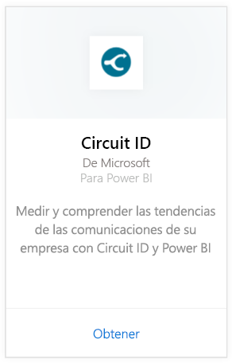
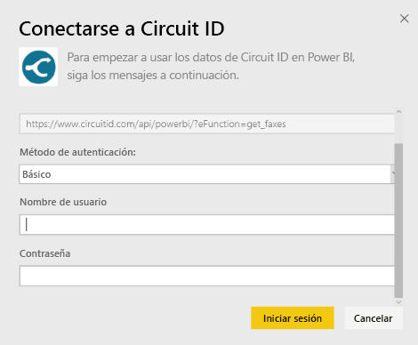
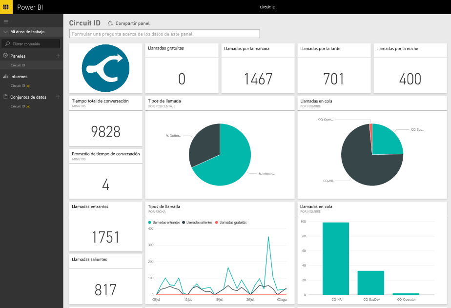

# Conexión a Circuit ID con Power BI
El análisis de los datos de comunicación desde el Id. de circuito le resultará más con Power BI. Power BI recupera los datos y, a continuación, crea un panel predeterminado e informes relacionados en función de esos datos. Una vez que haya creado la conexión, puede explorar los datos y personalizar el panel para adaptarlo a sus necesidades. Los datos se actualizan automáticamente todos los días.

Conéctese al [paquete de contenido de Circuit ID](https://app.powerbi.com/getdata/services/circuitid) para Power BI.

## Cómo conectarse
1. Seleccione **Obtener datos** en la parte inferior del panel de navegación izquierdo.
   
    
2. En el cuadro **Servicios** , seleccione **Obtener**.
   
    
3. Seleccione **Circuit ID** \> **Obtener**.
   
    
4. En el Método de autenticación, seleccione Básico y proporcione el nombre de usuario y la contraseña. A continuación, presione Iniciar.
   
    
5. Una vez que Power BI importe los datos, verá un nuevo panel, el informe y el conjunto de datos en el panel de navegación izquierdo. Los nuevos elementos se marcan con un asterisco amarillo.
   
    

**¿Qué más?**

* Pruebe a [hacer una pregunta en el cuadro de preguntas y respuestas](power-bi-q-and-a.md), en la parte superior del panel.
* [Cambie los iconos](service-dashboard-edit-tile.md) en el panel.
* [Seleccione un icono](service-dashboard-tiles.md) para abrir el informe subyacente.
* Aunque el conjunto de datos se programará para actualizarse diariamente, puede cambiar la programación de actualización o actualizarlo a petición mediante **Actualizar ahora**.

## Pasos siguientes
[¿Qué es Power BI?](power-bi-overview.md)

[Obtener datos para Power BI](service-get-data.md)

