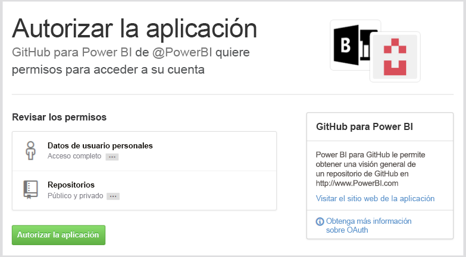
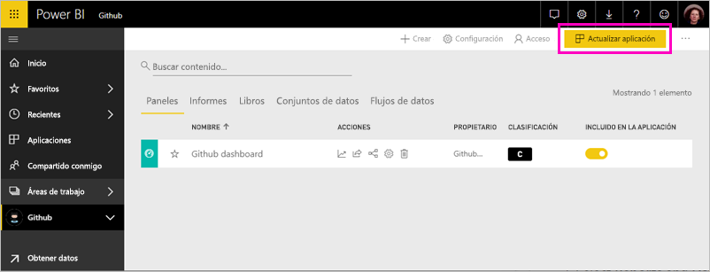
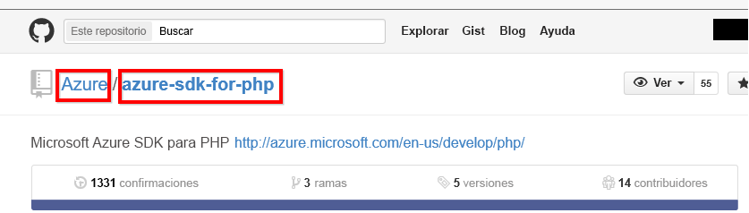

# Conexión a GitHub con Power BI
En este artículo, se explica cómo obtener datos de una cuenta de GitHub con una aplicación de plantilla de Power BI. La aplicación de plantilla genera un área de trabajo con un panel, un conjunto de informes y un conjunto de datos para que pueda explorar los datos de GitHub. La aplicación de GitHub para Power BI le muestra conclusiones sobre su repositorio de GitHub, con datos sobre contribuciones, problemas, solicitudes de incorporación de cambios y usuarios activos.

Después de instalar la aplicación de plantilla, puede cambiar el panel y el informe. A continuación, puede distribuirlo como una aplicación entre los compañeros de su organización.

Conéctese a la [aplicación de plantilla de GitHub](https://app.powerbi.com/groups/me/getapps/services/pbi-contentpacks.pbiapps-github) u obtenga más información sobre la [integración de GitHub](https://powerbi.microsoft.com/integrations/github) con Power BI.

También puede probar el [tutorial de GitHub](service-tutorial-connect-to-github.md). Instala datos reales de GitHub sobre el repositorio público para la documentación de Power BI.

>[!NOTE]
>Para usar la aplicación de plantilla, es necesario que la cuenta de GitHub tenga acceso al repositorio. Consulte más detalles sobre los requisitos a continuación.

## Cómo conectarse
[!INCLUDE [powerbi-service-apps-get-more-apps](./includes/powerbi-service-apps-get-more-apps.md)]
   
3. Seleccione **GitHub** \> **Obtenerlo ahora**.
4. En **¿Instalar esta aplicación de Power BI?** , seleccione **Instalar**.
4. En el panel **Aplicaciones**, seleccione el icono de **GitHub**.

    

6. En **Empezar a trabajar con la nueva aplicación**, seleccione **Conectar datos**.

    

5. Escriba el nombre del repositorio y el propietario del repositorio. Consulte los detalles acerca de la [búsqueda de parámetros](#FindingParams) más adelante.
   
    

5. Escriba sus credenciales de GitHub (este paso se podría omitir si ya ha iniciado la sesión con el explorador). 
6. En **Método de autenticación**, seleccione **oAuth2** \> **Iniciar sesión**. 
7. Siga las pantallas de autenticación de GitHub. Conceda permiso a la aplicación de plantilla de GitHub para Power BI para acceder a los datos de GitHub.
   
   
   
    Power BI se conecta a GitHub y a sus datos.  Los datos se actualizan una vez al día. Cuando Power BI haya importado los datos, verá el contenido de la nueva área de trabajo de GitHub.

## Modificar y distribuir una aplicación

Ha instalado la aplicación de plantilla de GitHub. Esto significa que también ha creado el área de trabajo de la aplicación de GitHub. En el área de trabajo, puede cambiar el informe y el panel y, después, distribuirlo como una *aplicación* a los compañeros de su organización. 

1. Seleccione la flecha junto al nombre del área de trabajo en la barra de navegación izquierda. Verá que el área de trabajo contiene un panel y un informe.

    

8. Seleccione el nuevo [panel de GitHub](https://powerbi.microsoft.com/integrations/github).    
    

3. Para ver todo el contenido de la nueva área de trabajo de GitHub, en la barra de navegación izquierda, seleccione **Áreas de trabajo** > **GitHub**.
 
   

    Esta vista es la lista de contenidos del área de trabajo. En la esquina superior derecha, verá **Actualizar aplicación**. Aquí empezará cuando esté preparado para distribuir la aplicación a sus compañeros. 

    

2. Seleccione **Informes** y **Conjuntos de datos** para ver el resto de los elementos del área de trabajo.

    Obtenga información sobre cómo [distribuir aplicaciones](service-create-distribute-apps.md) a sus compañeros.

## Qué se incluye en la aplicación
Los siguientes datos están disponibles desde GitHub en Power BI:     

| Nombre de tabla | Descripción |
| --- | --- |
| Contribuciones |La tabla de contribuciones proporciona el total de adiciones, eliminaciones y confirmaciones creadas por el colaborador de forma agregada por semana. Se incluyen los 100 colaboradores principales. |
| Problemas |Lista de todos los problemas para el repositorio seleccionado con cálculos como, por ejemplo, tiempo total y promedio para cerrar un problema, total de problemas abiertos o total de problemas cerrados. Esta tabla estará vacía cuando no haya ningún problema en el repositorio. |
| Solicitudes de extracción |Esta tabla contiene todas las solicitudes de extracción para el repositorio, así como quién extrajo la solicitud. También contiene cálculos de las solicitudes de incorporación de cambios abiertas, cerradas y el total, cuánto tiempo se ha necesitado para incorporar los cambios y cuánto tiempo se ha tardado de media para cada solicitud de incorporación de cambios. Esta tabla estará vacía cuando no haya ningún problema en el repositorio. |
| Usuarios |En esta tabla, se muestra una lista de colaboradores o usuarios de GitHub que han realizado contribuciones, registrado problemas o solucionado solicitudes de incorporación de cambios para el repositorio seleccionado. |
| Hitos |Contiene todos los hitos para el repositorio seleccionado. |
| DateTable |Estas tablas contienen fechas actuales y de años anteriores, y permiten analizar los datos de GitHub por fecha. |
| ContributionPunchCard |Esta tabla puede usarse como una tarjeta perforada de contribución para el repositorio seleccionado. Muestra confirmaciones por día de la semana y hora del día. Esta tabla no está conectada a otras tablas en el modelo. |
| RepoDetails |Esta tabla proporciona detalles para el repositorio seleccionado. |

## Requisitos del sistema
* La cuenta de GitHub que tiene acceso al repositorio.  
* Permiso concedido a la aplicación de Power BI para GitHub durante el primer inicio de sesión. Vea los detalles siguientes sobre la revocación del acceso.  
* Llamadas de API suficientes disponibles para extraer y actualizar los datos.  

### Quitar autorización de Power BI
Para quitar la autorización de Power BI para conectarse al repositorio de GitHub, puede revocar el acceso en GitHub. Para obtener más información, vea este tema en la [Ayuda de GitHub](https://help.github.com/articles/keeping-your-ssh-keys-and-application-access-tokens-safe/#reviewing-your-authorized-applications-oauth).

## Búsqueda de parámetros
Para determinar el propietario y el repositorio, examine el repositorio en GitHub:

La primera parte, "Azure", es el propietario y la segunda parte, "azure-sdk-for-php" es el repositorio mismo.  Verá estos dos mismos elementos en la dirección URL del repositorio:

    <https://github.com/Azure/azure-sdk-for-php> .

## Solución de problemas
Si es necesario, puede comprobar las credenciales de GitHub.  

1. En otra ventana del explorador, visite el sitio web de GitHub e inicie sesión en GitHub. Puede ver si está conectado en la esquina superior derecha del sitio de GitHub.    
2. En GitHub, vaya a la dirección URL del repositorio al que desea tener acceso en Power BI. Por ejemplo: https://github.com/dotnet/corefx.  
3. En Power BI, intente conectarse a GitHub. En el cuadro de diálogo Configurar GitHub, use los nombres del repositorio y el propietario del repositorio para dicho repositorio.  

## Pasos siguientes

* [Tutorial: conectarse a un repositorio de GitHub con Power BI](service-tutorial-connect-to-github.md)
* [Crear las nuevas áreas de trabajo en Power BI](service-create-the-new-workspaces.md)
* [Instalar y usar aplicaciones en Power BI](consumer/end-user-apps.md)
* [Conectarse a aplicaciones de Power BI para servicios externos](service-connect-to-services.md)
* ¿Tiene alguna pregunta? [Pruebe a preguntar a la comunidad de Power BI](http://community.powerbi.com/)

